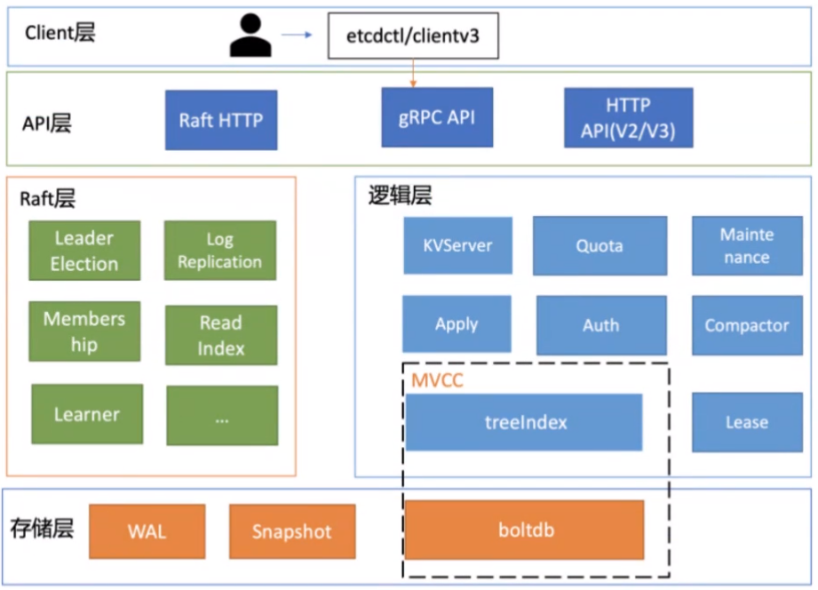
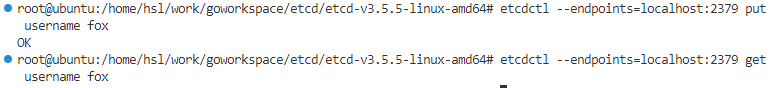

# etcd

## 1. etcd介绍

### 1.1 什么是etcd

`etcd`是一个Go语言编写的分布式、高可用的一致性键值存储系统，用于提供可靠的分布式键值（key - value）存储、配置共享和服务发现等功能。

官网：https://etcd.io/

文档：https://etcd.io/docs/v3.5/quickstart/

### 1.2 etcd的应用场景

分布式系统中的数据分为控制数据和应用数据。

etcd的使用场景默认处理的数据都是控制数据，对于应用数据，只推荐数据量很小，但是更新访问频繁的情况。常见的场景包括：服务发现、分布式锁、分布式队列、分布式通知与协调、主备选举等。

### 1.3 为什么使用etcd

与ZooKeeper相比，etcd更加简单，安装、部署和使用更加容易，并且etcd的某些功能是ZooKeeper所没有的。因此，在很多场景下，etcd比ZooKeeper更受用户的青睐，具体表现在如下几个方面：

- etcd更加稳定可靠，它唯一的目标就是把分布式一致性KV存储做到极致，所以它更加注重稳定性和扩展性。
- 在服务发现的实现上，etcd使用的是节点租约（Lease），并且支持Group（多key）；而ZooKeeper使用的是临时节点，临时节点存在不少的问题。
- etcd支持稳定的watch，而不是ZooKeeper一样简单的单次触发（One time trigger）watch。因为在微服务的环境下，通过调度系统的调度，一个服务随时可能会下线，也可能为应对临时访问压力而增加新的服务节点，而很多调度系统是需要得到完整节点历史记录的，在这方面，etcd可以存储十万个历史变更。
- etcd支持MVCC（多版本并发控制），因为有协同系统需要无锁操作。
- etcd支持更大的数据规模，支持存储百万到千万级别的key。
- 相比ZooKeeper，etcd的性能更好。在一个由三台8核节点组成的云服务器上，etcd v3版本可以做到每秒数十万次的写操作和数十万次的读操作。

### 1.4 etcd架构




上图是etcd基础架构图，按照分层模型，**etcd可分为Client层、API网络层、Raft算法层、逻辑层和存储层。**这些层的结构如下：

- Client层：Client层包括client v2和v3两个大版本API客户端库，提供了简洁易用的API，同时支持负载均衡、节点间故障转移，可极大降低业务使用etcd复杂度，提升开发效率、服务可用性。
- API网络层：**一方面，client访问etcd server的API分为v2和v3两个大版本。**v2API使用HTTP/1.x协议，v3API使用gRPC协议。同时v3通过etcd grpc-gateway组件也支持HTTP/1.x协议，便于各种语言的服务调用。另一方面，server之间通信协议，是指节点间通过Raft算法实现数据复制和Leader选举等功能时使用的HTTP协议。
- Raft算法层：**Raft算法层实现了Leader选举、日志复制、ReadIndex等核心算法特性，用于保障etcd多个节点间的数据一致性、提升服务可用性等**，是etcd的基石和两点。
- 功能逻辑层：etcd核心特性实现层，如典型的KVServer模块、MVCC模块、Auth鉴权模块、Lease租约模块、Compactor压缩模块等，其中MVCC模块主要由treeIndex模块和boltdb模块组成。
- 存储层：存储层包含预写日志（WAL）模块、快照（Snapshot）模块、boltdb模块。其中WAL可保障etcd crash后数据不丢失，boltdb则保存了集群元数据和用户写入的数据。

## 2. etcd实战

### 2.1 etcd环境搭建

对于搭建开发和测试环境，最简单和快捷的方式就是在本地部署一个单机版或者集群版的etcd环境。

#### 单实例etcd部署

etcd社区提供了编译好的etcd服务器和客户端的二进制文件以供下载：

```shell
wget https://github.com/etcd-io/etcd/releases/download/v3.5.5/etcd-v3.5.5-linux-amd64.tar.gz
tar -zxvf etcd-v3.5.5-linux-amd64.tar.gz
cd etcd-v3.5.5-linux-amd64/
#启动etcd服务
./etcd
#后台启动etcd，日志文件输出到/tmp/etcd.log目录
nohup ./etcd >/tmp/etcd.log 2>&1 &
#查看etcd版本
./etcd -version
#将etcd和etcdctl复制到/usr/local/bin目录，系统中可以直接调用etcd/etcdctl
cp etcd etcdctl /usr/local/bin
```

> - `nohup`: 代表 "no hang up"，它的作用是在用户注销（或终端关闭）后仍然继续运行命令，避免命令因为 SIGHUP 信号而被中断。
> - `./etcd`: 这是要运行的可执行文件或脚本的路径和名称。在这个例子中，`etcd` 是一个执行文件，`./` 表示该文件位于当前目录下。
> - `>/tmp/etcd.log`: 将命令的标准输出重定向到 `/tmp/etcd.log` 文件中，以便将命令的输出结果存储到该文件中。`>` 符号表示覆盖写入文件，如果文件不存在则创建；如果希望追加写入文件，可以使用 `>>` 符号。
> - `2>&1`: 将标准错误输出（文件描述符 2）重定向到标准输出（文件描述符 1）。这样，标准输出和标准错误输出都会被重定向到 `/tmp/etcd.log` 文件中。
> - `&`: 这个符号表示将命令放入后台运行，使得命令不会阻塞当前终端，并且可以继续输入其他命令。

**启动的etcd进程默认在2379端口来监听客户端的请求。**用户可以使用etcd的命令行工具etcdctl来与etcd server进行交互，具体命令如下所示：

```shell
#etcd读写操作
etcdctl --endpoints=localhost:2379 put username fox
etcdctl --endpoints=localhost:2379 get username
```



#### 单机多实例etcd部署

etcd server默认使用2380端口监听集群中其他server的请求，但是如果在同一台机器上有多个etcd server都在同一个端口上监听，那么会导致端口冲突。作为示例，分别让3个etcd server监听在12380、22380、32380端口上。

可以通过进程管理工具goreman，快速创建、停止本地的多节点etcd集群。

```shell
# 安装goreman，依赖go环境
go install github.com/mattn/goreman@latest
goreman help
```

#### 利用goreman创建3节点etcd集群

1) 编写local-cluster-profile文件

```shell
etcd1: etcd --name infra1 --listen-client-urls https://127.0.0.1:12379 --advertise-client-urls http://127.0.0.1:12379 --listen-peer-urls http://127.0.0.1:12380 --initial-advertise-peer-urls http://127.0.0.1:12380 --initial-cluster-token etcd-cluster-1 --initial-cluster 'infra1=http://127.0.0.1:12380,infra2=http://127.0.0.1:22380,infra3=http://127.0.0.1:32380' --initial-cluster-state new

etcd2: etcd --name infra2 --listen-client-urls https://127.0.0.1:22379 --advertise-client-urls http://127.0.0.1:22379 --listen-peer-urls http://127.0.0.1:22380 --initial-advertise-peer-urls http://127.0.0.1:22380 --initial-cluster-token etcd-cluster-1 --initial-cluster 'infra1=http://127.0.0.1:12380,infra2=http://127.0.0.1:22380,infra3=http://127.0.0.1:32380' --initial-cluster-state new

etcd3: etcd --name infra3 --listen-client-urls https://127.0.0.1:32379 --advertise-client-urls http://127.0.0.1:32379 --listen-peer-urls http://127.0.0.1:32380 --initial-advertise-peer-urls http://127.0.0.1:32380 --initial-cluster-token etcd-cluster-1 --initial-cluster 'infra1=http://127.0.0.1:12380,infra2=http://127.0.0.1:22380,infra3=http://127.0.0.1:32380' --initial-cluster-state new
```

etcd关键参数说明：

| 参数                    | 说明                                                         |
| ----------------------- | ------------------------------------------------------------ |
| --name                  | etcd节点名字                                                 |
| --initial-cluster       | etcd启动时，通过这个配置找到其他节点的地址列表，格式："节点名字1=http://节点ip1:2380,节点名字2=http://节点ip2:2380,..." |
| --initial-cluster-state | 初始化的时候，集群的状态"new"或者"existing"两种状态，new代表新建的集群，existing表示加入已经存在的集群。 |
| --listen-client-urls    | 监听客户端请求的地址列表，格式："http://localhost:2379"，多个用逗号分隔。 |
| --advertise-client-urls | 如果--listen-client-urls配置了多个监听客户端请求的地址，这个参数可以给出，建议客户端使用什么地址访问etcd |
|                         |                                                              |
|                         |                                                              |

