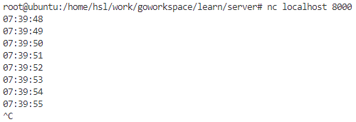
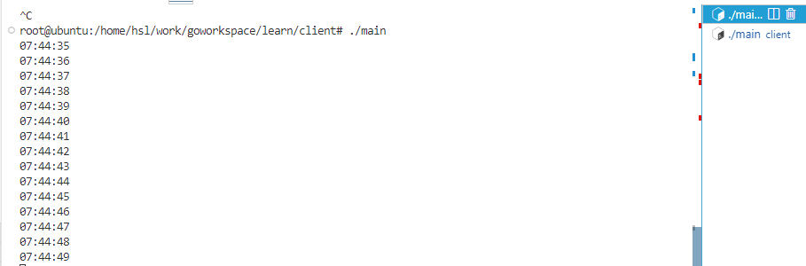
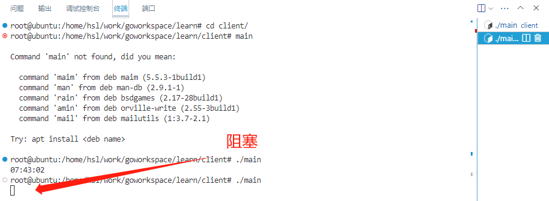
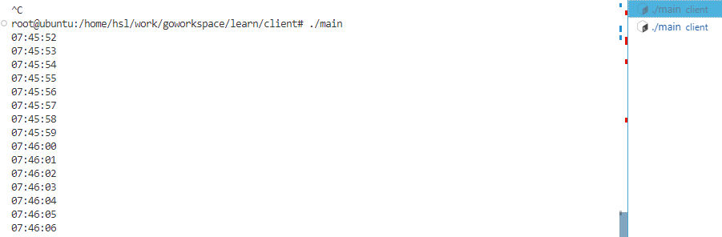
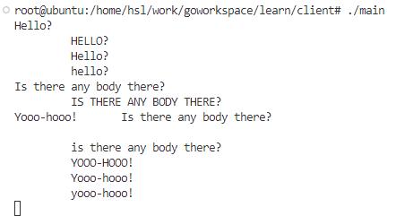
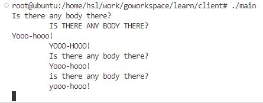

# Gopl Reivew

## 8️⃣ Goroutines与Channels

Go语言中的并发程序可以用两种手段来实现：goroutine 和 channel，其支持顺序通信进程，或被简称为`CSP`，`CSP`是一种并发编程模型，在这种并发编程模型中，值会在不同运行实例中传递，第二个手段便是多线程共享内存。

### 8.1 Goroutines

在Go语言中，每一个并发的执行单元叫作一个`goroutine`。当一个程序启动时，**其主函数在一个单独的goroutine中运行，我们叫它main goroutine**。新的goroutine会用go语句创建，即在函数或者方法前加上`go`关键字，go语句会使其语句中的函数在一个新建的goroutine中运行，而go语句本身也会迅速完成：

```go
go f()
```

```go
package main

import (
	"fmt"
	"time"
)

func main() {
	go spinner(100 * time.Millisecond)
	const n = 45
	fibN := fib(n)
	fmt.Printf("\rFibonacci(%d) = %d\n", n, fibN)
}

func spinner(delay time.Duration) {
	for {
		for _, r := range "-/\\|" {
			fmt.Printf("\r%c", r)
			time.Sleep(delay)
		}
	}
}
func fib(x int) int {
	if x < 2 {
		return x
	}
	return fib(x-1) + fib(x-2)
}
```

函数运行会在几秒后出现结果：

```shell
Fibonacci(45) = 1134903170
```

然后主函数返回，**除了从主函数退出或者直接终止程序外，没有其它编程方法能够让一个goroutine打断另一个的执行**，但是之后可以看到一种方式来实现这个目的，**通过goroutine之间的通信来让一个goroutine请求其他的goroutine，并让被请求的goroutine自行结束执行**。

注意，`fib`函数和`spinner`函数是同时执行的，如果spinner调用前不加上`go`，则会一直执行spinner函数，阻塞fib函数执行。


### 8.2 示例：并发的Clock服务

网络编程是并发最适合的领域之一，最典型的是服务器要同时处理很多连接程序。

这段代码是一个简单的Go语言TCP服务器程序，用于监听`localhost:8000`端口，并向连接到该端口的客户端发送当前时间。具体来说，该程序使用`net.Listen`函数创建一个TCP监听器，监听`localhost:8000`端口。然后，使用`listener.Accept`函数接受客户端的连接请求，并将连接对象传递给`handleConn`函数进行处理。`handleConn`函数中，使用`io.WriteString`函数向客户端发送当前时间，并使用`time.Sleep`函数暂停1秒钟，以模拟实时时间的流逝。如果客户端断开连接，则函数会返回：

```go
package main

import (
	"io"
	"log"
	"net"
	"time"
)

func main() {
	listener, err := net.Listen("tcp", "localhost:8000")
	if err != nil {
		log.Fatal(err)
	}
	for {
		conn, err := listener.Accept()
		if err != nil {
			log.Print(err)
			continue
		}
		handleConn(conn)
	}
}

func handleConn(c net.Conn) {
	defer c.Close()
	for {
		_, err := io.WriteString(c, time.Now().Format("15:04:05\n"))
		if err != nil {
			return // e.g., client disconnected
		}
		time.Sleep(1 * time.Second)
	}
}
```

创建了一个`listener`来监听网络端口到来的连接，然后用`handleConn`来处理这个完整的客户端连接：



客户端将服务器发来的时间显示了出来。

这段代码是一个简单的Go语言TCP客户端程序，用于连接`localhost:8000`端口，并将从服务器接收到的数据输出到标准输出。具体来说，该程序使用`net.Dial`函数创建一个TCP连接，连接到`localhost:8000`端口。然后，使用`defer`语句在函数结束时关闭连接。接着，调用`mustCopy`函数将从服务器接收到的数据输出到标准输出。`mustCopy`函数中，使用`io.Copy`函数将从`src`中读取的数据写入到`dst`中，直到`src`中的数据全部读取完毕。如果在复制过程中发生错误，则会输出一个错误信息并退出程序：

```go
package main

import (
	"io"
	"log"
	"net"
	"os"
)

func main() {
	conn, err := net.Dial("tcp", "localhost:8000")
	if err != nil {
		log.Fatal(err)
	}
	defer conn.Close()
	mustCopy(os.Stdout, conn)
}

func mustCopy(dst io.Writer, src io.Reader) {

	if _, err := io.Copy(dst, src); err != nil {
		log.Fatal(err)
	}
}
```

将这个代码同时在两个终端中运行测试，可以看到只能在一个终端中执行，也就是说第二个客户端必须等待第一个客户端完成才能进行。



---



现在把程序使用go关键字改成并发支持：

```go
for {
	conn,err := listener.Accept()
	if err != nil {
		log.Print(err)
		continue
	}	
	go handleConn(conn)
}
```

就可以将这个代码同时在两个终端中运行。



---


### 8.3 示例：并发的Echo服务

上一节中`clock`服务器中，每一个连接都会创建一个`goroutine`。现在我们创建一个`echo`服务器，它的每个连接会有多个Goroutine。大多数echo会返回它们读取到的内容，就像下面这个函数一样：

```go
func handleConn(c net.Conn) {
	io.Copy(c,c)
	c.Close()
}
```

现在让echo服务器模拟一个真实的`回响`，也就是随着时间推移，返回值由大写变为小写再到消失：

```go
package main

import (
	"bufio"
	"fmt"
	"log"
	"net"
	"strings"
	"time"
)

func main() {
	listener, err := net.Listen("tcp", "localhost:8000")
	if err != nil {
		log.Fatal(err)
	}
	for {
		conn, err := listener.Accept()
		if err != nil {
			log.Print(err)
			continue
		}
		go handleConn(conn)
	}
}

func echo(c net.Conn, shout string, delay time.Duration) {
	fmt.Fprintln(c, "\t", strings.ToUpper(shout))
	time.Sleep(delay)
	fmt.Fprintln(c, "\t", shout)
	time.Sleep(delay)
	fmt.Fprintln(c, "\t", strings.ToLower(shout))
}

func handleConn(c net.Conn) {
	input := bufio.NewScanner(c)
	for input.Scan() {
		echo(c, input.Text(), 1*time.Second)
	}
	c.Close()
}

```

升级一下客户端程序：

```go
package main

import (
	"io"
	"log"
	"net"
	"os"
)

func main() {
	conn, err := net.Dial("tcp", "localhost:8000")
	if err != nil {
		log.Fatal(err)
	}
	defer conn.Close()
	go mustCopy(os.Stdout, conn)
	mustCopy(conn, os.Stdin)
}

func mustCopy(dst io.Writer, src io.Reader) {

	if _, err := io.Copy(dst, src); err != nil {
		log.Fatal(err)
	}
}
```

程序使用`mustCopy`函数将从连接读取的数据复制到标准输出，同时将从标准输入读取的数据复制到连接中。运行当main goroutine 从标准输入获取内容并将其发送给服务器时，另一个goroutine 会读取并答应服务端的响应。当main goroutine结束时，例如用户在终端输入`Control+D`，其它goroutine也会结束。

下面这个会话中，客户端的输入是左对齐的，服务端的响应会用缩进来表示，客户端会向服务端喊三次话：



**注意**：第三次的呼叫只有在第二次的回声衰竭时才会进行发出第三次的回声，真实的回声会由三个独立的回升`叠加`组成。所以为了模仿真实，需要在调用`echo`时加入`go`关键字：

```go
// ...
func handleConn(c net.Conn) {
	input := bufio.NewScanner(c)
	for input.Scan() {
		go echo(c, input.Text(), 1*time.Second)
	}
	c.Close()
}
// ...
```

解决：



不仅在处理多个客户的请求时可以使用并发，在处理单个用户请求时也可以，就像上面的用法，但是可能存在安全隐患，所以需要慎重考虑。


### 8.4 Channels

简单来说，可以把`goroutine`看成`并发体`，把`channel`看成它们之间的`通信机制`，有了这个，独立的goroutine可以通过它来发送数据，channel根据具体的数据类型不同也不同比如` channel int `和` channel string `是两个发送不同类型数据的channel。

使用内置的`make`函数可以创建channel：

```go
ch = make(chan int)
```

和map类似，channel也对应一个make创建的底层数据结构的调用。channel可以与`==`或`nil`来比较。

一个channel主要有两个操作，都是通信行为：接收和发送。另外还有一个是close，除了这些之外的其它操作都会导致panic！

```go
ch <- x        //把x发送进通道
x  <- ch       //把接受通道里的值
   <- ch       //把通道里的值丢弃
close(ch)      //关闭通道，但是仍然可以接收到值
```

channel是有容量的，如果容量大于零就是有缓存的channel：

```go
ch = make(chan int)    // 无缓存的channel
ch = make(chan int, 0) // 无缓存的channel
ch = make(chan int, 3) // 有缓存的channel，容量为3
```

#### 8.4.1 不带缓存的Channels

在使用无缓存channel的情况下会导致发送和接收goroutine同步化，也被称为goroutine同步化。

**当一个值在无缓冲的通道上传递时，接受值后发送方的goroutine才会被唤醒。**

> 在讨论并发的时候，并不意味着同时发生。当两个goroutine并发地访问同一个变量时，其间需要有顺序，避免程序的执行发生问题。

8.3中的客户端程序在主goroutine中将输入复制到服务器中，这样客户端在输入接收后立即退出，即使后台的goroutine还在继续。为了让程序等待后台的goroutine在完成后退出，使用一个通道来同步两个goroutine：

```go
package main

import (
	"io"
	"log"
	"net"
	"os"
)

func main() {
	conn, err := net.Dial("tcp", "localhost:8000")
	if err != nil {
		log.Fatal(err)
	}
	done := make(chan struct{})
	go func() { 
		io.Copy(os.Stdout, conn)
		log.Println("done")
		done <- struct{}{} // 指示主goroutine
	}()
	mustCopy(conn, os.Stdin)
	conn.Close()
    <-done // 等待后台放入 struct{}{}
}

func mustCopy(dst io.Writer, src io.Reader) {

	if _, err := io.Copy(dst, src); err != nil {
		log.Fatal(err)
	}
}
```

这里的go语句中调用了匿名函数，这是go语言中启用goroutine常见的方法。

当用户关闭标准输入流后，mustCopy返回，主goroutine调用conn.Close()来关闭两端的网络连接。关闭写半边的连接会导致服务器看到EOF，关闭读半边的连接会导致后台goroutine调用io.Copy返回`read from closed connection`错误，这也是去掉错误日志的原因。

#### 8.4.2 管道