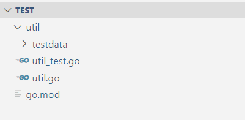
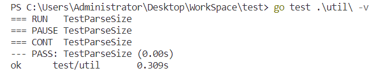
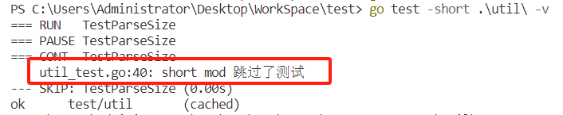
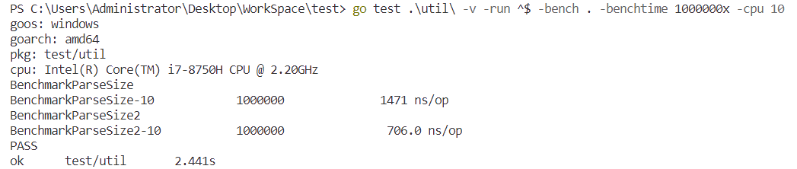
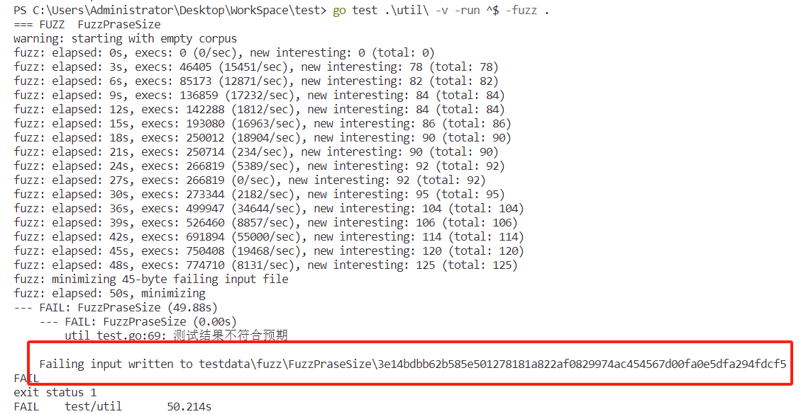
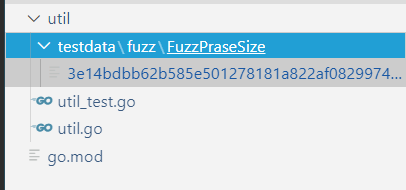
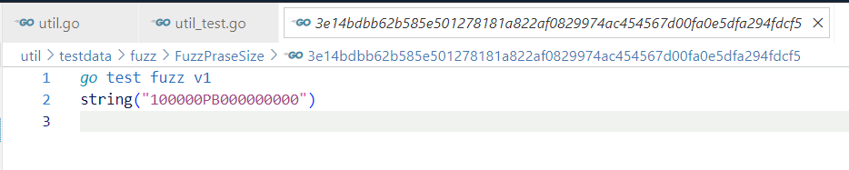

## 单元测试

### 单元测试规则

1. 测试用例文件必须以`_test.go`结尾，例如：`util_test.go`，以`test`结尾的文件不会被编译到生产环境里。
2. 功能测试用例的方法名必须以`Test`开头，性能测试`Benchmark`开头，模糊测试用例`Fuzz`开头
3. 默认情况下测试用例若正常通过则不会打印任何信息，必须指定 `-v` 打印信息
4. 声明后缀为`_test`的包的包测试文件将编译为分离包，然后与主测试二进制文件链接并运行
5. `go help test`、`go help testflag`查看 `go test`命令的帮助信息


### go test 模式

1. 本地模式：编译运行当前目录中的测试用例，`go test`或 `go test -v`
2. 列表模式：编译并测试命令行上列出的每一个包，例如：`go test util`、`go test ./...`、`go test .`等


### 常用flag

1. `-bench regexp`：表示运行匹配的基准测试用例
2. `-benchtime t`：指定每一个基准测试用例的运行时间或者运行次数
3. `-count n`：指定功能测试、基准测试与模糊测试，运行`n`次，相当于执行了`n`次`go test`命令。如果指定了`-cpu`，则为每个`cpu`配置运行N次
4. `-cover`：启用覆盖率分析，显示测试对于对于代码的覆盖率
5. `-cpu 1,2,4`：指定运行程序使用的CPU个数，`GOMAXPROCS`值，但单个CPU比多个快，因为执行时间涉及到CPU的调度
6. `-fuzz regexp`：运行匹配的模糊测试，不能对多个包使用
7. `-fuzztime t`：指定每一个模糊测试用例的运行时间或者运行次数
8. `-list regexp`：列出匹配的测试用例，不会列出子测试用例
9. `-parallel n`：允许并行执行调用了`t.parallel`方法的测试用例，默认为`GOMAXPROCS`值
10. `-run regexp`：表示运行匹配的功能测试用例
11. `-short` ：告诉`go test`可以跳过被标记的测试用例
12. `-timeout d`：运行测试用例的超时时间
13. `-v`：打印输出
14. `-benchmem`：输出内存分配的信息
15. `-blockprofile block.out`：将协程阻塞的数据写到`block.out`的文件
16. `-coverprofile cover.out`：将覆盖率的数据写到`block.out`的文件
17. `-cpuprofile cpu.out`：将cpu的数据写到`block.out`的文件
18. `-memprofile mem.out`：将内存的数据写到`block.out`的文件
19. `-mutexprofile mutex.out`：将死锁的信息写到`block.out`的文件
20. `-outputdir directory`：指定输出目录
21. `-trace trace.out`：指定测试用例的输出文件，可以基于这些文件去做性能分析

### 示例

目录结构：



被测试代码：

```go
package util

import (
	"regexp"
	"strconv"
	"strings"
)

const (
	B = 1 << (iota * 10)
	KB
	MB
	GB
	TB
	PB
)

const defaultNum = 100

func ParseSize(size string) (int64, string) {
	re, _ := regexp.Compile("[0-9]+")
	unit := string(re.ReplaceAll([]byte(size), []byte("")))
	num, _ := strconv.ParseInt(strings.Replace(size, unit, "", -1), 10, 64)
	unit = strings.ToUpper(unit)
	var byteNum int64 = 0
	switch unit {
	case "B":
		byteNum = num * B
	case "KB":
		byteNum = num * KB
	case "MB":
		byteNum = num * MB
	case "GB":
		byteNum = num * GB
	case "TB":
		byteNum = num * TB
	case "PB":
		byteNum = num * PB
	default:
		num = 0
	}
	if num == 0 {
		num = defaultNum
		byteNum = num * MB
		unit = "MB"
	}
	sizeStr := strconv.FormatInt(num, 10) + unit
	return byteNum, sizeStr
}
```

测试代码：

```go
package util

import (
	"testing"
)

var commTestData []commStruct

type commStruct struct {
	Group         string
	Sizestr       string
	ExpectSize    int64
	ExpectSizestr string
}

func initCommonData() {
	commTestData = []commStruct{
		{"B", "1b", B, "1B"},
		{"B", "100b", 100 * B, "100B"},
		{"KB", "1kb", KB, "1KB"},
		{"KB", "100kb", 100 * KB, "100KB"},
		{"MB", "1mb", MB, "1MB"},
		{"MB", "1000mb", 1000 * MB, "1000MB"},
		{"TB", "1tb", TB, "1TB"},
		{"PB", "1pb", PB, "1PB"},
		{"unknown", "1G", 100 * MB, "100MB"},
	}
}

// 可以在这里进行一些初始化操作，比如数据库连接，读取配置文件等
func TestMain(m *testing.M) {
	initCommonData()
	m.Run()
}

// 功能测试
func TestParseSize(t *testing.T) {
	t.Parallel() // 并行测试
	if testing.Short() {
		t.Skip("short mod 跳过了测试")
	}
	testData := commTestData
	for _, data := range testData {
		size, sizestr := ParseSize(data.Sizestr)
		if size != data.ExpectSize || sizestr != data.ExpectSizestr {
			t.Errorf("测试结果不符合预期：%+v\n", data)
		}
	}
}

func BenchmarkParseSize(b *testing.B) {
	for i := 0; i < b.N; i++ {
		ParseSize("100mb")
	}
}

func BenchmarkParseSize2(b *testing.B) {
	b.RunParallel(func(pb *testing.PB) {
		for pb.Next() {
			ParseSize("10gb")
		}
	})
}

func FuzzPraseSize(f *testing.F) {
	f.Fuzz(func(t *testing.T, a string) {
		size, sizeStr := ParseSize(a)
		if size == 0 || sizeStr == "" {
			t.Error("测试结果不符合预期")
		}
	})
}
```

#### 代码解析

制定测试所要的数据：

```go
// ...
var commTestData []commStruct

type commStruct struct {
	Group         string
	Sizestr       string
	ExpectSize    int64
	ExpectSizestr string
}

func initCommonData() {
	commTestData = []commStruct{
		{"B", "1b", B, "1B"},
		{"B", "100b", 100 * B, "100B"},
		{"KB", "1kb", KB, "1KB"},
		{"KB", "100kb", 100 * KB, "100KB"},
		{"MB", "1mb", MB, "1MB"},
		{"MB", "1000mb", 1000 * MB, "1000MB"},
		{"TB", "1tb", TB, "1TB"},
		{"PB", "1pb", PB, "1PB"},
		{"unknown", "1G", 100 * MB, "100MB"},
	}
}

// 可以在这里进行一些初始化操作，比如数据库连接，读取配置文件等
func TestMain(m *testing.M) {
	initCommonData()
	m.Run()
}
// ...
```

##### 功能测试

`t.Parallel()`是一个方法调用，用于告诉测试框架该测试用例可以并行执行。

`testing.Short()`是一个函数调用，用于告诉测试框架当前是否处于短时间测试模式，可以跳过该框架，以提高测试的速度。

```go
// 功能测试
func TestParseSize(t *testing.T) {
	t.Parallel() // 并行测试
	if testing.Short() {
		t.Skip("short mod 跳过了测试")
	}
	testData := commTestData
	for _, data := range testData {
		size, sizestr := ParseSize(data.Sizestr)
		if size != data.ExpectSize || sizestr != data.ExpectSizestr {
			t.Errorf("测试结果不符合预期：%+v\n", data)
		}
	}
}

```

命令行：



- `go test`：运行Go语言的测试框架。
- `.\util\`：指定要测试的包的路径，即`util`包。
- `-v`：输出测试的详细信息。

使用`-short`选项：



##### 基准测试

该函数是基准测试函数，用于测试`ParseSize`函数的性能。该函数使用`testing.B`类型的参数`b`，表示一个基准测试对象。在函数中，使用`for`循环执行`b.N`次`ParseSize("100mb")`函数调用，其中`b.N`是基准测试框架自动计算的测试次数，用于保证测试结果的准确性。在每次循环中，基准测试框架会自动记录函数的执行时间，并输出测试结果。通过基准测试，可以评估`ParseSize`函数的性能，以便优化代码。

```go
func BenchmarkParseSize(b *testing.B) {
	for i := 0; i < b.N; i++ {
		ParseSize("100mb")
	}
}
```

---

使用`b.RunParallel`方法并发执行`pb.Next()`，其中`pb`是一个`*testing.PB`类型的对象，表示一个基准测试的迭代器。在每次迭代中，调用`ParseSize("10gb")`函数，用于测试函数的性能。`b.RunParallel`方法会自动将测试用例并行执行。

```go
func BenchmarkParseSize2(b *testing.B) {
	b.RunParallel(func(pb *testing.PB) {
		for pb.Next() {
			ParseSize("10gb")
		}
	})
}
```

命令行：



- `-run ^$`：指定要运行的测试用例的正则表达式，这里表示运行所有测试用例。
- `-bench .`：运行基准测试，`.`表示运行所有基准测试。
- `-benchtime 1000000x`：指定每个基准测试运行的次数，这里表示每个基准测试运行1000000次。
- `-cpu 10`：指定运行基准测试的CPU核心数，这里表示使用10个CPU核心运行基准测试。

##### 模糊测试

该函数是Go语言中的模糊测试函数，用于对`ParseSize`函数进行模糊测试。该函数使用`testing.F`类型的参数`f`，表示一个模糊测试对象。在函数中，使用`f.Fuzz`方法对`ParseSize`函数进行模糊测试，其中`a`是一个字符串类型的参数，用于作为输入参数传递给`ParseSize`函数。在每次测试中，`f.Fuzz`方法会自动生成随机的字符串作为输入参数，并调用`ParseSize`函数进行测试。如果`ParseSize`函数的返回值不符合预期，即`size`等于0或`sizeStr`为空字符串，则会输出一个错误信息。通过模糊测试，可以发现和修复`ParseSize`函数中的潜在问题。

```go
func FuzzPraseSize(f *testing.F) {
	f.Fuzz(func(t *testing.T, a string) {
		size, sizeStr := ParseSize(a)
		if size == 0 || sizeStr == "" {
			t.Error("测试结果不符合预期")
		}
	})
}
```

命令行：



- `-run ^$`：指定要运行的测试用例的正则表达式，这里表示运行所有测试用例。
- `-fuzz .`：运行模糊测试，`.`表示运行所有模糊测试。

上面红框表示的是模糊测试将失败的测试用例输出到了所显示的目录：





注意：如果模糊测试的失败用例在目录中的话，下次执行功能测试会另外测试这个失败用例：

