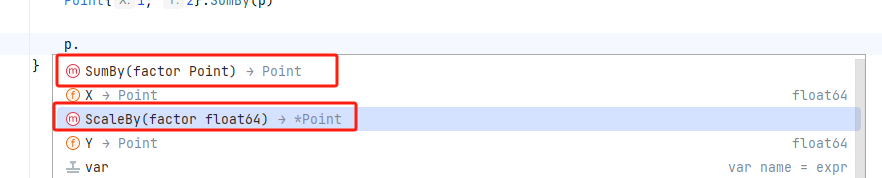
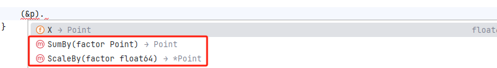
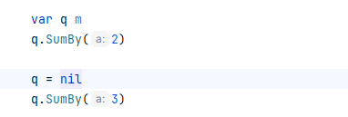

# Review

## 程序结构

`var name type = expression`

类型和表达式部分可以省略一个，但是不能都省略。如果类型省略，它的类型将由初始化表达式决定；如果表达式省略，其初始值对应于类型的零值。

>对于接口类型和引用类型（slice，指针，map，通道，函数）是nil。

---

### 短变量声明

在代码块的包围内，一种称为短变量声明的可选方式可以用来声明和初始化局部变量。

var 声明通常是为了那些跟初始化表达式类型不一致的局部变量保留的，或者用于后面才对变量赋值以及变量初始化不重要的情况。

```go
i := 100 // 一个int类型的变量
var boiling float64 = 100 // 一个float64类型的变量
```

> := 表示声明，而 = 表示赋值。一个多变量的声明不能和多重赋值搞混

短变量声明至少声明一个新变量：

```go
f, err := os.Open(infile)
// ...
f, err := os.Create(outfile) // 编译错误：没有新的变量
```

---

### 指针

指针类型的零值是nil，两个指针当且仅当指向同一个变量或者两者都是nil的情况才会相等

---

### new函数

每一次调用new都会返回一个具有唯一地址的不同变量：

```go
p := new(int)
q := new(int)
fmt.Println(p == q) // "false"
```

这个规则有一个例外：两个变量的类型不携带任何信息且是零值，例如`struct{}`或`[0]int`，当前的实现里面，它们有相同的地址

> fmt.Println ( new ( struct ) == new ( struct ) ) // false

new是一个预声明的函数，不是一个关键字：

```go
func delta(old, new int) int { return new - old }
```

自然，在delta函数内，内置的new函数是不可用，语法检测没问题，但编译会出错

---

### 变量的生存周期

```go
var global *int

func f() {
    var x int
    x = 1
    global = &x
}
```

这里， x 一定使用堆空间，因为它在 f 函数返回以后还可以从global变量访问，尽管它被声明为一个局部变量。不要用长生命周期的指针去指向短生命周期的变量。

---

### 类型声明

```go
package tempconv
// ...

type Celsius float64
type Fahrenheit float64

// ...
```

这个包里定义了两个类型，即使使用相同的底层类型float64，它们也不是相同的类型，所以它们不能用算是表达式进行比较和合并。 

---

### 包初始化

包的初始化从初始化包级别的变量开始，这些变量按照声明顺序初始化，在依赖已解析完毕的情况下，根据依赖的顺序进行。

```go
var a = b + c
var b = f()
var c = 1

func f() int { return c + 1 }

func main() {
    fmt.Println(a, b, c) // 3,2,1
}
```

```go
func init() { /* ... */}
```

init 函数：会在程序开始时自动执行，不能被调用和被引用。

## 方法

### 方法声明

Go语言中，接收者不是用特殊名（this、self）；而是我们自己选择接收者名字，跟其他参数变量一样。

由于接收者会频繁使用，因此最好能够选择简短且在整个方法中名称保持一致的名字。

```go
package main

import (
	"fmt"
	"math"
)

type Point struct {
	X, Y float64
}

func Distance(p, q Point) float64 {
	return math.Hypot(q.X-p.X, q.Y-p.Y)
}

func (p Point) Distance(q Point) float64 {
	return math.Hypot(q.X-p.X, q.Y-p.Y)
}

func main() {
	p := Point{1, 2}
	q := Point{4, 6}
	fmt.Println(Distance(p, q))
	fmt.Println(p.Distance(q))
}

```

上面两个Distance函数声明没有冲突，第一个声明一个包级别的函数（成为geometry.Distance）。第二个声明一个类型Point的方法，因此它的名字是Point.Distance。

<<<<<<< HEAD
> Point 结构类型中声明一个叫做 x 的方法会与字段 x 冲突

```go
package geometry

import (
	"math"
)

type Point struct {
	X, Y float64
}

func Distance(p, q Point) float64 {
	return math.Hypot(q.X-p.X, q.Y-p.Y)
}

func (p Point) Distance(q Point) float64 {
	return math.Hypot(q.X-p.X, q.Y-p.Y)
}

type Path []Point

func (path Path) Distance() float64 {
	sum := 0.0
	for i := range path {
		if i > 0 {
			sum += path[i-1].Distance(path[i]) // a方法
		}
	}
	return sum
}
```

```go
package main

import (
	"fmt"
	"test/geometry"
)

func main() {
	p := geometry.Point{1, 2}
	q := geometry.Point{4, 6}
	fmt.Println(geometry.Distance(p, q))
	fmt.Println(p.Distance(q))

	perim := geometry.Path{
		{1, 1},
		{5, 1},
		{5, 4},
		{1, 1},
	}
	fmt.Println(geometry.Path.Distance(perim)) // "12"，独立函数
	fmt.Println(perim.Distance())              // b方法，"12"，geometry.Path的方法
}
```

上面 a、b 的两个方法调用中，编译器会通过方法名和接收者的类型决定调用哪一个函数。在 a 方法中`path[i-1]`是Point类型，因此调用`Point.Distance`；在第二个示例，Perim是Path类型，因此调用`Path.Distance`。

类型拥有的所有方法名都必须是唯一的，但不同的类型可以使用相同的方法名，比如Point和Path类型的Distance方法；方法命名可以比函数更简短，在包外进行调用的时候，例如b方法，能够使用更加简短的名字且省略包的名字。

### 指针接收者的方法

由于主调函数会复制每一个变量，如果函数需要更新一个变量，或者如果一个实参太大而我们希望避免复制整个实参，因此我们必须使用指针来传递变量的地址。

```go
func (p *Point) ScaleBy(factor float64) {
	p.X *= factor
	p.Y *= factor
}
```

这个方法的名字是 `(p *Point).ScaleBy`，圆括号是必须的。

在合法的方法调用表达式中，只有符合以下三种形式的语句才能成立。

1. 实参接收者和形参接收者是同一类型，比如都是`T`类型或者`*T`类型：
2. 实参接收者是T类型的**变量**而形参接收者是*T类型。编译器会隐式地获取变量的地址。
3. 实参接收者是*T类型而形参接收者是T类型。编译器会隐式地解析引用接收者，获得实际取值。

```go
package main

import "fmt"

type Point struct {
	X, Y float64
}

func (p *Point) ScaleBy(factor float64) { // 这里的 p 为形参接收者
	p.X *= factor
	p.Y *= factor
}

func (q Point) SumBy(factor Point) {
	fmt.Println("成功")
}

func main() {
    var p Point // 这里的 p 为实参接收者
    
    // 2/3.编译器会隐式转换
	p.ScaleBy(2)
    p.SumBy(p)
    (&p).SumBy(p)
	(&p).ScaleBy(2)

	Point{1, 2}.SumBy(p) // 1.都是Point类型
}
```


> 
>
> 
>
>  **不管取地址还是取值都会有两个调用函数**

>  **nil是一个合法的接收者**
>
> 

### 方法变量与表达式

#### 方法变量

可以把方法赋值给一个方法变量，它是一个函数，把方法绑定到接收者上，函数只需要提供实参而不需要提供接收者就能够调用。

`方法变量 := 变量.方法`

```go
p := Point{1, 2}
q := Point{4, 6}

distanceFromP := p.Distance     // 方法变量
fmt.Println(distanceFromP(q))  
var origin Point                
fmt.Println(distanceFromP(origin))

scaleP := p.ScaleBy // 方法变量
scaleP(2)
```

#### 方法表达式

`方法表达式 := 类型.方法`

与方法变量相关的是方法表达式。和调用一个普通的函数不同，在调用方法的时候必须提供一个接收者作为第一个形参。

```go
p := Point{1, 2}
q := Point{4, 6}

distance := Point.Distance     // 方法变量
fmt.Println(distance(p, q))  
fmt.Printf("%T\n", distance)   // "func(Point, Point) float64"

scale := (*Point).ScaleBy // 方法变量
scaleP(&p, 2)
fmt.Println(p)
fmt.Printf("%T\n", distance)   // "func(*Point, float64)"
```

如果需要用一个值表示多种方法，那么方法变量可以帮助调用这个值来处理不同的接收者。

```go
package main

import "fmt"

type Point struct{ X, Y float64 }

func (p Point) Add(q Point) Point { return Point{p.X + q.X, p.Y + q.Y} }
func (p Point) Sub(q Point) Point { return Point{p.X - q.X, p.Y - q.Y} }

type Path []Point

func (path Path) TranslateBy(offset Point, add bool) {
	var op func(p, q Point) Point
	if add {
		op = Point.Add
	} else {
		op = Point.Sub
	}
	for i := range path {
		// 调用 path[i].Add(offset) 或 path[i].Sub(offset)
		path[i] = op(path[i], offset)
	}
}
func main() {
	path := Path{{1, 2}, {3, 4}, {5, 6}}
	path.TranslateBy(Point{1, 2}, true)
	fmt.Println(path)
	path = Path{{1, 2}, {3, 4}, {5, 6}}
	path.TranslateBy(Point{1, 2}, false)
	fmt.Println(path)
	fmt.Printf("%T\n", path.TranslateBy)
}
```

### 封装

如果变量或者方法是不能通过对象访问到的，这称作封装的变量或者方法。

Go语言只有一种方法控制命名的可见性：定义的时候，首字母大写的标识符是可以从包中导出的。同样的机制也适用于结构体内的字段和类型中的方法。结论就是，要封装一个对象，就必须使用结构体。

封装提供了三个优点。第一，因为使用方不能直接修改对象的变量，所以不需要更多的语句来检查变量的值。第二，隐藏实现细节可以防止使用方依赖的属性发生改变，使得设计者可以更加灵活地改变API的实现而不破坏兼容性。第三个重要的好处就是可以防止使用者肆意地改变对象内的变量。

## 接口

