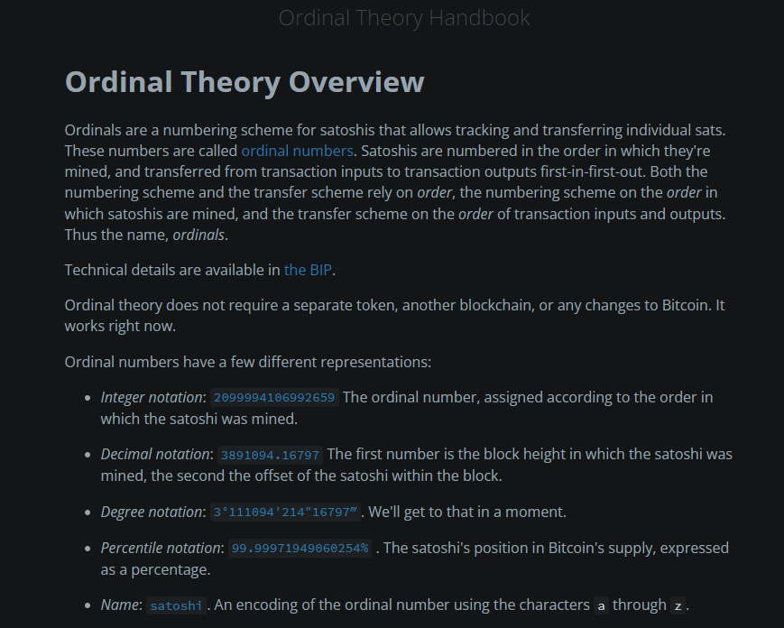
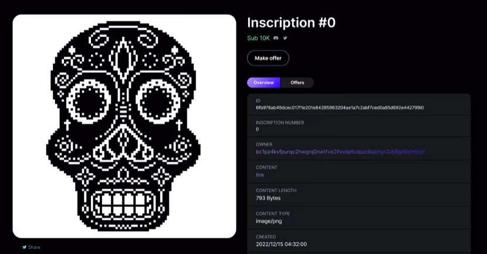
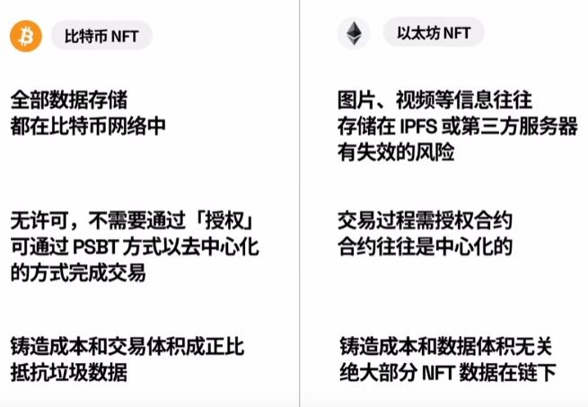
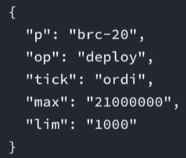
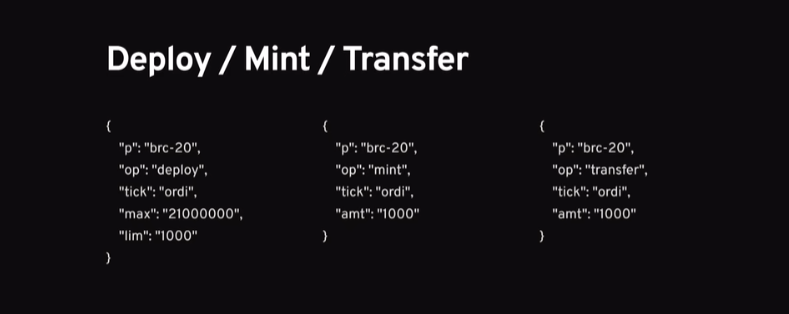
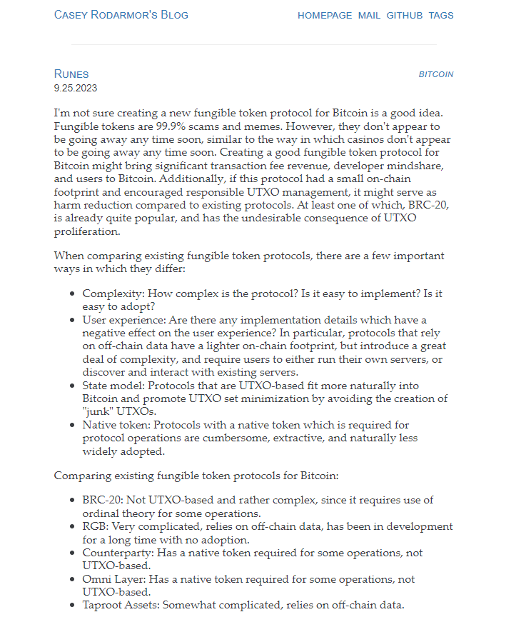

# Runes & Ordinals

## 一、Ordinals

### Ordinals协议

2022年由[Casey](https://twitter.com/rodarmor)提出的Ordinals协议的概念，2023年1月底正式在比特币主网上启动，Casey可以说是Ordinals之父，也是今年这轮比特币生态牛市中最亮眼的开发者。

比特币的最小单位为1`聪`，也称作`sats`或`satoshi`，1BTC等于`100,000,000`sats。Ordinals协议就是为每一个聪定义了顺序编号，并使用隔离见证和Taproot技术，允许将内容铭刻在比特币网络上，并绑定到特定序号的聪上，使其能够交易和转移。

铭刻的内容形式主要包括图片、文本、视频和音频等。



Ordinals的设计初衷是为了让比特币主链也拥有原生创造NFT的能力，也就是说Ordinals协议最初是为了比特币NFT而诞生的，而不是同质化代币。

以下这是比特币主网上第一个Ordinals：



Ordinals和其他非比特币链上的NFT有很大不同，Ordinals的元数据并没有存储在一个特定的位置上，相反这些数据会被嵌入到比特币交易的见证数据中（witness data，witness field），这也是大家称为铭文的原因，英语也叫inscription。

这一过程通过隔离见证`Segregated Witness, SegWit`和向Taproot支付`Pay-to-Taproot, P2TR`的方式来实现，其中包含了提交和揭露两个阶段，将内容铭刻在指定的从上面。



Ordinals还有个特点，就是先到先得，这也是每个铭文类发售的时候大家会去卷gas的原因，并且转移的时候也是先进先出。

Ordinals是通过第三方数据索引index，Ordinals的deploy、mint、transfer等行为全靠用户向链上发布特定的数据字段来实现，Ordinals只能通过基于检索的去中心化数据做合法解释。

### BRC20协议

BRC20是基于Ordinals的一种代币发行标准，其铸造也是铸造铭文的过程。

2023年3月8日，开发者[domodata](https://twitter.com/domodata)通过Ordinals协议和inscriptions功能向比特币链上存储JSON数据，通过将代币名称、总量等信息用规范的JSON格式写入聪以实现代币的部署铸造和转账，变相且简陋地实现了比特币链上发同质化代币的功能。

> BRC20和ERC20有很大的区别，其不能实现智能合约，并且名称最多为4个字母。





## 二、Runes

Runs是2023年9月由[Casey](https://twitter.com/rodarmor)提出的和BRC20同级别的代币协议，都是在比特币主网上发行Token资产的协议。

之前提到的BRC20有两个明显的缺点：

1. 效率底下
2. UTXO的膨胀

Casey最初在设计Ordinals时并没有构造BRC20协议的想法，由于BRC20爆火后比特币区块链的拥堵，Casey构想了一个BRC20的潜在替代方案，即为[Runes](https://casey.github.io/blog/runes/)。



### 概述

Runes余额由 UTXO 持有，UTXO 可以包含任意数量的任意数量的符文。

如果输出的脚本 pubkey 包含一个 OP_RETURN，后跟一个 ASCII 大写字母R作为数据推送，则该事务包含协议信息。协议消息是第一条报文之后的所有数据推送。

输入到带有无效协议信息的交易中的符文将被烧毁。这样可以防止未来的升级改变符文的分配或创建方式，从而避免旧客户端错误分配符文余额的情况。

前缀 varint 为整数编码，其中 varint 中前导的数量决定了其长度（以字节为单位）。

### Transfer

协议报文中的第一个数据推送被解码为整数序列。

这些整数被解释为（ID、OUTPUT、AMOUNT）元组序列。如果解码后的整数个数不是三的倍数，则协议报文信息无效。

- ID 是要分配的运行的数字 
- OUTPUT 是要分配的输出索引
- AMOUNT 是要分配的运行量

ID 被编码为 delta，这样同一 rune 的多个赋值就可以避免重复完整的 rune ID。例如，元组：

```rust
[(100, 1, 20), (0, 2 10), (20, 1, 5)]
```

即：

- ID 100，索引1，20个符文
- ID 100，索引2，10个符文
- ID 120，索引1、5个符文

而 Amount 0 是`所有剩余 runes`的简写。

处理完所有元组赋值后，任何未赋值的 runes 都会被赋值给第一个非 OP_RETURN 输出。

### Issuance

如果协议消息有第二次数据推送，则为发行交易。第二次数据推送被解码为两个整数，`SYMBOL`, `DECIMALS`。

如果剩余整数，则协议消息无效。

发行交易可以从`0`开始到`2^128 - 1`使用分配元组中的 ID 创建任何数量。

`SYMBOL`是一个 base 26-encoded 的可读符号，类似于序数卫星名称中使用的符号，`A`to`Z`。

`DECIMALS`是显示发行的 runes 时应使用的小数点后的位数。

如果`SYMBOL`尚未分配，就会分配给已发布的符文，而已发布的符文则会收到下一个可用的数字符文 ID，从 1 开始。

如果`SYMBOL`已经被分配，或者 是`BITCOIN`、`BTC`、 或`XBT`，则不会创建新的符文。使用符文 ID `0`的发行交易将被忽略，但其他分配仍会被处理。

### Notes

在显示UTXO 余额时，可使用符文 ID 0 和 BITCOIN、BTC 或 XBT 符号显示 UTXO 的本机比特币余额。

为了保持协议的简洁性，Casey 没有试图避免 symbol squatting。

一种可能但仍然简单的避免 symbol squatting 的技术是：只允许分配一定长度以上的 symbol，随着时间的推移，该长度会逐渐减少，最终达到 0，并允许分配所有 symbols。这将避免在协议初期分配短小、理想的 symbol，并鼓励以后对理想 symbol 的竞争，Casey 认为这种竞争可能是有意义的。