# Rust Notes

## 一、基础语法

- Rust 编辑器
- Rust 创建工程
- Rust 程序的编译与执行
- Rust 代码规范

### 1. 下载安装

MacOS / Linux / WSL：

```shell
curl --proto '=https' --tlsv1.2 -sSf https://sh.rustup.rs | sh
```

> Windows 原生平台安装请自查，首先确定版本位数：，在安装过程中，它会询问你是想安装 GNU 工具链的版本还是 MSVC 工具链的版本。安装 GNU 工具链版本的话，不需要额外安装其他软件包。而安装 MSVC 工具链的话，需要先安装微软的 Visual Studio 依赖。若暂时不想在本地安装，可使用网页版：[Rust 试验场](https://play.rust-lang.org/?version=stable&mode=debug&edition=2021)

### 2. 编辑器 / IDE

在 VS Code 中需要安装 rust-analyzer 插件才会有自动提示等功能：

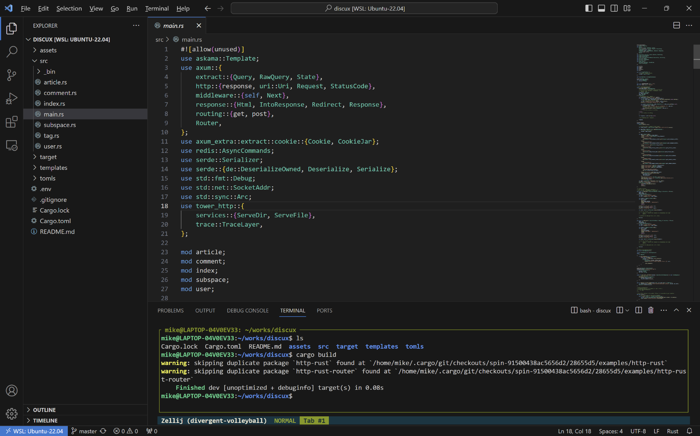

其他一些常用的 Rust 代码编辑器还有 VIM、NeoVIM、IDEA、Clion 等。JetBrains 最近推出了 Rust 专用的 IDE：RustRover。

Rust 编译器套件安装好之后，会提供一些工具：

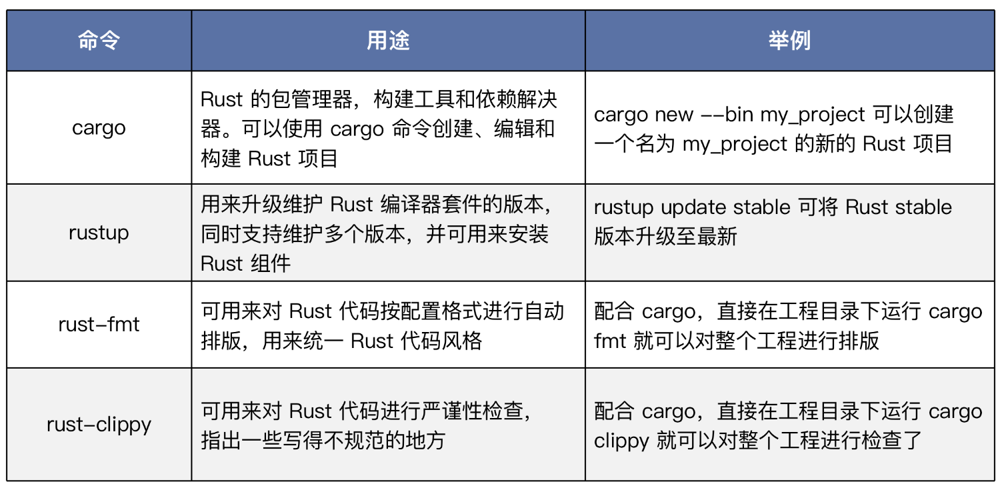

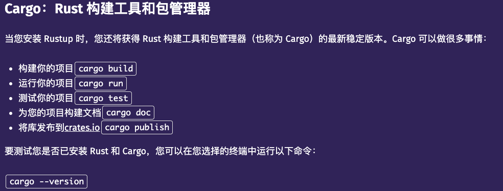

### 3. 创建工程

使用 Cargo 命令行工具来创建一个 Rust 工程 helloworld。

打开终端，输入：

```shell
cargo new --bin helloworld 
```

显示：

```shell
Created binary (application) `helloworld` package
```

新工程目录组织结构：

```shell
helloworld
    ├── Cargo.toml
    └── src
        └── main.rs
```

第一层是一个 src 目录和一个 Cargo.toml 配置文件。src 是放置源代码的地方，而 Cargo.toml 是这个工程的配置文件：

```
[package]
name = "helloworld"
version = "0.1.0"
edition = "2021"

# See more keys and their definitions at https://doc.rust-lang.org/cargo/reference/manifest.html

[dependencies]
```

Cargo.toml 中包含 package 等基本信息，里面有名字、版本和采用的 Rust 版次。Rust 3 年发行一个版次，目前有 2015、2018 和 2021 版次，最新的是 2021 版次。可以执行`rustc -V`来查看Rust 版本：

```shell
rustc 1.76.0 (07dca489a 2024-02-04)
```

### 4. Hello, World

```rust
fn main() {
    println!("Hello, world!");
}
```

这段代码会使终端输出`"Hello, world!"`的字符串，使用`cargo build`编译：

```shell
$ cargo build
   Compiling helloworld v0.1.0 (/home/mike/works/classes/helloworld)
    Finished dev [unoptimized + debuginfo] target(s) in 1.57s
```

使用`cargo run`命令可以直接运行程序：

```shell
$ cargo run
    Finished dev [unoptimized + debuginfo] target(s) in 0.01s
     Running `target/debug/helloworld`
Hello, world!
```

### 5. 基础语法

Rust 基础语法主要包括基础类型、复合类型、控制流、函数与模块几个方面。

#### 基础类型

##### 赋值语句

Rust使用`let`关键字定义变量以及初始化：

```rust
fn main() {
  let a: u32 = 1;
}
```

Rust 中类型写在变量名的后面，例子里变量 a 的类型是 u32, 也就是无符号 32 位整数，赋值为 1，Rust 保证定义的变量在第一次使用之前一定被初始化过。

##### 数字类型

与一些动态语言不同，Rust 中的数字类型是区分位数的。

###### 整数

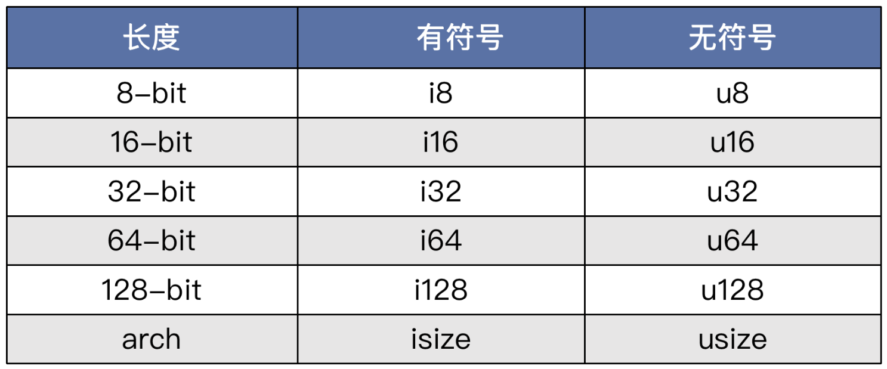

其中，isize 和 usize 的位数与具体 CPU 架构位数有关。CPU 是 64 位的，它们就是 64 位的，CPU 是 32 位的，它们就是 32 位的。这些整数类型可以在写字面量的时候作为后缀跟在后面，来直接指定值的类型，比如`let a = 10u32`就定义了一个变量a，初始化成无符号32位整型，值为10。

###### 整数字面量的辅助写法

```
十进制字面量 98_222，使用下划线按三位数字一组隔开
十六进制字面量 0xff，使用0x开头
8进制字面量 0o77，使用0o（小写字母o）开头
二进制字面量 0b1111_0000，使用0b开头，按4位数字一组隔开
字符的字节表示 b'A'，对一个ASCII字符，在其前面加b前缀，直接得到此字符的ASCII码值
```

各种形式的辅助写法是为了提高程序员写整数字面量的效率，同时更清晰，更不容易犯错。

###### 浮点数

浮点数有两种类型：f32 和 f64，分别代表 32 位浮点数类型和 64 位浮点数类型。它们也可以跟在字面量的后面，用来指定浮点数值的类型，比如 let a = 10.0f32; 就定义了一个变量 a，初始化成 32 位浮点数类型，值为 10.0。

###### 布尔类型

```rust
let a = true;
let b: bool = false;
```

###### 字符

```rust
fn main() {
    let c = 'z';
    let z: char = 'ℤ'; 
    let heart_eyed_cat = '😻';
    let t = '中';
}
```

Rust 的 char 类型存的是[Unicode散列值](https://unicode.org/glossary/#unicode_scalar_value)。可以表示各种符号，另外在 Rust 中，char 类型在内存中总是占用4个字节大小，这一点与C语言和其他语言中的 char 类型不一样。

**注意，Rust 中的 String 不能通过下标去访问。**

```rust
let hello = String::from("你好");
let a = hello[0];  // 你可能想把“你”字取出来，但实际上这样是错误的
```

> String 存储的 Unicode 序列的 UTF8 编码，而 UTF8 编码是变长编码。这样即使能访问成功，也只能取出一个字符的 UTF8 编码的第一个字节，它很可能是没有意义的。因此 Rust 直接对 String 禁止了这个索引操作。

###### 转义字符

与 C 语言一样，Rust 中转义符号也是反斜杠 \ ，可用来转义各种字符：

```rust
fn main() {
    // 将""号进行转义
    let byte_escape = "I'm saying \"Hello\"";
    println!("{}", byte_escape);
    
    // 分两行打印
    let byte_escape = "I'm saying \n 你好";
    println!("{}", byte_escape);
    
    // Windows下的换行符
    let byte_escape = "I'm saying \r\n 你好";
    println!("{}", byte_escape);
    
    // 打印出 \ 本身
    let byte_escape = "I'm saying \\ Ok";
    println!("{}", byte_escape);
    
    // 强行在字符串后面加个0，与C语言的字符串一致。
    let byte_escape = "I'm saying hello.\0";
    println!("{}", byte_escape);
}
```

除此之外，Rust 还支持通过 \x 输入等值的 ASCII 字符，以及通过 \u{} 输入等值的 Unicode 字符：

```rust
fn main() {
    // 使用 \x 输入等值的ASCII字符（最高7位）
    let byte_escape = "I'm saying hello \x7f";
    println!("{}", byte_escape);
    
    // 使用 \u{} 输入等值的Unicode字符（最高24位）
    let byte_escape = "I'm saying hello \u{0065}";
    println!("{}", byte_escape);
}
```

###### 禁止转义字符

如果不希望字符串被转义，在 Rust 中可以使用` r"" `或` r#""# `把字符串字面量套起来：

```rust
fn main() {
    // 字符串字面量前面加r，表示不转义
    let raw_str = r"Escapes don't work here: \x3F \u{211D}";
    println!("{}", raw_str);
    
    // 这个字面量必须使用r##这种形式，因为希望在字符串字面量里面保留""
    let quotes = r#"And then I said: "There is no escape!""#;
    println!("{}", quotes);
    
    // 如果遇到字面量里面有#号的情况，可以在r后面，加任意多的前后配对的#号，
    // 只要能帮助Rust编译器识别就行
    let longer_delimiter = r###"A string with "# in it. And even "##!"###;
    println!("{}", longer_delimiter);
}
```

> Rust 中的字符串字面量都支持换行写，但会把换行符包含进去。

###### 字节串

如果字符串字面量中用不到 Unicode 字符，只需要 ASCII 字符集，对于这种情况，Rust 还有一种更紧凑的表示法：字节串。用 b 开头，双引号括起来，比如 b"this is a byte string"。这时候字符串的类型已不是字符串，而是字节的数组 [u8; N]，N 为字节数：

```rust
fn main() {
    // 字节串的类型是字节的数组，而不是字符串了
    let bytestring: &[u8; 21] = b"this is a byte string";
    println!("A byte string: {:?}", bytestring);
    
    // 可以看看下面这串打印出什么
    let escaped = b"\x52\x75\x73\x74 as bytes";
    println!("Some escaped bytes: {:?}", escaped);

    // 字节串与原始字面量结合使用
    let raw_bytestring = br"\u{211D} is not escaped here";
    println!("{:?}", raw_bytestring);
}
```

> 字节串很有用，特别是在做系统级编程或网络协议开发的时候，经常会用到。

###### 数组

Rust 中的数组是 array 类型，用于存储同一类型的多个值。数组表示成[T; N]，由中括号括起来，中间用分号隔开，分号前面表示类型，分号后面表示数组长度：

```rust
fn main() {
    let a: [i32; 5] = [1, 2, 3, 4, 5];
    let a = [1, 2, 3, 4, 5];
}
```

Rust 中的数组是固定长度的，也就是说在编译阶段就能知道它占用的字节数，并且在运行阶段，不能改变它的长度（尺寸）。

Rust 中区分固定尺寸数组和动态数组，之所以做这种区分是因为 Rust 语言在设计时就要求适应不同的场合，要有足够的韧性能在不同的场景中都达到最好的性能。因为固定尺寸的数据类型是可以直接放栈上的，创建和回收都比在堆上动态分配的动态数组性能要好。

**是否能在编译期计算出某个数据类型在运行过程中占用内存空间的大小**，这个指标很重要，Rust 的类型系统就是按这个对类型进行分类的。

###### 动态数组

Rust 中的动态数组类型是 Vec（Vector），也就是向量，中文翻译成动态数组。它用来存储同一类型的多个值，容量可在程序运行的过程中动态地扩大或缩小，因此叫做动态数组：

```rust
fn main() {
    let v: Vec<i32> = Vec::new();
    let v = vec![1, 2, 3];
    
    let mut v = Vec::new();
    v.push(5);
    v.push(6);
    v.push(7);
    v.push(8);
}
```

动态数组可以用下标进行索引访问，比如：

```rust
fn main() {
    let s1 = String::from("superman 1");
    let s2 = String::from("superman 2");
    let s3 = String::from("superman 3");
    let s4 = String::from("superman 4");
    
    let v = vec![s1, s2, s3, s4];

    println!("{:?}", v[0]);
}
// 输出 
"superman 1"
```

**如果下标越界，代码可以通过编译，但运行时会出错，并且会导致主线程的崩溃。**

###### 哈希表

哈希表是一种常见的结构，用于存储 Key-Value 映射关系，基本在各种语言中都有内置提供。Rust 中的哈希表类型为 HashMap。对一个 HashMap 结构来说，Key 要求是同一种类型，比如是字符串就统一用字符串，是数字就统一用数字。Value 也是一样，要求是同一种类型。Key 和 Value 的类型不需要相同：

```rust
fn main() {
    use std::collections::HashMap;
    
    let mut scores = HashMap::new();
    scores.insert(String::from("Blue"), 10);
    scores.insert(String::from("Yellow"), 50);

    println!("{:?}", scores["Blue"]);
}
```

##### 复合类型

复合类型可以包含多种基础类型，是一种将类型进行有效组织的方式，提供了一级一级搭建更高层类型的能力。Rust 中的复合类型包括元组、结构体、枚举等。

###### 元组

元组是一个固定（元素）长度的列表，每个元素类型可以不一样。用小括号括起来，元素之间用逗号隔开。例如：

```rust
fn main() {
    let tup: (i32, f64, u8) = (500, 6.4, 1);
}
```

元组元素的访问：

```rust
fn main() {
    let x: (i32, f64, u8) = (500, 6.4, 1);
    
    // 元组使用.运算符访问其元素，下标从0开始，注意语法
    let five_hundred = x.0;
    let six_point_four = x.1;
    let one = x.2;
}
```

与数组的相同点是，它们都是固定元素个数的，在运行时不可伸缩。与数组的不同点是，元组的每个元素的类型可以不一样。元组在 Rust 中很有用，因为它可以用于函数的**返回值**，相当于把多个想返回的值捆绑在一起，**一次性返回**。

当没有任何元素的时候，元组退化成 ()，就叫做 unit 类型，是 Rust 中一个非常重要的基础类型和值，unit 类型唯一的值实例就是 ()，与其类型本身的表示相同。比如一个函数没有返回值的时候，它实际默认返回的是这个 unit 值。

###### 结构体

结构体也是一种复合类型，它由若干字段组成，每个字段的类型可以不一样，Rust 中使用 struct 关键字来定义结构体。比如下面的代码就定义了一个 User 类型：

```rust
struct User {
    active: bool,
    username: String,
    email: String,
    age: u64,
}
```

结构体类型的实例化：

```rust
fn main() {
    let user1 = User {
        active: true,
        username: String::from("someusername123"),
        email: String::from("someone@example.com"),
        age: 1,
    };
}
```

###### 枚举

```rust
enum IpAddrKind {
    V4,
    V6,
}
```

枚举类型里面的选项叫做此枚举的变体（variants）。

变体是其所属枚举类型的一部分，枚举使用变体进行枚举类型的实例化，比如：

```rust
let four = IpAddrKind::V4;
let six = IpAddrKind::V6;
```

可以看到，枚举类型也是一种复合类型。但是与结构体不同，结构体类型是里面的所有字段（所有类型）同时起作用，来产生一个具体的实例，而枚举类型是其中的一个变体起作用，来产生一个具体实例。学术上，通常把枚举叫作**和类型**（sum type），把结构体叫作**积类型**（product type）。

**枚举类型是 Rust 中最强大的复合类型**，在后面的课程中我们会看到，枚举就像一个载体，可以携带任何类型。

#### 控制流

##### 分支语句

Rust 中使用 if else 来构造分支：

```rust
fn main() {
    let number = 6;
    // 判断数字number能被4，3，2中的哪一个数字整除
    if number % 4 == 0 {
        println!("number is divisible by 4");
    } else if number % 3 == 0 {
        println!("number is divisible by 3");
    } else if number % 2 == 0 {
        println!("number is divisible by 2");
    } else {
        println!("number is not divisible by 4, 3, or 2");
    }
}
```

与其他 C 系语言不同，Rust 中 if 后面的条件表达式不推荐用（）包裹起来，因为 Rust 设计者认为那个是不必要的，是多余的语法噪音。

另外，`if else`支持表达式返回：

```rust
fn main() {
    let x = 1;
    // 在这里，if else 返回了值
    let y = if x == 0 {
        // 代码块结尾最后一句不加分号，表示把值返回回去
        100
    } else {
        // 代码块结尾最后一句不加分号，表示把值返回回去
        101
    };
    println!("y is {}", y);
}
```

像上面这样的代码，其实已经实现了类似于 C 语言中的三目运算符这样的设计，在 Rust 中，不需要额外提供那样的特殊语法。

##### 循环语句

Rust 中有三种循环语句，分别是 loop、while、for。

- loop 用于无条件（无限）循环：

  ```rust
  fn main() {
      let mut counter = 0;
      
      // 这里，接收从循环体中返回的值，对result进行初始化
      let result = loop {
          counter += 1;
          if counter == 10 {
              // 使用break跳出循环，同时带一个返回值回去
              break counter * 2;
          }
      };
  
      println!("The result is {result}");
  }
  ```

  这种**返回一个值到外面对一个变量初始化的方式**，是 Rust 中的习惯用法，这能让代码更紧凑。

- while 循环为条件判断循环。当后面的条件为真的时候，执行循环体里面的代码。和前面的 if 语句一样，Rust 中的 while 后面的条件表达式不推荐用（）包裹起来。比如：

  ```rust
  fn main() {
      let mut number = 3;
  
      while number != 0 {
          println!("{number}!");
          number -= 1;
      }
  
      println!("LIFTOFF!!!");
  }
  ```

- for 循环在 Rust 中，基本上只用于迭代器（暂时可以想象成对数组，动态数组等）的遍历。Rust 中没有 C 语言那种 for 循环风格的语法支持，因为那被认为是一种不好的设计，以下是对一个数组进行遍历：

  ```rust
  fn main() {
      let a = [10, 20, 30, 40, 50];
  
      for element in a {
          println!("the value is: {element}");
      }
  }
  ```

  上面代码对动态数组 Vec 的遍历阻止了越界的可能性，因此用这种方式访问 Vec 比用下标索引的方式访问更加安全。

  对于循环的场景，Rust 还提供了一个便捷的语法来生成遍历区间：` ..`（两个点）：

  ```rust
  fn main() {
      // 左闭右开区间
      for number in 1..4 {
          println!("{number}");
      }
      println!("--");
      // 左闭右闭区间
      for number in 1..=4 {
          println!("{number}");
      }
      println!("--");
      // 反向
      for number in (1..4).rev() {
          println!("{number}");
      }
  }
  // 输出
  1
  2
  3
  --
  1
  2
  3
  4
  --
  3
  2
  1
  ```

  打印字符：

  ```rust
  fn main() {
  for ch in 'a'..='z' {
          println!("{ch}");
      }
  }
  // 输出：
  a
  b
  c
  d
  e
  f
  g
  h
  i
  j
  k
  l
  m
  n
  o
  p
  q
  r
  s
  t
  u
  v
  w
  x
  y
  z
  ```

#### 函数与模块

##### 函数

函数基本上是所有编程语言的标配，在 Rust 中也不例外，它是一种基本的代码复用方法。在 Rust 中使用 fn 关键字来定义一个函数。比如：

```rust
fn print_a_b(a: i32, b: char) {
    println!("The value of a b is: {a}{b}");
}

fn main() {
    print_a_b(5, 'h');
}
```

函数对于几乎所有语言都非常重要，实际上各种编程语言在实现时，都是以函数作为基本单元来组织栈上的内存分配和回收的，这个基本的内存单元就是所谓的栈帧（frame）。

##### 闭包（Closure）

闭包是另一种风格的函数。它使用两个竖线符号` ||` 定义，而不是用` fn xxx() `来定义：

```rust
fn main() {
    // // 标准的函数定义
    // fn  add_one_v1   (x: u32) -> u32 { x + 1 }

    // // 闭包的定义，请注意形式对比
    // let add_one_v2 = |x: u32| -> u32 { x + 1 };

    // // 闭包的定义2，省略了类型标注
    // let add_one_v3 = |x|             { x + 1 };

    // // 闭包的定义3，花括号也省略了
    // let add_one_v4 = |x|              x + 1  ;
    
    let add_one = |x| x + 1; 
    let a_vec: Vec<i32> = vec![1,2,3,4,5];
    let vec2: Vec<_> = a_vec.iter().map(add_one).collect();
    println!("{vec2:?}");
}
```

闭包与函数的一个显著不同就是，**闭包可以捕获函数中的局部变量使用**，而函数不行。比如，下面示例中的闭包 add_v2 捕获了 main 函数中的局部变量 a 来使用，但是函数 add_v1 就没有这个能力：

```rust
fn main() {
    let a = 10u32;             // 局部变量
    
    fn  add_v1   (x: u32) -> u32 { x + a }    // 定义一个内部函数
    let add_v2 = |x: u32| -> u32 { x + a };   // 定义一个闭包
    
    let result1 = add_v1(20);  // 调用函数
    let result2 = add_v2(20);  // 调用闭包
    println!("{}", result2);
}
```

这样会编译错误，并提示错误：

```shell
error[E0434]: can't capture dynamic environment in a fn item
 --> src/main.rs:4:40
  |
4 |     fn  add_v1   (x: u32) -> u32 { x + a }    // 定义一个内部函数
  |                                        ^
  |
  = help: use the `|| { ... }` closure form instead
```

闭包之所以能够省略类型参数等信息，主要是其定义在某个函数体内部，从闭包的内容和上下文环境中能够分析出来那些类型信息。

##### 模块

代码量多了后，分成不同的文件模块书写是非常自然的事情，这个需求需要从编程语言层级去做一定的支持才行，Rust 也提供了相应的方案。

分文件和目录组织代码理解起来其实很简单，主要的知识点在于目录的组织结构上。比如下面示例：

```shell
backyard
├── Cargo.lock
├── Cargo.toml
└── src
    ├── garden              // 子目录
    │   └── vegetables.rs
    ├── garden.rs           // 与子目录同名的.rs文件，表示这个模块的入口
    └── main.rs
```

第五行代码到第七行代码组成 garden 模块，在 garden.rs 中，使用 mod vegetables; 导入 vegetables 子模块。在 main.rs 中，用同样的方式导入 garden 模块：

```shell
mod garden;
```

整个代码结构就这样一层一层地组织起来了，另一种文件的组织形式来自 2015 版：

```shell
backyard
├── Cargo.lock
├── Cargo.toml
└── src
    ├── garden          // 子目录
    │   └── mod.rs      // 子目录中有一个固定文件名 mod.rs，表示这个模块的入口
    │   └── vegetables.rs
    └── main.rs
```

同上，由第五行到第七行代码组成 garden 模块，在 main.rs 中导入它使用。

#### 测试

Rust 语言中自带单元测试和集成测试方案，假设在 src/lib.rs 或 src/main.rs 下有一段代码：

```shell
fn foo() -> u32 { 10u32 }

#[cfg(test)]            // 这里配置测试模块
mod tests {
    use crate::foo;
     
    #[test]             // 具体的单元测试用例
    fn it_works() {
        let result = foo();           // 调用被测试的函数或功能
        assert_eq!(result, 10u32);    // 断言
    }
}
```

在项目目录下运行 cargo test，会输出类似如下结果：

```shell
running 1 test
test tests::it_works ... ok
test result: ok. 1 passed; 0 failed; 0 ignored; 0 measured; 0 filtered out; finished in 0.00s

running 0 tests
test result: ok. 0 passed; 0 failed; 0 ignored; 0 measured; 0 filtered out; finished in 0.00s
```

#### 配置文件 Cargo.toml

`Cargo.toml`是 Rust 语言包和依赖管理器 Cargo 的配置文件，由官方定义约定。

写 Rust 代码基本都会按照这种约定来使用它，对所在工程进行配置。npm 依赖黑洞是指 Node.js 的包依赖太多太琐碎了，Rust 也类似，为了应对这种复杂性，Cargo 工具的提供了非常多的特性，配置起来也相对比较复杂。相关文档：[Cargo配置属性](https://doc.rust-lang.org/cargo/)

---

## 二、所有权

Rust 语言里的值有两大类：一类是固定内存长度（简称固定尺寸）的值，比如 i32、u32、由固定尺寸的类型组成的结构体等；另一类是不固定内存长度（简称非固定尺寸）的值，比如字符串 String。这两种值的本质特征完全不一样。而**怎么处理这两种值的差异，往往是语言设计的差异性所在**。

C、C++、Java 这些语言就明确定义了数字类型会占用内存中的几个字节，比如 8 位，也就是一个字节，16 位，也就是两个字节。而 JavaScript 这种语言，就完全屏蔽了底层的细节，统一用一个 Number 表示数字。Python 则给出了 int 整数、float 浮点、complex 复数三种数字类型。

Rust 语言因为在设计时就定位为一门通用的编程语言（对标 C++），它的应用范围很广，从最底层的嵌入式开发、OS 开发，到最上层的 Web 应用开发，它都要兼顾。所以它的数字类型不可避免地就得暴露出具体的字节数，于是就有了 i8、i16、i32、i64 等类型。

一种类型如果具有固定尺寸，那么它就能够在编译期做更多的分析。实际上固定尺寸类型也可以用来管理非固定尺寸类型。具体来说，Rust 中的非固定尺寸类型就是靠指针或引用来指向，而指针或引用本身就是一种固定尺寸的类型。

### 1. 栈与堆

现代计算机会把内存划分为很多个区。比如，二进制代码的存放区、静态数据的存放区、栈、堆等。

**栈上的操作比堆高效**，因为栈上内存的分配和回收只需移动栈顶指针就行了。这就决定了分配和回收时都必须精确计算这个指针的增减量，因此栈上一般放固定尺寸的值。另一方面，栈的容量也是非常有限的，因此也**不适合放尺寸太大的值**，比如一个有 1000 万个元素的数组。

那么非固定尺寸的值怎么处理呢？在计算机体系架构里面，专门在内存中拿出一大块区域来存放这类值，这个区域就叫堆。

在一般的程序语言设计中，栈空间都会与函数关联起来。每一个函数的调用，都会对应一个帧，也叫做 frame 栈帧，就像图片栈空间里的方块 main、fn1、fn2 等。

一个函数被调用，就会分配一个新的帧，函数调用结束后，这个帧就会被自动释放掉。因此**栈帧是一个运行时的事物**。函数中的参数、局部变量之类的资源，都会放在这个帧里面，比如图里 fn2 中的局部变量 a，这个帧释放时，这些局部变量就会被一起回收掉。

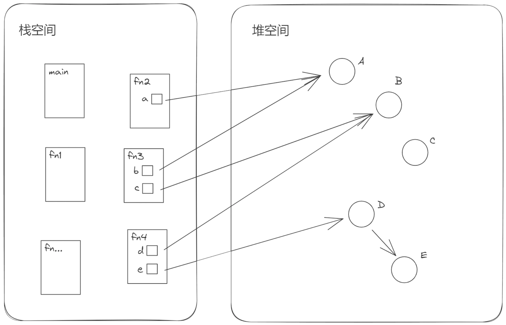

函数的调用会形成层级关系，因此栈空间中的帧可能会同时存在很多个，并且在它们之间也对应地形成层级关系。如上图所示，可能的函数调用关系为，main 函数中调用了函数 fn1，fn1 中调用了函数 fn2，fn2 中调用了函数 fn3，fn3 中调用了函数 fn4，fn4 调用了更深层次的其他函数。这样的话，在程序执行的某个时刻，main 函数、fn1、fn2、fn3、fn4 等对应的帧副本就同时存在于栈中了。

图中右边堆空间里面的一些小圈表示堆空间中资源，也就是被分配的内存。从图中可以看到，栈空间中函数帧的局部变量是可以引用这些堆上资源的。一个栈帧中的多个局部变量可以指向堆中的多个资源，如 fn3 中的 b 指向资源 A，c 指向资源 B；同时存在的多个栈帧中的局部变量还可以指向堆上的同一个资源，如图中的 a 和 b，c 和 d；堆上的资源也可以存在引用关系，如图中的 D 和 E。

如果一个资源没有被任何一个栈帧中的变量引用或间接引用，如图中的 C，那么它实际是一个被泄漏的资源，也就是发生了内存泄漏。被泄漏的资源会一直伴随程序的运行，直到程序自身的进程被停止时，才会一起被 OS 回收掉。

而计算机程序内存管理的复杂性，主要就在于**堆内存的管理比较复杂——既要高效，又要安全**。

### 2. 变量与可变性

在 Rust 中定义一个变量，使用`let variable = value`这种语法。比如`let x = 10u32`就定义了变量 x，10u32 是一个值，它被绑定到这个变量上，另外默认变量是不可变的。

Rust 默认这样做是为了减少一些很低级的 Bug，假如默认可以改的话，如果在一个代码量很大而且离定义变量很远的某个分支语句里面修改了这个变量的值，然后在后面某个函数调用里面又用到了它，结果导致程序行为与期望不符，所以Rust 禁用了这种方式。

但是下面这样做是可以的：

```rust
fn main() {
    let x = 5;
    println!("The value of x is: {x}");
    let x = 6;    // 注意这里，重新使用了 let 来定义新变量
    println!("The value of x is: {x}");
}
```

这种方式在 Rust 中叫做变量的 Shadowing。意思很好理解，就是定义了一个新的变量名，只不过这个变量名和老的相同。原来那个变量就被遮盖起来了，访问不到了，变量的 Shadow 甚至支持新的变量的类型和原来的不一样。

如果需要修改变量的值，需要在变量名前面加一个 mut ：

```rust
fn main() {
    let mut x = 5;
    println!("The value of x is: {x}");
    x = 6;
    println!("The value of x is: {x}");
}
// 输出 
// The value of x is: 5
// The value of x is: 6
```

注意，值的改变只能在同一种类型中变化，在变量 x 定义的时候，就已经确定了变量 x 的类型为数字了，如果将其改为字符串，则会报错。

Rust 中变量的可变性是一种潜力，只要它有可能会变化，那么就可以称之为变量。而 Rust 给这种潜力加了一道开关，**当想让这个变量的可变性暴露出来的时候，应该在变量名前面明确地加个 mut 修饰符**。

可以看到，变量名加了 mut，多打了 4 个字符，这实际是在代码中留下了一种足迹。也就是说给了程序员一个信息，当自己或别的程序员在读到这个变量的定义时，他会知道，后面一定会修改这个变量，因为如果后面没修改它，Rust 编译器会提示把这个 mut 去掉。另外这种设计还有一个好处，那就是减少滥用概率。

值是有类型的，比如 10u32，它就是一个 u32 类型的数字。一旦一个变量绑定了一个值，或者说一个值被绑定到了一个变量上，那么这个变量就被指定为这种值的类型。比如`let x = 10u32` 编译器会自动推导出变量 x 的类型为 u32，完整的写法就是`let x: u32 = 10u32`。

此外还有一种方式，就是直接先指定变量的类型，然后把一个值绑定上去，比如`let x: u32 = 10`。这种方式更好，它能说明在写这句代码的时候就已经对它做了一个架构上的规划和设计，这种形式能帮助在编译阶段阻止一些错误。

比如输入下面这段代码：

```rust
fn main() {
    let a: u8 = 323232;
    println!("{a}");
}
```

编译器就会报错，**指出 u8 类型装不下这么大的一个数字**。

**所有的变量都应该具有明确的类型是 Rust 程序的基本设计**，当然其他语言中也有类型，不同语言对类型重视的程度不一样，这取决于语言自身的设计定位。

### 3. 所有权

一个简单的例子：

```rust
fn main() {
    let a = 10u32;
    let b = a;
    println!("{a}");
    println!("{b}");
}

// 打印：
// 10
// 10
```

如果赋值为字符串，输出将会发生错误：

```rust
fn main() {
    let s1 = String::from("I am a superman.");
    let s2 = s1;
    println!("{s1}");
    println!("{s2}");
}
```

```shell
   Compiling playground v0.0.1 (/playground)
error[E0382]: borrow of moved value: `s1`
// 借用了移动后的值 `s1`
 --> src/main.rs:4:15
  |
2 |     let s1 = String::from("I am a superman.");
  |         -- move occurs because `s1` has type `String`, which does not implement the `Copy` trait
// 移动发生了，因为 `s1` 的类型是 `String`，而这种类型并没有实现 `Copy` trait."。
3 |     let s2 = s1;
  |              -- value moved here
// 在这里值移动了。
4 |     println!("{s1}");
  |               ^^^^ value borrowed here after move
// 值在被移动后在这里被借用
  |
  = note: this error originates in the macro `$crate::format_args_nl` which comes from the expansion of the macro `println` (in Nightly builds, run with -Z macro-backtrace for more info)
help: consider cloning the value if the performance cost is acceptable
// 如果性能成本可以接受的话，考虑克隆这个值
  |
3 |     let s2 = s1.clone();
  |                ++++++++
```

按修改建议进行修改：

```rust
fn main() {
    let s1 = String::from("I am a superman.");
    let s2 = s1.clone();
    println!("{s1}");
    println!("{s2}");
}
```

可以输出预期的结果了：

```shell
I am a superman.
I am a superman.
```

在 Rust 中，字符串的行为与 u32 这种数字类型不一样。u32 这种类型是固定尺寸类型，而 String 是非固定尺寸类型。

一般来说，对于固定尺寸类型，会默认放在栈上；而非固定尺寸类型，会默认创建在堆上，成为堆上的一个资源，然后在栈上用一个局部变量来指向它，如代码中的 s1。

在将一个变量赋值给另一个变量的时候，不同语言对底层细节的处理不一样。Java 语言对于 int 这类固定尺寸类型，在复制给另一个变量的时候，会直接复制它的值。在面对 Object 这种复杂对象的时候，默认只会复制这个 Object 的引用给另一个变量。这个引用的值（内存地址）就存在栈上的局部变量里面，因为如果那个 Object 占用的内存很大，每一次重新赋值，就把那个对象重新拷贝一次，也就是完全克隆，是非常低效的。所以在用 Java 编程时，它实际上是隐藏了对象引用的复制这个细节。

回到 Rust，对于 u32 这种固定尺寸类型来说，Rust 与 Java 也是同样的处理，直接在栈上进行内容的拷贝。而对于字符串这种动态长度的类型来说，在变量的再赋值上，Rust 除了拷贝字符串的引用外，实际还做了更多事情，一个修改后的例子：

```rust
fn main() {
    let s1 = String::from("I am a superman.");
    let s2 = s1;
    //println!("{s1}");
    println!("{s2}");
}
// 能正常打印
```

对比之后，可以发现` let s2 = s1; `语句执行后，s2 可以使用，而 s1 不能再使用了。也就是说，在 Rust 里面，s1 把内容`复制`给 s2 后，s2 可用，s1 不能用了。

从代码层面我们也可以说，s1 把值（资源）`移动`给了 s2。既然是移动了，那原来的变量就没有那个值了。请仔细体会这里与 Java 的不同之处。Java 默认做了引用的拷贝，并且新旧两个变量同时指向原来那个对象。**而 Rust 不一样，Rust 虽然也是把字符串的引用由 s1 拷贝到了 s2，但是只保留了最新的 s2 到字符串的指向，同时却把 s1 到字符串的指向给`抹去`了**。s1 之后都处于一种“不可用”的状态，直到函数结束。这就是 Rust 编译器做的那个`更多`的部分。

下面的图示展示了这两种行为上的差异，这有助于**内存安全**：

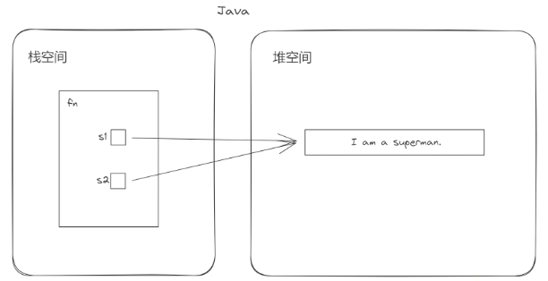

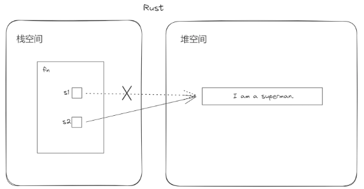

Rust 明确了所有权的概念，值也可以叫资源，所有权就是拥有资源的权利。一个变量拥有一个资源的所有权，那它就要负责那个资源的回收、释放。**Rust 基于所有权定义出发，推导出了整个世界**。

#### 所有权的定义

**所有权的基础是三条定义：**

1. **Rust中，每一个值都有一个所有者。**
2. **任何一个时刻，一个值只有一个所有者。**
3. **当所有者所在作用域（scope）结束的时候，其管理的值会被一起释放掉。**

这三条规则涉及两个概念：**所有者和作用域**。

所谓所有者，在代码里就用变量表示。而变量的作用域，就是变量有效（valid）的那个代码区间。

在 Rust 中，一个所有权型变量的作用域，简单来说就是它定义时所在的那个最里层的花括号括起的部分，从变量创建时开始，到花括号结束的地方。

比如：

```rust
fn main() {    
    let s = String::from("hello");
    // do stuff with s
}  // 变量s的作用域到这里结束

fn main() {    
    let a = 1u32;
    {
        let s = String::from("hello"); 
    }  // 变量s的作用域到这里结束
    // xxxx
    
}  // 变量a的作用域到这里结束
```

变量在其作用域内是有效的，离开作用域就无效了。

```rust
fn main() {
    let a = 10u32;
    let b = a;
    println!("{a}");
    println!("{b}");
}
```

在这个例子中，a 具有对值 10u32 的所有权。执行 let b = a 的时候，把值 10u32 复制了一份，b 具有对这个新的 10u32 值的所有权。当 main 函数结束的时候，a、b 两个变量就离开了作用域，其对应的两个 10u32，就都被回收了。这里是栈帧结束，栈帧内存被回收，局部变量位于栈帧中，所以它们所占用的内存就被回收了。

再来看一个字符串的例子：

```rust
fn main() {
    let s1 = String::from("I am a superman.");
    println!("{s1}");
}
```

局部变量 s1 拥有这个字符串的所有权，s1 的作用域从定义到开始，直到花括号结束。s1（栈帧上的局部变量）离开作用域时，变量 s1 上绑定的内存资源（字符串）就被回收掉了。注意，这里发生的事情是，栈帧中的局部变量离开作用域了，顺带要求堆内存中的字符串资源被回收。之所以能够做到这一点，是因为这个堆中的字符串资源被栈帧中的局部变量所指向了的。

而从 Rust 的语法层面看起来，就是变量 s1 对那个字符串拥有所有权。所以 s1 离开作用域的时候，那个资源就一起被回收了。这看起来好像是一个自动的过程，并没有像 C 语言中那样，需要手动调用 free() 函数去释放堆中的字符串资源。

这种**堆内存资源随着关联的栈上局部变量一起被回收的内存管理特性**，叫作 **RAII**（Resource Acquisition Is Initialization）。它实际不是 Rust 的原创，而是 C++ 创造的。对比一下 C 中的 malloc() 分配堆内存的方式，在分配堆内存后，C 语言里面必须由程序员手动在后续的代码中使用 free() 来释放堆内存中的资源。而有了 RAII 特性后，不需要手动写 free()，因此可以认为 RAII 内存管理方式是一个相当大的进步。

有了所有权的知识后，再回过头来分析上面那个例子：

```rust
fn main() {
    let s1 = String::from("I am a superman.");
    let s2 = s1;
    //println!("{s1}");
    println!("{s2}");
}
```

变量 s1 持有这个字符串的所有权，s1 对字符串的所有权从第 2 行定义时开始，到 let s2 = s1 执行后结束。这一行执行后，s2 持有那个字符串的所有权。而此时 s1 处于一种不可用的状态，或者叫无效状态（invalid），这个状态是由 Rust 编译器在编译阶段管理的，只需要从所有权模型去理解它，而不需要操心细节。

然后直到花括号结束，s2 及 s2 所拥有的字符串内存，就被回收掉了，s1 所对应的那个局部变量的内存空间也一并被回收了。

**所有权是 Rust 语言的出发点，我们写的任何 Rust 程序，都必须遵循这套规则**。

需要注意的一点是，所有权其实是内存结构之上的更上层概念，并不是说只有在堆中分配的资源才有所有权。实际上，栈上的资源也是有所有权的。所有权这个概念实际上屏蔽了底层内存结构的细节，让我们可以站在一个新的层次上更有效地对问题进行建模。

#### 使用所有权书写函数

基于所有权规则，函数的写法也会有所改变：

```rust
fn foo(s: String) {
    println!("{s}");
}

fn main() {
    let s1 = String::from("I am a superman.");
    foo(s1);
}

// 输出：
// I am a superman.
```

若想在调用函数结束后，在外面再打印一下 s1 的值：

```rust
fn foo(s: String) {
    println!("{s}");
}

fn main() {
    let s1 = String::from("I am a superman.");
    foo(s1);
    println!("{s1}");    // 这里加了一行
}
```

将会报错：

```shell
error[E0382]: borrow of moved value: `s1`
 --> src/main.rs:8:16
  |
6 |     let s1 = String::from("I am a superman.");
  |         -- move occurs because `s1` has type `String`, which does not implement the `Copy` trait
7 |     foo(s1);
  |         -- value moved here
8 |     println!("{s1}");
  |                ^^ value borrowed here after move
  |
note: consider changing this parameter type in function `foo` to borrow instead if owning the value isn't necessary
 --> src/main.rs:1:11
  |
1 | fn foo(s: String) {
  |    ---    ^^^^^^ this parameter takes ownership of the value
  |    |
  |    in this function
  = note: this error originates in the macro `$crate::format_args_nl` which comes from the expansion of the macro `println` (in Nightly builds, run with -Z macro-backtrace for more info)
help: consider cloning the value if the performance cost is acceptable
  |
7 |     foo(s1.clone());
  |           ++++++++
```

这个例子代码的提示与前面差不多，就是说 s1 所有权已经被移动进函数里面了，不能在移动后再使用了。

这个例子在其他语言中，一般是不会有问题的。foo 函数也许会修改字符串的值，在外面重新打印的时候，会打印出新的值。但是，这其实是一种相当隐晦的设计模式，可能会造成一些错误，而 Rust 阻止了这种模式。

注意提示中的这一行：

```shell
1 | fn foo(s: String) {
  |    ---    ^^^^^^ this parameter takes ownership of the value
```

**函数的参数 s 获取了这个值的所有权**，函数参数是这个函数的一个局部变量，它在这个函数栈帧结束的时候会被回收，因此这个字符串在这个函数调用结束后，就已经被回收了，这就是无法再打印这个字符串的原因。

同样再看一个上面例子的变形：

```rust
fn foo(s: String) {
    println!("{s}");
}

fn main() {
    let s1 = String::from("I am a superman.");
    foo(s1);
    foo(s1);
}
```

简单地想调用两次` foo()`函数都做不到，原因跟前面是一样的。

但是，既然能把所有权移动到函数里面，也当然能把所有权转移出来：

```rust
fn foo(s: String) -> String {
    println!("{s}");
    s
}

fn main() {
    let s1 = String::from("I am a superman.");
    let s1 = foo(s1);
    println!("{s1}");
}

// 输出结果
// I am a superman.
// I am a superman.
```

#### 移动与复制

u32 这种类型在做变量的再赋值的时候，是做了复制所有权的操作。而 String 这种类型在做变量再赋值的时候，是做了移动所有权的操作。那么，在 Rust 中哪些类型默认是做移动所有权操作，哪些类型默认是做复制所有权操作呢？

复制所有权的操作：

- 整数类型
- 布尔类型
- 浮点数类型
- 字符类型
- 元组类型
- 数组类型
- 不可变引用类型（&）

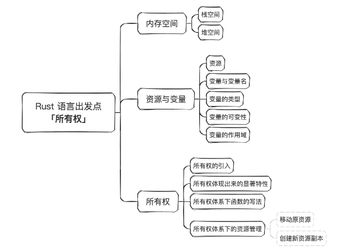

### 4. 引用

还是这个例子：

```rust
fn foo(s: String) -> String {
    println!("{s}");
    s
}

fn main() {
    let s1 = String::from("I am a superman.");
    let s1 = foo(s1);
    println!("{s1}");
}
```

这样可能会很麻烦。一是会给程序员造成一些心智负担，还得想着把值传回来再继续使用。如果代码中到处都是所有权传来传去，会让代码显得相当冗余，毕竟很多时候函数返回值是要用作其他类型的返回的。为了解决这个问题，Rust 引入了借用的概念。

`借用`概念也是实际生活中思维的映射，比如有一样东西，别人想用一下，可以借出。那`引用`概念又是什么呢？其实在 Rust 中，借用和引用是一体两面。把东西借给别人用，也就是别人持有了对这个东西的引用。

在 Rust 中，变量前用“&”符号来表示引用，比如` &x`。

其实**引用也是一种值，并且是固定尺寸的值**，一般来说，与机器 CPU 位数一致，比如 64 位或 32 位。因为是值，所以就可以赋给另一个变量。同时它又是固定的而且是小尺寸的值，那其实赋值的时候，就可以直接复制一份这个引用。

来看一下如何使用引用：

```rust
fn main() {
    let a = 10u32;
    let b = &a;        // b是变量a的一级引用
    let c = &&&&&a;    // c是变量a的多级引用
    let d = &b;        // d是变量a的间接引用
    let e = b;         // 引用b再赋值给e
    
    println!("{a}");
    println!("{b}");
    println!("{c}");
    println!("{d}");
    println!("{e}");
}
// 输出
// 10
// 10
// 10
// 10
// 10
```

从上面示例中可以看出，Rust 识别了一般情况下的意图，**不会打印出引用的内存地址**，而是打印出了被引用对象的值。示例中的 c 实际是 a 的 5 次引用，但是打印时仍然正确获取到了 a 的值。d 是 a 的间接引用，但是仍然正确获取到了 a 的值。这里可以看出 Rust 与 C 这种纯底层语言的显著区别，Rust 对程序员更友好，它会更多地面向业务。因为人们还是普遍关注最终那个值的部分，而不是中间过程的内存地址。

上面示例中，**b 和 e 都是对 a 的一级引用。由于引用是固定尺寸的值，let e = b 做的就是引用的复制操作，并没有再复制一份 a 的值**。对于字符串也是一样，这些引用都不会导致堆中的字符串资源被复制一份或多份。字符串的所有权仍然在 s1 那里，s2、s3、s4、s5 都是对这个所有权变量的引用。从这里开始，可以将变量按一个新的维度划分为**所有权型变量**和**引用型变量**。

也可以看出，在 Rust 中，一个所有权型变量（如 s1）带有值和类型的信息，一个引用型变量（如 s2、s3、s4、s5）也带有值和类型的信息，不然它没法正确回溯到最终的值。这些信息是 Rust 编译器帮忙维护的。

#### 不可变引用与可变引用

Rust 的变量具有可变性，那么同样的规则，是不是可以施加到引用上来呢？当然可以，这也正是 Rust 语言设计一致性的体现。

实际上默认` &x `指的是不可变引用。而要获取到可变引用，需要使用` &mut `符号，如` &mut x`。

所以：

- 引用分为不可变引用和可变引用
- `&x`是对变量`x`的不可变引用
- `&mut x`是对变量`x`的可变引用

这里 mut 和 x 中间有个空格，是为了避免和 &mutx 混淆。

到目前为止，如果要对一个变量内容进行修改，必须拥有所有权型变量才行。而很多时候，没法拥有那个资源的所有权，比如引用一个别人的库，它没有把所有权类型暴露出来，但是确实又有更新其内部状态的需求。因此需要一个东西，它既是一种引用，又能够修改指向资源的内容，于是就引入了**可变引用**。

前面举的引用的例子，实际只是访问（打印）变量的值，没有修改它们，如果要使用引用修改变量的值：

```rust
fn main() {
    let a = 10u32;
    let b = &mut a;
    *b = 20;

    println!("{b}");
}
```

提示：

```shell
error[E0596]: cannot borrow `a` as mutable, as it is not declared as mutable
  --> src/main.rs:19:13
   |
19 |     let b = &mut a;
   |             ^^^^^^ cannot borrow as mutable
   |
help: consider changing this to be mutable
   |
18 |     let mut a = 10u32;
   |         +++
```

既然要修改一个变量的值，那么变量名前需要加上`mut`修饰符：

```rust
fn main() {
    let mut a = 10u32;
    let b = &mut a;
    *b = 20;

    println!("{b}");
}
// 输出 
// 20
```

接下来改动一下例子：

```rust
fn main() {
    let mut a = 10u32;
    let b = &mut a;
    *b = 20;

    println!("{b}");
    println!("{a}");    // 这里多打印了一行a
}
// 输出 
20
20
```

正确输出了修改后的值，若换一下两个打印的语句：

```rust
fn main() {
    let mut a = 10u32;
    let b = &mut a;
    *b = 20;

    println!("{a}");  // 这一句移到前面来
    println!("{b}");
}
```

会报错：

```shell
   Compiling playground v0.0.1 (/playground)
error[E0502]: cannot borrow `a` as immutable because it is also borrowed as mutable
 --> src/main.rs:6:15
  |
3 |     let b = &mut a;
  |             ------ mutable borrow occurs here
...
6 |     println!("{a}");  // 这一句移到的前面来
  |               ^^^ immutable borrow occurs here
// 提示说这里发生了不可变借用
7 |     println!("{b}");
  |               --- mutable borrow later used here
// 在这后面使用了可变借用
  |
  = note: this error originates in the macro `$crate::format_args_nl` which comes from the expansion of the macro `println` (in Nightly builds, run with -Z macro-backtrace for more info)
```

- 打印语句` println! `中，不管是传所有权型变量还是引用型变量，都能打印出预期的值。实际上` println! `中默认会对所有权变量做不可变借用操作（对应代码里的第 6 行）。
- 可变引用调用的时机（对应代码里的第 7 行）和不可变引用调用的时机（对应代码里的第 6 行），好像有顺序要求。

另外一个例子：

```rust
fn main() {
    let mut a = 10u32;
    let b = &mut a;
    *b = 20;
    let c = &a;      // 在利用b更新了a的值后，c再次借用a
}
```

这个代码是可以顺利编译的。但是加一句打印则会报错：

```rust
fn main() {
    let mut a = 10u32;
    let b = &mut a;
    *b = 20;
    let c = &a;       // 在利用b更新了a的值后，c再次借用a
    
    println!("{b}");  // 加了一句打印语句
}
```

提示：

```shell
   Compiling playground v0.0.1 (/playground)
error[E0502]: cannot borrow `a` as immutable because it is also borrowed as mutable
// 不能将a借用为不可变的，因为它已经被可变借用了
  --> src/main.rs:5:13
  |
3 |     let b = &mut a;
  |             ------ mutable borrow occurs here
// 可变借用发生在这里
4 |     *b = 20;
5 |     let c = &a;
  |             ^^ immutable borrow occurs here
// 不可变借用发生在这里
6 |     
7 |     println!("{b}");  // 加了一句打印语句
  |               --- mutable borrow later used here
// 可变借用在这里使用了
```

试着改一下打印语句：

```rust
fn main() {
    let mut a = 10u32;
    let b = &mut a;
    *b = 20;
    let c = &a;
    
    println!("{c}");  // 不打印b了，换成打印c
}
// 输出
// 20
```

尝试一下把变量 c 的定义移到前面一些，结果又不能编译：

```rust
fn main() {
    let mut a = 10u32;
    let c = &a;        // c的定义移到这里来了
    let b = &mut a;
    *b = 20;
  
    println!("{c}");
}
```

提示：

```shell
   Compiling playground v0.0.1 (/playground)
error[E0502]: cannot borrow `a` as mutable because it is also borrowed as immutable
 --> src/main.rs:4:13
  |
3 |     let c = &a;        // c的定义移到这里来了
  |             -- immutable borrow occurs here
4 |     let b = &mut a;
  |             ^^^^^^ mutable borrow occurs here
...
7 |     println!("{c}");
  |               --- immutable borrow later used here
```

**引用的最后一次调用时机很关键**，一个所有权型变量的作用域是从它定义时开始到花括号结束，而引用型变量的作用域不是这样，**引用型变量的作用域是从它定义起到它最后一次使用时结束**。

比如上面的示例中，所有权型变量 a 的作用域是 2~8 行；不可变引用 c 的作用域只有第 3 行，它定义了，但并没有被使用，所以它的作用域就只有那一行；可变引用 b 的作用域是 4~7 行。同时，还存在一条规则：**一个所有权型变量的可变引用与不可变引用的作用域不能交叠**，也可以说不能同时存在，接下来用这条规则分析前面的示例：

```rust
fn main() {
    let mut a = 10u32;
    let c = &a;        
    let b = &mut a;
    *b = 20;
  
    println!("{c}");
}
```

所有权型变量 a 的作用域是 2~8 行，不可变引用 c 的作用域是 3~7 行，可变引用 b 的作用域是 4~5 行。b 和 c 的作用域交叠了，因此无法编译通过。

再看一个例子：

```rust
fn main() {
    let mut a = 10u32;
    let b = &mut a;
    *b = 20;
    let d = &mut a;
    
    println!("{d}");      // 打印d
}
// 输出
// 20
```

如果尝试打印 b：

```rust
fn main() {
    let mut a = 10u32;
    let b = &mut a;
    *b = 20;
    let d = &mut a;
    
    println!("{b}");      // 打印b
}
```

编译不通过，提示：

```shell
   Compiling playground v0.0.1 (/playground)
error[E0499]: cannot borrow `a` as mutable more than once at a time
// 在一个时刻不能把`a`以可变借用形式借用超过一次
 --> src/main.rs:5:13
  |
3 |     let b = &mut a;
  |             ------ first mutable borrow occurs here
4 |     *b = 20;
5 |     let d = &mut a;
  |             ^^^^^^ second mutable borrow occurs here
6 |     
7 |     println!("{b}");
  |               --- first borrow later used here
```

编译器：`在一个时刻不能把 a 以可变借用形式借用超过一次`，可以发现确实这两个可变借用的作用域交叠了，b 的作用域是 3～7 行，d 的作用域是第 5 行，所以**同一个所有权型变量的可变借用之间的作用域也不能交叠**。

继续来一个例子：

```rust
fn main() {
    let mut a = 10u32;
    let r1 = &a;
    a = 20;
    
    println!("{r1}");
}
```

编译报错：

```shell
   Compiling playground v0.0.1 (/playground)
error[E0506]: cannot assign to `a` because it is borrowed
// 不能给a赋值，因为它被借用了
 --> src/main.rs:4:5
  |
3 |     let r1 = &a;
  |              -- `a` is borrowed here
4 |     a = 20;
  |     ^^^^^^ `a` is assigned to here but it was already borrowed
5 |     
6 |     println!("{r1}");
  |               ---- borrow later used here
```

提示在有借用的情况下，不能对所有权变量进行更改值的操作（写操作）。

有可变借用存在的情况下也一样：

```rust
fn main() {
    let mut a = 10u32;
    let r1 = &mut a;
    a = 20;
    
    println!("{r1}");
}
```

编译报错：

```shell
   Compiling playground v0.0.1 (/playground)
error[E0506]: cannot assign to `a` because it is borrowed
 --> src/main.rs:4:5
  |
3 |     let r1 = &mut a;
  |              ------ `a` is borrowed here
4 |     a = 20;
  |     ^^^^^^ `a` is assigned to here but it was already borrowed
5 |     
6 |     println!("{r1}");
  |               ---- borrow later used here
```

提示在有借用的情况下，不能对所有权变量进行更改值的操作（写操作）。

##### 阶段性总结

1. **所有权型变量**的作用域是从它定义时开始到**所属那层花括号结束**。
2. **引用型变量**的作用域是从它定义起到它**最后一次使用时结束**。
3. **引用（不可变引用和可变引用）型变量**的作用域**不会长于所有权变量的作用域**。不然就会出现悬锤引用，这是典型的内存安全问题。
4. 一个**所有权型变量**的**不可变引用可以同时存在多个**，可以复制多份。
5. 一个**所有权型变量**的**可变引用与不可变引用的作用域不能交叠**，也可以说不能同时存在。
6. 某个时刻对某个**所有权型变量只能存在一个可变引用**，不能有超过一个可变借用同时存在，也可以说，对同一个所有权型变量的可变借用之间的作用域不能交叠。
7. **在有借用存在的情况下，不能通过原所有权型变量对值进行更新**。当借用完成后（借用的作用域结束后），物归原主，又可以使用所有权型变量对值做更新操作了。

下面我们再来试试可变引用能否被复制：

```rust
fn main() {
    let mut a = 10u32;
    let r1 = &mut a;
    let r2 = r1;
    
    println!("{r1}")
}
```

出错了，提示：

```shell
error[E0382]: borrow of moved value: `r1`
 --> src/main.rs:6:16
  |
3 |     let r1 = &mut a;
  |         -- move occurs because `r1` has type `&mut u32`, which does not implement the `Copy` trait
4 |     let r2 = r1;
  |              -- value moved here
5 |     
6 |     println!("{r1}")
  |                ^^ value borrowed here after move
```

r1 的值移动给了 r2，因此 r1 不能再被使用了，修改一下：

```rust
fn main() {
    let mut a = 10u32;
    let r1 = &mut a;
    let r2 = r1;
    
    println!("{r2}");    // 打印r2
}
// 输出
// 10
```

从这个例子可以看出，可变引用的再赋值，会执行移动操作。赋值后，原来的那个可变引用变量就不能用了。这有点类似于所有权的转移，因此**一个所有权型变量的可变引用也具有所有权特征**，它可以被理解为那个所有权变量的独家代理，具有**排它性**。

#### 多级引用

面这段代码展示了 mut 修饰符，&mut 和 & 同时出现的情况：

```rust
fn main() {
    let mut a1 = 10u32;
    let mut a2 = 15u32;

    let mut b = &mut a1;
    b = &mut a2;

    let mut c = &a1;
    c = &a2;
}
```

再来看一个多级可变引用的例子：

```rust
fn main() {
    let mut a1 = 10u32;
    let mut b = &mut a1;
    *b = 20;

    let c = &mut b;
    **c = 30;          // 多级解引用操作
    
    println!("{c}");
}
// 输出 
// 30
```

再来看一个例子：

```rust
fn main() {
    let mut a1 = 10u32;
    let b = &mut a1;
    let mut c = &b;
    let d = &mut c;
    
    ***d = 30;
    
    println!("{d}");
}
```

报错：

```shell
error[E0594]: cannot assign to `***d`, which is behind a `&` reference
  --> src/main.rs:21:5
   |
21 |     ***d = 30;
   |     ^^^^^^^^^ cannot assign

For more information about this error, try `rustc --explain E0594`.
```

提示：不能这样更新目标的值，因为目标躲在一个 & 引用后面。

##### 阶段性总结

1. 对于多级可变引用，要利用可变引用去修改目标资源的值的时候，需要做正确的多级解引用操作，比如例子中的 `**c`，做了两级解引用。
2. **只有全是多级可变引用的情况下，才能修改到目标资源的值**。
3. 对于多级引用（包含可变和不可变），打印语句中，可以自动为我们解引用正确的层数，直到访问到目标资源的值，这很符合人的直觉和业务的需求。

#### 用引用改进函数的定义

有了引用这个设施，可以改进前面将字符串所有权传进函数，然后又传出来的例子。

第一个例子是将字符串的不可变引用传进函数参数：

```rust
fn foo(s: &String) {
    println!("in fn foo: {s}");
}

fn main() {
    let s1 = String::from("I am a superman.");
    foo(&s1);    // 注意这里传的是字符串的引用 &s1
    println!("{s1}");    // 这里可以打印s1的值了
}
```

然后试试将字符串的可变引用传进函数，并修改字符串的内容：

```rust
fn foo(s: &mut String) {
    s.push_str(" You are batman.");
}

fn main() {
    let mut s1 = String::from("I am a superman.");
    println!("{s1}");
    foo(&mut s1);    // 注意这里传的是字符串的可变引用 &mut s1
    println!("{s1}");
}
```

输出：

```shell
I am a superman.
I am a superman. You are batman.
```

从代码中可以看到，这里 Rust 的代码` &s1 `和` &mut s1 `留下了清晰的足迹。如果一个函数参数接受的是可变引用或所有权参数，那么它里面的逻辑一般都会对其引用的资源进行修改。如果一个函数参数只接受不可变引用，那么它里面的逻辑，就一定不会修改被引用的资源。简单的一个参数的签名形式，就**将函数的意图初步划分出来**了，非常利于代码的阅读。

#### 小结

在同一时刻，同一个所有权变量的不可变引用和可变引用两者不能同时存在，不可变引用可以同时存在多个。可变引用具有排它性，只能同时存在一个。

借用结束后，原本的所有权变量会重新恢复可读可写的状态。不可变引用可以被任意复制多份，但是**可变引用不能被复制，只能转移**，这也体现了**可变引用具有一定的所有权特征**。所有权和引用模型是 Rust 语言编写高可靠和高性能代码的基础，理解这些模型有助于优化程序的效率，提高代码质量。

## 三、字符串

Rust 里的字符串内容相比于其他语言来说还要多一些。是否熟练掌握 Rust 的字符串的使用，对 Rust 代码开发效率有很大影响。

Rust 里常常会见到一些字符串相关的内容，比如下面这些：

```rust
String, &String, 
str, &str, &'static str
[u8], &[u8], &[u8; N], Vec<u8>
as_str(), as_bytes()
OsStr, OsString
Path, PathBuf
CStr, CString
```

一张图形象地表达 Rust 语言里字符串的复杂性：

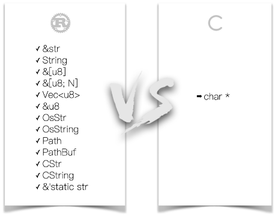

图里显示，C 中的字符串统一叫做` char *`，这确实很简洁，相当于是统一的抽象。但是这个统一的抽象也付出了代价，就是丢失了很多额外的信息。

计算机 CPU 执行的指令都是二进制序列，所有语言写的程序最后执行时都会归结为二进制序列来执行。之所以不直接写二进制打孔开发，而是出现了几百上千种计算机语言，就是因为**抽象**。

抽象是用来解决现实问题建模的工具。在 Rust 里也一样，之所以 Rust 有那么多看上去都是字符串的类型，就是因为 **Rust 把字符串在各种场景下的使用给模型化、抽象化了**。相比 C 语言的` char *`，多了建模的过程，在这个模型里面多了很多额外的信息。

### 1. 不同类型的字符串

示例：

```rust
fn main() {
  let s1: &'static str = "I am a superman."; 
  let s2: String = s1.to_string(); 
  let s3: &String = &s2;
  let s4: &str = &s2[..];
  let s5: &str = &s2[..6];
}
```

上述示例中，s1、s2、s3、s4、s5 看起来好像是 4 种不同类型的字符串表示，它们在内存中的结构图：

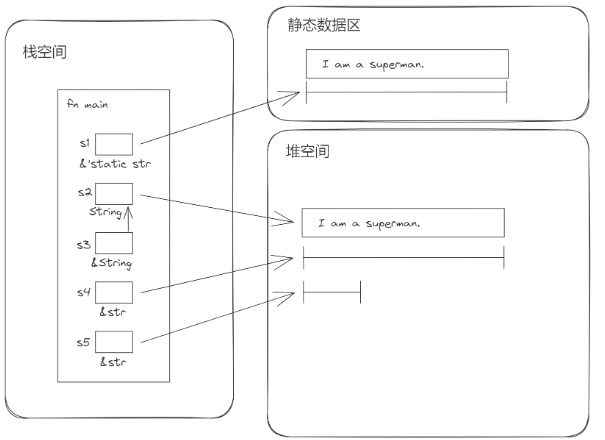

`"I am a superman." `这个用双引号括起来的部分是字符串的字面量，存放在静态数据区。而 s1 是指向静态数据区中的这个字符串的切片引用，形式是` &'static str`，这是静态数据区中的字符串的表示方法。

通过执行` s1.to_string()`，Rust 将静态数据区中的字符串字面量拷贝了一份到堆内存中，通过 s2 指向，s2 具有这个堆内存字符串的所有权，String 在 Rust 中就代表具有所有权的字符串。

s3 就是对 s2 的不可变引用，因此类型为` &String`。

s4 是对 s2 的切片引用，类型是` &str`。切片就是一块连续内存的某种视图，它可以提取目标对象的全部或一部分。这里 s4 就是取的目标对象字符串的全部。

s5 是对 s2 的另一个切片引用，类型也是` &str`。与 s4 不同的是，s5 是 s2 的部分视图。具体来说，就是` "I am a"`这一部分。

`String `是字符串的所有权形式，常常在堆中分配。`String `字符串的内容大小是可以动态变化的。而`str `是字符串的切片类型，通常以切片引用` &str `形式出现，是字符串的视图的借用形式。

字符串字面量默认会存放在静态数据区里，而静态数据区中的字符串总是贯穿程序运行的整个生命期，直到程序结束的时候才会被释放。因此不需要某一个变量对其拥有所有权，也没有哪个变量能够拥有这个字符串的所有权（也就是这个资源的分配责任）。因此对于字符串字面量这种数据类型，我们只能拿到它的借用形式` &'static str`。这里` 'static `表示这个引用可以贯穿整个程序的生命期，直到这个程序运行结束。

`&String `仅仅是对 String 类型的字符串的普通引用。

对 String 做字符串切片操作后，可以得到` &str`。这里这个` &str `就是指向由 String 管理的内存资源的切片引用，是目标字符串资源的借用形式，不会再把字符串内容复制一份。

从上面的图示里可以看到，`&str `既可以引用堆中的字符串，也可以引用静态数据区中的字符串（`&'static str `是` &str `的一种特殊形式）。其实内存本来就是一个线性空间，一个指针（引用是指针的一种）理论上来说可以指向这个线性空间中的任何地址。

`&str `也可转换`String`：

```rust
let s: String = "I am a superman.".to_string(); 
let a_slice: &str = &s[..];
let another_String: String = a_slice.to_string();
```

### 2. 切片

切片是一段连续内存的一个视图（view），在 Rust 中由 [T] 表示，T 为元素类型。这个视图可以是这块连续内存的全部或一部分。切片一般通过切片的引用来访问：

```rust
let s = String::from("abcdefg");
let s1 = &s[..];    // s1 内容是 "abcdefg"
let s2 = &s[0..4];  // s2 内容是 "abcd"
let s3 = &s[2..5];    // s3 内容是 "cde"
```

上面示例中，s 是堆内存中所有权型字符串类型。s1 作为 s 的一个切片引用，它也指向堆内存中那个字符串的头部，表示 s 的完整内容。s2 与 s1 指向的堆内存地址是相同的，但是内容不同，s2 是 "abcd"，而 s1 是 "abcdefg"。s3 则是 s 的中间位置的一段切片引用，内容是 "cde"。s3 指向的地址与 s、s1、s2 不同：

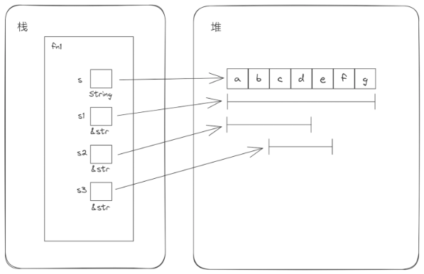

字符串切片引用，如何转换成所有权型字符串：

```rust
let s: &str = "I am a superman.";
let s1: String = String::from(s);  // 使用 String 的from构造器
let s2: String = s.to_string();    // 使用 to_string() 方法
let s3: String = s.to_owned();     // 使用 to_owned() 方法
```

### 3. ` [u8]`、`&[u8]`、`&[u8; N]`、`Vec<u8>`

- `[u8]`是字符串切片，大小是可以动态变化的。
- `&[u8] `是对字节串切片的引用，即切片引用，与` &str `是类似的。
- `&[u8; N]` 是对 u8 数组（其长度为 N）的引用。
- `Vec `是 u8 类型的动态数组。与` String `类似，这是一种具有所有权的类型。

`Vec `与` &[u8]`的关系如下：

```rust
let a_vec: Vec<u8> = vec![1,2,3,4,5,6,7,8];
// a_slice 是 [1,2,3,4,5]
let a_slice: &[u8] = &a_vec[0..5];   
// 用 .to_vec() 方法将切片转换成Vec
let another_vec = a_slice.to_vec();
// 或者用 .to_owned() 方法
let another_vec = a_slice.to_owned();
```

对比表格：

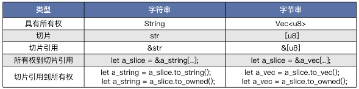

### 4. `as_str()`、`as_bytes()`、`as_slice()`

`String `类型上有个方法是` as_str()`。它返回` &str `类型。这个方法效果其实等价于` &a_string[..]`，也就是包含完整的字符串内容的切片。

```rust
let s = String::from("foo");
assert_eq!("foo", s.as_str());
```

`String `类型上还有个方法是` as_bytes()`，它返回` &[u8] `类型。

```rust
let s = String::from("hello");
assert_eq!(&[104, 101, 108, 108, 111], s.as_bytes());
```

通过上面两个示例可以对比这两个方法的不同之处，`&str `其实也是可以转成` &[u8] `的，查询标准库文档发现，用的正是同名方法：

```rust
let bytes = "bors".as_bytes();
assert_eq!(b"bors", bytes);
```

Vec 上有个` as_slice() `函数，与 String 上的` as_str() `对应，把完整内容转换成切片引用` &[T]`，等价于` &a_vec[..]`：

```rust
let a_vec = vec![1, 2, 3, 5, 8];
assert_eq!(&[1, 2, 3, 5, 8], a_vec.as_slice());
```

### 5. 隐式引用类型转换

Rust 中 &String 与 &str 其实是不同的，这种细节的区分，在某些情况下，会造成一些不方便，而且这些情况还比较常见：

```rust
fn foo(s: &String) {  
}

fn main() {
  let s = String::from("I am a superman.");
  foo(&s);
  let s1 = "I am a superman.";    
  foo(s1);                        
}
```

上面示例中，函数的参数类型我们定义成 &String。那么在函数调用时，这个函数只接受 &String 类型的参数传入：

```shell
error[E0308]: mismatched types
 --> src/main.rs:8:7
  |
8 |   foo(s1);                        // error on this line
  |   --- ^^ expected `&String`, found `&str`
  |   |
  |   arguments to this function are incorrect
  |
  = note: expected reference `&String`
             found reference `&str`
```

这种严格也导致了平时使用不方便，必须注意字符串处理时的各种细节问题，有时显得过于迂腐了。但是 Rust 也并不是那么死板，它在保持严格性的同时，通过一些精妙的机制，也可以实现一定程度上的灵活性。可以更改上述示例来体会一下：

```rust
fn foo(s: &str) {      // 只需要把这里的参数改为 &str 类型
}

fn main() {
  let s = String::from("I am a superman.");
  foo(&s);
  let s1 = "I am a superman.";    
  foo(s1);                        
}
```

在 Rust 中对 String 做引用操作时，可以告诉 Rust 编译器，我想把 &String 直接转换到 &str 类型。只需要在代码中明确指定目标类型就可以了：

```rust
let s = String::from("I am a superman.");
let s1 = &s;
let s2: &str = &s;
```

上述代码，s1 不指定具体类型，对所有权字符串 s 的引用操作，只转换成 &String 类型。而如果指定了目标类型为 &str，那么对所有权字符串 s 的引用操作，就进一步转换成了 &str 类型。

于是在上面的 foo() 函数中，只定义一种参数，就可以接收两种入参类型：&String 和 &str。这让函数的调用更符合直觉，使用更方便了。

同样的原理，不仅可以作用在 String 上，也可以作用在 Vec 上 ，更进一步的话，还可以作用在 Vec 上：

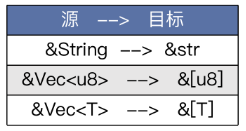

下面的示例表示同一个函数可以接受` &Vec `和` &[u32] `两种类型的传入：

```rust
fn foo(s: &[u32]) {
}

fn main() {
  let v: Vec<u32> = vec![1,2,3,4,5];
  foo(&v);
  let a_slice = v.as_slice();
  foo(a_slice);
}
```

### 6. 字节串转换成字符串

可以通过` as_bytes() `方法将字符串转换成` &[u8]`，相反的操作也是有的，就是把` &[u8] `转换成字符串。Rust 中的字符串实际是一个 UTF-8 序列，因此转换的过程也是与 UTF-8 编码相关的：

- `String::from_utf8() `可以把` Vec<u8> `转换成` String`，转换不一定成功，因为一个字节序列不一定是有效的 UTF-8 编码序列。它返回的是 Result，需要自行做错误处理。
- `String::from_utf8_unchecked() `可以把` Vec<u8> `转换成` String`。不检查字节序列是不是无效的 UTF-8 编码，直接返回` String `类型。但是这个函数是 unsafe 的，一般不推荐使用。
- `str::from_utf8()`可以将` &[u8] `转换成` &str`。它返回的是 Result，需要自行做错误处理。
- `str::from_utf8_unchecked() `可以把` &[u8] `转换成` &str`。它直接返回` &str `类型。但是这个函数是 unsafe 的，一般不推荐使用。

注意` from_utf8 `系列函数，返回的是 Result。有时候会让人觉得很繁琐，但是**这种繁琐实际是客观复杂性的体现，Rust 的严谨性要求对这种转换不成功的情况做严肃的自定义处理**。反观其他语言，对于这种转换不成功的情况往往用一种内置的策略做处理，而无法自定义。

### 7. 字符串切割成字符数组

`&str`类型里有个`chars()`函数，可以用来把字符串转换为一个迭代器，迭代器是一种通用的抽象，就是用来按顺序安全迭代的，通过这个迭代器，就可以取出 char：

```rust
fn main() {
    let s = String::from("中国你好");                                                                                 
    let char_vec: Vec<char> = s.chars().collect();                                                                     
    println!("{:?}", char_vec); 
    
    for ch in s.chars() {
        println!("{:?}", ch); 
    }
}
```

输出：

```shell
['中', '国', '你', '好']
'中'
'国'
'你'
'好'
```

### 8. `Path`、`PathBuf`、`OsStr`、`OsString`、`CStr`、`CString`

有了前面的知识背景。现在来看这些与字符串相关的类型：`Path`、`PathBuf`、`OsStr`、`OsString`、`CStr`、`CString`。

相对于普通的` String `或` &str`，它们只是包含了更多的特定场景的信息。比如` Path` 类型，它就要处理跨平台的目录分隔符（Unix 下是`/`，Windows 下是`\`），以及一些其他信息。而`PathBuf`与` Path `的区别就对应于` String `与` str `的区别。

`OsStr `的存在是因为各个操作系统平台上的原生字符串定义其实是不同的。比如 Unix 系统，原生字符串是任意非 0 字节序列，不过常常解释为 UTF-8 编码；而在 Windows 上，原生字符串定义为任意非 0 字节 16 位序列，正常情况下解释为 UTF-16 编码序列。而 Rust 自带的标准 str 定义和它们都不同，它是一个可以包含 0 这个字节的严格 UTF-8 编码序列。在开发平台相关的应用时，往往需要处理这种类型转换的细节，于是就有了` OsStr `类型。而` OsString` 与` OsStr `的关系对应于`String `与` str `的关系。

`CStr `是 C 语言风格的字符串，字符串以 0 这个字节作结束符，在字符串中不能包含 0。因为 Rust 要无缝集成 C 的能力。所以这些类型出现在 Rust 中就很合理了。而` CString `与` CStr `的关系就对应于` String `与` str `的关系。

### 9. Parse方法

`str `有一个` parse() `方法非常强大，可以从字符串转换到任意 Rust 类型，只要这个类型实现了` FromStr `这个` Trait`即可。把字符串解析成 Rust 类型，肯定有不成功的可能，所以这个方法返回的是一个 Result，需要自行处理解析错误的情况：

```rust
fn main() {
    let a = "10".parse::<u32>();
    let aa: u32 = "10".parse().unwrap(); // 这种写法也很常见
    println!("{:?}", a);
    
    let a = "10".parse::<f32>();
    println!("{:?}", a);
    
    let a = "4.2".parse::<f32>();
    println!("{:?}", a);
    
    let a = "true".parse::<bool>();
    println!("{:?}", a);

    let a = "a".parse::<char>();
    println!("{:?}", a);
    
    let a = "192.168.1.100".parse::<std::net::IpAddr>();
    println!("{:?}", a);
}
```

已实现了标准库的类型：[FromStr trait](https://doc.rust-lang.org/std/str/trait.FromStr.html#implementors)

`parse() `函数就相当于 Rust 语言内置的统一的解析器接口，如果实现的类型需要与字符串互相转换，就可以考虑实现这个接口，这样的话就比较能被整个 Rust 社区接受，这就是所谓的 Rust 地道风格的体现。

而对于更复杂和更通用的与字符串转换的场景，可能会更倾向于序列化和反序列化的方案。这块在 Rust 生态中也有标准的方案——`serde`，它作为序列化框架，可以支持各种数据格式协议，功能非常强大、统一，目前仅做了解。

 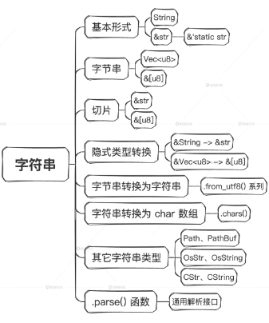

思考：`chars `函数是定义在` str `上的，为什么` String `类型能直接调用` str `上定义的方法？实际上` str `上的所有方法，`String `都能调用，请问这是为什么呢？

1. `String`类型为`struct`类型，实现了`Deref`特征。 
2. 当`String`类型调用`chars`方法时，编译器会检查`String`类型是否实现了`chars`方法，检查项包括`self`，`&self`，`&mut self `
3. 如果都没有实现`chars`方法，编译器则调用`deref`方法解引用(智能指针)，得到`str`，此时编译器才会调用`chars`方法，也就是可以调用`str`实现的所有方法

## 四、复合类型

### 1. 结构体

先来看一下结构体示例，定义一个 User 结构体：

```rust
struct User {
    active: bool,
    username: String,
    email: String,
    sign_in_count: u64,
}
```

示例中的 User 结构体由 4 个字段组成：

1. active 字段：bool 类型，表示这个用户是否是激活状态。
2. username 字段：字符串类型，表示这个用户的名字。
3. email 字段：字符串类型，表示这个用户的邮箱名。
4. sign_in_count 字段：u64 类型，用来记录这个用户登录了多少次。

User 完全由 4 个基础类型的字段组合而成，User 的**实例化需要这 4 个字段同时起作用，缺一不可**，比如：

```rust
fn main() {
    let user1 = User {
        active: true,
        username: String::from("someusername123"),
        email: String::from("someone@example.com"),
        sign_in_count: 1,
    };
}
```

结构体类型也可以参与更复杂结构体的构建：

```rust
struct Class {
  serial_number: u32,
  grade_number: u32,
  entry_year: String,
  members: Vec<User>,  
}
```

结构体类型可以不断往上一层一层地套。而在实际应用中，**结构体往往是一个程序的骨干，用来承载对目标问题进行建模和描述的重任**。

#### 结构体的形式

结构体有三种形式，分别是命名结构体、元组结构体和单元结构体。

##### 命名结构体

命名结构体是指每个字段都有名字的结构体，比如前面提到的 User 结构体，它的每个字段都有明确的名字和类型。

如果在实例化结构体之前，命名了结构体字段名的同名变量，那么用下面这种写法可以偷懒少写几个字符：

```rust
fn main() {
    let active = true;
    let username = String::from("someusername123");
    let email = String::from("someone@example.com");
    let user1 = User {
        active,    // 这里本来应该是 active: active,
        username,  // 这里本来应该是 username: username,
        email,     // 这里本来应该是 email: email,
        sign_in_count: 1,
    };
}
```

结构体创建好之后，可以更新结构体的部分字段。下面的示例里就单独更新了 email 字段：

```rust
fn main() {
    let mut user1 = User {
        active: true,
        username: String::from("someusername123"),
        email: String::from("someone@example.com"),
        sign_in_count: 1,
    };

    user1.email = String::from("anotheremail@example.com");
}
```

注意 user1 前面的 mut 修饰符，不加的话就没办法修改这个结构体里的字段。

而如果已经有了一个 User 的实例 user1，想再创建一个新的 user2，而两个实例之间只有部分字段不同。这时，Rust 也提供了偷懒的办法，比如：

```rust
数据fn main() {
    let active = true;
    let username = String::from("someusername123");
    let email = String::from("someone@example.com");
    let user1 = User {
        active,
        username,
        email,
        sign_in_count: 1,
    };
    let user2 = User {
        email: String::from("another@example.com"),
        ..user1    // 注意这里，直接用 ..user1
    };
}
```

用这种写法可以少写很多重复代码。特别是当这个结构体比较大的时候，比如有几十个字段，当只想更新其中的一两个字段的时候，就显得特别有用了，这能够让代码保持干净清爽。

比如有一个场景就正好符合这个语法特性。用户的信息存在数据库里，当更新一个用户的一个字段的信息时，首先需要从数据库里把这个用户的信息取出来，做一些基本的校验，然后把要更新的字段替换成新的内容，再把这个新的用户实例存回数据库，这个过程可以这样写：

```rust
// 这个示例是伪代码
let user_id = get_id_from_request;
let new_user_name = get_name_from_request();
let old_user: User = get_from_db(user_id);
let new_user: User = User {
    username: new_user_name,
    ..old_user    // 注意这里的写法
}
new_user.save()
```

有了这些语法糖，用 Rust 写业务代码是非常清爽的。

##### 元组结构体

除了前面那种最普通的命名结构体形式，Rust 中也支持一种匿名结构体的形式，也叫做元组结构体。所谓元组结构体，也就是**元组和结构体的结合体**：

```rust
struct Color(i32, i32, i32);
struct Point(i32, i32, i32);

fn main() {
    let black = Color(0, 0, 0);
    let origin = Point(0, 0, 0);
}
```

元组结构体有类型名，但是无字段名，也就是说字段是匿名的。在有些情况下这很有用，因为想名字是一件很头痛的事情。并且某些场景下用元组结构体表达会更有效。比如对于 RGB 颜色对、三维坐标这种各分量之间有对称性，又总是一起出现的情景，直接用元组结构体表达会显得更紧凑。

上述示例中，Color 类型和 Point 类型的元组部分其实是一样的，都是 (i32, i32, i32)，但是由于类型名不同，它们就是不同的类型，因此上面的 black 实例和 origin 实例就是两个完全不同的东西，前者表示黑色，后者表示原点。

##### 单元结构体

Rust 还支持单元结构体。单元结构体就是只有一个类型名字，没有任何字段的结构体。单元结构体在定义和创建实例的时候，连后面的花括号都可以省略。比如：

```rust
struct ArticleModule;

fn main() {
    let module = ArticleModule;    // 请注意这一句，也做了实例化操作
}
```

可以看到，这个示例中结构体 ArticleModule 类型实际创建了一个实例，ArticleModule 的定义和实例化都没有使用花括号。这种写法非常紧凑，所以要注意分辨，不然会疑惑：类型为什么能直接赋给一个变量，其实它就相当于定义了一种类型，它的名字就是一种信息，有类型名就可以进行实例化，承载很多东西。

#### 结构体中的所有权

##### 部分移动

Rust 的结构体有一种与所有权相关的特性，叫做部分移动（Partial Move），就是说结构体中的部分字段是可以被移出去的：

```rust
#[derive(Debug)]
struct User {
    active: bool,
    username: String,
    email: String,
    sign_in_count: u32,
}

fn main() {
    let active = true;
    let username = String::from("someusername123");
    let email = String::from("someone@example.com");
    let user1 = User {
        active,
        username,
        email,
        sign_in_count: 1,
    };
    
    let email = user1.email;  // 在这里发生了partially moved
    
    println!("{:?}", user1)   // 这一句无法通过编译
}
```

提示：

```shell
error[E0382]: borrow of partially moved value: `user1`
  --> src/main.rs:22:22
   |
20 |     let email = user1.email;
   |                 ----------- value partially moved here
21 |     
22 |     println!("{:?}", user1)
   |                      ^^^^^ value borrowed here after partial move
```

下面这句对于习惯的编程的人来说，其实是非常普通的一行，就是将结构体的一个字段值赋值给一个新的变量：

```rust
let email = user1.email;
```

但这里就发生了一件很奇妙的事情，因为 email 字段是 String 类型，是一种所有权类型，于是 email 字段的值被移动了。移动后，email 变量拥有了那个值的所有权。而 user1 中的 email 字段就被标记无法访问了。

稍微改一下这段代码，不直接打印 user1 实例整体，而是分别打印 email 之外的另外三个字段：

```rust
let email = user1.email;

println!("{}", user1.username);      // 分别打印另外3个字段 
println!("{}", user1.active);
println!("{}", user1.sign_in_count);
```

这时可以得到正确的输出，而如果单独打印 email 字段也是不行的，这就是结构体中所有权字段被部分移动的情景。

##### 引用类型的字段

还是用前面定义的 User 类型，它里面的所有字段都是带所有权的字段。而在赋值行为上，bool 和 u32 会默认复制一份新的所有权，而 String 会移动之前那份所有权到新的变量，全部定义带所有权的字段，是定义结构体类型的主要方式。

但是既然都是类型，Rust 的结构体没有理由不能支持借用类型。比如：

```rust
struct User {
    active: &bool,       // 这里换成了 &bool
    username: &str,      // 这里换成了 &str
    email: &str,         // 这里换成了 &str
    sign_in_count: &u32, // 这里换成了 &u32
}
```

这种写法当然是可以的，不过上面的代码暂时还没办法通过 Rust 的编译，需要加一些额外的标注才能让其通过。

几乎所有的地方，Rust 都会把问题一分为二，一是所有权形式的表示，二是借用形式的表示。借用形式的表示又可进一步细分为不可变借用的表示和可变借用的表示。一般来说，对于业务系统用的几乎都是所有权形式的结构体，而这就已经够用了。对于初学者来说，切忌贪图所有语言特性，应该以实用为主。

#### 给结构体添加标注

在Rust中，可以给类型添加标注：

```rust
#[derive(Debug)]        // 这里，在结构体上面添加了一种标注
struct User {
    active: bool,
    username: String,
    email: String,
    sign_in_count: u32,
}
```

这样标注后，就可以在打印语句的时候把整个结构体打印出来了：

```rust
println!("{:?}", user1);    // 注意这里的 :? 符号
```

这种` #[derive(Debug)] `语法在 Rust 中叫属性标注，具体来说这里用的是派生宏属性，派生宏作用在下面紧接着的结构体类型上，可以为结构体自动添加一些功能。比如，派生 Debug 这个宏可以让我们在` println! `中用` {:?} `格式把结构体打印出来，这对于调试是非常方便的。

#### 面向对象特性

Rust 不是一门面向对象的语言，但是它确实有部分面向对象的特性。而 Rust 承载面向对象特性的主要类型就是结构体，R**ust 有个关键字 impl 可以用来给结构体或其他类型实现方法，也就是关联在某个类型上的函数**。

##### 方法

使用`impl`关键字为结构体实现方法，可以像下面这样：

```rust
#[derive(Debug)]
struct Rectangle {
    width: u32,
    height: u32,
}

impl Rectangle {                // 就像这样去实现
    fn area(self) -> u32 {      // area就是方法，被放在impl实现体中
        self.width * self.height
    }
}

fn main() {
    let rect1 = Rectangle {
        width: 30,
        height: 50,
    };

    println!(
        "The area of the rectangle is {} square pixels.",
        rect1.area()      // 使用点号操作符调用area方法
    );
}
// 输出
// The area of the rectangle is 1500 square pixels.
```

##### Self

注意看 area 方法的签名：

```rust
fn area(self) -> u32 
```

这个参数好像有点特殊，是一个单 self，不太像标准的参数定义语法。实际上这里是 Rust 的一个语法糖，self 的完整写法是 self: Self，而 Self 是 Rust 里一个特殊的类型名，它表示正在被实现（impl）的那个类型。

Rust 中所有权形式和借用形式总是成对出现，在 impl 的时候也是如此。方法的签名中也会对应三种参数形式，扩展一下上面的例子：

```rust
impl Rectangle {
    fn area1(self) -> u32 {
        self.width * self.height
    }
    fn area2(&self) -> u32 {
        self.width * self.height
    }
    fn area3(&mut self) -> u32 {
        self.width * self.height
    }
}
```

方法是实现在类型上的特殊函数，它的第一个参数是 Self 类型，包含 3 种形式：

1. self: Self：传入实例的所有权。
2. self: &Self：传入实例的不可变引用。
3. self: &mut Self：传入实例的可变引用。

因为是标准用法，所以 Rust 简写成了 self、&self、&mut self，这种简写并不会产生歧义。

上述代码展开后是这样的：

```rust
impl Rectangle {
    fn area1(self: Self) -> u32 {
        self.width * self.height
    }
    fn area2(self: &Self) -> u32 {
        self.width * self.height
    }
    fn area3(self: &mut Self) -> u32 {
        self.width * self.height
    }
}
```

方法调用的时候，直接在实例上使用 . 操作符调用，然后第一个参数是实例自身，会默认传进去，因此不需要单独写出来：

```rust
rect1.area1();  // 传入rect1
rect1.area2();  // 传入&rect1
rect1.area3();  // 传入&mut rect1
```

很像 golang 的方法。

实例的引用也是可以直接调用方法的。比如，对于不可变引用，可以像下面这样调用，Rust 会自动做正确的多级解引用操作：

```rust
#[derive(Debug)]
struct Rectangle {
    width: u32,
    height: u32,
}

impl Rectangle {
    fn area(&self) -> u32 {
        self.width * self.height
    }
}

fn main() {
    let rect1 = Rectangle {
        width: 30,
        height: 50,
    };

    // 在这里，取了实例的引用
    let r1 = &rect1;
    let r2 = &&rect1;
    let r3 = &&&&&&&&&&&&&&&&&&&&&&rect1; // 不管有多少层
    let r4 = &&r1;

    // 以下4行都能打印出正确的结果
    println!("r1 is {}", r1.area());
    println!("r2 is {}", r2.area());
    println!("r3 is {}", r3.area());
    println!("r4 is {}", r4.area());
}
```

对同一个类型，impl 可以分开写多次，这在组织代码的时候比较方便：

```rust
impl Rectangle {
    fn area(&self) -> u32 {
        self.width * self.height
    }
}

impl Rectangle {
    fn can_hold(&self, other: &Rectangle) -> bool {
        self.width > other.width && self.height > other.height
    }
}
```

##### 关联函数（静态方法）

前面讲过，方法的第一个参数为 self，从函数参数定义上来说，第一个参数当然也可以不是 self。如果实现在类型上的函数，它的第一个参数不是 self 参数，那么它就叫做此类型的关联函数：

```rust
impl Rectangle {
    fn numbers(rows: u32, cols: u32) -> u32 {
        rows * cols
    }
}
```

调用时，关联函数使用类型配合路径符` ::`来调用，注意这里与实例用点运算符调用方法的区别：

```rust
Rectangle::numbers(10, 10);
```

##### 构造函数

不像 C++、Java 等语言，Rust 中没有专门的构造函数，但是用于构造实例的需求是不会变的。

那 Rust 中一般是怎么处理的呢？首先，Rust 中结构体可以直接实例化，比如前面定义的 Rectangle：

```rust
impl Rectangle {
  pub fn new(width: u32, height: u32) -> Self {
    Rectangle {
        width,
        height,
    }
  }  
}
```

然后，使用下面这行代码创建新实例：

```rust
let rect1 = Rectangle::new(30, 50);
```

但是 new 这个名字并不是强制的，在社区的很多库里还会看到 from()、from_xxx() 等其他名字起构造函数的功能。Rust 在这块并没有强制要求，多熟悉社区中的惯用法，能写出更地道的 Rust 代码。

##### Default

在对结构体做实例化的时候，Rust 又给我们提供了一个便利的设施，Default：

```rust
#[derive(Debug, Default)]      // 这里加了一个Default派生宏
struct Rectangle {
    width: u32,
    height: u32,
}

fn main() {
    let rect1: Rectangle = Default::default();    // 使用方式1
    let rect2 = Rectangle::default();             // 使用方式2
    
    println!("{:?}", rect1);
    println!("{:?}", rect2);
}

// 打印出如下：
// Rectangle { width: 0, height: 0 }
// Rectangle { width: 0, height: 0 }
```

Default 有两种使用方式，一种是直接用` Default::default()`，第二种是用`类型名::default()`，它们的实例化效果是一样的。

可以看到，打出来的实例字段值都 0，是因为 u32 类型默认值就是 0。对于通用类型，比如 u32 这种类型来说，取 0 是最适合的值了，但是，对于特定场景的 Rectangle ，可能希望给它赋一个初始的非 0 值。在 Rust 中，这可以做到，但是需要用到后面的知识，目前就可以先用约定的 new 关联函数 + 参数来达到目的：

```rust
#[derive(Debug)]
struct Rectangle {
    width: u32,
    height: u32,
}

impl Rectangle {
  pub fn new(width: u32, height: u32) -> Self {
    Rectangle {
        width,
        height,
    }
  }  
}

const INITWIDTH: u32 = 50;
const INITHEIGHT: u32 = 30;

fn main() {
    // 创建默认初始化值的Rectangle实例
    let rect1 = Rectangle::new(INITWIDTH , INITHEIGHT);
    println!("{:?}", rect1);
}
```

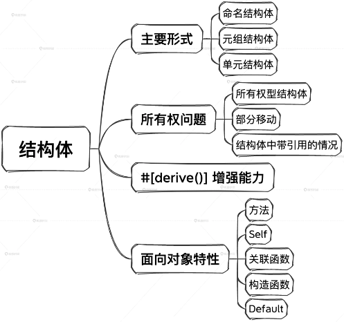

思考：如何给原生类型做impl呢：

可以用newtype模式对i8封装一下再impl，也可以通过trait来添加操作：

```rust
trait Operate {
  fn plus(self) -> Self;
}

impl Operate for i8 {
    fn plus(self) -> Self {
        self + self
    }
}

fn main() {
    let  a = 1i8;
    println!("{}",a.plus());
}
```

### 2. 枚举与模式匹配

#### 枚举

枚举是 Rust 中非常重要的复合类型，也是最强大的复合类型之一，广泛用于属性配置、错误处理、分支流程、类型聚合等场景中。它容纳选项的可能性，每一种可能的选项都是一个变体（variant）。Rust 中的枚举使用关键字 **enum** 定义，这点与 Java、C++ 都是一样的。与它们不同的是，Rust 中的枚举具有更强大的表达能力。

在 Rust 中，枚举中的所有条目被叫做这个枚举的变体。比如：

```rust
enum Shape {
    Rectangle,
    Triangle,
    Circle,
}
```

定义了一个形状（Shape）枚举，它有三个变体：长方形 Rectangle、三角形 Triangle 和圆形 Circle。

枚举与结构体不同，**结构体的实例化需要所有字段一起起作用**，而**枚举的实例化只需要且只能是其中一个变体起作用**。

##### 负载

Rust 中枚举的强大之处在于，enum 中的变体可以挂载各种形式的类型。所有其他类型，比如字符串、元组、结构体等等，都可以作为 enum 的负载（payload）被挂载到其中一个变体上。比如，扩展一下上面的代码示例：

```rust
enum Shape {
    Rectangle { width: u32, height: u32},
    Triangle((u32, u32), (u32, u32), (u32, u32)),
    Circle { origin: (u32, u32), radius: u32 },
}
```

Shape 枚举的三个变体都挂载了不同的负载，Rectangle 挂载了一个结构体负载表示宽和高的属性。

```rust
{width: u32, height: u32}
```

也可以单独定义一个结构体，然后把它挂载到 Rectangle 变体上：

```rust
struct Rectangle {
  width: u32, 
  height: u32
}

enum Shape {
  Rectangle(Rectangle),
  // ...
}
```

Triangle 变体挂载了一个元组负载`((u32, u32), (u32, u32), (u32, u32))`，表示三个顶点。

Circle 变体挂载了一个结构体负载` { origin: (u32, u32), radius: u32 }`，表示一个原点加半径长度。

枚举的变体能够挂载各种类型的负载，是 Rust 中的枚举超强能力的来源。

enum 就像一个筐，什么都能往里面装，下面的示例中 WebEvent 表示浏览器里面的 Web 事件可以帮助熟悉 Rust 的枚举表达形式：

```rust
enum WebEvent {
    PageLoad,
    PageUnload,
    KeyPress(char),
    Paste(String),
    Click { x: i64, y: i64 },
}
```

##### 枚举的实例化

枚举的实例化实际是枚举变体的实例化，比如：

```rust
let a = WebEvent::PageLoad;
let b = WebEvent::PageUnload;
let c = WebEvent::KeyPress('c');
let d = WebEvent::Paste(String::from("batman"));
let e = WebEvent::Click { x: 320, y: 240 };
```

可以看到，不带负载的变体实例化和带负载的变体实例化不一样，带负载的变体实例化要根据不同变体附带的类型做特定的实例化。

##### 类C枚举

```rust
// 给枚举变体一个起始数字值 
enum Number {
    Zero = 0,
    One,
    Two,
}

// 给枚举每个变体赋予不同的值
enum Color {
    Red = 0xff0000,
    Green = 0x00ff00,
    Blue = 0x0000ff,
}

fn main() {
    // 使用 as 进行类型的转化
    println!("zero is {}", Number::Zero as i32);
    println!("one is {}", Number::One as i32);

    println!("roses are #{:06x}", Color::Red as i32);
    println!("violets are #{:06x}", Color::Blue as i32);
}
// 输出 
// zero is 0
// one is 1
// roses are #ff0000
// violets are #0000ff
```

可以看到，能够像 C 语言那样，在定义枚举变体的时候，指定具体的值。这在底层系统级开发、协议栈开发、嵌入式开发的场景会经常用到。

打印的时候，只需要使用 as 操作符将变体转换为具体的数值类型即可。

代码中的` println! `里的` {:06x} `是格式化参数，这里表示打印出值的 16 进制形式，占位 6 个宽度，不足的用 0 补齐。你可以顺便了解一下 println 打印语句中[格式化参数](https://doc.rust-lang.org/std/fmt/index.html)的详细内容。

##### 空枚举

Rust 中也可以定义空枚举。比如` enum MyEnum {};`。它其实与单元结构体一样都表示一个类型，但是它不能被实例化。

```rust
enum Foo {}  

let a = Foo {}; // 错误的

// 提示
// expected struct, variant or union type, found enum `Foo`
// not a struct, variant or union type
```

##### impl 枚举

```rust
enum MyEnum {
    Add,
    Subtract,
}

impl MyEnum {
    fn run(&self, x: i32, y: i32) -> i32 {
        match self {                  // match 语句
            Self::Add => x + y,
            Self::Subtract => x - y,
        }
    }
}

fn main() {
    // 实例化枚举
    let add = MyEnum::Add;
    // 实例化后执行枚举的方法
    add.run(100, 200);
}
```

但是不能对枚举的变体直接 impl：

```rust
enum Foo {
  AAA,
  BBB,
  CCC
}

impl Foo::AAA {   // 错误的
}
```

一般情况下，枚举会用来做配置，并结合 match 语句使用来做分支管理，**如果要定义一个新类型，在 Rust 中主要还是使用结构体**。

#### match

##### match + 枚举

其实在上面的示例中，就已经出现 match 关键字了，它的作用是判断或匹配值是哪一个枚举的变体：

```rust
#[derive(Debug)]
enum Shape {
    Rectangle,
    Triangle,
    Circle,
}

fn main() {
    let shape_a = Shape::Rectangle;  // 创建实例
    match shape_a {                  // 匹配实例
        Shape::Rectangle => {
            println!("{:?}", Shape::Rectangle);  // 进了这个分支
        }
        Shape::Triangle => {
            println!("{:?}", Shape::Triangle);
        }
        Shape::Circle => {
            println!("{:?}", Shape::Circle);
        }
    }  
}
// 输出
// Rectangle
```

##### match 可返回值

就像大多数 Rust 语法一样，match 语法也是可以有返回值的，所以也叫做 match 表达式：

```rust
#[derive(Debug)]
enum Shape {
    Rectangle,
    Triangle,
    Circle,
}

fn main() {
    let shape_a = Shape::Rectangle;  // 创建实例
    let ret = match shape_a {        // 匹配实例，并返回结果给ret
        Shape::Rectangle => {
            1
        }
        Shape::Triangle => {
            2
        }
        Shape::Circle => {
            3
        }
    };
    println!("{}", ret);  
}
// 输出
// 1
```

因为`shape_a `被赋值为` Shape::Rectangle`，所以程序匹配到第一个分支并返回 1，变量` ret`的值为 1。

```rust
let ret = match shape_a {   
```

这种写法就是比较地道的 Rust 写法，可以让代码显得更紧凑。

##### 所有分支都必须处理

match 表达式里所有的分支都必须处理：

```rust
#[derive(Debug)]
enum Shape {
    Rectangle,
    Triangle,
    Circle,
}

fn main() {
    let shape_a = Shape::Rectangle;  // 创建实例
    let ret = match shape_a {        // 匹配实例
        Shape::Rectangle => {
            1
        }
        Shape::Triangle => {
            2
        }
        // Shape::Circle => {
        //     3
        // }
    };
    println!("{}", ret);  
}
```

上面这段代码在编译的时候会出错。

```rust
error[E0004]: non-exhaustive patterns: `Shape::Circle` not covered
  --> src/main.rs:10:19
   |
10 |   let ret = match shape_a {                  // 匹配实例
   |                   ^^^^^^^ pattern `Shape::Circle` not covered
   |
note: `Shape` defined here
  --> src/main.rs:5:3
   |
2  | enum Shape {
   |      -----
...
5  |   Circle,
   |   ^^^^^^ not covered
   = note: the matched value is of type `Shape`
help: ensure that all possible cases are being handled by adding a match arm with a wildcard pattern or an explicit pattern as shown
   |
16 ~     },
17 +     Shape::Circle => todo!()
   |
```

`Shape::Circle `分支没有覆盖到，不允许通过，另外注意，**match 表达式中各个分支返回的值的类型必须相同**。

##### _ 占位符

如果不想处理一些分支，可以用` _`：

```rust
#[derive(Debug)]
enum Shape {
    Rectangle,
    Triangle,
    Circle,
}

fn main() {
    let shape_a = Shape::Rectangle;  
    let ret = match shape_a {                  
        Shape::Rectangle => {
            1
        }
        _ => {
            10
        }
    };
    println!("{}", ret);  
}
```

相当于除` Shape::Rectangle `之外的分支都统一用 _ 占位符进行处理了。

##### 更广泛的分支

match 除了配合枚举进行分支管理外，还可以与其他基础类型结合进行分支分派：

```rust
fn main() {
    let number = 13;
    // 可以试着修改上面的数字值，看看下面走哪个分支

    println!("Tell me about {}", number);
    match number {
        // 匹配单个数字
        1 => println!("One!"),
        // 匹配几个数字
        2 | 3 | 5 | 7 | 11 => println!("This is a prime"),
        // 匹配一个范围，左闭右闭区间
        13..=19 => println!("A teen"),
        // 处理剩下的情况
        _ => println!("Ain't special"),
    }
}
```

可以看到，match 可以用来匹配一个具体的数字、一个数字的列表，或者一个数字的区间等等，非常灵活。

##### 模式匹配

match 实际是模式匹配的入口，从 match 表达式我们可引出模式匹配的概念。模式匹配就是**按对象值的结构**进行匹配，并且可以取出符合模式的值，下面通过一些示例来解释这句话。

模式匹配不限于在 match 中使用。除了 match 外，Rust 还给模式匹配提供了其他一些语法层面的设施：

###### if let

当要匹配的分支只有两个或者在这个位置只想先处理一个分支的时候，可以直接用 if let：

```rust
  let shape_a = Shape::Rectangle;  
  match shape_a {                  
    Shape::Rectangle => {
      println!("1");
    }
    _ => {
      println!("10");
    }
  };
```

改写为：

```rust
  let shape_a = Shape::Rectangle;  
  if let Shape::Rectangle = shape_a {                  
    println!("1");
  } else {
    println!("10");
  }
```

###### While let

while 后面也可以跟 let，实现模式匹配。比如：

```rust
#[derive(Debug)]
enum Shape {
    Rectangle,
    Triangle,
    Circle,
}

fn main() {
    let mut shape_a = Shape::Rectangle; 
    let mut i = 0;
    while let Shape::Rectangle = shape_a {    // 注意这一句
        if i > 9 {
            println!("Greater than 9, quit!");
            shape_a = Shape::Circle;
        } else {
            println!("`i` is `{:?}`. Try again.", i);
            i += 1;
        }
    }
}
// 输出
// `i` is `0`. Try again.
// `i` is `1`. Try again.
// `i` is `2`. Try again.
// `i` is `3`. Try again.
// `i` is `4`. Try again.
// `i` is `5`. Try again.
// `i` is `6`. Try again.
// `i` is `7`. Try again.
// `i` is `8`. Try again.
// `i` is `9`. Try again.
// Greater than 9, quit!
```

看起来，在条件判断语句那里用` while Shape::Rectangle == shape_a`也行，好像用` while let `的意义不大。来试一下，编译之后，报错了：

```rust
error[E0369]: binary operation `==` cannot be applied to type `Shape`
```

> 该错误表示`==`号不能作用在类型 Shape 上，在 Rust 中，`==` 运算符用于比较两个值是否相等。为了使用 `==` 运算符，你的类型需要实现 `PartialEq` trait，`PartialEq` trait 定义了一种可以进行部分相等性比较的类型。关于这点，`{}`与`{:?}`也是类似。

如果一个枚举变体带负载，使用模式匹配可以把这个负载取出来，下面使用带负载的枚举来举例。

#### let

let 本身就支持模式匹配。其实前面的 if let、while let 使用的就是 let 模式匹配的能力：

```rust
#[derive(Debug)]
enum Shape {
    Rectangle {width: u32, height: u32},
    Triangle,
    Circle,
}

fn main() {
    // 创建实例
    let shape_a = Shape::Rectangle {width: 10, height: 20}; 
    // 模式匹配出负载内容
    let Shape::Rectangle {width, height} = shape_a else {
        panic!("Can't extract rectangle.");
    };
    println!("width: {}, height: {}", width, height);
}

// 输出
// width: 10, height: 20
```

在这个示例中，利用模式匹配解开了` shape_a `中带的负载（结构体负载），同时定义了` width `和` height `两个局部变量，并初始化为枚举变体的实例负载的值，这两个局部变量在后续的代码块中可以使用。

注意第 12 行代码：

```rust
let Shape::Rectangle {width, height} = shape_a else {
```

这种语法是匹配结构体负载，获取字段值的方式。

#### 匹配元组

```rust
fn main() {
    let a = (1,2,'a');
    
    let (b,c,d) = a;
    
    println!("{:?}", a);
    println!("{}", b);
    println!("{}", c);
    println!("{}", d);
}
```

这种用法叫做**元组的析构**，常用来从函数的多个返回值里取出数据：

```rust
fn foo() -> (u32, u32, char) {
    (1,2,'a')
}

fn main() {
    let (b,c,d) = foo();
    
    println!("{}", b);
    println!("{}", c);
    println!("{}", d);
}
```

#### 匹配枚举

```rust
struct Rectangle {
    width: u32, 
    height: u32
}

enum Shape {
    Rectangle(Rectangle),
    Triangle((u32, u32), (u32, u32), (u32, u32)),
    Circle { origin: (u32, u32), radius: u32 },
}

fn main() {
    let a_rec = Rectangle {
        width: 10,
        height: 20,
    };
  
    // 请打开下面这一行进行实验
    //let shape_a = Shape::Rectangle(a_rec);
    // 请打开下面这一行进行实验
    //let shape_a = Shape::Triangle((0, 1), (3,4), (3, 0));
    
    let shape_a = Shape::Circle { origin: (0, 0), radius: 5 };
    
    // 这里演示了在模式匹配中将枚举的负载解出来的各种形式
    match shape_a {
        Shape::Rectangle(a_rec) => {  // 解出一个结构体
            println!("Rectangle {}, {}", a_rec.width, a_rec.height);
        }
        Shape::Triangle(x, y, z) => {  // 解出一个元组
            println!("Triangle {:?}, {:?}, {:?}", x, y, z);
        }
        Shape::Circle {origin, radius} => {  // 解出一个结构体的字段
            println!("Circle {:?}, {:?}", origin, radius);
        }
    }
}
// 输出
// Circle (0, 0), 5
```

这个示例展示了如何将变体中的结构体整体、元组各部分、结构体各字段解析出来的方式。

用这种方式，可以在做分支处理的时候，顺便处理携带的信息，让代码变得相当紧凑而有意义（高内聚）。

#### 匹配结构体

```rust
#[derive(Debug)]
struct User {
    name: String,
    age: u32,
    student: bool
}

fn main() {
    let a = User {
        name: String::from("mike"),
        age: 20,
        student: false,
    };
    let User {
        name,
        age,
        student,
    } = a;
    
    println!("{}", name);
    println!("{}", age);
    println!("{}", student);
    println!("{:?}", a);
}
```

编译输出：

```rust
error[E0382]: borrow of partially moved value: `a`
  --> src/main.rs:24:22
   |
16 |         name,
   |         ---- value partially moved here
...
24 |     println!("{:?}", a);
   |                      ^ value borrowed here after partial move
   |
   = note: partial move occurs because `a.name` has type `String`, which does not implement the `Copy` trait
   = note: this error originates in the macro `$crate::format_args_nl` which comes from the expansion of the macro `println` (in Nightly builds, run with -Z macro-backtrace for more info)
help: borrow this binding in the pattern to avoid moving the value
   |
16 |         ref name,
   |         +++
```

编译提示出错了，在模式匹配的过程中发生了` partially moved`，模式匹配过程中新定义的三个变量 name、age、student 分别得到了对应 User 实例 a 的三个字段值的所有权。

age 和 student 采用了复制所有权的形式，而 name 字符串值则是采用了移动所有权的形式。a.name 被部分移动到了新的变量 name ，所以接下来 a.name 就无法直接使用了。这个示例说明 Rust 中的模式匹配是一种释放原对象的所有权的方式。

从 Rust 小助手的建议里看到了一个关键字：ref。

#### ref 关键字

Rustc AI 建议添加一个关键字 ref，按它说的改改：

```rust
#[derive(Debug)]
struct User {
    name: String,
    age: u32,
    student: bool
}

fn main() {
    let a = User {
        name: String::from("mike"),
        age: 20,
        student: false,
    };
    let User {
        ref name,    // 这里加了一个ref
        age,
        student,
    } = a;
    
    println!("{}", name);
    println!("{}", age);
    println!("{}", student);
    println!("{:?}", a);
}
// 输出 
// mike
// 20
// false
// User { name: "mike", age: 20, student: false }
```

可以看到，打印出了正确的值。

有些情况下，只是需要读取一下字段的值而已，不需要获得它的所有权，这时就可以通过 ref 这个关键字修饰符告诉 Rust 编译器，现在只需要获得那个字段的引用，不要所有权。这就是 ref 出现的原因，用来在模式匹配过程中提供一个额外的信息。

使用了 ref 后，新定义的 name 变量的值其实是 &a.name ，而不是 a.name，Rust 就不会再把所有权给 move 出来了，因此也不会发生 partially moved 这种事情，原来的 User 实例 a 还有效，因此就能被打印出来了。

相应的，还有 **ref mut** 的形式。它是用于在模式匹配中获得目标的可变引用。

```rust
#[derive(Debug)]
struct User {
    name: String,
    age: u32,
    student: bool
}

fn main() {
    let mut a = User {   // 这里加了一个mut
        name: String::from("mike"),
        age: 20,
        student: false,
    };
    let User {
        ref mut name,    // 这里加了一个mut
        age,
        student,
    } = a;

    name.push_str("!");
    
    println!("{}", name);
    println!("{}", age);
    println!("{}", student);
    println!("{:?}", a);
}
// 输出 
// mike!
// 20
// false
// User { name: "mike!", age: 20, student: false }
```

Rust 中强大的模式匹配这个概念并不是 Rust 原创的，它来自于函数式语言，可以了解一下 Ocaml、Haskell 或 Scala 中模式匹配的相关概念。

#### 函数参数中的模式匹配

函数参数其实就是定义局部变量，因此模式匹配的能力在这里也能得到体现。

示例一：

```rust
fn foo((a, b, c): (u32, u32, char)) {  // 注意这里的定义
    println!("{}", a);
    println!("{}", b);
    println!("{}", c);  
}

fn main() {
    let a = (1,2, 'a');
    foo(a); 
}
```

上例，把元组 a 传入了函数` foo()`，`foo() `的参数直接定义成模式匹配，解析出了 a、b、c 三个元组元素的内容，并在函数中使用。

示例二：

```rust
#[derive(Debug)]
struct User {
    name: String,
    age: u32,
    student: bool
}

fn foo(User {        // 注意这里的定义
    name,
    age,
    student
}: User) {
    println!("{}", name);
    println!("{}", age);
    println!("{}", student);  
}

fn main() {
    let a = User {
        name: String::from("mike"),
        age: 20,
        student: false,
    };
    foo(a);
}
```

上例，把结构体 a 传入了函数 foo()，foo() 的参数直接定义成对结构体的模式匹配，解析出了 name、age、student 三个字段的内容，并在函数中使用。

枚举是 Rust 中的重要概念，广泛用于属性配置、错误处理、分支流程、类型聚合等。在实际场景中，一般把结构体作为模型的主体承载，把枚举作为周边的辅助配置和逻辑分类，它们经常会搭配使用。

模式匹配是 Rust 里非常有特色的语言特性，在做分支逻辑处理的时候，可以通过模式匹配带上要处理的相关信息，还可以把这些信息解析出来，让代码的逻辑和数据内聚得更加紧密，让程序看起来更加赏心悦目。

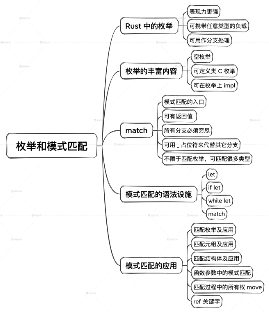

## 五、类型与类型参数

这块知识在其他大部分语言入门材料中讲得不多，但是对于 Rust 而言，却是非常重要而有趣的。

计算机硬件执行的代码其实是二进制序列，而对一个二进制值来说，正是类型赋予了它意义。比如 01100001 这个二进制数字，同样的内存表示，如果是整数，就表示 97。如果是字符，就表示 'a' 这个 char。如果没有类型去赋予它额外的信息，当看到这串二进制编码时，是不知道它代表什么的。

### 1. 类型

《Programming.with.Types》2019 这本书里对类型做了一个定义，翻译出来是这样的：类型是对数据的分类，这个分类定义了这些数据的意义、被允许的值的集合，还有能在这些数据上执行哪些操作。编译器或运行时会检查类型化过程，以确保数据的完整性，对数据施加访问限制，以及把数据按程序员的意图进行解释。

有些情况下，把操作部分忽略掉，所以可以简单地**把类型看作集合，这个集合表达了这个类型的实例能取到的所有可能的值**。

### 2. 类型系统

这本书里还定义了类型系统的概念。

书里是这样说的：类型系统是一套规则集——把类型赋予和施加到编程语言的元素上。这些元素可以是变量、函数和其他高阶结构。类型系统通过你在代码中提供的标注来给元素赋予类型，或者根据它的上下文隐式地推导某个元素的类型。类型系统允许在类型间做各种转换，同时禁止其他的一些转换。

举例来说，刚刚提到的类型的标注就像这种` let a: u32 = 10;`。我们用 : u32 这种语法对变量 a 进行了标注，表明变量 a 的类型是 u32 类型，u32 可以转换成 u64。

```rust
let b = a as u64;
```

但是`u32`不能直接转到 String 上去：

```rust
fn main() {
    let a: u32 = 10;
    let b = a as String;    // 错误的

    println!("{b}");
}
```

### 3. 类型化的好处

类型化有 5 大好处：正确性、不可变性、封装性、组合性、可读性。这 5 大好处中的每一个都是软件工程理论推崇的。

Rust 语言非常强调**类型化**，它的类型系统非常严格，隐式转换非常少：

```rust
fn main() {
    let a = 1.0f32;
    let b = 10;
    
    let c = a * b;
}
```

编译错误，提示不能将一个浮点数和一个整数相乘：

```rust
error[E0277]: cannot multiply `f32` by `{integer}`
 --> src/main.rs:5:15
  |
5 |     let c = a * b;
  |               ^ no implementation for `f32 * {integer}`
  |
  = help: the trait `Mul<{integer}>` is not implemented for `f32`
  = help: the following other types implement trait `Mul<Rhs>`:
            <&'a f32 as Mul<f32>>
            <&f32 as Mul<&f32>>
            <f32 as Mul<&f32>>
            <f32 as Mul>
```

当遇到这种基础类型转换错误时，可以尝试使用 as 操作符显式地将类型转成一致：

```rust
fn main() {
    let a = 1.0f32;
    let b = 10 as f32;    // 添加了 as f32
    
    let c = a * b;
}
```

这里其实展示出 Rust 的一个非常明显的特点：尽可能地显式化。显式化包含两层意思：

1. 不做自动隐式转换。
2. 没要内置转换策略

不做自动隐式转换，可以这样来理解，比如前面的示例，当别人来看你的代码的时候，多了 as f32 这几个字符，他就明白你是在做类型转换，就会自然地警觉起来，分析上下文，估计出下面算出的结果是什么类型，这相当于由程序员为编译器明确地提供了一些额外的信息。

没有内置转换策略这一点，可以拿 JavaScript 社区中流传的一张梗图来对比说明[doge]：

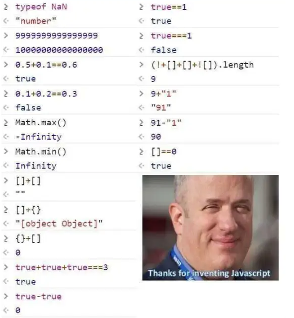

取图里的一个示例，在 JavaScript 里，`9 + "1" `计算出来的结果是` "91"`。这其实就涉及两个不同类型之间相加如何处理的问题。在这个问题上，JavaScript 自己内置了策略，把两个不同类型的值加起来，硬生生算出了一个结果。而当遇到` 91- "1"` 时，策略又变了，算出了数字 90，这些就是内置类型转换策略的体现。

Rust 的严谨，它有着严密的类型体系，在类型化上绝不含糊。它从底层到上层构建了一套完整严密的类型大厦。你的项目越大，使用 Rust 感觉也就越舒服，原因之一就是严谨的类型系统在为你保驾护航。

### 4. 类型作为一种约束

前面提到，类型是变量所有可能取得的值的集合。换句话说，类型实际上限制或定义了变量的取值空间。因此，**类型对于变量来说，也是一种约束**。

实际上，Rust 中的 : （冒号）在语法层面上就是约束：

```rust
let a: u8 = 10;
let b: String = "123".to_string();
```

上述示例中，变量 a 被限制为只能在 u8 这个类型的值空间取值，也就是 0 到 255 这 256 个整数里的一个，而 10 属于这个空间。变量 b 被限制为只能在字符串值空间内取值。不管字符串的值空间多大（其实是无限），这些值与 u8、u32 这些类型的值也是不同的。

### 5. 多类型表示

前面讲到用一种类型来对变量的取值空间进行约束，这有利于程序的健壮性，但有时也会遇到这种方式不够用的场景。比如在 Rust 中，把整数分成 u8、u16、u32、u64。现在想写一个函数，它的参数支持整数，也就是说要同时能接受 u8、u16、u32、u64 这几种类型的值，应该怎么办？如果只是采用前面的理论，这个需求是没法做到的。

再看另外一个实际的例子，有一个日志函数，可以给这个函数传入数字、字符串等类型。这种需求很常见。如何让这一个日志函数同时支持数字和字符串作为参数呢？这就很头痛了。这里实际提出了这样一个问题：在 Rust 语言中，有没有办法用某种方式来表示多种类型？答案是有的。

#### 类型参数

在 Rust 语言中定义类型的时候，可以使用类型参数。比如标准库里常见的` Vec<T>`，就带一个类型参数 T，它可以支持不同类型的列表，如 `Vec<u8>`、`Vec<u32>`、`Vec<String> `等。这里这个 T 就表示一个类型参数，在定义时还不知道它具体是什么类型，只有在使用的时候，才会对这个 T 赋予一个具体的类型。

这里这个 `Vec<T>`，是一个类型整体，单独拆开来讲 Vec 类型是没有意义的。T 是` Vec<T>`中的类型参数，它其实也是信息，提供给 Rust 编译器使用。而带类型参数的类型整体（比如` Vec<T>`）就叫做泛型（generic type）。

#### 结构体中的类型参数

来看一个例子，自定义一个结构体` Point<T>`：

```rust
struct Point<T> {
    x: T,
    y: T,
}
```

这是一个二维平面上的点，由 x、y 两个坐标轴来定义。因为 x、y 的取值有可能是整数，也有可能是浮点数，甚至有可能是其他值，比如无穷精度的类型。所以定义一个类型参数 T，定义的时候需要把 T 放在结构体类型名字后面，用 <> 括起来，也就是 struct Point。

这里的 Point 整体就成为了泛型。然后，标注 x 和 y 分量的类型都是 T。可以看到，T 占据了冒号后面定义类型的位置。所以说它是占位类型也没有问题。

对这个结构体的例子来说，其实还隐藏了一个很重要的细节：x 和 y 字段的类型都是 T，意味着 x 和 y 两个分量的类型是一样的。

来看这个 Point 结构体类型如何实例化：

```rust
struct Point<T> {
    x: T,
    y: T,
}

fn main() {
    let integer = Point { x: 5, y: 10 };     // 一个整数point
    let float = Point { x: 1.0, y: 4.0 };    // 一个浮点数point
}
```

正常编译通过，如果实例化的时候，给 x 和 y 赋予不同的类型值则会报错。

如果需要定义多个参数，那么定义多个就好了，把 x 分量和 y 分量定义成不同的参数化类型：

```rust
struct Point<T, U> {
    x: T,
    y: U,
}

fn main() {
    let both_integer = Point { x: 5, y: 10 };
    let both_float = Point { x: 1.0, y: 4.0 };
    let integer_and_float = Point { x: 5, y: 4.0 };
}
```

再次强调，前面两个示例里的` Point<T>`和`Point<T,U> `都是一个类型整体，把 Point 这个符号本身单独拿出来是没有意义的。

在使用的时候，可以用` turbofish `语法` ::<> `明确地给泛型，或者说是给 Rust 编译器提供类型参数信息，修改一下上面两个示例：

```rust
struct Point<T> {
    x: T,
    y: T,
}

fn main() {
    let integer = Point::<u32> { x: 5, y: 10 };     
    let float = Point::<f32> { x: 1.0, y: 4.0 };    
}
```

```rust
struct Point<T, U> {
    x: T,
    y: U,
}

fn main() {
    let both_integer = Point::<u32, u32> { x: 5, y: 10 };
    let both_float = Point::<f32, f32> { x: 1.0, y: 4.0 };
    let integer_and_float = Point::<u32, f32> { x: 5, y: 4.0 };
}
```

注意，使用时提供类型参数信息用的是`::<>`，而定义类型参数的时候只用到`<>`，注意它们的区别。Rust 把定义和使用两个地方通过语法明确地区分开了，而有的语言并没有区分这两个地方。

类型参数存在两个过程，**一个是定义时，一个是使用时**，这两个过程的区分很重要。这里所谓的`“使用时”`，仍然是在编译期进行分析的，也就是分析你在代码的某个地方用到了这个带类型参数的类型，然后把这个参数具体化，从而形成一个最终的类型版本。

比如` Point<T> `类型的具化类型可能是` Point<u32>`、`Point<f32> `等等；Point 类型的具化类型可能是` Point<u32, u32>`、` Point<u32, f32>`、` Point<f32, u32>`、` Point<f32, f32>`等等。到底有多少种具化版本，是看在后面代码使用时，会用到多少种不同的具体类型，这个数目是由编译器自动帮忙计算展开的。

这种在编译期间完成的类型展开成具体版本的过程，被叫做**编译期单态化**。单态化的意思就是把处于混沌未知的状态具体化到一个单一的状态。

### 6. 在泛型上做impl

当类型是一个泛型时，要对其进行 impl 的话，需要处理类型参数：

```rust
struct Point<T> {
    x: T,
    y: T,
}

impl<T> Point<T> {        // 注意这一行
    fn play(n: T) {}      // 注意这一行
}
```

在对` Point<T>`做 impl 的时候，需要在 impl 后面加一个`<T> `，表示在 impl 的 block 中定义类型参数 T，供 impl block 中的元素使用，这些元素包括：` impl<T> Point<T> `里` Point<T> `中的 T 和整个 impl 的花括号 body 中的代码，如` play() `函数的参数就用到了这个 T。

有一个细节需要注意：`struct Point<T> `里` Point<t> `中的 T 是定义类型参数 T，`impl<T> Point<T> `中的` Point<T> `中的 T 是使用类型参数 T，这个 T 是在 impl 后面那个尖括号中定义的。

在对泛型做了 impl 后，对其某一个具化类型继续做 impl 也是可以的，比如：

```rust
struct Point<T> {
    x: T,
    y: T,
}

impl<T> Point<T> {
    fn play(n: T) {}
}

impl Point<u32> {      // 这里，对具化类型 Point<u32> 继续做 impl
    fn doit() {}
}
```

### 7. 枚举中的类型参数

前面讲过，枚举的变体可以挂载任意其他类型作为负载。因此每个负载的位置，都可以出现类型参数。比如最常见的两个枚举，`Option<T> `与` Result<T, E>`，就是泛型。

`Option<T> `用来表示有或无：

```rust
enum Option<T> {
    Some(T),
    None,
}
```

` Result<T, E>`用来表示结果正确或错误，Ok 变体带类型参数 T，Err 变体带类型参数 E：

```rust
enum Result<T, E> {
    Ok(T),
    Err(E),
}
```

现在再看一个更复杂的枚举中带类型参数的例子：

```rust
struct Point<T> {
    x: T,
    y: T,
}

enum Aaa<T, U> {
    V1(Point<T>),
    V2(Vec<U>),
}
```

枚举` Aaa<T, U>`的变体 V1 带了一个` Point<T>`的负载，变体 V2 带了一个` Vec<U> `的负载。由于出现了两个类型参数 T 和 U，所以需要在 Aaa 后面的尖括号里定义这两个类型参数。

实际上，类型参数也是一种复用代码的方式，可以让写出的代码更紧凑，下面来看具体的应用场景。

### **8. 函数中的类型参数**

需求是这样的：很多不同的类型，其实它们实现某个逻辑时，逻辑是一模一样的。因此如果没有类型参数，就得对每个具体的类型重新实现一次同样的逻辑，这样就显得代码很臃肿。重复的代码也不好维护，容易出错：

```rust
struct PointU32 {
    x: u32,
    y: u32,
}

struct PointF32 {
    x: f32,
    y: f32,
}

fn print_u32(p: PointU32) {
    println!("Point {}, {}", p.x, p.y);
}

fn print_f32(p: PointF32) {
    println!("Point {}, {}", p.x, p.y);
}

fn main() {
    let p = PointU32 {x: 10, y: 20};
    print_u32(p);

    let p = PointF32 {x: 10.2, y: 20.4};
    print_f32(p);
}
```

上面示例中，因为我们没有使用类型参数，那就得针对不同的字段类型（u32，f32）分别定义结构体（PointU32，PointF32）和对应的打印函数（print_u32，print_f32），并分别调用。

而有了类型参数的话，这样的需求代码只需要写一份，让编译器来帮我们分析到时候要应用到多少种不同的类型上。

上面的代码可以优化成这样：

```rust
struct Point<T> {
    x: T,
    y: T,
}

fn print<T: std::fmt::Display>(p: Point<T>) {
    println!("Point {}, {}", p.x, p.y);
}

fn main() {
    let p = Point {x: 10, y: 20};
    print(p);

    let p = Point {x: 10.2, y: 20.4};
    print(p);
}
```

print 函数的类型参数在定义的时候，多了一个东西：

```rust
fn print<T: std::fmt::Display>(p: Point<T>) {
```

这里` T: std::fmt::Display `的意思是要求 T 满足某些条件 / 约束，这里具体来说就是 T 要满足可以被打印的条件。因为这个函数的目的是把 x 和 y 分量打印出来，那么它确实要能被打印才行，比如得能转换成人类可见的某种格式。

### 9. 方法中的类型参数

结构体中可以有类型参数，函数中也可以有类型参数，它们组合起来，方法上当然也可以有类型参数：

```rust
struct Point<T> {
    x: T,
    y: T,
}

impl<T> Point<T> {          // 在impl后定义impl block中要用到的类型参数
    fn x(&self) -> &T {     // 这里，在方法的返回值上使用了这个类型参数
        &self.x
    }
}

fn main() {
    let p = Point { x: 5, y: 10 };
    println!("p.x = {}", p.x());
}
// 输出 
// p.x = 5
```

上面的示例中，`Point<T> `的方法` x() `的返回值类型就是 &T，使用到了` impl<T> `这里定义的类型参数 T。

下面继续看更复杂的内容，方法中的类型参数和结构体中的类型参数可以不同：

```rust
struct Point<X1, Y1> {
    x: X1,
    y: Y1,
}

// 这里定义了impl block中可以使用的类型参数X3, Y3，
impl<X3, Y3> Point<X3, Y3> {
    // 这里单独为mixup方法定义了两个新的类型参数 X2, Y2
    // 于是在mixup方法中，可以使用4个类型参数：X3, Y3, X2, Y2
    fn mixup<X2, Y2>(self, other: Point<X2, Y2>) -> Point<X3, Y2> {
        Point {
            x: self.x,
            y: other.y,
        }
    }
}

fn main() {
    let p1 = Point { x: 5, y: 10.4 };
    let p2 = Point { x: "Hello", y: 'c' };

    let p3 = p1.mixup(p2);

    println!("p3.x = {}, p3.y = {}", p3.x, p3.y);
}

// 输出 
// p3.x = 5, p3.y = c
```

可以看到，在` Point<X3, Y3> `的方法` mixup() `上新定义了两个类型参数 X2、Y2，于是在` mixup() `方法中，可以同时使用 4 个类型参数：X2、Y2、X3、Y3。

### 10. 类型体系构建方法

类型体系构建指的是如何从最底层的小砖块开始，通过封装、组合、集成，最后修建成一座类型上的摩天大楼。在 Rust 里，主要有四大基础设施参与这个搭建的过程。

- struct 结构体
- enum 枚举
- 洋葱结构
- type 关键字

#### struct 和 enum

struct 是 Rust 里把简单类型组合起来的主要结构，struct 里的字段可以是基础类型，也可以是其他结构体或枚举等复合类型，这样就可以一层一层往上套，结构体 struct 表达的是一种元素间同时起作用的结构。

而枚举 enum 表达的是一种元素间在一个时刻只有一种元素起作用的结构，因此枚举类型特别适合做配置和类型聚合之类的工作： 

```rust
struct Point(u32, u32);  // 定义点

struct Rectangle {  // 长方形由两个点决定
  p1: Point,
  p2: Point,
}

struct Triangle(Point, Point, Point);  // 三角形由三个点组成

struct Circle(Point, u32);  // 圆由点和半径组成

enum Shape {   // 由枚举把长方形，三角形和圆形聚合在一起
  Rectangle(Rectangle),
  Triangle(Triangle),
  Circle(Circle),
}

struct Axes;   // 定义坐标

struct Geometry {    // 几何学由形状和坐标组成
  shape: Shape,
  axes: Axes,
}

struct Algebra;      // 定义代数

enum Level {         // 定义学校的级别
  Elementary,        // 小学
  Secondary,         // 初中
  High,              // 高中
}

enum Course {          // 数学要学习几何和代数，由枚举来聚合
  Geometry(Geometry),
  Algebra(Algebra),
}

struct MathLesson {      // 定义数学课程，包括数学的科目和级别
  math: Course,
  level: Level,
}
```

#### newtype

结构体还有一种常见的封装方法，那就是用单元素的元组结构体。比如定义一个列表类型` struct List(Vec<u8>);`。**它实际就是` Vec<u8> `类型的一个新封装，相当于给里面原来那种类型取了一个新名字，同时也把原类型的属性和方法等屏蔽起来了**。

有时，还可以看到没有具化类型参数的情形：

```rust
struct List<T>(Vec<T>);
```

这种模式非常常见，于是业界给它取了个名字，叫做 newtype 模式，意思是用新的类型名字替换里面原来那个类型名字。

#### 洋葱结构

Rust 中的类型还有另外一种构建方法——洋葱结构。来看一个示例，注意代码里的 type 关键字在这里的作用是把一个类型重命名，取了一个更短的名字：

```rust
// 你可以试着编译这段代码
use std::collections::HashMap;

type AAA = HashMap<String, Vec<u8>>;
type BBB = Vec<AAA>;
type CCC = HashMap<String, BBB>;
type DDD = Vec<CCC>;
type EEE = HashMap<String, DDD>;
```

最后 EEE 展开就是这样的：

```rust
HashMap<String, Vec<HashMap<String, Vec<HashMap<String, Vec<u8>>>>>>;
```

可以看到，尖括号的层数很多，像洋葱一样一层一层的，因此叫洋葱类型结构。

再来看一个结合 newtype 和 struct 的更复杂的示例：

```rust
use std::collections::HashMap;

struct AAA(Vec<u8>); // newtype
struct BBB {
  hashmap: HashMap<String, AAA>
}
struct CCC(BBB);
type DDD = Vec<CCC>;
type EEE = HashMap<String, Vec<DDD>>;

// 最后，EEE展开就类似下面这样（仅示意，无法编译通过）
// HashMap<String, Vec<Vec<CCC(BBB {hashmap: HashMap<String, AAA<Vec<u8>>>})>>>
```

#### type关键字

type 关键字很重要，它的作用是在洋葱结构表示太长了之后，把一大串类型的表达简化成一个简短的名字。在 Rust 中使用 type 关键字，可以使类型大厦的构建过程变得清晰可控。

type 关键字还可以处理泛型的情况，比如：

```rust
type MyType<T> = HashMap<String, Vec<HashMap<String, Vec<HashMap<String, Vec<T>>>>>>;
```

因为最里面那个是类型` Vec<T>`，T 类型参数还在。因此给这个洋葱类型重命名的时候，需要把这个 T 参数带上，于是就变成了 `MyType<T>`。

这种写法在标准库里很常见，最佳示例就是关于各种`Result* `的定义。

在` std::io `模块里，取了一个与` std::result::Result<T, E> `同名的 Result 类型，把` std::result::Result<T, E> `定义简化了，具化其 Error 类型为` std::io::Error`，同时仍保留了第一个类型参数 T。于是得到了` Result<T>`。

```rust
pub type Result<T> = Result<T, Error>;
```

刚开始接触 Rust 的时候，可能会对这种表达方式产生疑惑，其实道理就在这里。以后在阅读 Rust 生态中各种库的源码时，也会经常遇到这种封装方式，所以要习惯它。

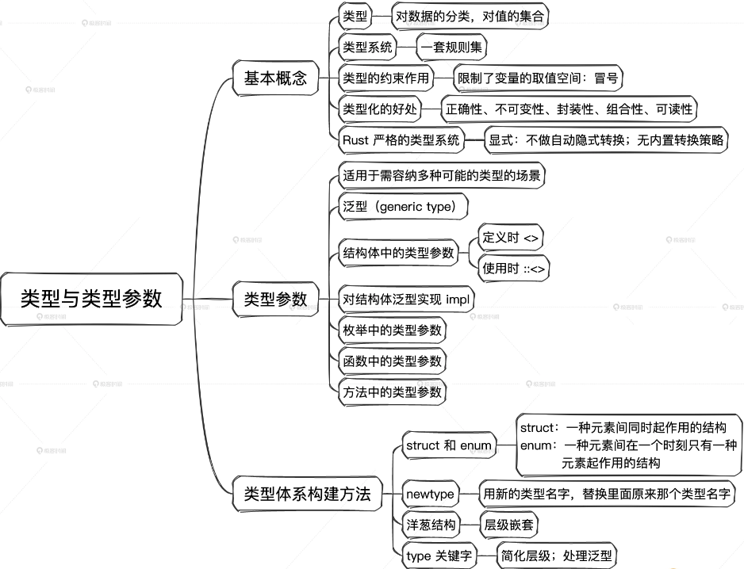

如果给某个泛型实现了一个方法，那么，还能为它的一个具化类型再实现同样的方法吗？

决于这个泛型能否表示相应的具化类型。比如为泛型 T 和 String 实现了相同的方法，由于 T 没有施加任何约束，它可以代表 String。那么当调用方法时，对于具化类型 String 来说，要调用哪一个呢？因此会出现歧义，编译器会报错：方法被重复定义了。

 但如果给泛型 T 施加了一个 Copy 约束，要求 T 必须实现了 Copy trait，那么就不会报错了，因为此时 T 代表不了 String，所以调用方法不会出现歧义。但如果再为 i32 实现一个同名方法就会报错了，因为 i32 实现了 Copy，它可以被 T 表示。

## 六、`Option<T>`、`Result<T, E>`和迭代器

`Option<T>`和`Result<T, E>`并不是 Rust 的独创设计，在 Rust 之前，OCaml、Haskell、Scala等已经使用他们很久了。

### 1. `Option<T>`和`Result<T, E>`

`Option<T>`和`Result<T, E>`在 Rust 代码中随处可见，但是到现在才开始正式介绍，就是因为它们实际是带类型参数的枚举类型：

#### `Option<T>`的定义

```rust
pub enum Option<T> {
    None,
    Some(T),
}
```

`Option<T>`定义为定义为包含两个变体的枚举。一个是不带负载的 None，另一个是带一个类型参数作为其负载的 Some。`Option<T>`的实例在 Some 和 None 中取值， 表示这个实例有取空值的可能。

**可以把`Option<T>`理解为把空值单独提出来了一个维度**，在没有`Option<t>`的语言中，空值是分散在其他类型中的。比如空字符串、空数组、数字 0、NULL 指针等。并且有的语言还把空值区分为空值和未定义的值，如 nil、undefined 等。

Rust 做了两件事情来解决这个混乱的场面，第一，**Rust 中所有的变量定义后使用前都必须初始化，所以不存在未定义值这个情况**。第二，**Rust 把空值单独提出来统一定义成` Option<T>::None`，并在标准库层面上就做好了规范，上层的应用在设计时也应该遵循这个规范**：

```rust
let s = String::from("");
let a: Option<String> = Some(s);
```

变量 a 是携带空字符串的` Option<String> `类型。这里，空字符串`""`的`“空”`与` None `所表示的`“无”`表达了不同的意义。

如果早点发明 Option，Tony Hoare 就不会自责了，Tony Hoare 在一次分享中说，他在 1965 年发明的空引用（Null references）是一个`“十亿美元”`的错误。

他是这样说的：我把它叫做我的十亿美元错误。那个时候，我正在为一个面向对象语言中的引用设计第一个全面的类型系统。我的目标是让编译器自动施加检查，来确保对引用的所有使用都是绝对安全的。但是我当时无法抵抗空引用的诱惑，就是因为它非常容易实现。这导致了难以计数的错误、漏洞和系统崩溃，在后续 40 年里这可能已经导致了十亿美元的痛苦和破坏。

Rust 通过所有权并借用检查器、Option、Result 等一整套机制全面解决了 Hoare 想解决的问题。

#### `Result<T, E>`的定义

```rust
pub enum Result<T, E> {
    Ok(T),
    Err(E),
}
```

`Result<T, E>` 被定义为包含两个变体的枚举，这两个变体各自带一个类型参数作为其负载。Ok(T) 用来表示结果正确，Err(E) 用来表示结果有错误。

对比其他语言函数错误返回的约定，C、CPP、Java 语言里有时用返回 0 来表示函数执行正确，有时又不是这样，需要根据代码所在的上下文环境来判断返回什么值代表正确，返回什么值代表错误。

而 Go 语言强制对函数返回值做出了约定：

```go
ret, err := function()
if err != nil {
```

约定要求函数返回两个值，正确的情况下，ret 存放返回值，err 为 nil。如果函数要返回错误值，那么会给 err 变量填充具体的内容，于是就出现了经典的满屏 if err ！= nil 代码，成了 Go 语言圈的一个梗。可以看到，Go 语言已经朝着把错误信息和正常返回值类型剥离开来的方向走出了一步。

而 Rust 没有像 Go 那样设计，一是因为 Rust 不存在单独的 nil 这种空值，二是 Rust 直接用带类型参数的枚举就可以达到这个目的。

一个枚举实例在一个时刻只能是那个枚举类型的某一个变体。所以一个函数的返回值，不论它是正确的情况还是错误的情况，都能用` Result<T, E>` 类型统一表达，这样会显得更紧凑。同时还因为`Result<T, E>`是一种类型，可以在它之上添加很多操作，用起来很方便：

```rust
let r: Result<String, String> = function();
```

这个例子表示将函数返回值赋给变量 r，返回类型是` Result<String, String>`。在正确的情况下，返回内容为 String 类型；错误的情况下，被返回的错误类型也是 String。你是不是在想：两种可以一样？当然可以，这两个类型参数可以被任意类型代入。

`Result<T, E>`被用来支撑 Rust 的错误处理机制，所以非常重要。

### 2. 解包

有一个问题，比如` Option::Some(10) `和` 10u32 `明显已经不是同一种类型了。真正想要的值被`“包裹”`在了另外一种类型里面。这种`“包裹”`是通过枚举变体来实现的，那想获取被包在里面的值应该怎么做呢？

#### ` expect()`、`unwrap()`、`unwrap_or()`

其实有很多办法，先讲一类解包操作，这里列出了三种方法，分别是` expect()`、`unwrap()`、`unwrap_or()`。这里给出了它们解包的具体操作和示例代码，可以看一下有什么不同：

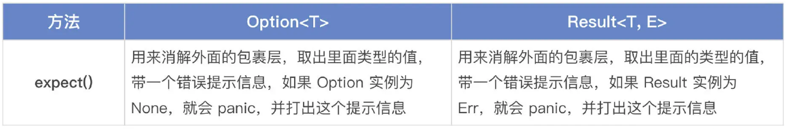

示例：

```rust
// Option
let x = Some("value");
assert_eq!(x.expect("fruits are healthy"), "value");
// Result
let path = std::env::var("IMPORTANT_PATH")
    .expect("env variable `IMPORTANT_PATH` should be set by `wrapper_script.sh`");
```

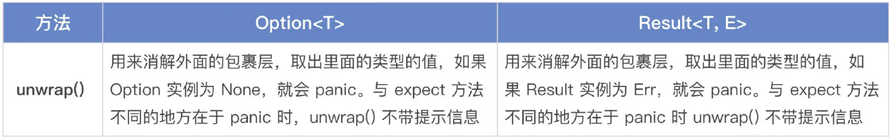

示例：

```rust
// Option
let x = Some("air");
assert_eq!(x.unwrap(), "air");
// Result
let x: Result<u32, &str> = Ok(2);
assert_eq!(x.unwrap(), 2);
```

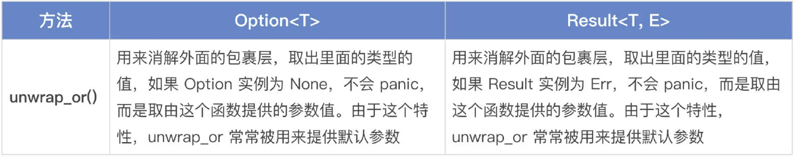

示例：

```rust
// Option
assert_eq!(Some("car").unwrap_or("bike"), "car");
assert_eq!(None.unwrap_or("bike"), "bike");

// Result
let default = 2;
let x: Result<u32, &str> = Ok(9);
assert_eq!(x.unwrap_or(default), 9);

let x: Result<u32, &str> = Err("error");
assert_eq!(x.unwrap_or(default), default);
```


示例：

```rust
// Option
let x: Option<u32> = None;
let y: Option<u32> = Some(12);

assert_eq!(x.unwrap_or_default(), 0);
assert_eq!(y.unwrap_or_default(), 12);

// Result
let good_year_from_input = "1909";
let bad_year_from_input = "190blarg";
let good_year = good_year_from_input.parse().unwrap_or_default();
let bad_year = bad_year_from_input.parse().unwrap_or_default();

assert_eq!(1909, good_year);
assert_eq!(0, bad_year);
```

可以看到，解包操作挺费劲的。如果我们总是先用` Option<T>`或` Result<T, E>`把值包裹起来，用的时候再手动解包，那其实说明没有真正抓住到 Option 和 Result 的设计要义。在 Rust 中，很多时候不需要解包也能操作里面的值，这样就不用做看起来多此一举的解包操作了。

#### 不解包的情况下的操作

不解包的情况下如果想要获取被包在里面的值就需要用到` Option<T> `和`Result<T, E> `里的一些常用方法。

##### `Option<T> `上的常用方法和示例

- map()：在 Option 是 Some 的情况下，通过 map 中提供的函数或闭包把 Option 里的类型转换成另一种类型。在 Option 是 None 的情况下，保持 None 不变。map() 会消耗原类型，也就是获取所有权。

  ```rust
  let maybe_some_string = Some(String::from("Hello, World!"));
  let maybe_some_len = maybe_some_string.map(|s| s.len());
  assert_eq!(maybe_some_len, Some(13));
   
  let x: Option<&str> = None;
  assert_eq!(x.map(|s| s.len()), None);
  ```

- cloned()：通过克隆 Option 里面的内容，把` Option<&T> `转换成` Option<T>`。

  ```rust
  let x = 12;
  let opt_x = Some(&x);
  assert_eq!(opt_x, Some(&12));
  let cloned = opt_x.cloned();
  assert_eq!(cloned, Some(12));
  ```

- is_some()：如果 Option 是 Some 值，返回 true。

  ```rust
  let x: Option<u32> = Some(2);
  assert_eq!(x.is_some(), true);
   
  let x: Option<u32> = None;
  assert_eq!(x.is_some(), false);
  ```

- is_none()：如果 Option 是 None 值，返回 true。

  ```rust
  let x: Option<u32> = Some(2);
  assert_eq!(x.is_none(), false);
   
  let x: Option<u32> = None;
  assert_eq!(x.is_none(), true);
  ```

- as_ref()：把` Option<T>`或` &Option<T> `转换成` Option<&T>`。创建一个新 Option，里面的类型是原来类型的引用，就是从` Option<T> `到` Option<&T>`。原来那个` Option<T> `实例保持不变。

  ```rust
  let text: Option<String> = Some("Hello, world!".to_string());
  let text_length: Option<usize> = text.as_ref().map(|s| s.len());
  println!("still can print text: {text:?}");
  ```

- as_mut()：把` Option<T> `或` &mut Option<T> `转换成` Option<&mut T>`。

  ```rust
  let mut x = Some(2);
  match x.as_mut() {
  Some(v) => *v = 42,
  None => {},
  }
  assert_eq!(x, Some(42));
  ```

- take()：把 Option 的值拿出去，在原地留下一个 None 值。这个非常有用。相当于把值拿出来用，但是却没有消解原来那个 Option。

  ```rust
  let mut x = Some(2);
  let y = x.take();
  assert_eq!(x, None);
  assert_eq!(y, Some(2));
   
  let mut x: Option<u32> = None;
  let y = x.take();
  assert_eq!(x, None);
  assert_eq!(y, None);
  ```

- replace()：在原地替换新值，同时把原来那个值抛出来。

  ```rust
  let mut x = Some(2);
  let old = x.replace(5);
  assert_eq!(x, Some(5));
  assert_eq!(old, Some(2));
   
  let mut x = None;
  let old = x.replace(3);
  assert_eq!(x, Some(3));
  assert_eq!(old, None);
  ```

- and_then()：如果 Option 是 None，返回 None；如果 Option 是 Some，就把参数里面提供的函数或闭包应用到被包裹的内容上，并返回运算后的结果。

  ```rust
  fn sq_then_to_string(x: u32) -> Option<String> {
  x.checked_mul(x).map(|sq| sq.to_string())
  }
   
  assert_eq!(Some(2).and_then(sq_then_to_string), Some(4.to_string()));
  assert_eq!(Some(1_000_000).and_then(sq_then_to_string), None); // overflowed!
  assert_eq!(None.and_then(sq_then_to_string), None);
  ```

##### `Result<T, E> `上的常用方法和示例

- map()：当 Result 是 Ok 的时候，把 Ok 里的类型通过参数里提供的函数运算并且可以转换成另外一种类型。当 Result 是 Err 的时候，原样返回 Err 和它携带的内容。

  ```RUST
  let line = "1\n2\n3\n4\n";
   
  for num in line.lines() {
  match num.parse::<i32>().map(|i| i * 2) {
  Ok(n) => println!("{n}"),
  Err(..) => {}
  }
  }
  ```

- is_ok()：如果 Result 是 Ok，返回 true。

  ```RUST
  let x: Result<i32, &str> = Ok(-3);
  assert_eq!(x.is_ok(), true);
   
  let x: Result<i32, &str> = Err("Some error message");
  assert_eq!(x.is_ok(), false);
  ```

- is_err()：如果 Result 是 Err，返回 true。

  ```rust
  let x: Result<i32, &str> = Ok(-3);
  assert_eq!(x.is_err(), false);
   
  let x: Result<i32, &str> = Err("Some error message");
  assert_eq!(x.is_err(), true);
  ```

- as_ref()：创建一个新 Result，里面的两种类型分别是原来两种类型的引用，就是从` Result<T, E> `到` Result<&T, &E>`。原来那个` Result<T, E> `实例保持不变。

  ```rust
  let x: Result<u32, &str> = Ok(2);
  assert_eq!(x.as_ref(), Ok(&2));
   
  let x: Result<u32, &str> = Err("Error");
  assert_eq!(x.as_ref(), Err(&"Error"));
  ```

- as_mut()：创建一个新 Result，里面的两种类型分别是原来两种类型的可变引用，就是从` Result<T, E>`到` Result<&mut T, &mut E>`。原来那个` Result<T, E>` 实例保持不变。

  ```rust
  fn mutate(r: &mut Result<i32, i32>) {
  match r.as_mut() {
  Ok(v) => *v = 42,
  Err(e) => *e = 0,
  }
  }
  let mut x: Result<i32, i32> = Ok(2);
  mutate(&mut x);
  assert_eq!(x.unwrap(), 42);
  let mut x: Result<i32, i32> = Err(13);
  mutate(&mut x);
  assert_eq!(x.unwrap_err(), 0);
  ```

- and_then()：当 Result 是 Ok 时，把这个方法提供的函数或闭包应用到 Ok 携带的内容上面，并返回一个新的 Result。当 Result 是 Err 的时候，这个方法直接传递返回这个 Err 和它的负载。这个方法常常用于一路链式操作，前提是过程里的每一步都需要返回 Result。

  ```rust
  fn sq_then_to_string(x: u32) -> Result<String, &'static str> {
  x.checked_mul(x).map(|sq| sq.to_string()).ok_or("overflowed")
  }
   
  assert_eq!(Ok(2).and_then(sq_then_to_string), Ok(4.to_string()));
  assert_eq!(Ok(1_000_000).and_then(sq_then_to_string), Err("overflowed"));
  assert_eq!(Err("not a number").and_then(sq_then_to_string), Err("not a number"));
  ```

- map_err()：当 Result 是 Ok 时，传递原样返回。当 Result 是 Err 时，对 Err 携带的内容使用这个方法提供的函数或闭包进行运算及类型转换。这个方法常常用于转换 Result 的 Err 的负载的类型，在错误处理流程中大量使用。

  ```rust
  fn stringify(x: u32) -> String { format!("error code: {x}") }
  let x: Result<u32, u32> = Ok(2);
  assert_eq!(x.map_err(stringify), Ok(2));
  let x: Result<u32, u32> = Err(13);
  assert_eq!(x.map_err(stringify), Err("error code: 13".to_string()));
  ```

  
