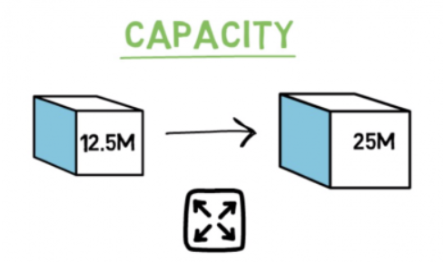
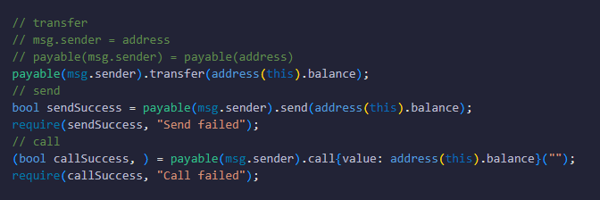
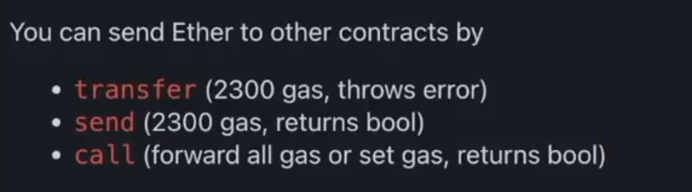
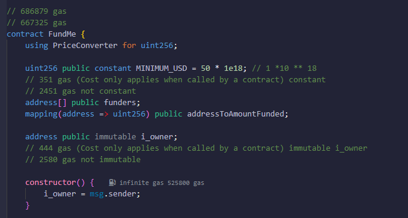

# Foundry

Foundry是智能合约的开发框架，与Hardhat依赖 JS 不同，Foundry不需要使用者学习Solidity以外的任何语言

# Security and auditing

Github：[Security and auditing course](https://github.com/Cyfrin/security-and-auditing-full-course-s23)

工具配置：Linux、Foundry or Hardhat、Phind or ChatGPT

---

## EIP:1559

**EIP-1559**是一项以太坊改进提案，旨在**优化以太坊区块链的费用市场系统**。 

**工作原理：**

以太坊的*遗留*费用市场经常导致以太坊区块被自前一个区块以来出价最高的交易者的交易填满。这种格式会导致**不必要的向上竞标压力**以及ETH Gas价格和交易时间的**不确定性。**

为了克服这些缺点，EIP-1559 引入了一个新的收费系统，其中包含三个关键要素：**基本费用**、**小费**和**费用上限**。 

**基本费用：**

由以太坊设置，基本费用表示交易必须用于包含在以太坊区块中 **的最低气体量。**

如果交易者将他们的费用上限设置为高于基本费用并为矿工添加小费，他们可以合理地假设他们的交易将在以下一系列区块中得到确认。这种动态与当前的遗留费用系统形成对比，在该系统中，用户可以触发交易，然后条件变化如此之快，以至于交易数小时都无法确认。 

值得注意的是，**基础费用被烧毁**（即销毁），如果对以太坊区块空间的需求许可，这可能导致 ETH 在未来成为通缩资产。 

**小费：**

由用户设置，小费被添加到交易中，以补偿矿工/验证者的风险，例如挖掘叔块。该技巧还使交易者能够**支付高于基本费用的溢价，**以更快地挖掘/验证他们的交易。因此，当以太坊区块现在 100% 满时，提示允许用户暂时恢复到传统的“第一价格拍卖”系统来完成他们的交易。 

**费用上限：**

费用上限由用户设置，表示以太坊交易者愿意为交易支付**的最大天然气量。**费用上限包括基本费用和小费，当交易得到确认时，交易者会收到退款，作为实际花费的金额与建议的费用上限之间的差额。简单地说，费用上限 –（基本费用 + 小费）= 退款。该系统确保用户永远不会为了获得包含在以太坊区块中的交易而 **支付比他们愿意支付的更多的气体。**

### **总结**

- *在 EIP-1559 下，矿工/验证者获得有偿区块奖励 + 小费。* 

- 所有应计的基本费用都会被烧掉。 

- 用户设置自己的费用上限和提示，而基本费用由协议根据需求决定。 
- EIP-1559 仍然能够促进传统风格的交易。当这些交易进入时，它们的汽油价格会简单地转换为费用上限，包括各自的基本费用和小费。 

### **优势**

EIP-1559 的激活提供了三个根本性的进步：**改进的以太坊交易用户体验**、**改进的 ETH 经济性**和**改进的以太坊安全性**。

**用户体验：**

EIP-1559 在协议级别明确了以太坊交易的 gas 价格，从而**减轻了有关 gas**和以太坊交易时间的大部分不确定性。 

EIP-1559 实现这些缓解措施的主要方式之一是**让区块达到 200% 满**，即无论以太坊的 gas 限制是多少，都可以加倍。这种额外的灵活性将赋予以太坊更好的能力来支持交易需求，从而缩短交易等待时间和更清晰的汽油价格估计。 



**改善ETH经济性**：

EIP-1559**要求所有基本费用都以 ETH 支付**，而传统的费用系统实际上并没有指定必须以 ETH 支付 gas。 

**这种传统的动态为经济抽象的可能性**留下了空间，即 ETH 在以太坊网络中失去了其核心重要性。*EIP-1559 允许仅以 ETH*支付基本费用，从而减轻了这种抽象，从而巩固了 ETH 的经济地位。 

此外，如果对以太坊区块空间的需求继续保持高位或从这里开始增长，则基本费用燃烧可能会使 ETH 从通胀资产转变为供应稳步减少 的**通货紧缩资产。**

**改进以太坊的安全性**：

EIP-1559 还以各种方式提高了以太坊的安全性。首先，**EIP-1559 有助于防止**针对以太坊网络的 垃圾邮件攻击

以前，理论上，攻击者可以通过与矿工勾结来尝试向以太坊发送垃圾邮件以获取低于市场的天然气成本。EIP-1559 确保这样的垃圾邮件发送者支付的费用永远不会低于发起攻击的基本费用，因此随着时间的推移，这种攻击甚至会变得更加昂贵，因为罪魁祸首不断提高自己的基本费用。 

此外，**EIP-1559 可以帮助防止**以太坊的小规模重组或重组。 

由于去中心化区块链共识的性质，重组可以非恶意地发生，但它们也可以被设计和执行为恶意代理的利益的攻击。由于以太坊的传统“天然气战争”导致区块中充斥着巨额交易费用，矿工们有非常重要的动机来执行小型区块链重组。相比之下，EIP-1559 会消耗基本费用，从而导致较小的攻击激励。

## Solidity

### Solidity存储数据的方式

1. Stack
2. Memory
   Memory是可以被修改的临时变量，常被作用于标记数组、映射或结构体。
3. Storage
   Storage是可以被修改的永久变量，不可在函数或者局部生存区里定义该关键字。
4. Calldata
   Calldata是不可以被修改的临时变量，常被作用于标记数组、映射或结构体。
5. Code
6. Logs

### transfer, send and call





1. transfer会自动回滚
2. send需要设置require回滚
3. 目前call是发送和接受以太币或者其他区块链原生货币最主要的方式

## gas节省

#### constant & immutable



#### require的另一种写法

```solidity
// ...

error NotOwner();

contract xxx{
    // ...
    modifier onlyOwner {
        if(msg.sender != i_owner) {
            revert NotOwner();
        }
        _;
    }
}
```

#### receive & fallback

receive()：

当向合约发送Transact时，若没有指定某个函数，receive函数就会被触发（当 calldata 没有值时，即只有当calldata是空白时才能触发）

fallback()：

当向合约发送Transact时，若calldata有值，则调用fallback()

## 课堂回顾

接口、GitHub引用以及Solidity的数学运算：[p29 4-3 1:53](https://www.bilibili.com/video/BV1Ca411n7ta?p=29&spm_id_from=pageDriver&vd_source=ea18e3c33199d1462f65aa17d9d163b1)

