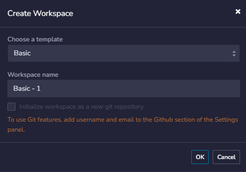
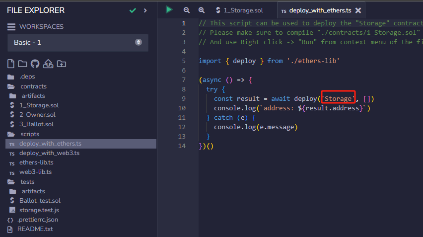
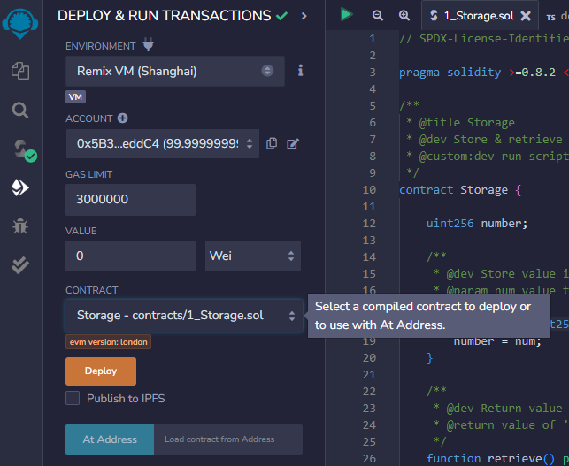
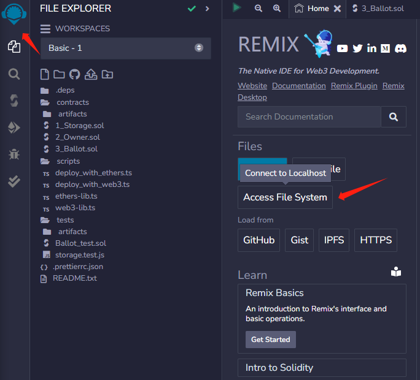
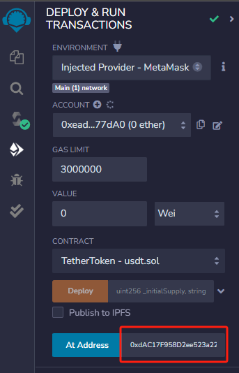
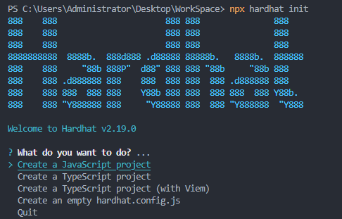
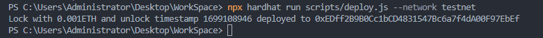

# DApp 设计与开发

> **提示：建议先观看课程视频，这样记忆会更深刻，笔记是配合视频学习的。另外老师会提到很多案例还有建议，这些都很重要，本文档只用于记录知识点。**
>
> **视频 url：[梁培利：DApp 设计与开发](https://www.bilibili.com/video/BV1by4y1A7M7/?spm_id_from=333.999.0.0&vd_source=ea18e3c33199d1462f65aa17d9d163b1)**

## 一、简介

### 相关技术栈

- Solidty / JavaScript
- Node.js / React.js
- Hardhat / Remix IDE / Metamask
- ERC20 / ERC721 / Openzepplin
- VScode / Github / Vercel / Cloudflare
- IPFS / The Graph / Readthedocs

---

### 智能合约工程师的基本素质

- 安全
- 测试
- 英语
- 人品 and 快速学习能力

---

## 二、区块链基本概念

- 账户与钱包
- 区块链浏览器
- 本地链 / 测试网 / 主网
- 本地环境 / 测试环境 / 生产环境
- Provider / Relay Network

### 私钥、公钥生产的方式

**私钥：**

1. 私钥是256位的随机数
2. 在随机数前插入版本号，后面附加压缩标志和校验码（经过两次SHA-256的算法校验，取两次哈希结果的前四个字节作为校验码）
3. 通过 Base56 Encode 成更容易阅读和管理的编码数据（与第二步可互相转化）

**公钥：**

1. 得到私钥之后利用椭圆曲线加密算法计算所对应的非压缩公钥，生成的公钥一共65字节，其中一个字节是0x04，其中32个字节是X坐标，另外32个字节是Y坐标
2. 将第一步得到的公钥地址进行SHA-256哈希计算
3. 取上一步结果，进行RIPEMD-160计算
4. 取上一步结果，在其前面加上地址版本号
5. 取上一步结果，进行两次SHA-256计算
6. 取上一步的前4个字节（8位十六进制），追加到**第4步**的结果后面
7. 最后用 Base58 Encode 得到最后的结果

---

### 钱包与账户

**`"Not your keys, not your coins"`**

钱包即管理私钥的工具。

**钱包的类型：**

- 纸钱包
- 冷钱包
- 热钱包
- 网页钱包
- 手机钱包
- 硬件钱包
- 交易所
- 随机钱包
- 种子钱包
- ...

**BIP39：**

BIP：*Bitcoin* *Improvement Proposal*

github：[BIP39](https://github.com/bitcoin/bips/blob/master/bip-0039.mediawiki)

意义：提供一种易于使用和安全的方法来管理加密货币钱包的助记词。

**私钥的保管方式：**

- 每次接收别人的转账时使用新地址
- 私钥不能接触网络
- ...

> 这块老师还提了很多私钥泄露的故事，可以了解保管私钥的方式有多么重要，推荐看一遍。

---

### 区块链浏览器

区块浏览器（Block Explorer）是一种用于查看和分析区块链数据的工具。

区块浏览器可以用于多种用途，例如：

- 查看交易历史记录
- 查看地址余额
- 查看区块信息
- 查看智能合约
- ...

> 老师还提到有很多新加入的功能，比如不通过Wallet去对合约地址进行交互等等

---

### 产品开发流程

1. 分析需求
2. 开发
3. 测试与审计
4. 部署到测试网
5. 部署到主网

---

### 本地环境、测试环境与生产环境

本地环境、测试环境和生产环境是软件开发中常用的三种环境。它们之间的主要区别在于它们的目的和使用方式。

1. 本地环境：本地环境是指开发人员在本地计算机上搭建的开发环境。它通常用于开发和测试新功能，以及进行单元测试和集成测试等。本地环境通常包括开发工具、数据库、Web 服务器和其他必要的软件组件。
2. 测试环境：测试环境是指专门用于测试软件的环境。它通常是一个独立的环境，与生产环境隔离开来，以便测试人员可以在不影响生产环境的情况下进行测试。测试环境通常包括与生产环境相同的硬件和软件配置，以确保测试结果的准确性。
3. 生产环境：生产环境是指软件正式部署和运行的环境。它通常是一个稳定的环境，用于处理实际的业务流程和用户请求。生产环境通常需要高可用性、高性能和高安全性，以确保系统的稳定性和可靠性。

---

### Provider 与 Relay Network

**Provider：**

解决用户与区块链进行交互的问题，即用户与区块链交互的方式，例如钱包。

**Relay Network：**

Relay Network 是一种用于加速以太坊交易的网络。它是由 MetaMask 团队开发的，旨在提高以太坊交易的速度和可靠性。Relay Network 的主要特点是它可以通过中继节点来转发交易，从而减少交易的等待时间和燃气费用。

Relay Network 的工作原理如下：

1. 用户将交易发送到 Relay Network。
2. Relay Network 将交易转发到中继节点。
3. 中继节点验证交易，并将其转发到以太坊网络。
4. 以太坊网络处理交易，并将结果返回给中继节点。
5. 中继节点将结果返回给 Relay Network。
6. Relay Network 将结果返回给用户。

通过使用 Relay Network，给用户提供接口，使用户可以不用跑全节点，例如`infura`。用户可以将交易发送到一个中心化的网络，而不是直接发送到以太坊网络。这可以减少交易的等待时间和燃气费用，从而提高交易的速度和可靠性。同时，Relay Network 还提供了一些额外的功能，例如交易重放和交易取消等。

---

## 三、NFT交易市场简介

### OpenSea

OpenSea是部署在以太坊上的项目，需要用户提前准备好一个以太坊钱包（网页版推荐MetaMask钱包），且准备ETH作为手续费。OpenSea支持包括ETH、WHALE、RARI、WETH、USDC、DAI 等代币支付，具体要看 NFT 所有人是以哪种代币进行标价（主要以ETH支付为主）。

> 具体交互视频里有演示

---

## 四、Remix IDE的基本使用

最好使用网页版的Remix，本地版的Remix除了可以离线使用之外，都不如网页版的Reimx。

### WorkSpace

点击创建WorkSpace后会默认生成三个合约，Storage、Owner与Ballot：




---

### 部署方式

1. 通过TS脚本去部署

   编译后点击scripts目录下的`deploy_with_ether.ts`：

   


2. 选择remix中的部署按钮部署：

   

---

部署之后会可以点击按钮查看合约信息：


### Debug

调用store函数输入数值，并打开交易信息。复制信息中的 transaction hash 到`Debugger`按钮中的输入框进行debug：


可以查看函数或者变量在运行中的状态。

---

### 测试

选择`Solidity uint testing`按钮，这是remix自带的测试目录，用户测试时需要自己去编写测试合约，Pass✔：


---

### Remix d

点击Remix图标回到Home主页，在Files中选择Access File System，可以使用Remixd的npm使本地文件与Remix IDE进行连接：




> 本地必须安装node.js

在本地目录的命令行中输入：

`remixd -s <path-to-the-shared-folder> --remix-ide <Remix IDE URL>`

即可连接本地文件，要注意在Remix IDE中修改了文件，本地文件也会更改，并且不会提示。若本地修改，Remix IDE会出现提示。

---

### USDT示例

URL：[Tether USD](https://etherscan.io/token/0xdac17f958d2ee523a2206206994597c13d831ec7#code)

复制 Contract Source Code 到Remix IDE中，连接metamask切换到以太坊主网。修改编译器版本后进行编译，选择TetherToken合约并在At Address中输入Token contract address：



即可不需要前端或者后端对合约进行交互。

---

## 五、Hardhat基本使用

Hardhat 是一个用于以太坊开发的开源开发环境。它提供了一系列工具和库，可以帮助开发者更轻松地编写、测试和部署智能合约。Hardhat 支持 Solidity 和 Vyper 两种智能合约语言，并提供了一系列插件，可以与其他工具和服务集成，例如 Truffle、Etherscan、Infura 等。

### 安装Hardhat

```shell
npm install hardhat
```

---

### Hardhat 初始化

```shell
npx hardhat init
```



根据提示步骤进行。

---

### Hardhat 任务

```shell
npx hardhat 
```

可以查看任务列表

---

### 编译

```shell
npx hardhat compile
```


编译通过后会生成两个文件夹`artifacts`和`cache`：


artifacts目录下的合约同名json文件中会有合约的ABI。

---

### 测试

```shell
npx hardhat test
```

可以通过`hardhat/console.sol`去打印测试状态信息

---

### 部署

```shell
npx hardhat run scripts/deploy.js
```


会将该合约部署到Hardhat的VM中

查看Hardhat VM：

```shell
npx hardhat node
```


hardhat与remix连接：


部署到测试网：

修改`hardhat.config.js`：


运行命令：

```shell
npx hardhat run scripts/deploy.js --network testnet
```

执行成功：



可以前往测试网浏览器查看detail

---

## 六、测试驱动开发 TDD

测试驱动开发(Test Driven Development)，是一种不同于传统软件开发流程的新型的开发方法。它要求在编写某个功能的代码之前先编写测试代码，然后只编写使测试通过的功能代码通过测试来推动整个开发的进行。这有助于编写简洁可用和高质量的代码，并加速开发过程。


TDD流程：


### 测试驱动开发的好处

- 降低开发者负担
- 保护网
- 提前澄清需求
- 快速反馈

---

### 实施测试驱动开发的要点

1. 分析问题并拆分：把问题分解成一个个可以操作的任务
2. 代码设计：规划、设计功能的实现

### 案例演示

**功能设计：**

1. 可以查看总共有多少信件
2. 当有新的信件到来时，总信件数 + 1
3. 存储信件内容并可查看
4. 存储信件发送人并可查看

JS测试代码：

```js
const { expect } = require("chai");
const { ethers } = require("hardhat");

describe("Mailbox", async () => {
	it("should get mailbox contract", async () => {
		const mailboxContract = await ethers.getContractFactory("Mailbox");
	});

	it("should get total letters in the box", async () => {
		const mailboxContract = await ethers.getContractFactory("Mailbox");
		const mailbox = await mailboxContract.deploy();

		expect(await mailbox.totalLetters()).to.equal(0);
	});

	it("should increase by one when get new letter", async () => {
		const mailboxContract = await ethers.getContractFactory("Mailbox");
		const mailbox = await mailboxContract.deploy();

		await mailbox.write("hello");
		expect(await mailbox.totalLetters()).to.equal(1);
	});

	it("should get mail contract", async () => {
		const mailboxContract = await ethers.getContractFactory("Mailbox");
		const mailbox = await mailboxContract.deploy();

		await mailbox.write("hello");
		const letters = await mailbox.read();
		expect(letters[0].letter).to.equal("hello");
	});

	it("should get mail sender", async () => {
		const mailboxContract = await ethers.getContractFactory("Mailbox");
		const mailbox = await mailboxContract.deploy();

		await mailbox.write("hello");
		const letters = await mailbox.read();
		expect(letters[0].sender).to.equal(
			"0xf39Fd6e51aad88F6F4ce6aB8827279cffFb92266"
		);
	});
});
```

合约代码：

```solidity
// SPDX-License-Identifier: MIT
pragma solidity ^0.8.19;

contract Mailbox {
    uint public totalLetters;

    struct Letter {
        string letter;
        address sender;
    }

    Letter[] private letters;

    function write(string memory letter) public {
        letters.push(Letter(letter, msg.sender));
        totalLetters++;
    }

    function read() public view returns (Letter[] memory) {
        return letters;
    }
}
```

