# DApp 设计与开发

> **提示：建议先观看课程视频，这样记忆会更深刻，笔记是配合视频学习的。另外老师会提到很多案例还有建议，这些都很重要，本文档只用于记录知识点。**
>
> **视频 url：[梁培利：DApp 设计与开发](https://www.bilibili.com/video/BV1by4y1A7M7/?spm_id_from=333.999.0.0&vd_source=ea18e3c33199d1462f65aa17d9d163b1)**

## 一、简介

### 相关技术栈

- Solidty / JavaScript
- Node.js / React.js
- Hardhat / Remix IDE / Metamask
- ERC20 / ERC721 / Openzepplin
- VScode / Github / Vercel / Cloudflare
- IPFS / The Graph / Readthedocs

---

### 智能合约工程师的基本素质

- 安全
- 测试
- 英语
- 人品 and 快速学习能力

---

## 二、区块链基本概念

- 账户与钱包
- 区块链浏览器
- 本地链 / 测试网 / 主网
- 本地环境 / 测试环境 / 生产环境
- Provider / Relay Network

### 私钥、公钥生产的方式

**私钥：**

1. 私钥是256位的随机数
2. 在随机数前插入版本号，后面附加压缩标志和校验码（经过两次SHA-256的算法校验，取两次哈希结果的前四个字节作为校验码）
3. 通过 Base56 Encode 成更容易阅读和管理的编码数据（与第二步可互相转化）

**公钥：**

1. 得到私钥之后利用椭圆曲线加密算法计算所对应的非压缩公钥，生成的公钥一共65字节，其中一个字节是0x04，其中32个字节是X坐标，另外32个字节是Y坐标
2. 将第一步得到的公钥地址进行SHA-256哈希计算
3. 取上一步结果，进行RIPEMD-160计算
4. 取上一步结果，在其前面加上地址版本号
5. 取上一步结果，进行两次SHA-256计算
6. 取上一步的前4个字节（8位十六进制），追加到**第4步**的结果后面
7. 最后用 Base58 Encode 得到最后的结果

---

### 钱包与账户

**`"Not your keys, not your coins"`**

钱包即管理私钥的工具。

**钱包的类型：**

- 纸钱包
- 冷钱包
- 热钱包
- 网页钱包
- 手机钱包
- 硬件钱包
- 交易所
- 随机钱包
- 种子钱包
- ...

**BIP39：**

BIP：*Bitcoin* *Improvement Proposal*

github：[BIP39](https://github.com/bitcoin/bips/blob/master/bip-0039.mediawiki)

意义：提供一种易于使用和安全的方法来管理加密货币钱包的助记词。

**私钥的保管方式：**

- 每次接收别人的转账时使用新地址
- 私钥不能接触网络
- ...

> 这块老师还提了很多私钥泄露的故事，可以了解保管私钥的方式有多么重要，推荐看一遍。

---

### 区块链浏览器

区块浏览器（Block Explorer）是一种用于查看和分析区块链数据的工具。

区块浏览器可以用于多种用途，例如：

- 查看交易历史记录
- 查看地址余额
- 查看区块信息
- 查看智能合约
- ...

> 老师还提到有很多新加入的功能，比如不通过Wallet去对合约地址进行交互等等

---

### 产品开发流程

1. 分析需求
2. 开发
3. 测试与审计
4. 部署到测试网
5. 部署到主网

---

### 本地环境、测试环境与生产环境

本地环境、测试环境和生产环境是软件开发中常用的三种环境。它们之间的主要区别在于它们的目的和使用方式。

1. 本地环境：本地环境是指开发人员在本地计算机上搭建的开发环境。它通常用于开发和测试新功能，以及进行单元测试和集成测试等。本地环境通常包括开发工具、数据库、Web 服务器和其他必要的软件组件。
2. 测试环境：测试环境是指专门用于测试软件的环境。它通常是一个独立的环境，与生产环境隔离开来，以便测试人员可以在不影响生产环境的情况下进行测试。测试环境通常包括与生产环境相同的硬件和软件配置，以确保测试结果的准确性。
3. 生产环境：生产环境是指软件正式部署和运行的环境。它通常是一个稳定的环境，用于处理实际的业务流程和用户请求。生产环境通常需要高可用性、高性能和高安全性，以确保系统的稳定性和可靠性。

---

### Provider 与 Relay Network

**Provider：**

解决用户与区块链进行交互的问题，即用户与区块链交互的方式，例如钱包。

**Relay Network：**

Relay Network 是一种用于加速以太坊交易的网络。它是由 MetaMask 团队开发的，旨在提高以太坊交易的速度和可靠性。Relay Network 的主要特点是它可以通过中继节点来转发交易，从而减少交易的等待时间和燃气费用。

Relay Network 的工作原理如下：

1. 用户将交易发送到 Relay Network。
2. Relay Network 将交易转发到中继节点。
3. 中继节点验证交易，并将其转发到以太坊网络。
4. 以太坊网络处理交易，并将结果返回给中继节点。
5. 中继节点将结果返回给 Relay Network。
6. Relay Network 将结果返回给用户。

通过使用 Relay Network，给用户提供接口，使用户可以不用跑全节点，例如`infura`。用户可以将交易发送到一个中心化的网络，而不是直接发送到以太坊网络。这可以减少交易的等待时间和燃气费用，从而提高交易的速度和可靠性。同时，Relay Network 还提供了一些额外的功能，例如交易重放和交易取消等。

---

## 三、NFT交易市场简介

### OpenSea

OpenSea是部署在以太坊上的项目，需要用户提前准备好一个以太坊钱包（网页版推荐MetaMask钱包），且准备ETH作为手续费。OpenSea支持包括ETH、WHALE、RARI、WETH、USDC、DAI 等代币支付，具体要看 NFT 所有人是以哪种代币进行标价（主要以ETH支付为主）。

> 具体交互视频里有演示

---

## 四、Remix IDE的基本使用

最好使用网页版的Remix，本地版的Remix除了可以离线使用之外，都不如网页版的Reimx。

### WorkSpace

点击创建WorkSpace后会默认生成三个合约，Storage、Owner与Ballot：


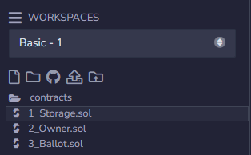

---

### 部署方式

1. 通过TS脚本去部署

   编译后点击scripts目录下的`deploy_with_ether.ts`：

   

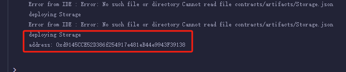

2. 选择remix中的部署按钮部署：

   

---

部署之后会可以点击按钮查看合约信息：

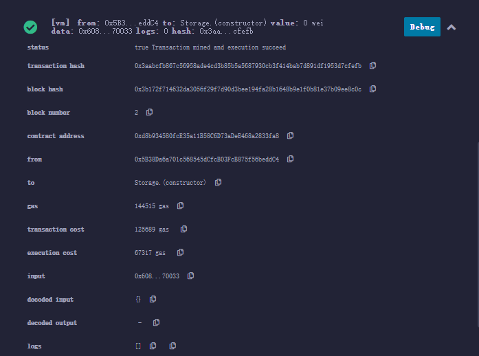

### Debug

调用store函数输入数值，并打开交易信息。复制信息中的 transaction hash 到`Debugger`按钮中的输入框进行debug：

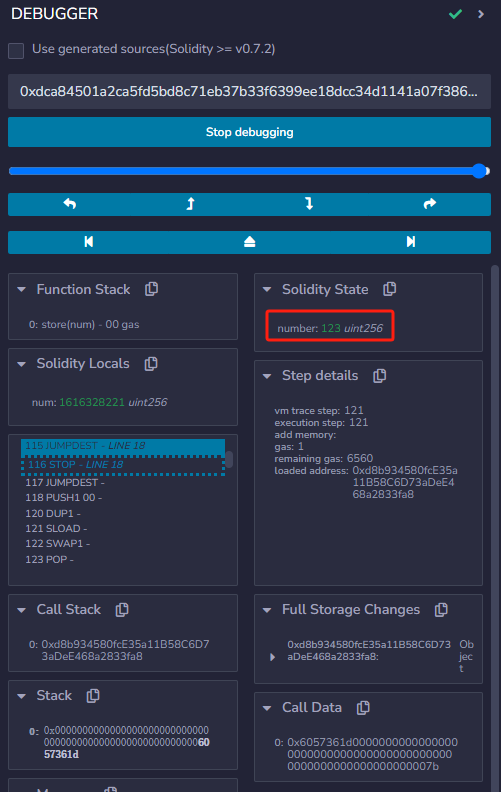

可以查看函数或者变量在运行中的状态。

---

### 测试

选择`Solidity uint testing`按钮，这是remix自带的测试目录，用户测试时需要自己去编写测试合约，Pass✔：

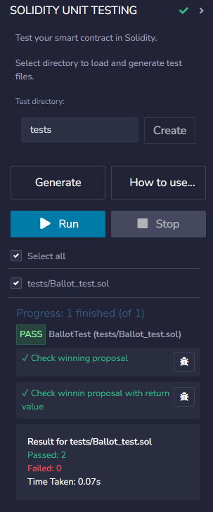

---

### Remix d

点击Remix图标回到Home主页，在Files中选择Access File System，可以使用Remixd的npm使本地文件与Remix IDE进行连接：


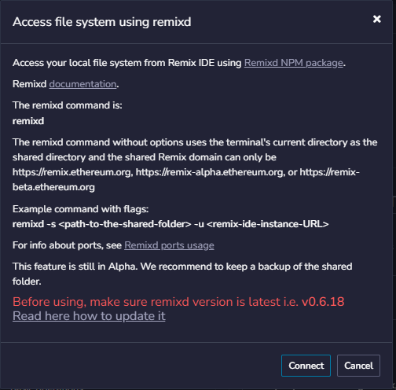

> 本地必须安装node.js

在本地目录的命令行中输入：

`remixd -s <path-to-the-shared-folder> --remix-ide <Remix IDE URL>`

即可连接本地文件，要注意在Remix IDE中修改了文件，本地文件也会更改，并且不会提示。若本地修改，Remix IDE会出现提示。

---

### USDT示例

URL：[Tether USD](https://etherscan.io/token/0xdac17f958d2ee523a2206206994597c13d831ec7#code)

复制 Contract Source Code 到Remix IDE中，连接metamask切换到以太坊主网。修改编译器版本后进行编译，选择TetherToken合约并在At Address中输入Token contract address：


即可不需要前端或者后端对合约进行交互。

---

## 五、Hardhat基本使用

Hardhat 是一个用于以太坊开发的开源开发环境。它提供了一系列工具和库，可以帮助开发者更轻松地编写、测试和部署智能合约。Hardhat 支持 Solidity 和 Vyper 两种智能合约语言，并提供了一系列插件，可以与其他工具和服务集成，例如 Truffle、Etherscan、Infura 等。

### 安装Hardhat

```shell
npm install hardhat
```

---

### Hardhat 初始化

```shell
npx hardhat init
```


根据提示步骤进行。

---

### Hardhat 任务

```shell
npx hardhat 
```

可以查看任务列表

---

### 编译

```shell
npx hardhat compile
```

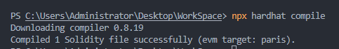

编译通过后会生成两个文件夹`artifacts`和`cache`：

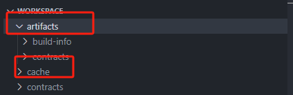

artifacts目录下的合约同名json文件中会有合约的ABI。

---

### 测试

```shell
npx hardhat test
```

可以通过`hardhat/console.sol`去打印测试状态信息

---

### 部署

```shell
npx hardhat run scripts/deploy.js
```


会将该合约部署到Hardhat的VM中

查看Hardhat VM：

```shell
npx hardhat node
```

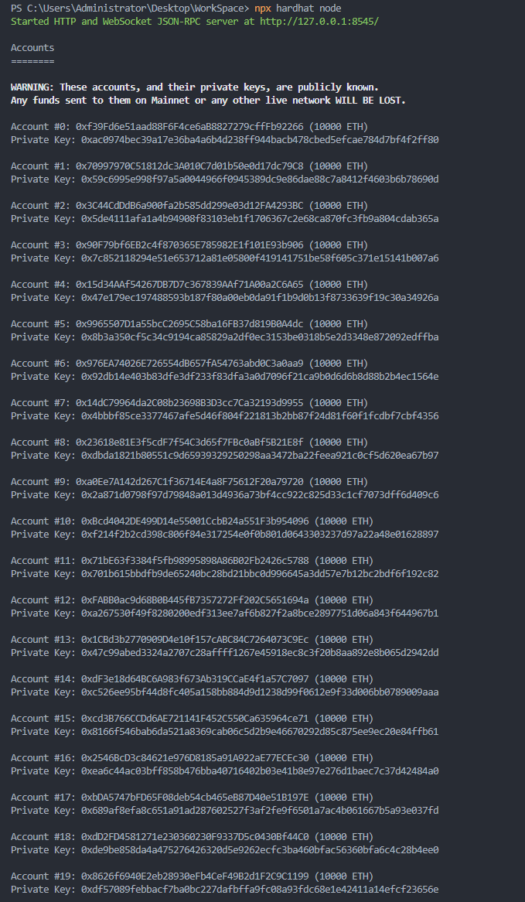

hardhat与remix连接：

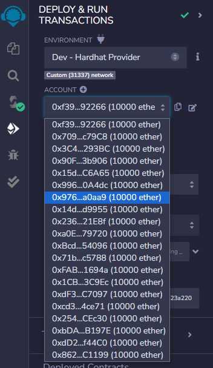

部署到测试网：

修改`hardhat.config.js`：

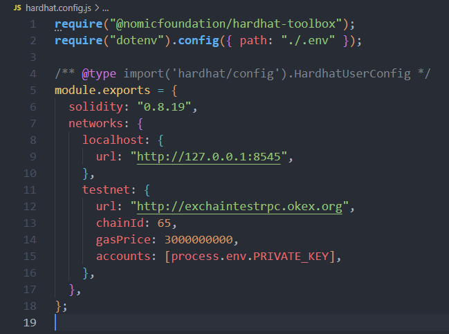

运行命令：

```shell
npx hardhat run scripts/deploy.js --network testnet
```

执行成功：


可以前往测试网浏览器查看detail

---

## 六、测试驱动开发 TDD

测试驱动开发(Test Driven Development)，是一种不同于传统软件开发流程的新型的开发方法。它要求在编写某个功能的代码之前先编写测试代码，然后只编写使测试通过的功能代码通过测试来推动整个开发的进行。这有助于编写简洁可用和高质量的代码，并加速开发过程。

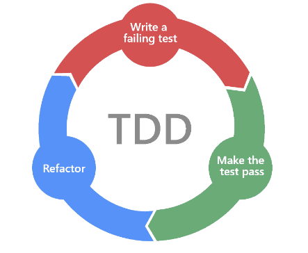

TDD流程：

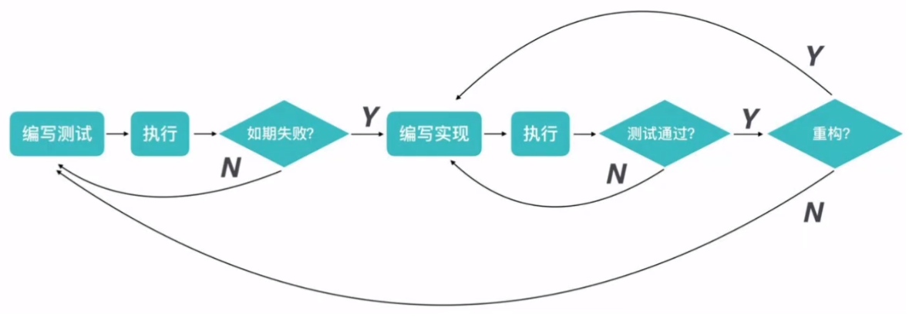

### 测试驱动开发的好处

- 降低开发者负担
- 保护网
- 提前澄清需求
- 快速反馈

---

### 实施测试驱动开发的要点

1. 分析问题并拆分：把问题分解成一个个可以操作的任务
2. 代码设计：规划、设计功能的实现

---

### 案例演示

**功能设计：**

1. 可以查看总共有多少信件
2. 当有新的信件到来时，总信件数 + 1
3. 存储信件内容并可查看
4. 存储信件发送人并可查看

JS测试代码：

```js
const { expect } = require("chai");
const { ethers } = require("hardhat");

describe("Mailbox", async () => {
	it("should get mailbox contract", async () => {
		const mailboxContract = await ethers.getContractFactory("Mailbox");
	});

	it("should get total letters in the box", async () => {
		const mailboxContract = await ethers.getContractFactory("Mailbox");
		const mailbox = await mailboxContract.deploy();

		expect(await mailbox.totalLetters()).to.equal(0);
	});

	it("should increase by one when get new letter", async () => {
		const mailboxContract = await ethers.getContractFactory("Mailbox");
		const mailbox = await mailboxContract.deploy();

		await mailbox.write("hello");
		expect(await mailbox.totalLetters()).to.equal(1);
	});

	it("should get mail contract", async () => {
		const mailboxContract = await ethers.getContractFactory("Mailbox");
		const mailbox = await mailboxContract.deploy();

		await mailbox.write("hello");
		const letters = await mailbox.read();
		expect(letters[0].letter).to.equal("hello");
	});

	it("should get mail sender", async () => {
		const mailboxContract = await ethers.getContractFactory("Mailbox");
		const mailbox = await mailboxContract.deploy();

		await mailbox.write("hello");
		const letters = await mailbox.read();
		expect(letters[0].sender).to.equal(
			"0xf39Fd6e51aad88F6F4ce6aB8827279cffFb92266"
		);
	});
});
```

合约代码：

```solidity
// SPDX-License-Identifier: MIT
pragma solidity ^0.8.19;

contract Mailbox {
    uint public totalLetters;

    struct Letter {
        string letter;
        address sender;
    }

    Letter[] private letters;

    function write(string memory letter) public {
        letters.push(Letter(letter, msg.sender));
        totalLetters++;
    }

    function read() public view returns (Letter[] memory) {
        return letters;
    }
}
```

---

## 七、详解ERC20

EIP：[eips：ERC20](https://eips.ethereum.org/EIPS/eip-20)

### 三个可选项

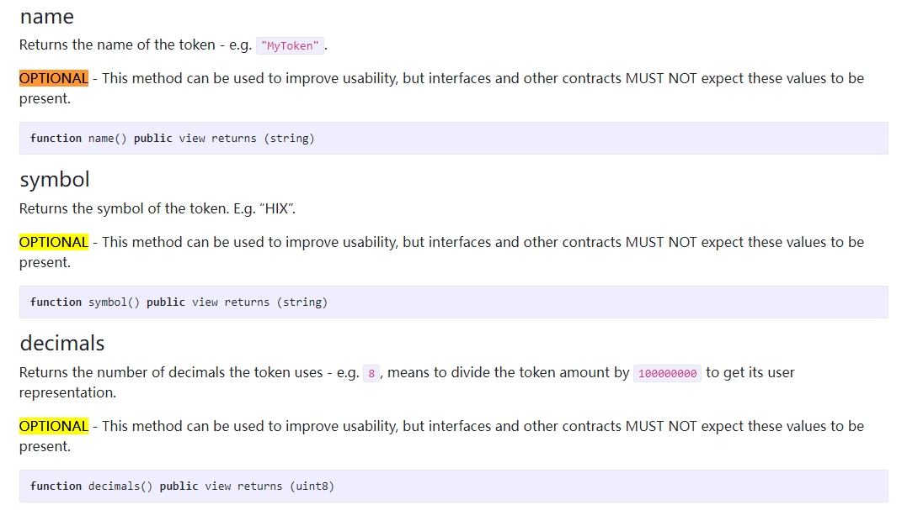

---

### 两个Event

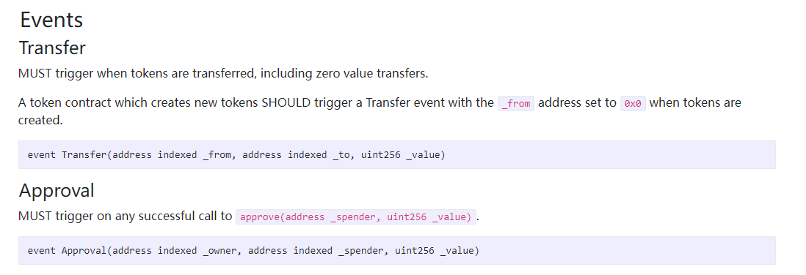

> 老师提到两个例子，第一个是可以利用Transfer事件获取所有持币者地址与余额的例子，web3.js或ethers.js有一个滑动窗口式获取历史事件的接口：getPastEvent，获取到数据之后可以统计例子所要求的信息。
>
> 第二个例子是USDT的合约transfer函数没有返回值的漏洞，可以使用SafeERC20的transfer或是取消自己的transfer函数的返回值。

---

## 八、详解ERC721

[eips：ERC721](https://eips.ethereum.org/EIPS/eip-721)

> 协议里的注释把实现逻辑写得很清楚，老师建议根据注释要能写出完整代码

**每个符合ERC-721标准的合约都必须实现ERC721和ERC165接口**

---

### CryptoKitties

CryptoKitties是一个基于以太坊区块链的虚拟猫收集游戏。在这个游戏中，玩家可以购买、出售、繁殖和收集数字化的猫咪，每只猫都有独特的基因和特征。这些猫是以非同质化代币（NFT）的形式存在于以太坊区块链上，每只猫都是独一无二的，不能被复制或替代。CryptoKitties在2017年底推出，因其独特的玩法和创新的区块链技术而受到广泛关注。它也被认为是区块链游戏的先驱之一，为后来的区块链游戏开发奠定了基础。

[CryptoKitties‘s official website](https://www.cryptokitties.co/)

---

### ERC721Metadata

ERC721Metadata对于ERC-721智能合约来说是可选的。这允许查询智能合约的名称以及NFT所代表的资产的详细信息：

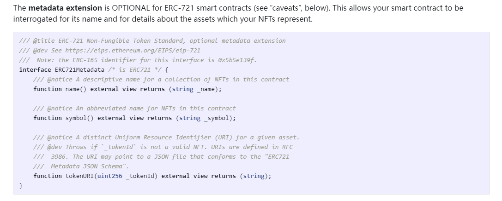

tokenURI：用于返回代表NFT元数据的URI（Uniform Resource Identifier）。这个URI可以指向一个JSON文件，其中包含有关NFT的详细信息，例如名称、描述、图像等。通过使用tokenURI函数，可以使NFT的元数据与其代币ID相关联，从而使其更易于管理和查询。

ERC721Metadata JSON 格式：

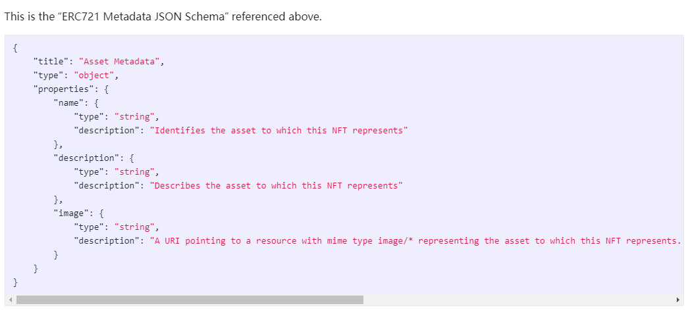

---

### ERC1155

[eips：EIP1155](https://eips.ethereum.org/EIPS/eip-1155)

ERC1155是以太坊上的一种智能合约标准，用于实现可互操作的多资产代币。它是ERC20和ERC721标准的进一步发展，旨在提供更高的灵活性和效率。

ERC1155合约可以同时管理多种不同类型的代币，每种代币都有一个唯一的标识符（ID）。这些代币可以是可替代的（fungible）或不可替代的（non-fungible），具体取决于合约的实现。与ERC20和ERC721不同，ERC1155合约允许在一次交易中同时转移多种类型的代币。这种批量转移的功能可以提高交易的效率，并减少与代币转移相关的交易费用。此外，ERC1155还支持批量查询代币余额和元数据信息，使得应用程序可以更高效地管理和展示多种类型的代币。总结来说，ERC1155是一种智能合约标准，用于实现可互操作的多资产代币，提供了更高的灵活性和效率。它允许在一次交易中同时转移多种类型的代币，并支持批量查询代币余额和元数据信息。

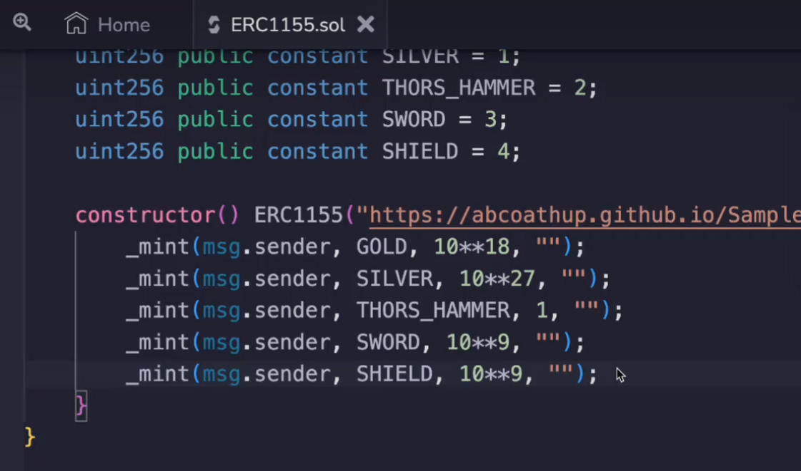

图中的THORS_HAMMER相当于ERC721代币，其他的相当于ERC20代币。

### 关于ERC721的其他应用

#### Loot

Loot的设计灵感来自传统的角色扮演游戏，但它完全在以太坊区块链上运行，使得游戏中的装备和物品具有真正的所有权和交易价值。

Loot的核心是一组生成的装备和物品，每个装备和物品都由一个唯一的ID表示。这些装备和物品的属性和特征是通过智能合约随机生成的，例如武器、护甲、戒指、项链等。每个装备和物品都是不可替代的（non-fungible），因为它们具有独特的属性和价值。Loot的玩家可以通过购买、交易或探索游戏世界来获取装备和物品。这些装备和物品可以用于创建角色、参与战斗、完成任务等。由于Loot的所有权和交易发生在以太坊区块链上，玩家可以自由地买卖、交易和转移他们的装备和物品。

官网：[LootProject](https://www.lootproject.com/)

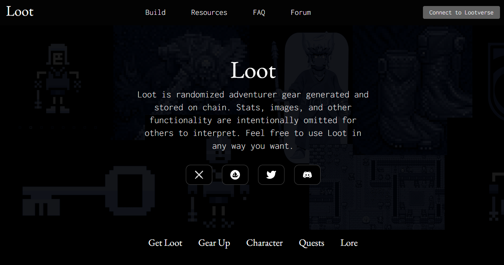

OpenSea官网的LootNFT：

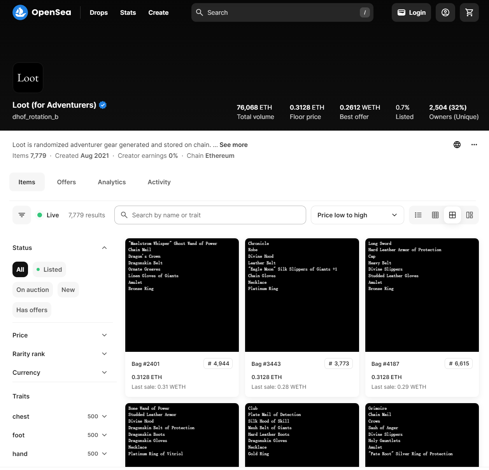

#### 图床

如果做一个NFT项目的话，需要有一个图片或者其他信息载体的托管方，如果是一个公司对于信息载体可以使用OSS等其他文件存储去托管。作为学生可以使用一些中心化的图床，比如ImgTP：

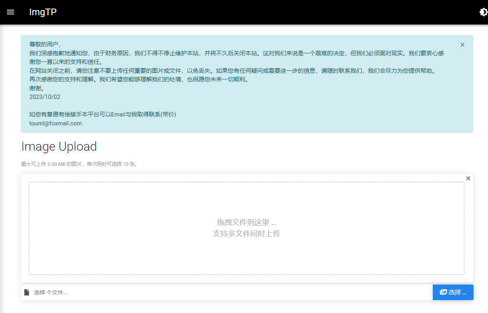

除了这些中心化的图床，还有去中心化的图床，比如IPFS图床：[ipfsscan](https://cdn.ipfsscan.io/)

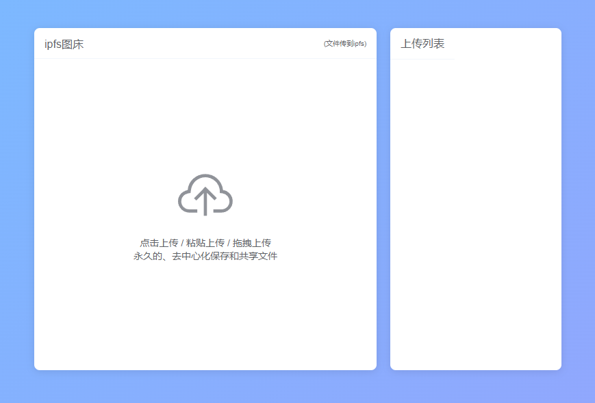

上传后将图片的URL写在json文件里，然后再将json文件的链接配置到token uri。

## 九、NFT Market 实例 - 合约部分

配置环境：回顾第五章

### 创建ERC20合约

创建`erc20-usdt.sol`：

```solidity
// SPDX-License-Identifier: MIT
pragma solidity ^0.8.20;

import "@openzeppelin/contracts/token/ERC20/ERC20.sol";

contract cUSDT is ERC20 {
    constructor() ERC20("fake USDT", "cUSDT") {
        _mint(msg.sender, 1 * 10 ** 8 * 10 ** decimals());
    }
}
```

可以通过[OpenZeppelin](https://docs.openzeppelin.com/contracts/5.x/wizard)网站中的wizard去生成合约：

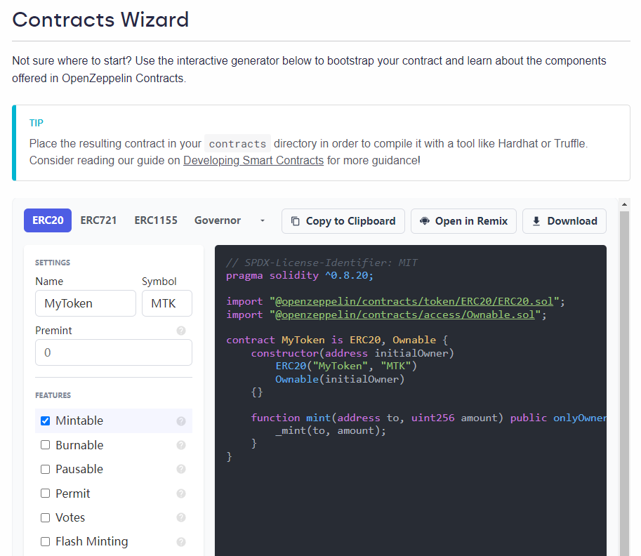

### 创建ERC721合约

创建`erc721-nft.sol`：

```solidity
// SPDX-License-Identifier: MIT
pragma solidity ^0.8.20;

import "@openzeppelin/contracts/token/ERC721/ERC721.sol";
import "@openzeppelin/contracts/token/ERC721/extensions/ERC721Enumerable.sol";
import "@openzeppelin/contracts/token/ERC721/extensions/ERC721URIStorage.sol";
import "@openzeppelin/contracts/access/Ownable.sol";

contract MyNFT is ERC721, ERC721Enumerable, ERC721URIStorage, Ownable {
    uint256 private _nextTokenId;

    constructor() ERC721("MyNFT", "NFT") Ownable(msg.sender) {}

    function safeMint(address to, string memory uri) public onlyOwner {
        uint256 tokenId = _nextTokenId++;
        _safeMint(to, tokenId);
        _setTokenURI(tokenId, uri);
    }

    // The following functions are overrides required by Solidity.

    function _update(
        address to,
        uint256 tokenId,
        address auth
    ) internal override(ERC721, ERC721Enumerable) returns (address) {
        return super._update(to, tokenId, auth);
    }

    function _increaseBalance(
        address account,
        uint128 value
    ) internal override(ERC721, ERC721Enumerable) {
        super._increaseBalance(account, value);
    }

    function tokenURI(
        uint256 tokenId
    ) public view override(ERC721, ERC721URIStorage) returns (string memory) {
        return super.tokenURI(tokenId);
    }

    function supportsInterface(
        bytes4 interfaceId
    )
        public
        view
        override(ERC721, ERC721Enumerable, ERC721URIStorage)
        returns (bool)
    {
        return super.supportsInterface(interfaceId);
    }
}
```

### 创建交易市场合约

创建`nft-market.sol`：

```solidity
// SPDX-License-Identifier: MIT

pragma solidity ^0.8.20;

import "@openzeppelin/contracts/interfaces/IERC721Receiver.sol";
import "@openzeppelin/contracts/interfaces/IERC721.sol";
import "@openzeppelin/contracts/interfaces/IERC20.sol";

/**
 * @title NFTMarket contract that allows atomic swaps of ERC20 and ERC721
 */
contract Market is IERC721Receiver {
    IERC20 public erc20;
    IERC721 public erc721;

    bytes4 internal constant MAGIC_ON_ERC721_RECEIVED = 0x150b7a02;

    struct Order {
        address seller;
        uint256 tokenId;
        uint256 price;
    }

    mapping(uint256 => Order) public orderOfId; // token id to order
    Order[] public orders;
    mapping(uint256 => uint256) public idToOrderIndex;

    event Deal(address buyer, address seller, uint256 tokenId, uint256 price);
    event NewOrder(address seller, uint256 tokenId, uint256 price);
    event CancelOrder(address seller, uint256 tokenId);
    event ChangePrice(
        address seller,
        uint256 tokenId,
        uint256 previousPrice,
        uint256 price
    );

    constructor(IERC20 _erc20, IERC721 _erc721) {
        require(
            address(_erc20) != address(0),
            "Market: IERC20 contract address must be non-null"
        );
        require(
            address(_erc721) != address(0),
            "Market: IERC721 contract address must be non-null"
        );
        erc20 = _erc20;
        erc721 = _erc721;
    }

    function buy(uint256 _tokenId) external {
        require(isListed(_tokenId), "Market: Token ID is not listed");

        address seller = orderOfId[_tokenId].seller;
        address buyer = msg.sender;
        uint256 price = orderOfId[_tokenId].price;

        require(
            erc20.transferFrom(buyer, seller, price),
            "Market: ERC20 transfer not successful"
        );
        erc721.safeTransferFrom(address(this), buyer, _tokenId);
        removeListing(_tokenId);

        emit Deal(buyer, seller, _tokenId, price);
    }

    function cancelOrder(uint256 _tokenId) external {
        require(isListed(_tokenId), "Market: Token ID is not listed");

        address seller = orderOfId[_tokenId].seller;
        require(seller == msg.sender, "Market: Sender is not seller");

        erc721.safeTransferFrom(address(this), seller, _tokenId);
        removeListing(_tokenId);

        emit CancelOrder(seller, _tokenId);
    }

    function changePrice(uint256 _tokenId, uint256 _price) external {
        require(isListed(_tokenId), "Market: Token ID is not listed");
        address seller = orderOfId[_tokenId].seller;
        require(seller == msg.sender, "Market: Sender is not seller");

        uint256 previousPrice = orderOfId[_tokenId].price;
        orderOfId[_tokenId].price = _price;
        Order storage order = orders[idToOrderIndex[_tokenId]];
        order.price = _price;

        emit ChangePrice(seller, _tokenId, previousPrice, _price);
    }

    function getAllNFTs() public view returns (Order[] memory) {
        return orders;
    }

    function getMyNFTs() public view returns (Order[] memory) {
        Order[] memory myOrders = new Order[](orders.length);
        uint256 myOrdersCount = 0;

        for (uint256 i = 0; i < orders.length; i++) {
            if (orders[i].seller == msg.sender) {
                myOrders[myOrdersCount] = orders[i];
                myOrdersCount++;
            }
        }

        Order[] memory myOrdersTrimmed = new Order[](myOrdersCount);
        for (uint256 i = 0; i < myOrdersCount; i++) {
            myOrdersTrimmed[i] = myOrders[i];
        }

        return myOrdersTrimmed;
    }

    function isListed(uint256 _tokenId) public view returns (bool) {
        return orderOfId[_tokenId].seller != address(0);
    }

    function getOrderLength() public view returns (uint256) {
        return orders.length;
    }

    /**
     * @dev List a good using a ERC721 receiver hook
     * @param _operator the caller of this function
     * @param _seller the good seller
     * @param _tokenId the good id to list
     * @param _data contains the pricing data as the first 32 bytes
     */
    function onERC721Received(
        address _operator,
        address _seller,
        uint256 _tokenId,
        bytes calldata _data
    ) public override returns (bytes4) {
        require(_operator == _seller, "Market: Seller must be operator");
        uint256 _price = toUint256(_data, 0);
        placeOrder(_seller, _tokenId, _price);

        return MAGIC_ON_ERC721_RECEIVED;
    }

    // https://stackoverflow.com/questions/63252057/how-to-use-bytestouint-function-in-solidity-the-one-with-assembly
    function toUint256(
        bytes memory _bytes,
        uint256 _start
    ) public pure returns (uint256) {
        require(_start + 32 >= _start, "Market: toUint256_overflow");
        require(_bytes.length >= _start + 32, "Market: toUint256_outOfBounds");
        uint256 tempUint;

        assembly {
            tempUint := mload(add(add(_bytes, 0x20), _start))
        }

        return tempUint;
    }

    function placeOrder(
        address _seller,
        uint256 _tokenId,
        uint256 _price
    ) internal {
        require(_price > 0, "Market: Price must be greater than zero");

        orderOfId[_tokenId].seller = _seller;
        orderOfId[_tokenId].price = _price;
        orderOfId[_tokenId].tokenId = _tokenId;

        orders.push(orderOfId[_tokenId]);
        idToOrderIndex[_tokenId] = orders.length - 1;

        emit NewOrder(_seller, _tokenId, _price);
    }

    function removeListing(uint256 _tokenId) internal {
        delete orderOfId[_tokenId];

        uint256 orderToRemoveIndex = idToOrderIndex[_tokenId];
        uint256 lastOrderIndex = orders.length - 1;

        if (lastOrderIndex != orderToRemoveIndex) {
            Order memory lastOrder = orders[lastOrderIndex];
            orders[orderToRemoveIndex] = lastOrder;
            idToOrderIndex[lastOrder.tokenId] = orderToRemoveIndex;
        }

        orders.pop();
    }
}
```

> remixd工具的使用和remix环境的具体交互查看老师的视频

### 测试合约

在`test`目录下创建`market.js`文件：

```js
const { expect } = require("chai");
const { ethers } = require("hardhat");

describe("Market", function () {
	let usdt, market, myNft, account1, account2;
	let baseURI = "https://sameple.com/";

	beforeEach(async () => {
		[account1, account2] = await ethers.getSigners();
		// const MAX_ALLOWANCE = BigNumber.from(2).pow(256).sub(1);
		const USDT = await ethers.getContractFactory("cUSDT");
		usdt = await USDT.deploy();
		const MyNFT = await ethers.getContractFactory("MyNFT");
		myNft = await MyNFT.deploy();
		const Market = await ethers.getContractFactory("Market");
		market = await Market.deploy(usdt.target, myNft.target);

		await myNft.safeMint(account1.address, baseURI + "0");
		await myNft.safeMint(account1.address, baseURI + "1");
		await myNft.approve(market.target, 0);
		await myNft.approve(market.target, 1);
		await usdt.transfer(account2.address, "10000000000000000000000");
		await usdt
			.connect(account2)
			.approve(market.target, "1000000000000000000000000");
	});

	it("its erc20 address should be usdt", async function () {
		expect(await market.erc20()).to.equal(usdt.target);
	});

	it("its erc721 address should be myNft", async function () {
		expect(await market.erc721()).to.equal(myNft.target);
	});

	it("account1 should have 2 nfts", async function () {
		expect(await myNft.balanceOf(account1.address)).to.equal(2);
	});

	it("account2 should have 10000 USDT", async function () {
		expect(await usdt.balanceOf(account2.address)).to.equal(
			"10000000000000000000000"
		);
	});

	it("account2 should have 0 nfts", async function () {
		expect(await myNft.balanceOf(account2.address)).to.equal(0);
	});

	it("account1 can list two nfts to market", async function () {
		const price =
			"0x0000000000000000000000000000000000000000000000000001c6bf52634000";
		// let price = "0x0100"
		expect(
			await myNft["safeTransferFrom(address,address,uint256,bytes)"](
				account1.address,
				market.target,
				0,
				price
			)
		).to.emit(market, "NewOrder");
		expect(
			await myNft["safeTransferFrom(address,address,uint256,bytes)"](
				account1.address,
				market.target,
				1,
				price
			)
		).to.emit(market, "NewOrder");

		expect(await myNft.balanceOf(account1.address)).to.equal(0);
		expect(await myNft.balanceOf(market.target)).to.equal(2);
		expect(await market.isListed(0)).to.equal(true);
		expect(await market.isListed(1)).to.equal(true);

		expect((await market.getAllNFTs())[0][0]).to.equal(account1.address);
		expect((await market.getAllNFTs())[0][1]).to.equal(0);
		expect((await market.getAllNFTs())[0][2]).to.equal(price);
		expect((await market.getAllNFTs())[1][0]).to.equal(account1.address);
		expect((await market.getAllNFTs())[1][1]).to.equal(1);
		expect((await market.getAllNFTs())[1][2]).to.equal(price);
		expect(await market.getOrderLength()).to.equal(2);

		expect((await market.getMyNFTs())[0][0]).to.equal(account1.address);
		expect((await market.getMyNFTs())[0][1]).to.equal(0);
		expect((await market.getMyNFTs())[0][2]).to.equal(price);
	});

	it("account1 can unlist one nft from market", async function () {
		const price =
			"0x0000000000000000000000000000000000000000000000000001c6bf52634000";
		// let price = "0x0100"
		expect(
			await myNft["safeTransferFrom(address,address,uint256,bytes)"](
				account1.address,
				market.target,
				0,
				price
			)
		).to.emit(market, "NewOrder");
		expect(
			await myNft["safeTransferFrom(address,address,uint256,bytes)"](
				account1.address,
				market.target,
				1,
				price
			)
		).to.emit(market, "NewOrder");

		expect(await market.cancelOrder(0)).to.emit(market, "CancelOrder");
		expect(await market.getOrderLength()).to.equal(1);
		expect(await market.isListed(0)).to.equal(false);
		expect((await market.getMyNFTs()).length).to.equal(1);
	});

	it("account1 can change price of nft from market", async function () {
		const price =
			"0x0000000000000000000000000000000000000000000000000001c6bf52634000";
		expect(
			await myNft["safeTransferFrom(address,address,uint256,bytes)"](
				account1.address,
				market.target,
				0,
				price
			)
		).to.emit(market, "NewOrder");
		expect(
			await myNft["safeTransferFrom(address,address,uint256,bytes)"](
				account1.address,
				market.target,
				1,
				price
			)
		).to.emit(market, "NewOrder");

		expect(await market.changePrice(1, "10000000000000000000000")).to.emit(
			market,
			"ChangePrice"
		);
		expect((await market.getMyNFTs()).length).to.equal(2);
		expect((await market.getMyNFTs())[1][2]).to.equal(
			"10000000000000000000000"
		);
	});

	it("account2 can buy nft from market", async function () {
		const price =
			"0x0000000000000000000000000000000000000000000000000001c6bf52634000";
		expect(
			await myNft["safeTransferFrom(address,address,uint256,bytes)"](
				account1.address,
				market.target,
				0,
				price
			)
		).to.emit(market, "NewOrder");
		expect(
			await myNft["safeTransferFrom(address,address,uint256,bytes)"](
				account1.address,
				market.target,
				1,
				price
			)
		).to.emit(market, "NewOrder");

		expect(await market.connect(account2).buy(1)).to.emit(market, "Deal");

		expect(await market.getOrderLength()).to.equal(1);
		expect(await usdt.balanceOf(account1.address)).to.equal(
			"99990000000500000000000000"
		);
		expect(await usdt.balanceOf(account2.address)).to.equal(
			"9999999500000000000000"
		);
		expect(await myNft.ownerOf(1)).to.equal(account2.address);
	});
});

```

> 这里建议看视频跟着老师一步一步去理解如何测试代码

查看测试结果在命令行输入：

```shell
npx hardhat test
```

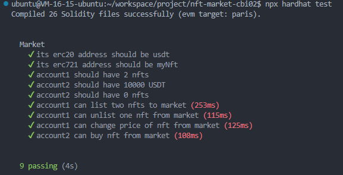

查看测试代码覆盖率以及测试结果在命令行输入：

```shell
npx hardhat coverage
```

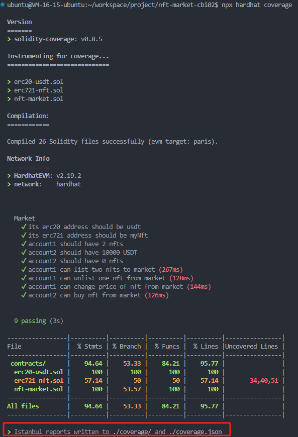

### 两个技巧

#### hardhat-abi-exporter

项目开发过程中，其他同事可能会需要abi的json文件，代码具体位置：

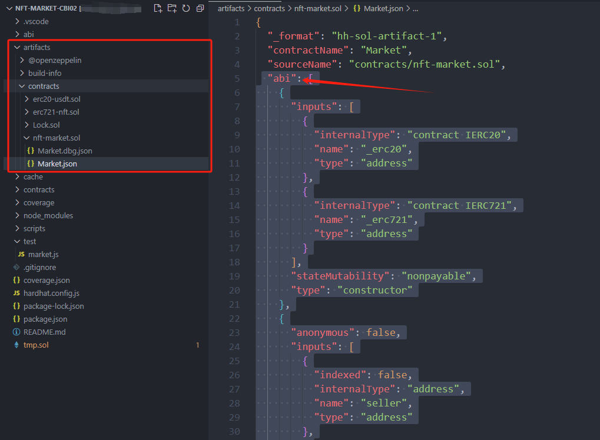

但是每次选取可能有点麻烦，老师这里推荐了`hardhat-abi-exporter`，这个附件可以指定目录生成相应合约的abi的json文件。

**如何使用：**

1. 命令行运行：`npm install hardhat-abi-exporter --save`，打开package.json会出现相应的版本信息即安装成功：
   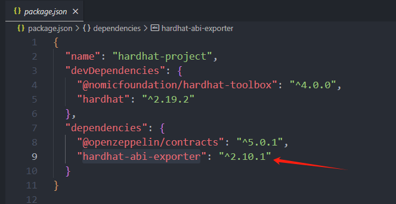：
2. 打开`hardhat.config.js`文件，添加如下两个部分：
   
3. 在命令行输入：`npx hardhat export-abi --no-compile`，即可当前目录下生成`abi`目录，目录下包括了项目的所有所需要的abi文件：
   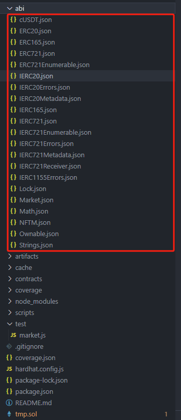

#### hardhat flatten命令

使用`npx hardhat flatten > tmp.sol`命令可以将项目中的合约扁平化为一个合约文件：

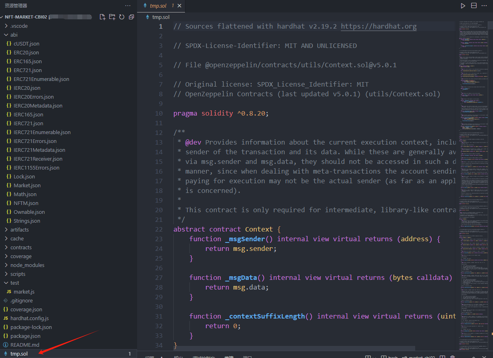

#### Linux的history命令使用小技巧

如上面寻找abi命令的例子，在命令行中输入：`history | grep abi`，即可显示最近使用了abi这个关键字的所有命令：

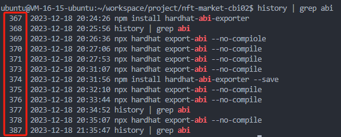

下次想使用某个命令时，可以记住红框中标记的代号，直接在命令行中输入：`!代号码`，即可便捷使用这个命令。

## 十、NFT Market 实例 - 后端部分

### JS学习资料

[ES6 入门教程](https://es6.ruanyifeng.com/)

[现代 JavaScript 教程](https://zh.javascript.info/)

### Node.js

官网：[Node](https://nodejs.org/en/about)

Node.js是一个基于Chrome V8 JavaScript引擎的开源、跨平台的运行时环境。它允许开发者使用JavaScript语言在服务器端运行代码，构建高性能的网络应用程序。

Node.js的特点包括：

1. 异步非阻塞I/O模型：Node.js使用事件驱动和非阻塞I/O模型，使得它能够处理大量并发请求，提供高性能和可扩展性。
2. 单线程：Node.js使用单线程模型，但通过事件循环机制实现了并发处理。这意味着开发者可以使用相对简单的代码编写高性能的应用程序。
3. 跨平台：Node.js可以在多个操作系统上运行，包括Windows、macOS和Linux等。
4. 丰富的模块生态系统：Node.js拥有庞大的模块生态系统，开发者可以使用npm（Node包管理器）轻松地安装、管理和共享代码库。

Node.js广泛应用于构建Web服务器、API服务器、实时应用程序、命令行工具等。它已经成为现代Web开发中的重要工具之一，为开发者提供了快速、高效的开发环境。

#### npm

npm是Node Package Manager的缩写，是一个用于管理和共享JavaScript代码的包管理器。它是Node.js的默认包管理器，允许开发者在项目中安装、更新、卸载和共享代码包。通过npm，开发者可以轻松地引入第三方库、框架和工具，以加快开发速度并提高代码的可重用性。npm还提供了一些命令行工具，用于管理项目依赖、运行脚本和发布自己的代码包。

官网：[npmjs](https://www.npmjs.com)

#### Express框架

Express是一个流行的Node.js Web应用程序框架，它简化了构建Web应用程序和API的过程。它提供了一组强大的功能和工具，使开发者能够快速创建可靠和可扩展的服务器端应用程序。

Express具有以下特点：

1. 轻量级：Express是一个轻量级的框架，它提供了基本的Web应用程序功能，同时保持了灵活性和可扩展性。
2. 路由：Express使用路由来定义不同URL路径的处理程序。开发者可以定义多个路由，每个路由对应不同的URL路径，并指定处理该路径的函数。
3. 中间件：Express使用中间件来处理请求和响应。中间件是一个函数，可以在请求到达路由处理程序之前或之后执行一些操作，例如身份验证、日志记录、错误处理等。
4. 模板引擎：Express支持多种模板引擎，例如EJS、Handlebars和Pug，使开发者能够动态生成HTML页面。
5. 静态文件服务：Express可以轻松地提供静态文件，例如CSS、JavaScript和图像文件。
6. 扩展性：Express具有丰富的插件生态系统，开发者可以使用各种插件来扩展框架的功能。

通过使用Express，开发者可以更快速地构建Web应用程序，并且具有更好的可维护性和可扩展性。

[Express.js](https://www.npmjs.com/package/express)：

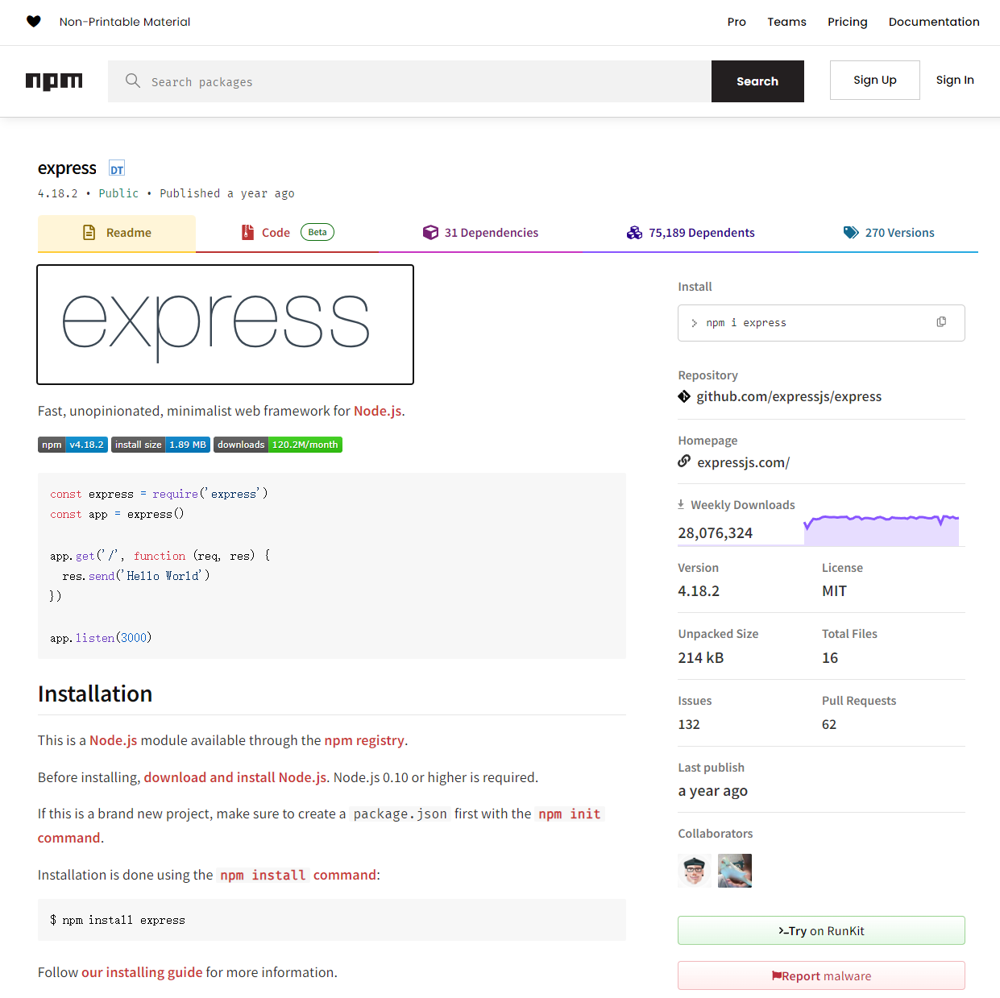

### 编写一个简单的服务端

> 写代码的具体逻辑过程看老师视频

```js
// app.js
const express = require("express");
const app = express();

const hostname = "127.0.0.1";
const port = 3000;

const products = [
	{
		name: "Telecision",
		price: 2000,
		brand: "Apple",
	},
	{
		name: "Laptop",
		price: 3000,
		brand: "Dell",
	},
];

// 静态模板，使用pug附件
app.set("view engine", "pug");
app.set("views", "./views");

// 中间件
const requestUrlLogger = (req, res, next) => {
	console.log("Request URL:", req.url);
	next();
};

// 使用中间件
app.use(requestUrlLogger);
app.use(express.json());

// 路由
app.get("/", (req, res) => {
	res.send("Hello World!");
});

app.get("/products/:brand", (req, res) => {
	const brand = req.params.brand;
	console.log(brand);
	const filteredProducts = products.filter(
		(product) => product.brand === brand
	);
	res.send(filteredProducts);
});

app.post("/products", (req, res) => {
	const name = req.body.name;
	const price = req.body.price;
	const brand = req.body.brand;

	products.push({
		name: name,
		price: price,
		brand: brand,
	});

	res.json({
		message: "Successfully added!",
		product: {
			name: name,
			price: price,
			brand: brand,
		},
	});
});

app.get("/home", (req, res) => {
	res.render("home", {
		title: "Home Page",
		message: "Hello World!",
	});
});

app.listen(port);
console.log(`Server running at http://${hostname}:${port}/`);
```

home.pug：

```pug
html 
head
title= title 
body 
h1= message
div 
p Welcome to #{title}
```

目录结构：

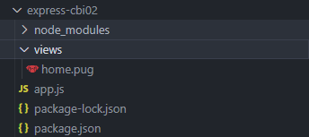

#### pug

Pug（以前称为Jade）是一种模板引擎，用于简化HTML代码的编写。它采用了简洁的语法和缩进风格，使得编写和阅读模板更加简单和易于维护。Pug模板文件中的内容描述了生成HTML的结构和内容。它使用缩进来表示嵌套关系，并使用特定的语法来定义标签、属性和文本内容。

#### nodemon

它是一个用于监视文件变化并自动重新启动应用程序的工具，特别适用于开发Node.js应用程序。通常，在开发过程中，每次修改代码后都需要手动重新启动应用程序才能看到更改的效果。而使用 `nodemon`，它会监视指定的文件或文件夹，并在文件发生变化时自动重新启动应用程序，从而节省了手动重启的时间和精力。

使用`npm install --save-dev nodemon`命令安装，安装好后使用`nodemon xxx.js`即可开启监听：

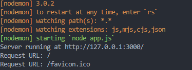

> 这里可能会出现nodemon命令无法识别的情况，可以使用路径去调用nodemon.js去进行监听，也可以使用`npx nodemon xxx.js`命令去进行监听。

### IPFS

IPFS（InterPlanetary File System）是一种分布式的点对点文件系统，旨在创建一个全球性的、去中心化的存储和共享文件的网络协议。其设计目标是解决传统的基于位置的文件系统的一些问题，例如依赖特定服务器的中心化存储、数据冗余和可用性等。它采用了一种称为 MerkleDag 的数据结构，通过对文件内容进行哈希和加密，将文件映射到唯一的标识符，从而实现内容寻址。

在 IPFS 中，文件被分割成小块，并使用唯一的哈希值进行标识。这些文件块可以存储在网络中的任何节点上，而不是集中在特定的服务器上。当用户请求一个文件时，IPFS 使用哈希值来查找和获取文件块，从而实现高效的文件传输和共享。IPFS 还具有版本控制、文件完整性验证和加密等功能。它提供了一个去中心化的文件系统，使得文件可以在网络中被安全地存储、共享和访问，而不依赖于特定的服务器或中心化的存储提供者。IPFS 的目标是构建一个更加开放、自由和可靠的互联网基础设施，为用户提供更好的数据控制权和去中心化的数据交换方式。它被广泛应用于分布式应用程序、区块链和去中心化的存储解决方案中。

