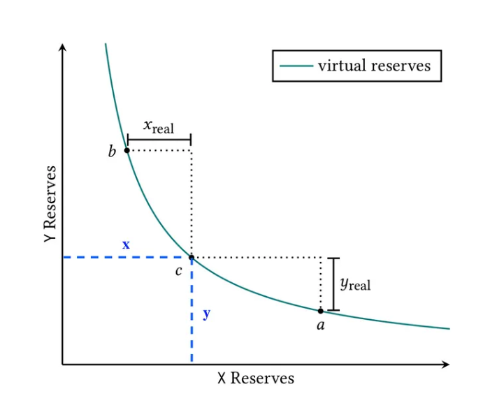
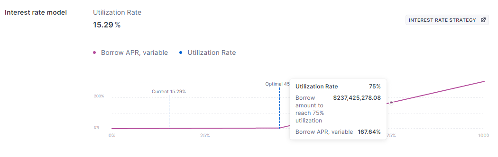

# Defi

> **提示：看笔记不容易理解，建议先观看课程视频，这样记忆会更深刻，笔记是配合视频学习的。另外老师会提到很多案例还有建议，这些都很重要，本文档只用于记录知识点。**
>
> **url：[梁培利：去中心化金融原理](https://www.bilibili.com/video/BV19x4y1w7aj/?spm_id_from=333.999.0.0&vd_source=ea18e3c33199d1462f65aa17d9d163b1)**

## 一、简介

金融的定义：货币或财务资产的创造、管理和投资的过程。

### CeFi：中心化金融

特点：

- 账户管理
- 交易审查
- 手续费作为利润来源
- 监管管理
- 不透明
- 基于信任

---

### DeFi：去中心化金融

#### DeFi VS CeFi

1. 账户创建：不需要KYC等验证信息，地址可以随意创建。
2. 业务流程透明：开源的智能合约，任何人都可以验证与审核。
3. 资金监管问题：相对于传统金融而言，其监管特别少。

#### DeFi的优势

1. 效率高：若涉及到第三方的协作，DeFi通过智能合约管理，相比现实生活中效率高得多。
2. 开源：合约代码任何人都可以验证。
3. 可编程性：有很多的DeFi产品，可以当作DeFi的组件。

## 二、稳定币

### 货币的功能

1. 价值存储
2. 计价单位
3. 交换媒介
4. 延期支付

---

### 中本聪的愿景不能实现的原因

- 手续费以及交易时间

- 网络承载量
- 价格波动

因为这些原因，区块链就产生了稳定币的需求。

---

### 稳定币市值排名


### 稳定币的分类

1. 法币为抵押的稳定币
2. 以加密货币作为抵押的稳定币
3. 部分抵押或者基于算法的稳定币

---

### USDT

**USDT的运作：**

1. 用户经过**KYC**之后将钱充到泰达公司（**中心化**）
2. 泰达公司根据用户充值的数量给用户的地址发送USDT
3. 用户可以使用USDT参加DeFi的项目以及交易等活动
4. 当用户想要离场时，将USDT转回到泰达公司的链上地址
5. 泰达公司在链上销毁这些USDT，并且把法币转回到银行账户

**USDT的盈利来源：**

- 手续费
- 投资
- 放贷

**USDT的缺点：**

中心化，智能合约中Owner可以将资产用户拉黑、资产清零。

---

### USDC

USDC 和 USDT 都是加密货币稳定币，它们的主要区别在于发行机构、背书机制和监管合规性等方面。USDC 更加透明和受监管，而 USDT 的监管合规性存在一定的争议。


---

### BUSD

**BUSD是Paxos发行的美元稳定币：**

- 受纽约金融服务局NYFSD的监管
- 使用Binance的品牌
- 可以 1:1 购买和赎回
- 100%的美元或者美元现金等价物支撑
- 仅发在以太坊上面（ERC20）

**Paxos监管风波：**

根据美国金融监管机构的规定，任何提供金融服务的公司都需要获得相应的许可和授权。然而，Paxos 公司被指控未经授权地向客户提供了一些金融服务，这引起了监管机构的关注。监管机构对 Paxos 公司进行了调查，并要求其停止违规行为并支付罚款。

Paxos 公司在接受调查后，承认了自己的错误，并表示将采取措施改进自己的业务和合规性。该公司还表示，将与监管机构合作，确保自己的业务符合监管要求，并保护客户的利益。

---

### DAI

- 基于加密资产超额抵押
- 由MakerDAO提出方案并研发上线
- 按照 1:1 的价值锚定美元

**DAI 的生成：**

1. 用户创建一个Vault（Vault 的基本原理是将资产存储在一个智能合约中，并使用一组规则来管理资产的存储和提取），然后充值一定数量的抵押品
2. Vault的所有者就可以生成一笔交易，在交易中确定想要生成的DAI的数量
3. 取回自己的抵押资产：DAI+Stability Fee（利息，最后会置入`Maker Buffer`中）

假设一个ETH的价格为1500美金，至少需要抵押150%的DAI的价值，则用户用十个ETH最多可以抵押10000个DAI。但由于以太坊价格有波动，所以能取走的DAI基本少于这个比例的最大限度（留有余地，不至于被触发清算）。当想要取回抵押资产时，需要还清所生成的 DAI。可以向智能合约发送一笔交易，指定要还款的 DAI 数量和抵押的资产数量。智能合约将会解锁您的抵押资产，并销毁相应数量的 DAI。

> 若ETH升值，用户可以collateral to debt，按照一个安全的比例再去提取相应升值数量的DAI。
>
> 若ETH降值，DAI系统里的keeper会随时监控各种vault，如果触发红线，keeper会自动对资产进行拍卖（Collateral Auction）。拍卖的诉求为DAI+Stability Fee+Penalty Fee，这个 Penalty Fee 即惩罚费用，因为用户没有及时关注Vault进行补仓。

**四种清算：**

- Collateral Auction：当抵押资产的价值低于借贷额度时，系统会启动 Collateral Auction。在 Collateral Auction 中，抵押资产将被拍卖，以获取足够的 DAI 来还清借款。如果拍卖所得的 DAI 足以还清借款，则拍卖结束，否则将启动 Debt Auction。
- Debt Auction：在 Debt Auction 中，MKR 持有者可以使用 MKR 代币来购买未偿还的债务。如果 Debt Auction 所得的 MKR 足以还清借款，则拍卖结束，否则将启动 Surplus Auction。
- Surplus Auction：在 Surplus Auction 中，MKR 持有者可以使用 DAI 来购买 MKR 代币。这有助于减少系统中的 DAI 数量，以维持 DAI 的稳定性。
- Global Settlement：全局清算，存在严重问题时，例如黑客攻击、智能合约漏洞等，系统管理员可以启动 Global Settlement以保证用户资产的安全。

**MKR：**

一种治理代币，作用是用于 MakerDAO 系统的治理和稳定费用支付。MKR 持有者将MKR锁定在DAO合约中后可以参与系统的治理，例如投票决定系统参数、修改智能合约等。此外，MKR 持有者还需要支付一定数量的 MKR 代币作为稳定费用，以维持 DAI 的稳定性，**Maker Buffer中的资产会用于购买MKR代币并销毁**。

- 增加新的抵押品
- 修改抵押品的相关参数
- 修改 DSR
- 选择预言机
- 触发紧急停机
- 升级系统

**Risk Parameters：**

- Debt Ceiling：MakerDAO 系统中的一个参数，它规定了系统中可以生成的 DAI 的最大数量。
- Stability Fee：借款人需要支付的利息。
- Liquidation Ratio：抵押资产的价值与借款额度的比率。当抵押资产的价值低于清算比率时，系统会启动清算流程，例如老师上课所讲到的例子中的150%。
- Liquidation Penalty：清算流程中的惩罚比率。当抵押资产被清算时，借款人需要支付一定数量的惩罚费用，以弥补系统的损失。
- Collateral Auction Duration：抵押资产拍卖的持续时间。在抵押资产被清算后，系统会启动抵押资产拍卖流程，以获取足够的 DAI 来还清借款。
- Auction Bid Duration：拍卖出价的持续时间。在抵押资产拍卖流程中，MKR 持有者可以使用 DAI 或 MKR 代币来参与拍卖。
- Auction Step Size：拍卖出价的步长。在抵押资产拍卖流程中，MKR 持有者需要逐步提高出价，直到拍卖结束。

**MKR的激励机制：**

如果系统稳定，系统会用超出Maker Buffer中的部分资产来进行回购销毁MKR代币，那么MKR代币的价值会越来越高。如果系统不稳定，出现债务清算不完等问题，系统则会分发MKR代币导致MKR代币的价值变低。

**DSR：**

DSR 是 MakerDAO 系统中的一个参数，它是 DAI 存款利率（DAI Savings Rate）的缩写。在 MakerDAO 系统中，用户可以将 DAI 存入 DSR 合约中，以获得一定数量的利息。DSR 的数量取决于系统中的借贷规模和稳定性，通常在 0% 到 8% 之间。DSR 的利息是由 MKR 持有者通过 DAO 投票来决定的，它直接影响着用户的收益和系统的稳定性。如果 DSR 设置过高，系统可能会过度吸引 DAI 存款，导致系统的稳定性受到威胁。如果 DSR 设置过低，用户可能会选择将 DAI 存入其他收益更高的平台，导致系统的使用率下降。

---

## 三、AMM（Auto Market Maker）

### Uniswap

**发展史：**

- 2017年6月，Vitalik 发布文章 On Path Independence
- 2018年11月，Uniswap V1 发布，支持ETH和另一种Token之间进行交易
- 2020年3月，Uniswap V2 发布，支持任意两种Token进行交易
- 2021年5月，Uniswap V3 发布，提高LP资金利用率

---

### Uniswap的核心

**Automated Market Maker**：

自动做市商，是一种去中心化交易模型，它使用算法来自动设置资产价格和提供流动性。在传统的交易市场中，做市商通常是指那些提供买卖双方之间的流动性的交易商。而在去中心化交易市场中，由于缺乏中心化的交易所，因此需要一种新的交易模型来提供流动性。在 AMM 模型中，交易是通过智能合约进行的，而不是通过中心化的交易所进行的。AMM 模型使用一种称为 `Constant Product Market Maker` 的算法来计算资产价格和提供流动性。该算法基于一个简单的公式：x * y = k，其中 x 和 y 分别表示两种资产的数量，k 是一个常数。当一种资产的数量增加时，另一种资产的数量会相应地减少，以保持公式的平衡。

**Market Maker：**

做市商，是指在金融市场中提供流动性的交易商。做市商通常会同时提供买入和卖出的报价，以便买方和卖方可以在需要时快速进行交易。做市商通常会在市场上持有大量的资产，以便在需要时快速进行交易。在传统的金融市场中，做市商通常是由大型金融机构或专业交易商提供的。做市商通常会收取一定的交易费用，以作为提供流动性的回报。做市商的存在可以提高市场的流动性和交易效率，从而促进市场的发展。

**Liquidity：**

在加密货币市场中，由于加密货币市场的波动性较大，因此流动性可以帮助买方和卖方快速进行交易，从而减少市场波动性。流动性通常由做市商提供，他们会在市场上提供买入和卖出的报价，以便买方和卖方可以快速进行交易。

**Liquidity Provider：**

由于 DeFi 市场通常是去中心化的，因此流动性通常由流动性提供者提供。流动性提供者可以将资产存入智能合约中，以提供流动性。在 DeFi 市场中，流动性提供者通常会获得一定数量的奖励，以作为提供流动性的回报。

---

### **去中心化交易所的核心要素**

- 任何人都可以添加流动性，成为LP，并拿到LP Token
- LP在任意时间内都可以移除流动性并销毁LP Token，拿回自己的Token
- 用户可以基于交易池来进行交易
- 交易时收取一定的手续费，并分配给LP

---

### Constant Product Automated Market Maker

- 交易：`x * y =（x + dx) * (y - dy) = k`
- 添加流动性：添加流动性和移除流动性是指向交易对中添加或移除资产流动性的过程。在 CPAMM 模型中，交易对由两种资产组成，例如 ETH 和 DAI。当用户向交易对中添加资产流动性时，他们需要将两种资产的数量存入智能合约中。例如，如果用户想要向 ETH/DAI 交易对中添加流动性，他们需要将一定数量的 ETH 和 DAI 存入智能合约中。当其他用户进行交易时，他们需要支付一定数量的交易费用，这些费用将被分配给提供流动性的用户。因此，提供流动性的用户可以获得交易费用作为收益。
- 移除流动性：当用户想要从交易对中取出资产流动性时，他们需要将存入智能合约中的两种资产的数量取出。取出的资产数量将根据用户在交易对中提供的流动性比例进行计算。例如，如果用户在 ETH/DAI 交易对中提供了 50% 的流动性，那么他们可以从智能合约中取出 50% 的 ETH 和 DAI。


**公式推演：**

1. 交换：

   由`x * y = （x + dx) * (y - dy)`**得到`dy = (y * dx) / (x + dx)`**

2. 添加流动性：

   流动添加后得到 x + dx 与 y + dy ，但价格不变，即`x / y = (x + dx) / (y + dy)`，**推导后得到`x / y = dx / dy`**。也就是说，添加之前池子的比例要与添加后的池子的比例一样。

   如何衡量池子里的流动性呢，即`(x * y) ^ (1 / 2)`，进行开根号处理是因为想保持一个线性的关系。

   添加之后可以获得多少Shares（LP Token）：

   设 L0：添加之前的Liquidity为`T`，L1：添加之后的Liquidity为`T+S`

   则`L0 / L1 = T / (T + S)`，**推到后得到`S = min(dy / (y * T), dx / (x * T)) `**。

3. 移除流动性：

   由`S / T =((dx * dy) / (x * y)) ^ (1 / 2)`**得到`dx = x * (S / T)`，同理，`dy = y * (S / T)`**

**参考上面三步所涉及到的公式写一个智能合约：**

```solidity
// SPDX-License-Identifier: MIT
pragma solidity ^0.8.20;

import "@openzeppelin/contracts/token/ERC20/IERC20.sol";

contract CPAMM {
    IERC20 public immutable token0;
    IERC20 public immutable token1;

    uint public reserve0;
    uint public reserve1;

    uint public totalSupply;
    mapping(address => uint) public balanceOf;

    constructor(address _token0, address _token1) {
        token0 = IERC20(_token0);
        token1 = IERC20(_token1);
    }

    function _mint(address _to, uint _amount) private {
        balanceOf[_to] += _amount;
        totalSupply += _amount;
    }

    function _burn(address _from, uint _amount) private {
        balanceOf[_from] -= _amount;
        totalSupply -= _amount;
    }

    function _sqrt(uint y) internal pure returns (uint z) {
        if (y > 3) {
            z = y;
            uint x = y / 2 + 1;
            while (x < z) {
                z = x;
                x = (y / x + x) / 2;
            }
        } else if (y != 0) {
            z = 1;
        }
    }

    function _min(uint _x, uint _y) private pure returns(uint) {
        return _x > _y ? _y : _x;
    }

    function _update(uint _reserve0, uint _reserve1) private {
        reserve0 = _reserve0;
        reserve1 = _reserve1;
    }

    function swap(address _tokenIn, uint _amountIn) external returns(uint amountOut) {

        require(_amountIn > 0, "Invalid Amount");
        require(_tokenIn == address(token0) || _tokenIn == address(token1), "Invalid token.");
        
        bool isToken0 = _tokenIn == address(token0);
        (IERC20 tokenIn, IERC20 tokenOut) = isToken0 ? (token0, token1) : (token1, token0);

        (uint reserveIn, uint reserveOut) = isToken0 ? (reserve0, reserve1) :  (reserve1, reserve0);
        // 转币到合约
        tokenIn.transferFrom(msg.sender, address(this), _amountIn);
        // 计算输出的数量
        amountOut = (_amountIn * reserveOut) / (reserveIn + _amountIn);
        // 转币给用户
        tokenOut.transfer(msg.sender, amountOut);
        // 更新自己的余额表
        _update(token0.balanceOf(address(this)), token1.balanceOf(address(this)));
    }

    function addLiquidity(uint _amount0, uint _amount1) external returns(uint shares) {
        require(_amount0 > 0 && _amount1 > 0, "Invalid amount");

        // 把token0和token1转入到合约
        token0.transferFrom(msg.sender, address(this), _amount0);
        token1.transferFrom(msg.sender, address(this), _amount1);
        // 计算并mint share给账户
        // 若别人添加过，那么比例要符合要求
        if (reserve0 > 0 || reserve1 > 0) {
            require(_amount0 * reserve1 == _amount1 * reserve0, "dy / dx");
        }
        if (totalSupply == 0) {
            shares = _sqrt(_amount0 * _amount1);
        } else {
            shares = _min(
                (_amount0 * totalSupply) / reserve0,
                (_amount1 * totalSupply) / reserve1
            );
        }
        
        require(shares > 0, "share is zero");
        _mint(msg.sender, shares);
        // 更新余额表
        _update(token0.balanceOf(address(this)), token1.balanceOf(address(this)));
    }

    function removeLiquidity(uint _shares) external returns(uint amount0, uint amount1) {
        require(_shares > 0, "Invalid shares");
        // 计算dx与dy的数量
        amount0 = (_shares * reserve0) / totalSupply;
        amount1 = (_shares * reserve1) / totalSupply;
        // 销毁用户的share
        _burn(msg.sender, _shares);
        // 把两个币转回给用户
        token0.transfer(msg.sender, amount0);
        token0.transfer(msg.sender, amount1);
        // 更新余额表
        _update(token0.balanceOf(address(this)), token1.balanceOf(address(this)));
    }
}
```

---

## 四、Uniswap V2

### 手续费的计算机制

1. 手续费全给项目方（Sm）：
   
2. 手续费全给LP（S1）：

​		则LP得到的share价值相当于`S1 += Sm`，注意并不是增发新的share，每个share token的价值增加了。

3. 手续费部分给项目方：

   

​		其中的比例在第一种方案中为1，在第二种方案中为0。

​		UniswapV2Pair合约中的代码，其中的phi比例为1/6：


​	mintFee代表手续费开关，如果打开需要将手续费的一部分分给自己。

---

### Spot Price

在加密货币市场中，Spot Price 通常是指某个加密货币在当前市场上的即时价格。这个价格可以通过各种加密货币交易所或市场数据提供商获取。Spot Price 可以用于计算加密货币的市值、波动率和其他指标，也可以用于进行加密货币交易和投资决策。

由`x * y = （x + dx) * (y - dy)`中得到的`p0：y / x`与`p1：dy / dx`，则 p0 与 p1 的差价就是滑点，当dx不断增大时，你所获得的dy所对应的代币可能会低于市场价的价格。所以大额用户想要提交就要注意对池子的影响以及需要提高滑点。

#### TWAP

TWAP 全称是 time-weighted average price（时间加权平均价格）。它是一种定价算法，用于计算特定时期内资产的平均价格。在 DeFi 中，一种称为自动做市商 (AMM) 的去中心化交易所 (DEX) 可用于生成可在其他协议中使用的 TWAP 价格。 TWAP 也可以用来指用于执行大批量订单的交易策略，通过在设定的时间内将其分成相等的部分，以最大限度地减少滑点。

**TWAP是如何被计算的：**


**写一个智能合约：**

```solidity
// SPDX-License-Identifier: MIT
pragma solidity 0.6.6;

import "@uniswap/v2-core/contracts/interfaces/IUniswapV2Pair.sol";
import "@uniswap/lib/contracts/libraries/FixedPoint.sol";
import "@uniswap/v2-periphery/contracts/libraries/UniswapV2OracleLibrary.sol";
import "@uniswap/v2-periphery/contracts/libraries/UniswapV2Library.sol";


contract UniswapV2TWAP {
    using FixedPoint for *;

    uint public constant PERIOD = 1 hours;

    IUniswapV2Pair public immutable pair;
    address public immutable token0;
    address public immutable token1;

    uint public price0CumulativeLast;
    uint public price1CumulativeLast;
    uint public blockTimestampLast;

    FixedPoint.uq112x112 public price0Average;
    FixedPoint.uq112x112 public price1Average;

    constructor(IUniswapV2Pair _pair) public {
        pair = IUniswapV2Pair(_pair);
        token0 = _pair.token0();
        token1 = _pair.token1();
        price0CumulativeLast = _pair.price0CumulativeLast();
        price1CumulativeLast = _pair.price1CumulativeLast();
        (, , blockTimestampLast)= _pair.getReserves();
    }

    function update() external {
       (
           uint price0Cumulative,
           uint price1Cumulative,
           uint32 blockTimestamp
       ) = UniswapV2OracleLibrary.currentCumulativePrices(address(pair));

       uint timeElapsed = blockTimestamp - blockTimestampLast;
       require(timeElapsed > 1 hours, "time elapsed < 1h");

       price0Average = FixedPoint.uq112x112(
           uint224((price0Cumulative - price0CumulativeLast) / timeElapsed)
           );
        price1Average = FixedPoint.uq112x112(
           uint224((price1Cumulative - price1CumulativeLast) / timeElapsed)
           );

        price0CumulativeLast = price0Cumulative;
        price1CumulativeLast = price1Cumulative;
        blockTimestampLast = blockTimestamp;
    }

    function consult(address token, uint amountIn) 
       external view returns(uint amountOut) {
           require(token == token0 || token == token1);
           if (token == token0) {
               amountOut = price0Average.mul(amountIn).decode144();
           } else {
               amountOut = price1Average.mul(amountIn).decode144();
           }
       }

}
```

---

## 五、计算无常损失


因为添加了流动性，无论是在涨价还是降价，都会导致无常损失的产生。


## 六、Flash Swaps

### Flash Swaps

Flash Swaps 是一种 DeFi（去中心化金融）交易模式，它允许用户在不需要提供任何抵押品的情况下进行借贷和交易。Flash Swap 的基本原理是利用智能合约在同一笔交易中进行借贷和交易，从而实现无需抵押品的借贷和交易：


**使用 Flash Swaps 加杠杆：**
用户持有3个ETH，每个ETH到价格为200DAl，抵押率为150%。用户想要2倍杠杆

1. 添加3ETH到Maker Vault
2. 借出400DAI出来
3. 在Uniswap 把DAI换成ETH
4. 重复1-3步

Flash Swap：

1. 跟Uniswap借3个ETH
2. 把用户的3个ETH和借的3个ETH抵押到Maker Vault
3. 借出800个DAI出来
4. 还给Uniswap 600DAI

---

### Uniswap代码结构

**Uniswap主要合约的交互：**


**查看K线：**

[Uniswap INFO](https://info.uniswap.org/)


Uniswap的后端使用 [The Graph](https://thegraph.com/explorer) 来查询数据，比如上面图中K线的生成。


---

### Uniswap V2 总结

一个核心：CPAMM

三个操作：添加流动性 / 加密资产交易 / 移除流动性

几个概念：手续费 / Price Oracle / TWAP / Flash Swaps / 无常损失 / 滑点 等

## 七、Uniswap V3

### Uniswap V3 的改进

1. 提高资金利用率（集中流动性），增加LP深度
2. 增强价格预言机的方便性与准确性
3. 灵活的手续费收取机制（0.05%/0.3%/1%）

---

### Concentrated Liquidity 集中流动性

概念解释：

只在某个价格区间内提供流动性



案例：

设，

c（10，200），Pc = 20；

b（5， 400），Pb = 80；

a（20，100），Pa = 5；

而 Xreal = 5ETH，Yreal = 100DAI，相比V2资金利用率提升一倍。在现实生活中，货币价值波动不会像例子中的那么大，如果b和a贴近于c，利用率相比Uniswap V2有明显的提高。

---

### 流动性提供的方式


图标3为区间流动性。


课堂笔记：


---

### 应用场景

- 稳定币的兑换（0.99~1.01)
- Interest-bearing ASSET：xSushi/Sushi等
- 固定收益债券
- IDO
- 保险

---

### 影响

- 波动比例大

- 无常损失高

- LP挖矿实现机制的更改

- 手续费计算复杂

- LP Token：ERC20 -> ERC721

---

## 八、Staking Rewards


---

## 九、Curve

### DeFiLlama

[DeFiLlama](https://defillama.com/)是一个汇总各种defi项目的网站：


---

### Curve特点

1. 低滑点
2. 低手续费：代币交换费用统一为0.04%，存取款手续费在0%~0.02%
3. 资金利用率高

 恒定乘积（0, +无穷）都可以兑换，但是滑点大。而恒定和价格可能会归零，但没有滑点。Curve使用一种中和的办法，在一定的价格区间内使用近似恒定和的算法来降低滑点，若价格浮动较大则使用恒定乘积。

回顾 UniswapV2 的滑点计算：


Curve优化后的AMM算法：


AMM算法反向推理过程：

- [Liangpeili Defi](https://www.bilibili.com/video/BV11u4y1Z781/?p=16&spm_id_from=pageDriver) 19:00
- [知乎](https://zhuanlan.zhihu.com/p/461398413)


Curve官网：[Curve](https://curve.fi/#/ethereum/swap)


---

### Curve 如何激励 LP

1. 部分手续费分红
2. 获取治理代币CRV

**CRV代币：**

Curve DAO 的治理代币，LP根据份额与时间来赚取CRV，交易费的50%分给将CRV存到治理合约锁仓的用户。

**CRV代币分配及释放周期：**


3.03亿的总供应量分配如下：

- 62%分配给社区流动性提供者
- 30%分配给股东（团队和投资者）需要2-4年的锁定期 
- 3%分配给员工，需要2年的锁定期 
- 5%分配给社区储备基金

**veCRV 代币：**

- VeToken（Vote-Escrowed Tokens）模型
- 1 CRV 锁仓四年就能获得 1 veCRV，而锁定一年只能获得 0.25 veCRV
- veCRV不能转账，只能通过锁定CRV获得

**veCRV 的用途：**

- 交易费：0.03% Curve交易费用中的其他50%分配给 veCRV 持有人，以回购 Curve 3Poll 稳定池（即DAI+USDT+USDC 资金池）的LP Token 3CRV的方式回馈给 veCRV 的持有者。
- 奖励增加：veCRV 的持有者如果同时为协议提供流通性，会根据质押的年期最高获得2.5倍的流动性奖励，进而提高提供流动性的整体收益。如果LP在 3Pool 中提供流动性，则他们最初将获得0.22%的APR，如果锁定 veCRV 可将奖励提高到极限2.5倍，即0.55%。
- 治理投票: 通过投票来影响CRV的分配。

**Curve War**：

Curve 平台上每个矿池的流动性激励，将会由其 veCRV 投票权决定，越多 veCRV 持有者为其投票，它的流动性激励就会越高。这样一来，CRV 成为了其他协议为自己利益相关者提供的收益的重要组成部分，为了提高自己的 APY/APR，这些协议就不得不以各种方式积累 veCRV，来争夺 Curve 流动性激励，Curve War 也随之而来：


### Curve 稳定币

- LLAMMA机制-算法实时结算
- 自动稳定器 PegKeeper
- 货币政策

## 十、AAVE与Compound

### AAVE

#### **AAVE简介**

AAVE 是一个去中心化金融（DeFi）协议，旨在为用户提供借贷和存款服务。它建立在以太坊区块链上，允许用户以去中心化的方式借入和借出加密资产。AAVE 平台的代币也被称为 AAVE，它是协议的治理代币，持有者可以参与协议的治理和决策。AAVE 通过采用一些创新的机制，如闪电贷和利息激励，提供了更高的灵活性和效率。用户可以在 AAVE 上借入和借出各种加密资产，同时享受相应的利息和奖励。

#### **AAVE的利率模型**

AAVE 的利率模型是基于供需动态调整的。AAVE 使用一种称为 "借贷池" 的机制来管理用户的借贷和存款。每个借贷池都有自己的资产和利率模型。利率模型基于供需平衡来确定利率。当借贷池中的资金供应较多时，利率会下降，以吸引更多的借款人。相反，当借贷需求增加时，利率会上升，以鼓励更多的存款者提供资金。

AAVE 还采用了一种名为 "利息激励" 的机制。这意味着存款者可以通过提供资金来获得一部分借款人支付的利息。这种激励机制有助于吸引更多的资金流入借贷池，从而增加供应并降低利率。

#### **不同资产的利率模型策略**

- 最佳利用率的百分比不一样

  DAI：

  

  WBTC：

  

- 超过最佳利用率部分的增长速率不一样
  DAI：
  

  WBTC：

  

#### 清算机制与过程

- 健康因子 Health Factor：
  借出资产的价值与抵押资产价值的比例  =（抵押物价值 * 清算阈值）/  借款数量
- 由第三方清算人执行
- 被清算者需要支付一笔额外的清算费用


#### 闪电贷

在一个区块内完成包含借款、交易、还款等各种操作，来实现无抵押贷款。

#### AAVE Token

- 总量1600万枚
- 协议治理
- 质押分红

#### AAVE EcosystemOverview


#### AAVE 提案流程


#### AAVE安全模块

1. 智能合约风险
2. 清算风险
3. 预言机风险

#### 套利与杠杆


#### 稳定币-GHO

1. 2022年7月8日发布提案
2. 提供持续性收益
3. 获取治理代币AAVE

### Compound

#### cToken

1. 2022年1月，存入1000DAl，收到1000CDAI
2. 年化10%
3. 2023年1月，兑换1000CDAl，收到
   1100DA

#### 兑换率


1. underlyingBalance: 在智能合约还未被借走的DAI数量
2. totalBorrowBalance: 所有借款人应偿还的DAl的数量(利)
3. reserves:保留金总数量
4. cTokenSupply: CDAl的总量

#### COMP Token

6月14日，去中心化借贷协议Compound宣布已通过治理提案007，将于6月15日开始进行治理代币COMP的分配。
按照分发时间表，每天将在Compound的八个借贷市场上分发大约2.880个COMP，包括ETH、DAUSDC、USDT、BAT、REP、WBTC和ZRX。每个市场收到的COMP数量将与该市场中应计的利息成比例，并且用户实时根据其在Compound上的余额获得COMP。在未来四年中，一千万个COMP供应中的42%将分配给用户

#### 借贷即挖矿


