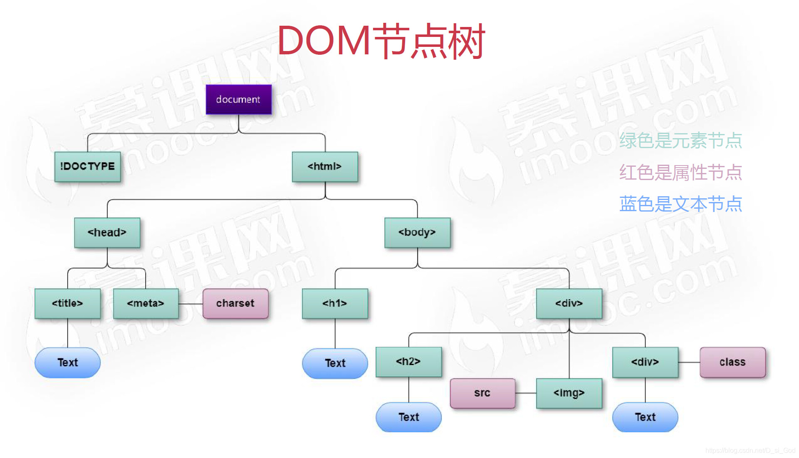

# JavaScript DOM

## DOM简介

文档对象模型（Document Object Model，简称 DOM），是 W3C 组织推荐的处理可扩展标记语言（HTML或者XML）的标准编程接口，W3C 已经定义了一系列的 DOM 接口，通过这些 DOM 接口可以改变网页的内容、结构和样式。



1. 文档：一个页面就是一个文档，DOM中使用doucument来表示
2. 元素：页面中的所有标签都是元素，DOM中使用 element 表示
3. 节点：网页中的所有内容都是节点（标签，属性，文本，注释等），DOM中使用node表示

## 获取元素

DOM获取元素的方法有五种：

1. 根据 ID 获取：

   使用 getElementByld() 方法可以获取带ID的元素对象：

   `doucument.getElementByld('id名')`

   使用 console.dir() 可以打印获取的元素对象，更好的查看对象里面的属性和方法。

   ```js
   <div id="time">2019-9-9</div>
   <script>
       // 1.因为文档页面从上往下加载，所以得先有标签，所以script写在标签下面
       // 2.get 获得 element 元素 by 通过 驼峰命名法
       // 3.参数 id是大小写敏感的字符串
       // 4.返回的是一个元素对象
       var timer = document.getElementById('time');
       console.log(timer);
       // 5. console.dir 打印元素对象，更好的查看里面的属性和方法
       console.dir(timer);
   </script>
   ```

2. 根据标签名获取：

   根据标签名获取，使用getElementByTagName()方法可以返回带有指定标签名的对象的集合：

   `doucument.getElementsByTagName('标签名');`

   因为得到的是一个对象的集合，所以想要操作里面的元素就需要遍历得到元素对象是动态的，返回的是获取过来元素对象的集合，以[伪数组](https://so.csdn.net/so/search?q=伪数组&spm=1001.2101.3001.7020)的形式存储。如果获取不到元素，返回为空的伪数组（因为获取不到对象）。

   ```js
   <ul>
       <li>知否知否，应是等你好久</li>
       <li>知否知否，应是等你好久</li>
       <li>知否知否，应是等你好久</li>
       <li>知否知否，应是等你好久</li>
       <li>知否知否，应是等你好久</li>
   </ul>
   <script>
       // 1.返回的是获取过来元素对象的集合 以伪数组的形式存储
       var lis = document.getElementsByTagName('li');
       console.log(lis);
       console.log(lis[0]);
       // 2.依次打印,遍历
       for (var i = 0; i < lis.length; i++) {
           console.log(lis[i]);
       }
       // 3.如果页面中只有 1 个 li，返回的还是伪数组的形式
       // 4.如果页面中没有这个元素，返回的是空伪数组
   </script>
   ```

3. 根据父元素（ ID + 标签名）的方法获取：

   父元素必须是单个对象(必须指明是哪一个元素对象)，获取的时候不包括父元素自己。

   ```js
   //element.getElementsByTagName('标签名'); 父元素必须是指定的单个元素
   var ol = document.getElementById('ol');
   console.log(ol.getElementsByTagName('li'));
   ```

4. 通过H5新增方法获取：

   - `getElementsByClassName`

     根据类名返回元素对象合集`getElementsByClassName('ClassName')`

   - `document.querySelector`

     根据指定选择器返回第一个元素对象

   - `document.querySelectorAll`

     根据指定选择器返回所有元素对象

   ```js
       // 1. getElementsByClassName 根据类名获得某些元素集合
       var boxs = document.getElementsByClassName('box');
       console.log(boxs);
       // 2. querySelector 返回指定选择器的第一个元素对象  切记 里面的选择器需要加符号 .box  #nav
       var firstBox = document.querySelector('.box');
       console.log(firstBox);
       var nav = document.querySelector('#nav');
       console.log(nav);
       var li = document.querySelector('li');
       console.log(li);
       // 3. querySelectorAll()返回指定选择器的所有元素对象集合
       var allBox = document.querySelectorAll('.box');
       console.log(allBox);
       var lis = document.querySelectorAll('li');
       console.log(lis);
   ```

5. 获取特殊元素
   1. 获取body元素：`document.body;`
   2. 获取html元素：`document.documentElement;`

## 事件基础

JavaScript 使有能力创建动态页面，而事件是可以被 JavaScript 侦测到的行为。简单理解： `触发—响应机制`。网页中的每个元素都可以产生某些可以触发 JavaScript 的事件，例如，可以在用户点击某按钮时产生一个事件，然后去执行某些操作。
三要素：事件源，事件类型，事件处理程序

| 鼠标事件    | 触发条件         |
| ----------- | ---------------- |
| onclick     | 点击鼠标左键     |
| onmouseover | 鼠标经过触发     |
| onmouseout  | 鼠标离开触发     |
| onfocus     | 获取鼠标焦点触发 |
| onblur      | 失去鼠标焦点触发 |
| onmousemove | 鼠标移动触发     |
| onmouseup   | 鼠标弹起触发     |
| onmousedown | 鼠标按下触发     |

## 操作元素

JavaScript 的 DOM 操作可以改变网页内容、结构和样式，可以利用 DOM 操作元素来改变元素里面的内容 、属性等。

>  注意以下都是属性

1. 改变元素内容：

   从起始位置到终止位置的内容，但它去除html标签，同时空格和换行也会去掉：

   `element.innerText`

   起始位置到终止位置的全部内容，包括HTML标签，同时保留空格和换行：

   `element.innerHTML`

   ```js
   <div></div>
   <p>
    我是文字
    <span>123</span>
   </p> 
   <script>
    var div = document.querySelector('div');
    div.innerText = '<strong>今天是：</strong> 2019';
    div.innerHTML = '<strong>今天是：</strong> 2019';
    var p = document.querySelector('p');
    console.log(p.innerText);
    console.log(p.innerHTML);
   </script>
   ```

   

2. 改变元素内容