# 01 【HTML简介】

## 1.网页

### 1.1 什么是网页？

**网站：**利用前端技术制作的网页集合。

**网页：**构成网站的基本元素，通常是 HTML 格式的文件（.htm 或 .html）必须通过浏览器来阅读。

### 1.2 什么是HTML?

**超文本：**由图片、声音、动画、视频……构成且可以相互链接的文本。

**HTML：**超文本标记语言（HTML 不是编程语言，而是由一套标记标签构成的标记语言）。

### 1.3 网页的形成

前端代码开发 ——> 浏览器解析、渲染代码 ——> 呈现 Web 页面。

### 1.4Web标准的构成

**主要包括三个方面：** `结构`、`表现`、`行为`。


**结构html**  

结构是页面的整体结构，哪里是标题，哪里是段落，哪里是图片  
结构使用HTML来编写  

```html  
<!DOCTYPE html>  
<html>  
    <head>  
        <meta charset="utf-8"/>  
        <title></title>  
    </head>  
    <body>  
    </body>  
</html>  
```

**表现css**  

表现是页面的外在的样式，比如字体，字体大小，字体颜色，背景...  
使用CSS来设置页面中元素的样式  

**行为js**  

页面和用户之间的交互行为  
使用JavaScript来设置页面的行为  
一个设计优良的网页要求结构、表现、行为三者分离  
在开发中总是要面临一个问题，就是程序之间的耦合，三者分离就是为了解耦合  

https://i0.hdslb.com/bfs/album/5e39821431861bd76111a347911aba86e905a17f.png

> 如果现实图片违规，则点击这个链接浏览


**Web 标准提出的最佳体验方案：** `结构`、`样式`、`行为` 相互分离。

- **简单的理解：**结构写到 `.html` 文件中、表现写到 `.css` 文件中、行为写到 `.js` 文件中
- **一句话解释：**结构类似身体、表现类似衣服、行为类似动作（结构始终是一切的基础！）

## 2.字符编码

所有的数据在计算机中存储时都是以二进制形式存储的，文字也不例外。

所以一段文字在存储到内存中时，都需要转换为二进制编码当我们读取这段文字时，计算机会将编码转换为字符，供我们阅读

### 2.1 编码

将字符转换为二进制码的过程称为编码

### 2.2 解码

将二进制码转换为字符的过程称为解码

### 2.3 字符集（charset）

编码和解码所采用的规则称为字符集（相当于密码本）

### 2.4 乱码

如果编码和解码所采用的字符集不同就会出现乱码问题。

**可以通过meta标签来设置网页的字符集，避免乱码问题**

```html
<meta charset="utf-8">
```

## 3.字符集

**字符集：**多个字符的集合，以便计算机能够识别和储存各种文字。

### 3.1 ASCII

ASCII(American Standard Code for Information Interchange)：美国信息交换标准代码

在所有字符集中，最知名的可能要数被称为ASCII的8位字符了。美国信息交换标准代码是由美国国家标准学会(American National Standard Institute , ANSI )制定的，是一种标准的单字节字符编码方案，用于基于文本的数据。它最初是美国国家标准，供不同计算机在相互通信时用作共同遵守的西文字符编码标准，后来它被国际标准化组织（International Organization for Standardization, ISO）定为国际标准，称为ISO 646标准。适用于所有拉丁文字字母

ASCII 码使用指定的7 位或8 位二进制数组合来表示128 或256 种可能的字符。标准ASCII 码也叫基础ASCII码，使用7 位二进制数（剩下的1位二进制为0）来表示所有的大写和小写字母，数字0 到9、标点符号，以及在美式英语中使用的特殊控制字符

ASCII码表：[Ascii Table - ASCII character codes and html, octal, hex and decimal chart conversion](http://www.asciitable.com/)

### 3.2 ISO-8859-1

ISO-8859-1编码是单字节编码，向下兼容ASCII，其编码范围是0x00-0xFF，0x00-0x7F之间完全和ASCII一致，0x80-0x9F之间是控制字符，0xA0-0xFF之间是文字符号。

ISO码表：[HTML ISO-8859-1 参考手册](https://www.w3school.com.cn/charsets/ref_html_8859.asp)

### 3.3 GB2312

GB2312（信息交换用汉字编码字符集）是由中国国家标准总局1980年发布。基本集共收入汉字6763个和非汉字图形字符682个。GB 2312的出现，基本满足了汉字的计算机处理需要，它所收录的汉字已经覆盖中国大陆99.75%的使用频率。

### 3.4 GBK

GBK（即“国标”、“扩展”汉语拼音的第一个字母），汉字编码字符集。2000年已被GB18030-2000国家强制标准替代。 2005年GB18030-2005发布，替代了GB18030-2000。

GBK使用了双字节编码方案，其编码范围从8140至FEFE（剔除xx7F），共23940个码位，共收录了21003个汉字，完全兼容GB2312-80标准，支持国际标准ISO/IEC10646-1和国家标准GB13000-1中的全部中日韩汉字，并包含了BIG5编码中的所有汉字。

### 3.5 Big5

Big5，又称为大五码或五大码，是使用繁体中文（正体中文）社区中最常用的电脑汉字字符集标准，共收录13,060个汉字。

Big5虽普及于台湾、香港与澳门等繁体中文通行区，但长期以来并非当地的国家/地区标准或官方标准，而只是业界标准。倚天中文系统、Windows繁体中文版等主要系统的字符集都是以Big5为基准，但厂商又各自增加不同的造字与造字区，派生成多种不同版本。

### 3.6 UTF-8

UTF-8（8位元，Universal Character Set/Unicode Transformation Format）是针对Unicode的一种可变长度字符编码，也叫万国码、统一码。它可以用来表示Unicode标准中的任何字符，而且其编码中的第一个字节仍与ASCII相容，使得原来处理ASCII字符的软件无须或只进行少部分修改后，便可继续使用。

### 3.7 UTF-16

UTF-16是Unicode的其中一个使用方式。UTF-16比起UTF-8，好处在于大部分字符都以固定长度的字节（2字节）储存，但UTF-16却无法兼容于ASCII编码。

### 3.8 Unicode

Unicode只是一组字符设定或者说是从数字和字符之间的逻辑映射的概念编码，但是它并没有指定代码点如何在计算机上存储。UCS4、UTF-8、UTF-16（UTF后的数字代表编码的最小单位，如UTF-8表示最小单位1字节，所以它可以使用1、2、3字节等进行编码，UTF-16表示最小单位2字节，所以它可以使用2、4字节进行编码）都是Unicode的编码方案。UTF-8因可以兼容ASCII而被广泛使用。

**如果把各种文字编码形容为各地的方言，那么Unicode就是世界各国合作开发的一种语言。**

### 3.9 字符集使用

在 `<head>` 标签内，可以通过 `<meta>` 标签的 `charset` 属性来规定 HTML 文档应该使用哪种字符编码。

```html
<meta charset="UTF-8">
```

`charset` 常用的值有：`GB2312`、`BIG5`、`GBK`、`UTF-8`，其中 `UTF-8` 也被称为：万国码，基本包含了全世界所有国家需要用到的字符。

**注意：**字符设置是必须的，否则极大可能引起网页乱码。一般情况下，统一使用 "UTF-8" 编码，尽量统一写成标准的 `UTF-8`，不要写成 "utf8" 或 "UTF8"。

**标准骨架：**

```html
<!doctype html>
<html lang="en">

<head>
    <meta charset="UTF-8">
    <title>Title</title>
</head>

<body>
</body>

</html>
```

### 3.10 IE 兼容模式

IE 支持通过特定的 `<meta>` 标签来确定绘制当前页面所应该采用的 IE 版本。除非有强烈的特殊需求，否则最好是设置为 **edge mode**，从而通知 IE 采用其所支持的最新的绘制模式。

```html
<!doctype html>
<html lang="en">

<head>
    <meta charset="UTF-8">
    <meta http-equiv="x-ua-compatible" content="ie=edge">
    <title>Title</title>
</head>

<body>
</body>

</html>
```

## 4.文档声明（doctype）

`<!doctype>` 文档类型声明，作用是告诉浏览器应该使用哪种 HTML 版本来解析渲染网页。

```html
<!doctype html>
<!-- 当前页面采用 HTML5 版本 -->
```

**注意：**

- `<!doctype>` 声明位于文档最前面的位置，处于 \<html> 标签之前
- `<!doctype>` 文档类型声明标签，不属于 HTML 标签
- 请默认统一指定 HTML5 版本 `<!doctype html>`

## 5.lang语言种类

用来定义当前网页显示的主语言，书写在 `<html>` 标签内。

- `en` 定义语言为英语
- `zh` 定义语言为中文

简单来说：定义为 `en` 就是面向英文用户的网页，定义为 `zh` 就是面向中国大陆用户的网页。

> `en-GB` 英文（英国）
>
> `en-US` 英文（美国）
>
> `zh-CN` 中文（简体，中国大陆）
>
> `zh-SG` 中文（简体，新加坡）
>
> `zh-HK` 中文（繁体，香港）
>
> `zh-MO` 中文（繁体，澳门）
>
> `zh-TW` 中文（繁体，台湾）

```html
<html lang="zh-CN"> 
</html>
```

> 语言的设置是为了方便 `浏览器搜索推荐` 以及触发 `浏览器翻译功能`，并不是说设置了某类主语言后网页中就不能存在其他类型的语言了。

## 6.HTML语法规范

### 6.1 基本语法概述

HTML 标签是由**尖括号**包围的关键字词，例如：`<html>`。

HTML 标签通常是成对出现的，例如：`<html>` 和 `</html>`，我们称为**双标签**。标签对中的第一个标签是**开始标签**，第二个标签是**结束标签**。

有些特殊的标签必须是单个标签，例如：`<br />`，我们称为**单标签**。注意：`/` 之前有一个空格（Coding Style 编码风格）。每个标签原则上都应该有**结束符**，即：` /`。所以单标签的最后要加 `/` 以表示结束，当然不加也是可以被浏览器正常解析的。

> HTML5 规范中明确说明单标签 `/` 是可以忽略的，**实际开发中建议不要给单标签添加斜线**。

> 任何标签都建议不要大写，即便是 `<!doctype html>` 标签。

### 6.2 标签关系

1. **包含关系**

```html
<head>
    <title></title>
</head>
```

2. **并列关系**

```html
<head>
</head>
<body> 
</body>
```

## ⭕7.HTML5的基本结构

```html
<!-- 文档声明，声明当前网页的版本 -->
<!doctype html>
<!-- html的根标签（元素），网页中的所有内容都要写根元素的里边 -->
<html>
    <!-- head是网页的头部，head中的内容不会在网页中直接出现，主要用来帮助浏览器或搜索引擎来解析网页 -->
    <head>
        <!-- meta标签用来设置网页的元数据，这里meta用来设置网页的字符集，避免乱码问题 -->
        <meta charset="utf-8">
        <!-- title中的内容会显示在浏览器的标题栏，搜索引擎会主要根据title中的内容来判断网页的主要内容 -->
        <title>网页的标题</title>
    </head>
    <!-- body是htm1的子元素，表示网页的主体，网页中所有的可见内容都应该写在body里 -->
    <body>
        <!-- h1网页的一级标题 -->
        <h1>网页的大标题</h1>
    </body>
</html>
```

`<!doctype html>`文档声明  
用来标识当前页面的html的版本  
该声明用来告诉浏览器，当前的页面是使用HTML5的标准编写的  
`<html>`网页的根标签   
一个页面中有且只有一个根标签  
网页中的所有内容都需要写在html标签的内部  

`<head>`网页的头部  

该标签中的内容不会在网页中直接显示  
该标签用于帮助浏览器解析页面  
子标签  
`<title>`用来设置网页的标题   
默认会在浏览器的标题栏中显示  
搜索引擎检索网页时，会主要检索title中的内容，它会影响到页面在搜索引擎中的排名  
`<meta>`  
用来设置网页的元数据，比如网页使用的字符集  
`<meta charset="utf-8" />`  
设置网页的关键字  
`<meta name="keywords" content="关键字,关键字,关键字,关键字"/>`  
设置网页的描述  
`<meta name="description" content="网页的描述"/>`  
请求的重定向  
`<meta http-equiv="refresh" content="秒数;url=地址"  />`  

# 02 【字符实体与语义标签(上)】

## ⭕1.字符实体

有些时候，在HTML中不能直接书写一些特殊符号，如：

- 多个连续的空格（在网页中编写的多个空格默认情况会自动被浏览器解析为一个空格）

- 比如字母两侧的大于小于号（可能会被认为是标签并解析）

如果我们需要在网页中书写这些特殊的符号，则需要使用html中的实体（转义字符）实体的语法：`&实体的名字;`，如：

| 实体名称   | 显示结果 | 描述     |
| ---------- | -------- | -------- |
| `&nbsp;`   | ``       | 空格     |
| `&gt;`     | >        | 大于号   |
| `&lt;`     | <        | 小于号   |
| `&amp;`    | &        | 与       |
| `&copy;`   | ©        | 版权     |
| `&reg;`    | ®        | 注册商标 |
| `&trade;`  | ™        | 商标     |
| `&times;`  | ×        | 乘号     |
| `&divide;` | ÷        | 除号     |
| `&iquest;` | ¿        | 倒问号   |

更多的字符实体，可参考：[HTML 字符实体](https://www.w3school.com.cn/html/html_entities.asp)、[HTML ISO-8859-1 参考手册](https://www.w3school.com.cn/charsets/ref_html_8859.asp)

## ⭕2.meta标签

> 个人理解name里面的值是指定的，然后content里的内容会在根据name中的值发挥不同的作用

以京东网站为例，右键单击，选择`查看网页源代码`

```html
<meta charset="utf8" version='1'/>
<meta name="viewport" content="width=device-width, initial-scale=1.0, maximum-scale=1.0, user-scalable=yes"/>
<meta name="description" content="京东JD.COM-专业的综合网上购物商城,销售家电、数码通讯、电脑、家居百货、服装服饰、母婴、图书、食品等数万个品牌优质商品.便捷、诚信的服务，为您提供愉悦的网上购物体验!"/>
<meta name="Keywords" content="网上购物,网上商城,手机,笔记本,电脑,MP3,CD,VCD,DV,相机,数码,配件,手表,存储卡,京东"/>
```

meta主要用于设置网页中的一些元数据，元数据并不是给用户看的

-  charset ：指定网页的字符集 

-  name ：指定的数据的名称 

-  -  keywords：表示网站的关键字，可以同时指定多个关键字，关键字间使用`,`隔开 

-  -  description：表示网站的描述信息
      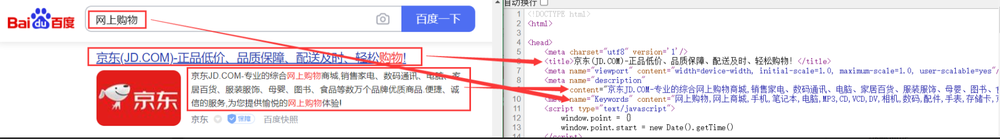

-  content ：指定的数据的内容，会作为搜索结果的超链接上的文字显示 

## ⭕3.语义化标签

电脑编辑器都是`gbk`写的，而`vscode`是用`utf-8`打开的---会乱码

**标签语义**

**简单的理解：**标签的含义，即：这个标签是用来干嘛的。

这里先介绍几个基本的语义标签，还有些常用的标签放在后面具体讲解

|                         | 标签                                      | 作用   | 描述                                                         |
| ----------------------- | ----------------------------------------- | ------ | ------------------------------------------------------------ |
| 块元素 Block Element    | `<h1>` `<h2>` `<h3>` `<h4>` `<h5>` `<h6>` | 标题   | 一共有六级标题 从`h1` ~ `h6`重要性递减，`h1`最重要，`h6`最不重要 h1在网页中的重要性仅次于`title`标签 一般情况下一个页面中只会有一个`h1` 一般情况下标题标签只会使用到`h1` ～ `h3`，`h4` ～ `h6`很少用 |
|                         | `<hgroup>`                                | 标题组 | 多层次的标题。它将一组`<h1>` ～ `<h6>`元素分组               |
|                         | `<p>`                                     | 段落   | 页面中的一个段落。由空行或第一行缩进将相邻的文本块分开       |
|                         | `<blockquote>`                            | 短引文 | 用缩进表示所包含文本。 可以用`cite`属性表示引文来源，用`<cite>`元素表示来源的文本表述 |
| 行内元素 Inline Element | `<q>`                                     | 长引文 | 用一个简短的内联引号包围文本。 大多数浏览器通过在文本周围加上引号来实现。 该元素用于不需要段落分隔的短引文； |
|                         | `<br>`                                    | 换行   |                                                              |
|                         | `<em>`                                    | 强调   | 表示强调作用。`<em>`元素可以嵌套，每一级嵌套表示更高的强调程度 `<i>`元素效果与它相同，不过`<i>`不属于语义标签 |
|                         | `<strong>`                                | 重要   | 表示重要性、严肃性或紧迫性。浏览器通常以粗体字呈现内容 `<b>`元素效果与它相同，不过`<b>`不属于语义标签 |

> 注意：`<em>` 标签不只是单纯的用于倾斜文本，其核心的意义在于对元素进行**强调！**所以在后期的开发中可以把一些**特殊性、强调性**的元素放在 em 标签中，然后再对 em 这个盒子进行样式设置，这比把其放入其他盒子（如：span）中要更合理，同理 `<strong>` 标签页适合放一些**重点强调**的元素。

```html
<h1>一级标题</h1>
<h2>二级标题</h2>
<h3>三级标题</h3>
<h4>四级标题</h4>
<h5>五级标题</h5>
<h6>六级标题</h6>
```

**标签语义：**作为标题使用，并且依据重要性递减。

**特点：**

- 加了标题的文字会自动加粗，字号也会依次变大
- 一个标题就独占一行，同一行标题后不会再放置其他任何内容（后期可以通过 CSS 修改）

> 级别越大的标题标签，对网页元素的强调性越强，同时也和浏览器 SEO 优化有关。
>
> 故：标题标签不得滥用，要用在合适的地方！


HTML5 提供的新语义元素有

| 标签           | 作用                         | 描述                                                         |
| -------------- | ---------------------------- | ------------------------------------------------------------ |
| `<header>`     | 页眉                         | 介绍性的内容                                                 |
| `<footer>`     | 页脚                         | 通常包含有关作者的信息、版权或文件链接                       |
| `<nav>`        | 导航链接                     | 可以是当前文档内的，也可以是到其他文档的。常见例子是菜单、目录和索引 |
| `<main>`       | 文档主内容                   | 中心主题直接相关或扩展的内容                                 |
| `<article>`    | 文章                         | 自成一体，独立分发，可重复使用                               |
| `<section>`    | 文档中的节                   | 没有一个更具体的语义元素来代表                               |
| `<aside>`      | 页面内容以外的内容           | 其内容与文档的主要内容只有间接的关系。经常以边栏或呼出框的形式出现 |
| `<mark>`       | 重要或强调的文本             | 为参考或记事目的而被标记或突出的文本，表明其相关性和重要性   |
| `<summary>`    | `<details>` 标题             | 为`<details>`指定一个摘要、标题或图例。点击`<summary>`可以切换`<details>`打开和关闭 |
| `<details>`    | 用户能够查看或隐藏的额外细节 | 其中的信息只有被切换到 "打开 "状态时才可见。必须使用`<summary>`提供一个摘要或标签 |
| `<figure>`     | 自包含内容                   | 独立的内容，用`<figcaption>`元素指定一个可选的标题。比如图示、图表、照片、代码清单等 |
| `<figcaption>` | `<figure>` 的标题            | 描述其父元素                                                 |
| `<time>`       | 定义日期/时间                | 可能包括`datetime`属性，将日期翻译成机器可读的格式，以便获得更好的搜索引擎结果或自定义功能。如提醒 |

这些新语义标签在视觉效果上基本上没有什么区别

## 4.内容修正

浏览器在解析网页时，会自动对网页中不符合规范的内容进行修正，比如：

- 标签写在了根元素的外部

- `<p>`元素中嵌套了块元素

- 根元素中出现了除`head`和`body`以外的子元素

这个通过浏览器中的`查看网页源代码`并不能看到效果，但是使用F12进行`开发者调试`时是能够看到上述几种情况被修正的结果。

不过虽然浏览器能够对不规范的页面内容进行修正，还是不建议编写不规范的代码，因为这对后期代码维护或团队代码协作将是非常不好的后果和体验。

## ⭕5.布局标签

**结构化语义标签**

- `header`表示网页的头部（页眉）

- `main`表示网页的主体部分（一个页面中只会有一个main）

- `footer`表示网页的底部（页脚）

- `nav`表示网页中的导航

- `aside`和主体相关的其他内容（侧边栏）

- `article`表示一个独立的文章

- `section`表示一个独立的区块，上边的标签都不能表示时使用section


​		

> 注意：
>
> - 这种语义化标准主要是针对搜索引擎的
> - 这些新标签页面中可以使用多次
> - 在 IE9 中，需要把这些元素转换为块级元素
> - 其实，我们移动端更喜欢使用这些标签

- `div` 块元素，没有任何的语义，就用来表示一个区块。目前来讲，div还是主要的布局元素
- `span` 行内元素，没有任何的语义，一般用于在网页中`选中文字`

`<div>` 和 `<span>` 是没有语义的，它们就是两种盒子，用来对网页进行布局和装其他内容。

```html
<div>这是头部</div>
<span>今日价格</span>
```

> div 是 division 的缩写表示：分割、分区。

> span 意为：跨度、跨距。

**特点：**

- `<div>` 标签用来布局，一行只能放一个 `<div>`，**大盒子**
- `<span>` 标签用来布局，一行上可以放多个 `<span>`，**小盒子**

**说明：**后期可以通过 CSS 将 div 与 span 之间的特性相互转换。

**拓展：** `span` 标签不单单是用于布局，对于一些需要单独修饰和设置的元素，可以将其用 `span` 标签嵌套起来，然后就可以单独对其进行设置（比如：在一个 p 标签的段落中要对其中某一句话单独设置样式，那么就可以用 span 将这句话单独嵌套起来，这样就方便对其单独设置样式还不会影响段落中的其他内容，这其实也是利用了 span 一行可以放置多个盒子的特性），不过对于特殊且具有强调性的元素建议使用 `em`，对于重点强调但不特殊的的元素建议使用 `strong`。

## 6.段落和换行标签

在网页中，要把文字有条理地显示出来，就需要将这些文字分段显示，在 HTML 标签中，`<p>` 标签用于定义段落，它可以将整个网页分为若干个段落。

```html
<p>我是一个段落标签</p>
```

> 单词 paragraph 的缩写，意为：段落。

**便签语义：**可以把 HTML 文档分割为若干段落。

**特点：**

- 文本在一个段落中会根据浏览器窗口的大小自动换行

  > 对于中文段落来说无论如何都会自动换行，但是对于英文段落来说如果字母是连续的（aaa...），那么浏览器会认为该段落整体都是一个字母不会自动换行，要想英文段落自动换行字母之间得有空格。

- 段落和段落之间保有空隙（段间距）

- 同一段落里的不同行文字之间也有一定的空隙（行间距）

在 HTML 中，一个段落中的文字会从左到右依次排列，直到浏览器窗口的右端，然后才自动换行。

如果希望某段文本强制换行显示，就需要使用换行标签  `<br>`。

```html
<br>
```

> 单词 break 的缩写，意为：打断、换行。

**标签语义：**强制换行。

**特点：**

- `<br>` 是个单标签
- `<br>` 标签只是简单地开始新的一行，跟段落不一样，所以不会产生段间距

分割线标签：`<hr>`。

```html
<hr>
<!-- 某些时候需要对内容块进行分割时会用到分割线标签 -->
```

> 注意：实际开发中并不常用 hr 作为分割线，而是使用 CSS 盒子模型中的边框来实现分割线效果，或是利用一个空盒子设置长宽高及背景颜色来实现分割线效果。

## ⭕7.列表

表格是用来显示数据的，那么**列表就是用来布局的**。

列表最大的特点就是：整齐、整洁、有序、它作为布局会更加自由和方便。

在实际开发中凡是遇到排列整齐的简洁内容，都可以使用列表来进行布局。

合理的使用列表布局可以有效提高 SEO。

根据使用情景不同，列表可以分为三大类：`无序列表`、`有序列表` 和 `自定义列表`。

| 标签名         | 定义       | 说明                                                         |
| -------------- | ---------- | ------------------------------------------------------------ |
| `<ul>` `</ul>` | 无序标签   | 里面**只包含 li**，没有顺序，使用较多，li 里面可以包含任何标签 |
| `<ol>` `</ol>` | 有序标签   | 里面**只包含 li**，有顺序，使用相对较少，li 里面可以包含任何标签 |
| `<dl>` `</dl>` | 自定义标签 | 里面**只能包含 dt 和 dd**，dt 和 dd 里面可以放任何标签，dd 一般作为对 dt 的细分描述 |

### 7.1 无序列表

`<ul>` 标签表示 HTML 页面中项目的无序列表，一般会以项目符号呈现列表项，而列表项使用 `<li>` 标签定义（开发中经常使用）。

**无序列表的基本语法格式如下：**

```html
<ul>
    <li>列表项1</li>
    <li>列表项2</li>
    <li>列表项3</li>
    ...
</ul>
```

- 无序列表的各个列表项之间没有顺序级别之分，是并列的
- `<ul>` `</ul>` 中只能嵌套 `<li>` `</li>`，直接在 `<ul>` `</ul>` 标签中输入其他标签或者文字的做法是不被允许的，列表中的任何内容都应该放在 `li` 中
- `<li>` 与 `</li>` 之间相当于一个容器，可以容纳所有的元素
- 无序列表会带有自己的样式属性（比如圆点），但在实际开发中，我们会使用 CSS 来设置


> 附：去除 li 前符号的方法：`style="list-style: none;"`

### 7.2 有序列表

有序列表即为有序排列顺序的列表，其各个列表项会按照一定的顺序排列定义（开发中不太常用）。

在 HTML 标签中，`<ol>` 标签用于定义有序列表，列表排序以数字来显示，并且使用 `<li>` 标签来定义列表项。

**有序列表的基本语法格式如下：**

```html
<ol>
    <li>列表项1</li>
    <li>列表项2</li>
    <li>列表项3</li>
    ...
</ol>
```

- `<ol>` `</ol>` 中只能嵌套 `<li>` `</li>`，直接在 `<ol>` `</ol>` 标签中输入其他标签或者文字的做法是不被允许的
- `<li>` 与 `</li>` 之间相当于一个容器，可以容纳所有的元素
- 有序列表会带有自己样式属性（比如序号），但在实际使用时，我们会使用 CSS 来设置


> 附：去除 li 前符号的方法：`style="list-style: none;"`

### 7.3 自定义列表

**自定义列表的使用场景：**

自定义列表常用于对术语或名词进行解释、描述和展开，定义列表的列表项前没有任何项目符号（开发中常用）。

在 HTML 标签中，`<dl>` 标签用于定义描述列表（或定义列表），该标签会与 `<dt>`（定义项目/名字）和 `<dd>`（描述每一个项目/名字）一起使用。

其基本语法如下：

```html
<dl>
    <dt>名词1</dt>
    <dd>名词1解释1</dd>
    <dd>名词1解释2</dd>
</dl>
```

- `<dl>` `</dl>` 里面只包含 `<dt>`、`<dd>`
- `<dt>` 和 `<dd>` 个数没有限制，经常是一个 `<dt>` 对应多个 `<dd>`


## ⭕8.超链接

在 HTML 标签中，`<a>` 标签用于定义超链接，作用是从一个页面链接到另一个页面。

**（1）链接的语法格式**

```html
<a href="跳转目标" target="目标窗口的弹出方式">文本、图像或其他内容</a>
```

> 单词 **anchor** 的缩写，意为：锚。

**两个属性的作用如下：**

| 属性     | 作用                                                         |
| -------- | ------------------------------------------------------------ |
| `href`   | 用于指定链接目标的 url 地址，（必须属性）当标签应用 href 属性时，它就具有了超链接的功能 |
| `target` | 用于指定链接页面的打开方式，其中 `_self` 在当前页面打开的方式（为默认值），`_blank` 在新窗口中打开的方式 |

**（2）链接分类**

- **外部链接：**例如：`<a href="http://www.baidu.com">百度</a>` 

- **内部链接：**网站内部页面之间相互链接，直接链接内部页面名称即可，例如： `<a href="index.html">首页</a>`

  - 当我们需要跳转一个服务器内部的页面时，一般我们都会使用相对路径，会以`./`或`../`开头
  - `./` 表示当前文件所在目录，可以省略不写
  - `../`表示当前文件所在目录的上一级目录

- **空链接：**如果当时没有确定链接目标时， `<a href="javascript:void(0)">首页</a>"`，当用户点击链接时，void(0) 计算为 0，但 Javascript 上没有任何效果

- **下载链接：**如果 href 里面地址是一个文件或者压缩包（前提：路径包含文件类型后缀名，如：`.exe`、`.zip` 等），便会下载这个文件

- **网页元素链接：**在网页中的各种网页元素，如：文本、图像、表格、音频、视频等都可以添加超链接

- **锚点链接：**点击链接，可以快速定位到当前页面中的某个位置

  - 在链接文本的 href 属性中，设置属性值的 `#名字` 的形式，如：`<a href="#two">第2集</a>`
  - 找到目标位置标签（此处以 h3 标签为例），里面添加一个 `id属性="刚才的名字"`，如：`<h3 id="two">第2集介绍</h3>`
  - `<a href="#"></a>` 默认定位到页面顶部

  ```html
  <p> 汉皇重色思倾国，御宇多年求不得。</p>
  <p> 杨家有女初长成，养在深闺人未识。 </p>
  <p> 天生丽质难自弃，一朝选在君王侧。 </p>
  <p><a id="Anchor1" href="#Anchor2"> 回眸一笑百媚生，六宫粉黛无颜色。</a></p>
  <p> 春寒赐浴华清池，温泉水滑洗凝脂。 </p>
  <p> 侍儿扶起娇无力，始是新承恩泽时。 </p>
  <p> 云鬓花颜金步摇，芙蓉帐暖度春宵。 </p>
  <p> 春宵苦短日高起，从此君王不早朝。 </p>
  <p> 承欢侍宴无闲暇，春从春游夜专夜。 </p>
  <p><a id="Anchor2" href="#Anchor3"> 后宫佳丽三千人，三千宠爱在一身。</a></p>
  <p> 金屋妆成娇侍夜，玉楼宴罢醉和春。 </p>
  <p> 姊妹弟兄皆列土，可怜光彩生门户。 </p>
  <p> 遂令天下父母心，不重生男重生女。 </p>
  <p> 骊宫高处入青云，仙乐风飘处处闻。 </p>
  <p> 缓歌慢舞凝丝竹，尽日君王看不足。 </p>
  <p> 渔阳鼙鼓动地来，惊破霓裳羽衣曲。 </p>
  <p> 九重城阙烟尘生，千乘万骑西南行。 </p>
  <p> 翠华摇摇行复止，西出都门百余里。 </p>
  <p> 六军不发无奈何，宛转蛾眉马前死。 </p>
  <p> 花钿委地无人收，翠翘金雀玉搔头。 </p>
  <p> 君王掩面救不得，回看血泪相和流。 </p>
  <p> 黄埃散漫风萧索，云栈萦纡登剑阁。 </p>
  <p> 峨嵋山下少人行，旌旗无光日色薄。 </p>
  <p> 蜀江水碧蜀山青，圣主朝朝暮暮情。 </p>
  <p> 行宫见月伤心色，夜雨闻铃肠断声。 </p>
  <p> 天旋地转回龙驭，到此踌躇不能去。 </p>
  <p> 马嵬坡下泥土中，不见玉颜空死处。 </p>
  <p> 君臣相顾尽沾衣，东望都门信马归。 </p>
  <p> 归来池苑皆依旧，太液芙蓉未央柳。 </p>
  <p> 芙蓉如面柳如眉，对此如何不泪垂。 </p>
  <p> 春风桃李花开夜，秋雨梧桐叶落时。 </p>
  <p> 西宫南苑多秋草，落叶满阶红不扫。 </p>
  <p> 梨园弟子白发新，椒房阿监青娥老。 </p>
  <p> 夕殿萤飞思悄然，孤灯挑尽未成眠。 </p>
  <p><a id="Anchor3" href="#Anchor4"> 迟迟钟鼓初长夜，耿耿星河欲曙天。 </a></p>
  <p> 鸳鸯瓦冷霜华重，翡翠衾寒谁与共。 </p>
  <p> 悠悠生死别经年，魂魄不曾来入梦。 </p>
  <p> 临邛道士鸿都客，能以精诚致魂魄。 </p>
  <p> 为感君王辗转思，遂教方士殷勤觅。 </p>
  <p> 排空驭气奔如电，升天入地求之遍。 </p>
  <p> 上穷碧落下黄泉，两处茫茫皆不见。 </p>
  <p> 忽闻海上有仙山，山在虚无缥渺间。 </p>
  <p> 楼阁玲珑五云起，其中绰约多仙子。 </p>
  <p> 中有一人字太真，雪肤花貌参差是。 </p>
  <p> 金阙西厢叩玉扃，转教小玉报双成。 </p>
  <p> 闻道汉家天子使，九华帐里梦魂惊。 </p>
  <p> 揽衣推枕起徘徊，珠箔银屏迤逦开。 </p>
  <p> 云鬓半偏新睡觉，花冠不整下堂来。 </p>
  <p><a id="Anchor4" href="#Anchor5"> 风吹仙袂飘飖举，犹似霓裳羽衣舞。 </a></p>
  <p> 玉容寂寞泪阑干，梨花一枝春带雨。 </p>
  <p> 含情凝睇谢君王，一别音容两渺茫。 </p>
  <p> 昭阳殿里恩爱绝，蓬莱宫中日月长。 </p>
  <p> 回头下望人寰处，不见长安见尘雾。 </p>
  <p> 惟将旧物表深情，钿合金钗寄将去。 </p>
  <p> 钗留一股合一扇，钗擘黄金合分钿。 </p>
  <p> 但令心似金钿坚，天上人间会相见。 </p>
  <p> 临别殷勤重寄词，词中有誓两心知。 </p>
  <p> 七月七日长生殿，夜半无人私语时。 </p>
  <p><a id="Anchor5" href="#Anchor6"> 在天愿作比翼鸟，在地愿为连理枝。 </a></p>
  <p> 天长地久有时尽，此恨绵绵无绝期。 </p>
  
  <!-- Heading to link to -->
  <a href="#">回到顶部</a>
  ```

  


## 9.路径

### 9.1 相对路径

相对路径：以引用文件所在位置为参考基础，而建立出目录路径。

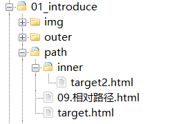)

```html
<!--           09.相对路径.html
        当我们需要跳转一个服务器内部的页面时，一般我们都会使用相对路径
            相对路径都会使用.或..开头
                ./
                ../
            ./可以省略不写，如果不写./也不写../则就相当于写了./

            ./ 表示当前文件所在的目录
                - 在这里当前页面就是 09.相对路径.html
                - ./就等于 09.相对路径.html 所在的目录 path =（ path/09.相对路径.html）

            ../ 表示当前文件所在目录的上一级目录
     -->
    <a href="./target.html">超链接1</a> 
    <br><br>
    <a href="../07.列表.html">超链接2</a>
    <br><br>
    <a href="./inner/target2.html">超链接3</a>
    <br><br>
    <a href="../outer/target3.html">超链接4</a>

<!-- 绝对路径  从项目根目录开始 以/开头-->
    <a href="/01_introduce/path/inner/target2.html" target="_blank">超链接</a>
```

### 9.2 绝对路径

绝对路径：指目录下的绝对位置，直接到达目的位置，通常是从盘符开始的路径。

如 Windows 系统的绝对路径：`D:\web\img\logo.png` 

### 9.3 网络地址

`https://github.com/JERRY-Z-J-R/JERRY-Z-J-R/blob/main/mark-img/readme.gif`

## 10.图片

### 10.1 基本使用

在 HTML 标签中，`` 标签用于定义 HTML 页面中的图像。

```html

```

> 单词 image 的缩写，意为图像。

`src` 是 `` 标签的必须属性，它用于指定图像文件的路径和文件名。

`URL` 是 `统一资源定位符`（通俗理解：地址、网址）。

所谓属性：简单理解就是属于这个图像标签的特性。

**图像标签的其他属性：**

| 属性     | 属性值   | 说明                                                         |
| -------- | -------- | ------------------------------------------------------------ |
| `src`    | 图片路径 | 必须属性                                                     |
| `alt`    | 文本     | 替换文本，图像显示失败时显示（为了提高 SEO 及适配屏幕阅读器，建议都把 alt 写上） |
| `title`  | 文本     | 提示文本，鼠标放到图片上，显示的提示文字                     |
| `width`  | 像素     | 设置图像的宽度（了解，后面通过 CSS 设置）                    |
| `height` | 像素     | 设置图像的高度（了解，后面通过 CSS 设置）                    |
| `border` | 像素     | 设置图像的边框粗细（了解，后面通过 CSS 设置）                |

**图像标签的注意点：**

- 图像标签**可以同时拥有多个属性**（其它标签也是同理）
- 属性之间不分先后顺序，标签名与属性、属性与属性之间均以**空格**分开（其它标签也是同理）
- **属性均采取键值对**的格式，即：`key="value"` 的格式，`属性="属性值"`
- 设置图像的宽度与高度时：一般设置其中之一便可，另外一个会自动按比例适配
- 设置宽高时，可以使用**百分数**作为值，此时图片大小会以当前父元素的大小为基础进行比例缩放，这样做的好处在于当父元素改变大小时，图片也会随比例同等缩放

### 10.2 图片格式

#### 10.2.1 jpeg（jpg）

- 支持的颜色比较丰富

- 不支持透明效果

- 不支持动图

- 一般用来显示照片

#### 10.2.2 gif

- 支持的颜色比较单一

- 支持简单透明

- 支持动图

#### 10.2.3 png

- 支持的颜色丰富

- 支持复杂透明

- 不支持动图

- 专为网页而生

#### 10.2.4 webp

- 这种格式是谷歌新推出的专门用来表示网页中的图片的一种格式

- 具备其他图片格式的所有优点，而且文件还特别的小

- 缺点：兼容性不好

#### 10.2.5 base64

-  将图片使用base64编码，这样可以将图片转换为字符，通过字符的形式来引入图片 
   图片格式的选择 

```html
<img width="300" src="" />
```

-  图片效果一样的，选文件小的 

-  图片效果不一样的，选图片效果好的 

-  尽可能的兼顾和平衡图片效果和文件大小 

## ⭕11.内联框架

内联框架`iframe`，用于向当前页面中引入一个其他页面，

- `src`指定要引入的网页的路径

- `frameborder`指定内联框架的边框

**举例**

```html
<iframe src="https://www.qq.com" width="800" height="600" frameborder="0"></iframe>
```

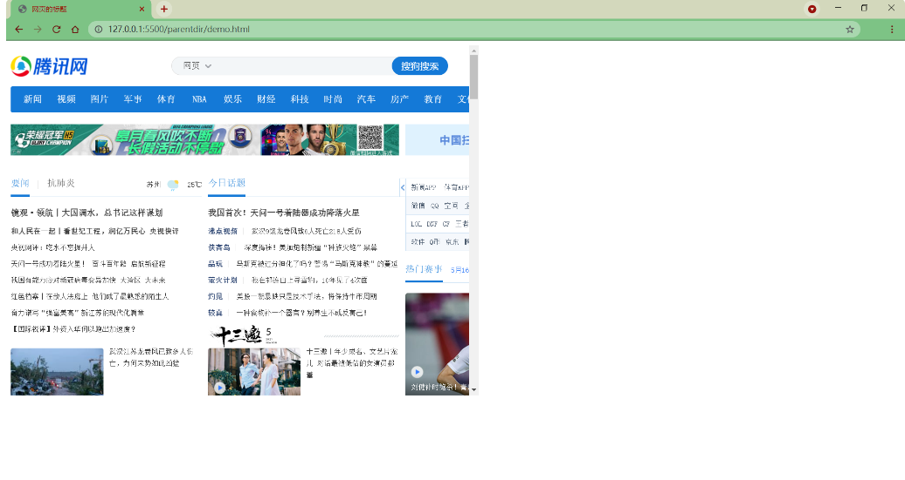

**设置高度与宽度**

`height` 和 `width` 属性用来定义 iframe 标签的高度与宽度。

属性默认以像素为单位，但是你可以指定其按比例显示（如："70%"）。

```html
<iframe height="500px" src="https://www.bilibili.com/" width="70%"></iframe>
```


> **提示：**您可以把需要的文本放置在 `<iframe>` 和 `</iframe>` 之间，这样就可以应对不支持 `<iframe>` 的浏览器。
>
> **提示：**使用 CSS 为 `<iframe>`（包括滚动条）定义样式。

**使用 CSS 隐藏 `<iframe>` 滚动条**

- 遮掉 iframe 滚动条：

```html
<div style="width: 400px; overflow: hidden">
    <iframe height="480" src="https://www.runoob.com" width="415">您的浏览器不支持</iframe>
</div>
```

- 新选择器原生移除滚动条：

```css
<!-- 此方法目前暂不推荐使用 -->
<head>
  <style>
    iframe::-webkit-scrollbar { 
      display: none;
    }
  </style>
</head>
```

通过`iframe`的方式引入视频。以某艺为例，提供了视频链接的HTML代码和通用代码

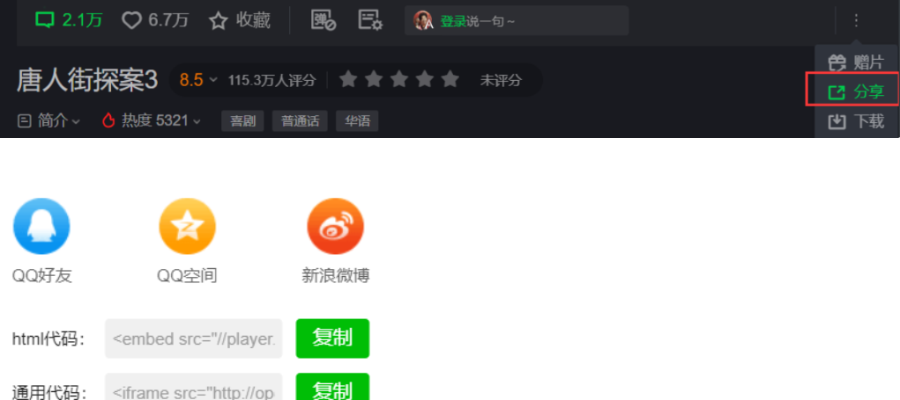

```html
<iframe    src="http://open.iqiyi.com/developer/player_js/coopPlayerIndex.html?vid=0c53ddd55f262c6d416afa9d1f49dc55&tvId=1008748400&accessToken=2.ef9c39d6c7f1d5b44768e38e5243157d&appKey=8c634248790d4343bcae1f66129c1010&appId=1368&height=100%&width=100%"
        frameborder="0" allowfullscreen="true" width="100%" height="100%"></iframe>
```

## 12.音视频

### ⭕12.1 音频

HTML5 在不使用插件的情况下，也可以原生的支持音频格式文件的播放。当然，支持的格式是有限的。

当前 `<audio>` 元素支持三种音频格式：尽量使用 mp3 格式。


`audio`标签用来向页面中引入一个外部的音频文件

音视频文件引入时，默认情况下不允许用户自己控制播放停止

**属性**：

- `controls`是否允许用户控制播放
- `autoplay`音频文件是否自动播放 
  - 如果设置了`autoplay`，则音乐在打开页面时会自动播放
  - 但是目前来讲大部分浏览器都不会自动对音乐进行播放

- `loop`音乐是否循环播放

语法

```html
<audio src="文件地址" controls="controls"></audio>
```

```html
<audio src="./source/audio.mp3" controls autoplay loop></audio>
```

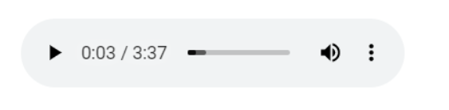

常见属性：

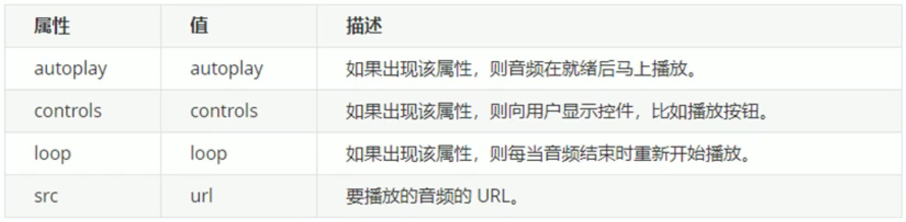

### ⭕12.2 source

除了通过`src`属性来指定外部文件的路径以外，还可以通过`<source>`元素来指定文件的路径

```html
<audio controls="controls">
	<source src="happy.mp3" type="audio/mpeg">
	<source src="happy.ogg" type="audio/ogg">
	您的浏览器暂不支持 <audio> 标签。
</audio>
```

### ⭕12.3 视频

HTML5 在不使用插件的情况下，也可以原生的支持视频格式文件的播放。当然，支持的格式是有限的。

当前 `<video>` 元素支持三种视频格式：尽量使用 mp4 格式。

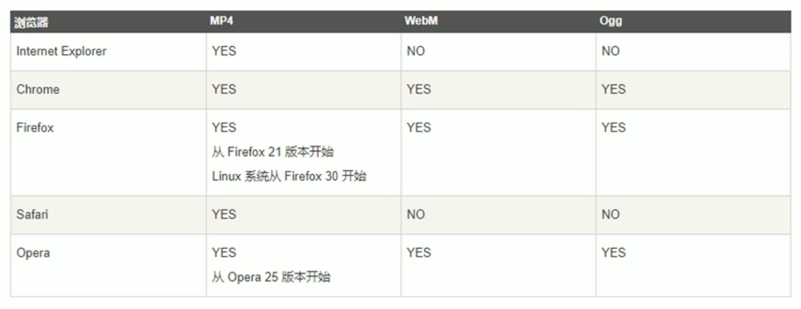

使用`video`标签来向网页中引入一个视频，使用方式和`audio`基本上是一样的

语法：

```html
<video src="文件地址" controls="controls"></video>
```

```html
<video controls="controls" width="300"> 
    <source src="move.ogg" type="video/ogg"> 
    <source src="move.mp4" type="video/mp4"> 
    您的浏览器暂不支持 <video> 标签播放视频
</ video >
```

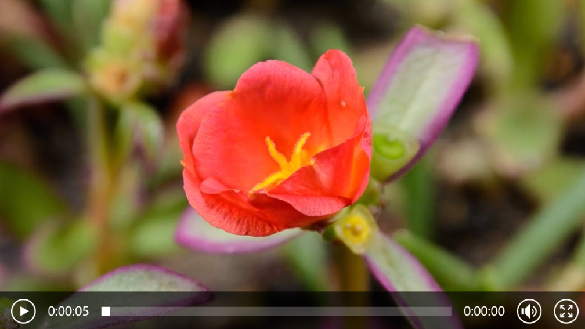

常见属性：

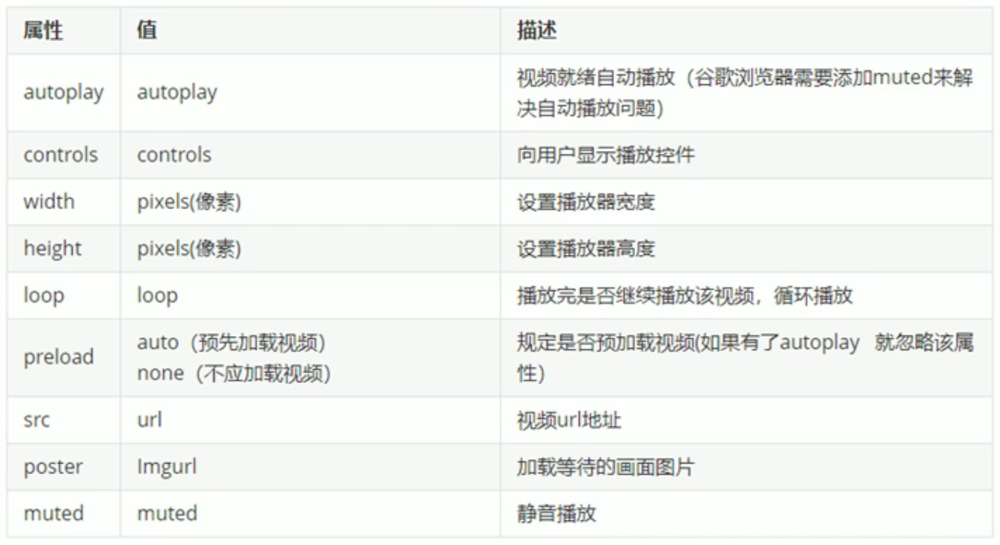

```html
<!doctype html>
<html lang="en">
<head>
    <meta charset="UTF-8">
    <meta name="viewport" content="width=device-width, initial-scale=1.0">
    <meta http-equiv="X-UA-Compatible" content="ie=edge">
    <title>HTML5新增视频标签</title>
    <style>
        video {
            width: 100%;
        }
    </style>
</head>
<body>
<video src="media/mi.mp4" autoplay="autoplay" muted="muted" loop="loop" poster="media/mi9.jpg"></video>
</body>
</html>
```

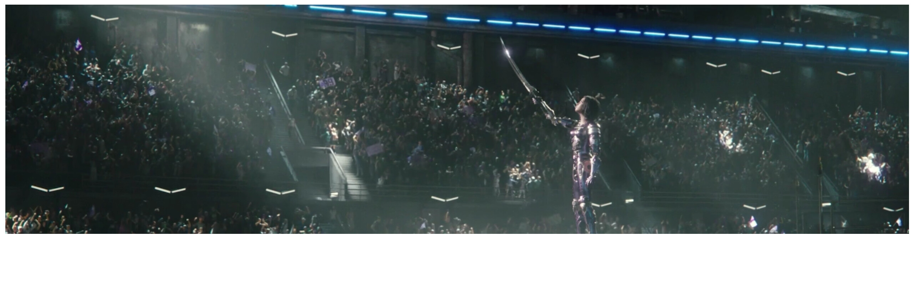

### ⭕12.4 多媒体标签总结

- 音频标签和视频标签使用方式基本一致
- 浏览器支持情况不同
- 谷歌浏览器把音频和视频自动播放禁止了
- 我们可以给视频标签添加 muted 属性来静音播放视频，音频不可以（可以通过 JavaScript 解决）
- 视频标签是重点，我们经常设置自动播放，不使用 controls 控件，循环和设置大小属性

# 03 【语义标签(下) CSS简介】

## 1.语义标签(下)

### 1.1 表格

#### 1.1.1 表格的主要作用

表格主要用于显示、展示数据。因为它可以让数据显示得非常的规整，可读性非常好。特别是后台展示数据的时候，能够熟练运用表格就显得很重要。一个清爽简约的表格能够把繁杂的数据表现得很有条理（合理的使用表格也能够有效提高 SEO）。

**注意：**表格不是用来布局页面的，而是用来展示数据的。**表格常用于表单数据的 “布局”**。

> 特别强调，表格是用于表单数据的 “布局”，而不是页面的布局！

#### 1.1.2 表格的基本语法

```html
<table>
    <tr>
        <td>单元格</td>
        ...
    </tr>
    ...
</table>
```

- `<table>` `</table>` 是用于定义表格的标签
- `<tr>` `</tr>` 用于定义表格中的行，必须嵌套在 `<table>` `</table>` 标签中
- `<td>` `</td>` 用于定义表格中的单元格，必须嵌套在 `<tr>` `</tr>` 标签中
- 字母 td 指表格数据（table data），即：数据单元格的内容
- 单元格 td 里面可以放任何的元素

#### 1.1.3 表头单元格标签

一般表头单元格位于表格的第一行或第一列，作用是：突出重要性，表头单元格里面的文本内容**默认加粗居中**显示。

`<th>` 标签表示 HTML 表格的表头部分（table head 的缩写）。

```html
<table>
    <tr>
    	<th>姓名</th>
        <th>性别</th>
        <th>年龄</th>
        ...
    </tr>
    ...
</table>
```

#### 1.1.4 表格属性

**注意：**表格标签的属性在实际开发中并不常用，而是通过后面的 CSS 来设置，这里了解即可。

以下属性都写在 table 开始标签内，多个属性之间用空格隔开。

```html
<table align="center" border="1" cellpadding="0" cellspacing="0" width="500" height="240">
    ...
</table>
```

| 属性名        | 属性值                    | 描述                                                         |
| :------------ | :------------------------ | :----------------------------------------------------------- |
| `align`       | `left`、`center`、`right` | 规定表格相对周围元素的对齐方式（默认 left），注意指的是整个表格的对齐方式（表格是在父盒子中默认往左靠，还是居中或是往右靠），而不是指单元格内容的对齐方式（单元格内容对齐可以通过：`style="text-align: center;"` 设置）（了解） |
| `border`      | `1` 或 `""`               | 规定表格单元是否拥有边框，默认为 ""，表示没有边框（了解）    |
| `cellpadding` | 像素值                    | 规定单元边沿与其内容之间的空白，默认 1 像素（了解）          |
| `cellspacing` | 像素值                    | 规定单元格之间的空白，默认 2 像素（了解）                    |
| `width`       | 像素值 或 百分比          | 规定表格的宽度（了解）                                       |
| `height`      | 像素值 或 百分比          | 规定表格的高度（了解）                                       |

但是一般是通过css去控制

```css
table {
    width: 50%;
    margin: 0 auto;
    border: 1px black solid;

    /* border-spacing：指定边框之间的距离；边框之间虽然没有距离了，但是实际上是两条边框的和，看起来是变粗了 */
    /* border-spacing: 0; */

    /*border-collapse:collapse；设置边框的合并；真正的将两条边框合并成一条边框 */
    border-collapse: collapse;
    
    /* 默认情况下元素在td中是垂直居中的，可以通过vectical-align来修改 */
    vertical-align: middle;
    text-align: center;
}

/* 如果表格中没有使用tbody而是直接使用tr，那么浏览器会自动创建一个tbody，并且将tr全都放到tbody中
   所以说，tr不是table的子元素 */
tbody tr:nth-child(odd) {
    background-color: rgb(211, 216, 188);
}

td {
    border: 1px black solid;
}
```

#### ⭕1.1.5 表格结构标签

**使用场景：**因为表格可能很长，为了更好的表示表格的语义，可以将表格分割成：`表格头部` 和 `表格主体` 两大部分。

在表格标签中，分别用：`<thead>` 标签表示表格的头部区域，`<tbody>` 标签表示表格的主体区域，这样可以更好的分清表格结构。

- `<thead>` `</thead>`：用于定义表格的头部，`<thead>` 内部必须拥有 `<tr>` 标签，一般是位于第一行，且一般 `<tr>` 标签中推荐放置 `<th>` 标签
- `<tbody>` `</tbody>`：用于定义表格的主体，主要用于放数据本体
- 以上标签都是放在 `<table>` `</table>` 标签中

```html
<table>
    <!-- 头部区域 -->
    <thead>
    	<tr>
    		<th>姓名</th>
            <th>性别</th>
            <th>年龄</th>
        	...
    	</tr>
    </thead>
    <!-- 主体区域 -->
    <tbody>
        <tr>
            <td>周吉瑞</td>
            <td>男</td>
            <td>18</td>
            ...
        </tr>
        ...
    </tbody>
</table>
```

#### ⭕1.1.6 合并单元格

特殊情况下，可以把多个单元格合并为一个单元格，这里会最简单的合并单元格即可。

**合并单元格的方式：**

- 跨行合并（上下合并）：`rowspan="合并单元格的个数"`
- 跨列合并（左右合并）：`colspan="合并单元格的个数"`

**目标单元格：（写合并代码）**

- 跨行：最上侧单元格为目标单元格，与下侧的合并
- 跨列：最左侧单元格为目标单元格，与右侧的合并

**合并单元格三步曲：**

- 先确定是跨行还是跨列合并
- 找到目标单元格，写上 `合并方式=合并的单元格数量`，比如：`<td colspan="2">` `</td>`
- 删除多余单元格

```html
<!doctype html>
<html lang="en">

<head>
    <meta charset="UTF-8">
    <meta http-equiv="X-UA-Compatible" content="IE=edge">
    <meta name="viewport" content="width=device-width, initial-scale=1.0">
    <title>Document</title>
</head>

<body>
    <table width="500" height="249" border="1" cellspacing="0">
        <tr>
            <td></td>
            <td colspan="2"></td>
            <!-- <td></td> -->
        </tr>
        <tr>
            <td rowspan="2"></td>
            <td></td>
            <td></td>
        </tr>
        <tr>
            <!-- <td></td> -->
            <td></td>
            <td></td>
        </tr>
    </table>
</body>

</html>
```

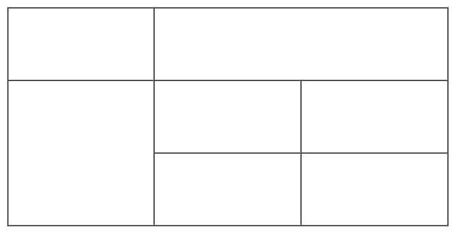

### 1.2 表单

#### 1.2.1 为什么需要表单

使用表单的目的是收集用户信息。

在网页中，需要跟用户进行交互，收集用户资料，此时就需要表单。

#### 1.2.2 表单的组成

在 HTML 中，一个完整的表单通常由 `表单域`、`表单控件`（也称为表单元素）和 `提示信息`  3 个部分构成。

#### ⭕1.2.3 表单域

**表单域是一个包含表单元素的区域。**

在 HTML 标签中，`<form>` 标签用于定义表单域，以实现用户信息的收集和传递。

`<form>` 会把它范围内的表单元素信息提交给服务器。

```html
<form action="url地址" method="提交方式" name="表单域名称">
    <!-- 各种表单元素控件 -->
</form>
```

**常用属性：**

| 属性名   | 属性值         | 作用                                               |
| -------- | -------------- | -------------------------------------------------- |
| `action` | `url` 地址     | 用于指定接收并处理表单数据的服务器程序的 url 地址  |
| `method` | `get` / `post` | 用于设置表单数据的提交方式，其取值为 get 或 post   |
| `name`   | 名称           | 用于指定表单的名称，以区分同一个页面中的多个表单域 |

注意：对于 HTML 基础的学习来说，暂时不用考虑提交数据，只需写上 form 标签即可，后面学习服务端编程阶段会重新讲解。

**form 表单中 method 的 get 和 post 区别：**

> method 方法规定如何发送表单数据（form-data）（表单数据会被发送到在 action 属性中规定的页面中）。
>
> 表单数据可被作为 URL 变量的形式来发送（method="get"）或者作为 HTTP post 事务的形式来发送（method="post"）。
>
> **关于 GET 的注释：**
>
> - 将表单数据以名称/值对的形式附加到 URL 中
> - URL 的长度是有限的（大约 3000 字符）
> - 绝不要使用 GET 来发送敏感数据！（在 URL 中是可见的，且浏览器会记录 URL）
> - 对于用户希望加入书签的表单提交很有用（因为信息记录在 URL 中，直接保存 URL 即可）
> - GET 更适用于非安全数据，比如在 Google 中查询字符串
>
> **关于 POST 的注释：**
>
> - 将表单数据附加到 HTTP 请求的 body 内（数据不显示在 URL 中）
> - 没有长度限制
> - 通过 POST 提交的表单不能加入书签

#### ⭕1.2.4 表单控件（表单元素）

在表单域中可以定义各种表单元素，这些表单元素就是允许用户在表单中输入或者选择的内容控件。

**（1）\<input>  表单元素**

在英文单词中，input 是输入的意思，而在表单元素中 `<input>` 标签用于收集用户信息。

在 `<input>` 标签中，包含一个 type 属性，根据不同的 type 属性值，输入字段拥有很多种形式（可以是文本、字段、复选框、掩码后的文本控件、单选按钮、按钮等）。

```html
<input type="属性值" />
```

- `<input />` 标签为单标签

- type 属性设置不同的属性值用来指定不同的控件类型

**type 属性的属性值及其描述如下：**

| 属性值     | 描述                                                         |
| ---------- | ------------------------------------------------------------ |
| `button`   | 定义可点击按钮（多数情况下，用于通过 JavaScript 启动脚本）   |
| `checkbox` | 定义复选框，即：多选框，在一组多选中，要求它们必须拥有相同的 name |
| `file`     | 定义输入字段和 “浏览” 按钮，供文件上传                       |
| `hidden`   | 定义隐藏的输入字段                                           |
| `image`    | 定义图像形式的提交按钮                                       |
| `password` | 定义密码字段，该字段中的字符被掩码                           |
| `radio`    | 定义单选按钮，在一组单选按钮中，要求它们必须拥有相同的 name  |
| `reset`    | 定义重置按钮，重置按钮会清除表单中的所有数据                 |
| `submit`   | 定义提交按钮，提交按钮会把表单数据发送到服务器               |
| `text`     | 定义单行的输入字段，用户可在其中输入文本，默认宽度为 20 个字符 |

【hidden解释】

> `<input type="hidden" name="..." value="...">`
> 上面是 html 中的隐藏域。主要作用为：
>
> 1. 隐藏域在页面中对于用户是不可见的，在表单中插入隐藏域的目的在于收集或发送信息，以利于被处理表单的程序所使用。浏览者单击发送按钮发送表单的时候，隐藏域的信息也被一起发送到服务器。
> 2. 有些时候我们要给用户一信息，让他在提交表单时提交上来以确定用户身份，如 sessionkey，等等。当然这些东西也能用 cookie 实现，但使用隐藏域就简单的多了。而且不会有浏览器不支持，也避免了用户禁用 cookie 后的烦恼。
> 3. 有些时候一个 form 里有多个提交按钮，怎样使程序能够分清楚到底用户是按那一个按钮提交上来的呢？我们就可以写一个隐藏域，然后在每一个按钮处加上   onclick="document.form.command.value="xx"" 然后我们接到数据后先检查 command 的值就会知道用户是按的那个按钮提交上来的。
> 4. 有时候一个网页中有多个 form，我们知道多个 form 是不能同时提交的，但有时这些 form 确实相互作用，我们就可以在 form 中添加隐藏域来使它们联系起来。
> 5. javascript 不支持全局变量，但有时我们必须用全局变量，我们就可以把值先存在隐藏域里，它的值就不会丢失了。
> 6. 定义隐藏输入字段，隐藏字段对于用户是不可见的。隐藏字段常常存储默认值。
> 7. 通常是提交一些表格的时候，有些变量是预先定了其值的，而且不想客户再改变其值，所以用 hidden 隐藏，但提交表单的时候还是会把其值上交上去的。
>
> 以上为基本用法，其实和文本框差不多的作用，唯一的区别就是用户界面是不可见的。
>
> 在使有中要注意，不要将敏感信息存放在隐藏域里！尽管一般用户看不到它。
>
> 【案例】
>
> ```html
> <!doctype html>
> <html lang="en">
> 
> <head>
>     <meta charset="UTF-8">
>     <meta http-equiv="X-UA-Compatible" content="IE=edge">
>     <meta name="viewport" content="width=device-width, initial-scale=1.0">
>     <title>Document</title>
> </head>
> 
> <body>
> <form action="http://127.0.0.1:8080/" method="get">
>     <input type="hidden" name="name" value="dselegent">
>     <input type="submit">
> </form>
> 
> </body>
> 
> </html>
> ```
>
> 

**除 type 属性外，`<input>` 标签还有很多其他属性，其常用属性如下：**

| 属性名      | 属性值       | 描述                                        |
| ----------- | ------------ | ------------------------------------------- |
| `name`      | 由用户自定义 | 定义 input 元素的名称                       |
| `value`     | 由用户自定义 | 规定 input 元素的值，也就是提交到服务器的值 |
| `checked`   | checked      | 规定此 input 元素首次加载时应当被选中       |
| `maxlength` | 正整数       | 规定输入字段中的字符的最大长度              |

- `name` 和 `value` 是每个表单元素都有的属性值，主要给后台人员使用
- `name` 表单元素的名字，要求：单选按钮和复选框要有相同的 name 值
- `checked` 属性主要针对于单选按钮和复选框，主要作用：打开页面时默认选中某个表单元素
- `maxlength` 是用户可以在表单元素输入的最大字符数，一般很少使用

**<1>、有些表单元素刚打开页面就须要默认显示几个文字怎么做？**

答：可以给这些表单元素设置 `value属性="值"`。

```html
用户名：<iuput type="text" value="请输入用户名" />
```

**<2>、页面中的表单元素很多，如何区别不同的表单元素？**

答：name 属性：当前 input 表单的名字，后台可以通过这个 name 属性找到这个表单，页面中的表单很多，name 的主要作用就是用于区别不同的表单。

```html
用户名：<input type="text" value="请输入用户名" name="username" />
```

- name 属性后面的值是自定义的
- radio（或者 checkbox）如果是一组，我们必须给他们命名相同的名字

```html
<input type="radio" name="sex" />男
<input type="radio" name="sex" />女
```

**<3>、如果页面一打开就让某个单选按钮或者复选框是选中状态？**

答：checked 属性：表示默认选中状态，用于单选按钮和复选按钮。

```html
性 别：
<input type="radio" name="sex" value="男" checked="checked" />男
<input type="radio" name="sex" value="女" >女
```

- \<label\> 标签

`<label>` 标签为 input 元素定义标注（标签）。

`<label>` 标签用于绑定一个表单元素，**当点击 `<label>` 标签内的文本时，浏览器就会自动将焦点（光标）转到或者选择对应的表单元素上，用来增加用户体验。**

**语法：**

```html
<label for="sex">男</label>
<input type="radio" name="sex" id="sex" />
<label>
    男<input type="radio" value="男" name="sex" />
</label>
```

**核心：** `<label>` 标签的 for 属性应当与相关元素的 id 属性相同。


**（2）\<select> 表单元素**

**使用场景：**在页面中，如果有多个选项让用户选择，并且想要节约页面空间时，我们可以使用 `<select>` 标签控件定义下拉列表。

**语法：**

```html
<select>
    <option>选项1</option>
    <option>选项2</option>
    <option>选项3</option>
    ...
</select>
```

- `<select>` 中至少包含一对 `<option>`
- 在 `<option>` 中定义 `selected="selected"` 时，当前项即为默认选中项

每个 `<option>` 元素都应该有一个 value 属性，其中包含选择该选项时要提交给服务器的数据值。如果不包含 value 属性，则 value 默认为元素内包含的文本。可以在 `<option>` 元素上包含 selected 属性，以使其在页面首次加载时默认选中。

**（3）\<textarea> 表单元素**

**使用场景：**当用户输入内容较多的情况下，我们就不能使用文本框表单了，此时我们可以使用 `<textarea>` 标签

在表单元素中，`<textarea>` 标签是用于定义多行文本输入的控件。

使用多行文本输入控件，可以输入更多的文字，该控件常用于留言板、评论。

**语法：**

```html
<textarea rows="3" cols="20">
	文本内容
</textarea>
```

- 通过 `<textarea>` 标签可以轻松地创建多行文本输入框
- `cols="每行中的字符数"`，`rows="显示的行数"`，我们在实际开发中不会使用，都是用 CSS 来改变大小

- 如果要禁止拉伸文本框大小，则：`style="resize: none" `

#### ⭕1.2.5按钮

```html
<!-- 提交按钮 -->
<input type="submit">
<!-- 重置按钮 -->
<input type="reset">
<!-- 普通按钮 -->
<input type="button" value="按钮">
<br><br>
<button type="submit">提交</button>
<button type="reset">重置</button>
<button type="button">按钮</button>
```

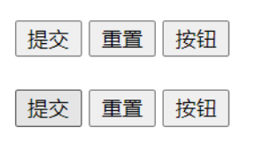

上面两种写法实际上效果是一致的，**区别**在于：

- `input`是自闭合标签，不需要`</input>`就能结束；`button`不是自闭合标签，跟一般标签一样是成对出现的

- `button`因为不是自闭合标签，所以使用起来更灵活，可以嵌套其他的标签

> 除了type=button，都会跳转页面

#### ⭕1.2.6表单的css

某些表单元素激活时会有`outline`默认样式

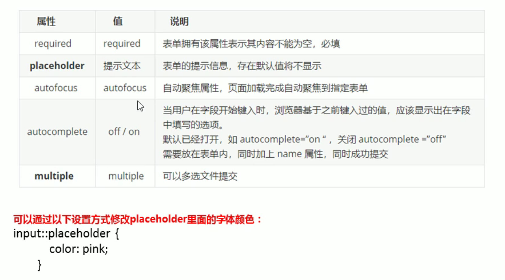

```html
<!DOCTYPE html>
<html lang="en">
	<head>
		<meta charset="UTF-8" />
		<meta name="viewport" content="width=device-width, initial-scale=1.0" />
		<meta http-equiv="X-UA-Compatible" content="ie=edge" />
		<title>HTML5新增表单属性</title>
		<style>
			input::placeholder {
				color: red;
			}
		</style>
	</head>

	<body>
		<form action="target.html">
			<!-- 
				autocomplete="off" 关闭自动记录
				readonly 将表单项设置为只读，数据会提交
				disabled 将表单项设置为禁用，数据不会提交
				autofocus 设置表单项自动获取焦点（自动激活那个输入框）
			 -->
			<input type="text" name="username" value="hello" readonly />
			<br /><br />
			<input type="text" name="username" autofocus />
			<br /><br />
			<input type="submit" />
			<!-- 重置按钮 -->
			<input type="reset" />
			<!-- 普通的按钮 -->
			<input type="button" value="按钮" />
			<br /><br />
			<input type="text" name="b" placeholder="hsl" />
			<br /><br />
			<button type="submit">提交</button>
			<button type="reset">重置</button>
			<!-- 普通的按钮(仅仅是能够按，没有别的作用) -->
			<button type="button">按钮</button>
		</form>
	</body>
</html>

```

**多文件演示**

```html
<!doctype html>
<html lang="en">
<head>
    <meta charset="UTF-8">
    <meta name="viewport" content="width=device-width, initial-scale=1.0">
    <meta http-equiv="X-UA-Compatible" content="ie=edge">
    <title>HTML5新增表单属性</title>
    <style>
        input::placeholder {
            color: hotpink;
        }
    </style>
</head>
<body>
<form action="">
    <input type="search" name="sear" id="one" required="required" placeholder="pink老师" autofocus="autofocus"
           autocomplete="off">
    <input type="file" name="" id="two" multiple="multiple">
    <input type="submit" value="提交">
</form>

</body>
</html>
```


**快捷输入**

```html
<!doctype html>
<html lang="en">

<head>
    <meta charset="UTF-8">
    <meta name="viewport" content="width=device-width, initial-scale=1.0">
    <meta http-equiv="X-UA-Compatible" content="ie=edge">
    <title>HTML5新增表单属性</title>
    <style>
        input::placeholder {
            color: hotpink;
        }
    </style>
</head>

<body>
    <form action="">
        <input type="search" name="sear" id="one" required="required" placeholder="pink老师" autofocus="autofocus"
            autocomplete="on">
        <input type="submit" value="提交">
    </form>

</body>

</html>
```


**自动聚焦**

```html
<!doctype html>
<html lang="en">

<head>
    <meta charset="UTF-8">
    <meta name="viewport" content="width=device-width, initial-scale=1.0">
    <meta http-equiv="X-UA-Compatible" content="ie=edge">
    <title>HTML5新增表单属性</title>
    <style>
        input::placeholder {
            color: hotpink;
        }
    </style>
</head>

<body>
    <form action="">
        <input type="search" name="sear" id="one" required="required" placeholder="pink老师" autofocus="autofocus"
            autofocus="autofocus">
        <input type="submit" value="提交">
    </form>

</body>

</html>
```


#### ⭕1.2.7HTML5新增的input类型

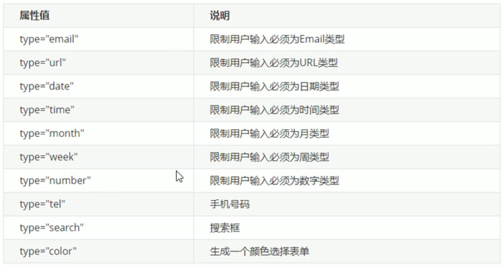

```html
<!doctype html>
<html lang="en">

<head>
    <meta charset="UTF-8">
    <meta name="viewport" content="width=device-width, initial-scale=1.0">
    <meta http-equiv="X-UA-Compatible" content="ie=edge">
    <title>Document</title>
</head>

<body>
<!-- 我们验证的时候必须添加form表单域 -->
<form action="">
    <ul>
        <li>邮箱: <input type="email"/></li>
        <li>网址: <input type="url"/></li>
        <li>日期: <input type="date"/></li>
        <li>时间: <input type="time"/></li>
        <li>数量: <input type="number"/></li>
        <li>手机号码: <input type="tel"/></li>
        <li>搜索: <input type="search"/></li>
        <li>颜色: <input type="color"/></li>
        <!-- 当我们点击提交按钮就可以验证表单了 -->
        <li><input type="submit" value="提交"></li>
    </ul>
</form>
</body>

</html>
```

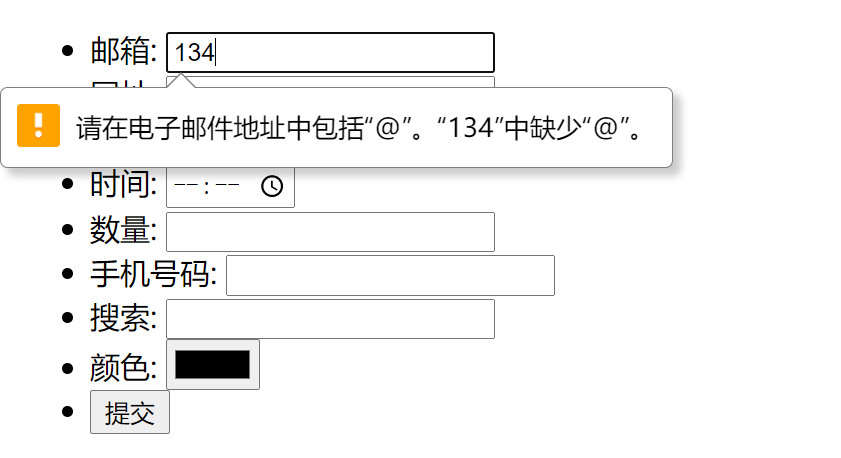

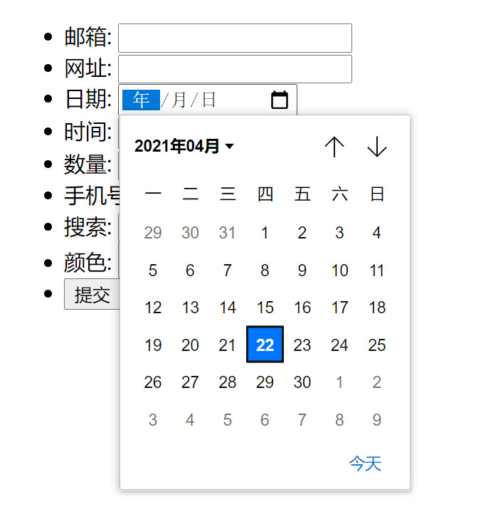

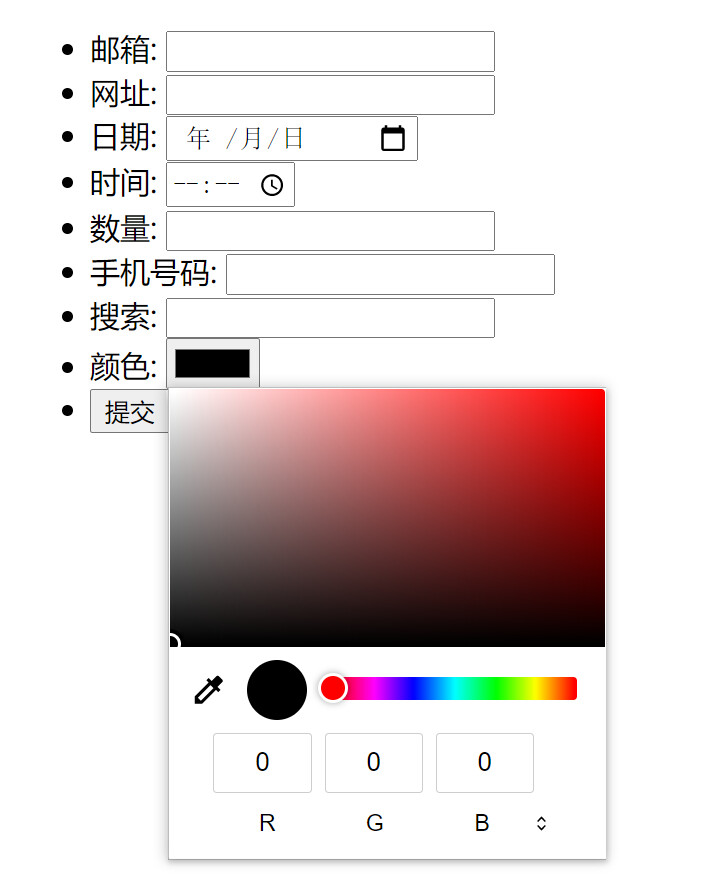

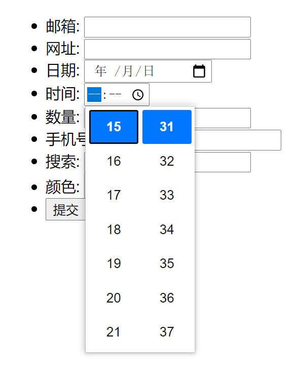

注意：HTML5 所提供的 input 类型可以依据具体的系统环境适配界面样式。


当为数值框时，输入法自动打开数字键盘！


#### ⭕1.2.8表单元素几个总结

（1）表单元素我们学习了三大组 `input 输入表单元素`、`select 下拉表单元素`、`textarea 文本域表单元素`

（2）这三组表单元素都应该包含在 `form 表单域` 里面，并且应该有 `name 属性`

```html
<form>
    <input type="text" name="username">
    <select name="jiguan">
        <option>北京</option>
    </select>
    <textarea name="message"></textarea>
</form>
```

（3）有三个名字非常相似的标签：

- 表单域 form 使用场景：提交区域内表单元素给后台服务器
- 文件域 file 是 input type 属性值 使用场景：上传文件
- 文本域 textarea 使用场景：可以输入多行文字，比如：留言板、网站介绍等……

> **表单中 name 属性的重要性：**
>
> **name 属性用于对提交到服务器后的表单数据进行标识。注意：只有设置了 name 属性的表单元素才能在提交表单时传递它们的值。简单来说，name 就是提交到后台的索引，比如在复选框中都要设置成name="hobby" 说明几个复选框都在 ”爱好“ 下。**
>
> **即：表单想要把数据提交到指定的位置，表单控件必须要有 name 属性。**

##  2.CSS简介

###  2.1 什么是CSS

CSS 是 `层叠样式表` 的简称。

有时我们也会称之为 `CSS样式表` 或 `级联样式表`。

CSS 也是一种 `标记语言`。

CSS 主要用于设置 HTML 页面中的文本样式（字体、大小、颜色、对齐方式……）、图片样式（宽高、边框样式、边距……）以及版面的布局和外观显示样式。

CSS 让我们的网页更加丰富多彩，布局更加灵活自如，简单理解：CSS 可以美化 HTML，让 HTML 更漂亮，同时让页面布局更简单。

**层叠样式表**

网页实际上是一个多层的结构，通过CSS可以分别为网页的每一个层来设置样式，而最终我们能看到只是网页的最上边一层

总之一句话，CSS用来设置网页中元素的样式

**总结：**

- HTML 搭建结构，填入元素内容
- CSS 美化 HTML，布局网页元素
- CSS 最大价值：由 HTML 专注去做结构呈现，样式交给 CSS，即：**结构 与 样式 分离**


###  ⭕2.2 CSS语法规范

使用 HTML 时，需要遵从一定的规范，CSS 也是如此，要想熟练地使用 CSS 对网页进行修饰，首先需要了解 CSS 样式规则。

CSS 规则由两个主要的部分构成：`选择器` 以及 `一条或多条声明`。

- `选择器` 是用于选出需要设置 CSS 样式的 HTML 标签，**花括号**内是对该对象设置的具体样式
- `属性` 和 `属性值` 以 `“键值对”` 的形式出现 `属性: 属性值;`
- 属性是对指定的对象设置的样式属性，例如：字体大小、文本颜色等
- 属性和属性值之间用英文 `:` 分开
- 多个 “键值对” 之间用英文 `;` 进行区分（末尾的键值对可以不加 `;`）

所有的样式，都包含在 `<style>` 标签内，表示是样式表。

`<style>` 一般写到 `</head>` 里。

```html
<head>
    <style type="text/css">
        h4 {
            color: bule;
            font-size: 100px;
        }
    </style>
</head>
```

注意：`<style>` 标签可以写到其他标签内部并作用与该标签区域内，但是强烈不推荐这种写法！

> `type="text/css"` 可以省略。

###  2.3 CSS代码风格

####  2.3.1 样式格式书写

- 紧凑格式（不推荐）

```css
h3 { color: deeppink; font-size: 20px; }
```

- 展开格式（**推荐**）

```css
h3 {
	color: deeppink;
	font-size: 20px;
}
```

强烈推荐第二种格式，因为更直观！不用担心占用空间，因为后期可以通过代码压缩工具来压缩代码。

####  2.3.2 样式大小书写

- 大写（不推荐）

```css
H3 {
	COLOR: PINK;
}
```

- 小写（**推荐**）

```css
h3 {
	color: pink;
}
```

强烈推荐样式选择器，属性名，属性值关键字**全部使用小写字母**，特殊情况除外。

> 凡是你不确定是否用大写的都一律用小写就对了！

####  ⭕2.3.3 空格规范

```css
h3 {
	color: pink;
}
```

- **属性值前面**，**冒号后面**，保留一个空格
- **选择器（标签）和前花括号中间**，保留一个空格

###  2.4 注释

####  2.4.1 css中的注释

只能使用`/*`和`*/`包裹。即不管是单行注释，还是多行注释，都是以`/*`开头，以`*/`结尾

```css
/* css中的单行注释 */

/* 
css中的多行注释
css中的多行注释
css中的多行注释
*/
```

####  2.4.2 html中的注释

只能使用`<!--`和`-->`包裹。即不管是单行注释，还是多行注释，都是以`<!--`开头，以`-->`结尾

```html
<!-- html中的单行注释 -->

<!-- 
html中的多行注释
html中的多行注释
html中的多行注释
-->
```

####  4.3JS(JavaScript)中的注释

单行注释使用`//`。多行注释使用`/*`和`*/`包裹，以`<!--开头，以-->`结尾

```js
/* JS(JavaScript)中的单行注释*/

/*
JS(JavaScript)中的多行注释
JS(JavaScript)中的多行注释
JS(JavaScript)中的多行注释
*/
```

###  2.5 基本语法

```
选择器 声明块
```

**选择器**

通过选择器可以选中页面中的指定元素

- 比如`p`的作用就是选中页面中所有的`p`元素声明块

**声明块**

通过声明块来指定要为元素设置的样式

-  声明块由一个一个的声明组成，声明是一个名值对结构 

-  一个样式名对应一个样式值，名和值之间以`:`连接，以`;`结尾 

```css
h1{
    color: green;
}
```

###  ⭕2.6 CSS 命名规范

页面外围控制整体布局宽度：`wrapper`、页头：`header`、页面主体：`main`、内容：`content`、页脚：`footer`、导航：`nav`、主导航：`mainbav`、子导航：`subnav`、顶导航：`topnav`、边导航：`sidebar`、左导航：`leftsidebar`、右导航：`rightsidebar`、菜单：`menu`、子菜单：`submenu`、搜索：`search`、栏目：`column`、侧栏：`sidebar`、功能区（商品模块）：`shop`、左右中：`left` `right` `center`、登录：`login`、登录条：`loginbar`、注册：`regsiter`、标志：`logo`、横幅广告：`banner`、热点：`hot`、新闻：`news`、按钮：`btn`、滚动：`scroll`、标签页：`tab`、文章列表：`list`、 标题：`title`、摘要：`summary`、提示信息：`msg`、小技巧：`tips`、图标：`icon`、下载：`download`、加入我们：`joinus`、注释：`note`、指南：`guild`、服务：`service`、状态：`status`、投票：`vote`、合作伙伴：`partner`、链接：`link`、友情链接：`friendlink`、版权：`copyright`

###  ⭕2.7 CSS属性书写顺序

**建议遵循以下顺序：**

1. 布局定位属性：`display / position / float / clear / visibility / overflow`（建议 `display` 第一个写，毕竟关系到模式）

2. 自身属性：`width / height / margin / padding / border / background`

3. 文本属性：`color / font / text-decoration / text-align / vertical-align / white-space / break-word`

4. 其他属性（CSS3）：`content / cursor / border-radius / box-shadow / text-shadow / background:linear-gradient …`

```css
.jdc {
	display: block;
	position: relative;
	float: left;
	width: 100px;
	height: 100px;
	margin: 0 10px;
	padding: 20px 0;
	font-family: Arial, 'Helvetica Neue', Helvetica, sans-serif;
	color: #333;
	background: rgba(0,0,0,.5);
	border-radius: 10px;
}
```

###  2.8 SEO优化

> SEO 优化是个复杂长期的过程，此处只是简单的介绍 SEO 优化，目的是提高前端开发者的认知。

SEO（Search Engine Optimization）：汉译为**搜索引擎优化**。是一种方式：利用[搜索引擎](https://baike.baidu.com/item/搜索引擎/104812)的规则提高网站在有关搜索引擎内的[自然排名](https://baike.baidu.com/item/自然排名/2092669)。目的是让其在行业内占据领先地位，获得[品牌](https://baike.baidu.com/item/品牌/235720)收益。很大程度上是网站经营者的一种商业行为，将自己或自己公司的排名前移。（百度百科）


> 外链：链接到外部网页的链接，外链不是越多越好，而是外链的质量越高、越合理、越方便越好。
>
> 反链：被其他页面链接，反链的源头质量越高、链接次数越高越好。

- [Google PageRank算法 - 黄规速博客：学如逆水行舟，不进则退-CSDN博客](https://blog.csdn.net/hguisu/article/details/7996185)

- [Google 段落排名算法（Passage Ranking）全解读 - 阿里云开发者社区 (aliyun.com)](https://developer.aliyun.com/article/782412)

**【用户体验优化】**

网站体验也可称为网站用户体验，如何做好这一步优化！ 首先得确定你的目标用户群体，了解他们的上网习惯，分析他们的心理。然后顺着用户的特征来一步步优化网站，从而获得用户的青睐，通过用户体验优化来提高转换率。

**UEO（用户体验优化）=PV/OR**

- PV：即页面浏览量或点击量

- OR：跳出率，跳出率指那些访问该网站，仅浏览了一个页面就离开的用户所占的比例

**从上述可以看出，用户跳出率低，页面浏览量就越高，用户体验就越好！**

###  2.9 狭义的 HTML5 CSS3

1. HTML5 结构本身

   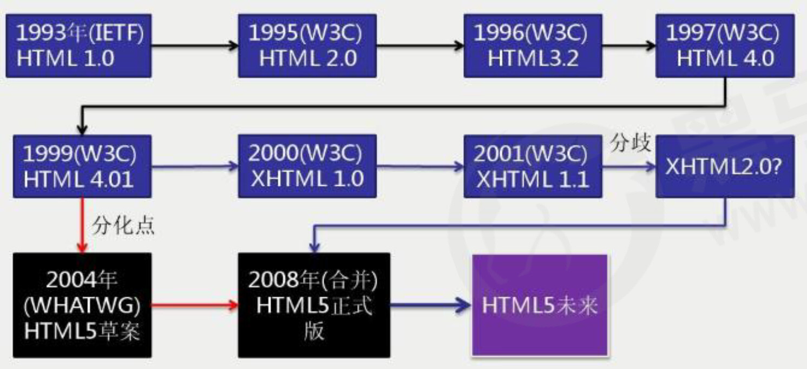

2. CSS3 相关样式

   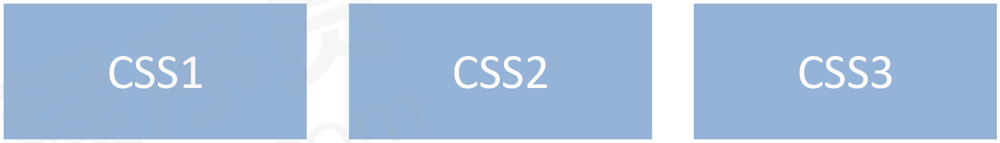

###  2.10 广义的 HTML5

1. 广义的 HTML5 是 HTML5 + CSS3 + JavaScript
2. 这个集合有时称为 H5
3. 虽然 HTML5 的一些特性仍然不被某些浏览器支持，但是它是一种发展趋势

# 04 【CSS选择器 】

## 1.CSS选择器的作用

选择器就是根据不同的需求把不同的标签选出来，这就是选择器的作用，简单来说，就是：选择标签用的。

```css
h1 {
	color: red;
	font-size: 25px;
}
```

以上 CSS 做了两件事：

- 找到所有的 h1 标签。（选对人）
- 设置这些标签的样式：颜色为红色、字体大小为 25 像素。（做对事）

## 2.选择器的分类

在 CSS 中，可以根据选择器的类型把选择器分为：`基础选择器` 和 `复合选择器`，复合选择器是建立在基础选择器之上，对基础选择器进行**组合形成**的。

- 基础选择器是由 `单个` 选择器组成的
- 基础选择器又包括：`标签选择器`、`类选择器`、`id 选择器`、`通配符选择器`
- 复合选择器可以更准确、更高效的选择目标元素（标签）
- 复合选择器是由两个或多个基础选择器，通过不同的方式组合而成的
- 常用的复合选择器包括：**后代选择器**、**子选择器**、**并集选择器**、**伪类选择器**等


## 3.标签选择器

`标签选择器`（元素选择器）是指用 HTML 标签名称作为选择器，按标签名称分类，为页面中某一类标签指定统一的 CSS 样式。

**语法：**

```css
标签名 {
	属性1: 属性值1;
	属性2: 属性值2;
	属性3: 属性值3;
	...
}
```

**作用：**

标签选择器可以把某一类标签全部选择出来，比如所有的 `<div>` 标签和所有的 `<span>` 标签。

**优点：**

能快速为页面中同类型的标签统一设置样式。

**缺点：**

不能设计差异化样式，只能选择全部的当前标签。

## 4.类选择器

如果想要差异化选择不同的标签，单独选一个或者某几个标签，可以使用 `类选择器` 。

**CSS 语法：**

```css
.类名 {
	属性1: 属性值1;
	...
}
```

例如：将所有拥有 red 类的 HTML 元素均设置为红色。

```css
.red {
	color: red;
}
```

**HTML 语法：**

```html
<div class="red">变红色</div>
```

类选择器在 HTML 中以 class 属性表示，在 CSS 中，类选择器以一个 `.` 号显示。

**注意：**

- 类选择器使用 `.`（英文点号）进行标识，后面紧跟类名（自定义，我们自己命名的）
- 可以理解为给这个标签起了一个别名来表示
- 长名称或词组可以使用**中横线** `-` 来为类命名
- 不能使用已有的关键字作为类名
- 不要使用纯数字、中文等命名，尽量使用英文字母来表示
- 命名要有意义，尽量使别人一眼就知道这个类名的目的（**可读性第一，长度第二，推荐使用英语，如果是使用拼音请使用全拼**）
- 命名规范：见附件（Web前端开发规范手册.pdf）

**类选择器——多类名**

我们可以给一个标签指定多个类名，从而达到更多的选择目的，这些类名都可以选出这个标签，简单理解就是一个标签有多个名字。

- 在标签 class 属性中写多个类名
- 多个类名中间必须用 `空格` 分开
- 这个标签就可以分别具有这些类名的样式

```html
    <style type="text/css">
        /* 一个标签可以运用多个类选择器，之间用空格隔开 */
        .red {
            color: red;
        }

        .font35 {
            font-size: 35px;
        }
    </style>
    <div class="red font35">dselegent</div>
```

**多类名开发中使用场景**

- 可以把一些标签元素相同的样式（共同的部分）放到一个类里面
- 这些标签都可以调用这个公共的类，然后再调用自己独有的类
- 从而节省 CSS 代码，统一修改也非常方便（**模块化、可重用化**）

```html
    <style type="text/css">
        /* 类选择器最大的优势在于：复用 */
        .box {
            width: 100px;
            height: 100px;
        }

        .red {
            background-color: red;
        }

        .green {
            background-color: green;
        }
    </style>
    <div class="box red"></div>
    <div class="box green"></div>
    <div class="box red"></div>
```

多类名选择器在后期布局比较复杂的情况下，是使用得较多的。

## 5.id选择器

id 选择器可以为标有特定 id 的 HTML 元素指定特定的样式。

HTML 元素以 id 属性来设置 id 选择器，CSS 中 id 选择器以 `#` 来定义。

**语法：**

```css
#id名 {
	属性1: 属性值1;
	...
}
```

**例如：**将 id 为 nav 元素中的内容设置为红色。

```css
#nav {
	color: red;
}
```

**注意：****id 属性只能在每个 HTML 文档中出现一次。**

**口诀：**样式 `#` 定义，结构 `id` 调用，只能调用一次，别人切勿使用。

**id 选择器和类选择器的区别：**

- 类选择器 (class) 好比人的名字，一个人可以有多个名字，同时一个名字也可以被多个人使用
- id 选择器好比人的身份证号码，全中国是唯一的，不可重复（同一个 id 选择器只能调用一次）
- id 选择器和类选择器最大的不同在于使用次数上
- 类选择器在修改样式中用的最多，id 选择器一般用于页面唯一性的元素上，经常和 JavaScript 搭配使用

```html
    <style type="text/css">
        #pink {
            color: pink;
        }
    </style>
    <div id="pink">dselegent</div>
```

再次强调：**同一 id 只能定义一次，同一 id 选择器也只能调用一次！**（对于 CSS 修改样式来说，最好使用类选择器，id 选择器主要与后面的 JS 搭配使用）。

## 6.通配符选择器

在 CSS 中，通配符选择器使用 `*` 定义，它表示选取页面中**所有元素**（标签）。

**语法：**

```css
* {
	属性1: 属性值1;
	...
}
```

- 通配符选择器不需要调用，自动就给所有的元素使用样式
- 特殊情况才使用，后面讲解使用场景

```css
* {
	margin: 0;
	padding: 0;
}
```

## ⭕7.基础选择器总结

| 基础选择器   | 作用                            | 特点                                                  | 使用情况       | 用法                 |
| ------------ | ------------------------------- | ----------------------------------------------------- | -------------- | -------------------- |
| 标签选择器   | 可以选出所有相同的标签，比如：p | 不能差异化选择                                        | 较多           | `p {color: red;}`    |
| 类选择器     | 可以选出 1 个或者 多个 标签     | 可以根据需求选择                                      | 非常多         | `.nav {color: red;}` |
| id 选择器    | 一次只能选择 1 个标签           | ID 属性只能在每个 HTML 文档中出现一次，也只能调用一次 | 一般和 js 搭配 | `#nav {color: red;}` |
| 通配符选择器 | 选择所有的标签                  | 选择的太多，有部分不需要                              | 特殊情况使用   | `* {color: red;}`    |

- 每个基础选择器都有使用场景，都需要掌握
- 如果是修改样式，类选择器是使用最多的

## 8.关系选择器

- 父元素：直接包含子元素的元素叫做父元素

- 子元素：直接被父元素包含的元素是子元素

- 祖先元素：直接或间接包含后代元素的元素叫做祖先元素；一个元素的父元素也是它的祖先元素

- 后代元素：直接或间接被祖先元素包含的元素叫做后代元素；子元素也是后代元素

- 兄弟元素：拥有相同父元素的元素是兄弟元素

### ⭕8.1 后代选择器

`后代选择器` 又称为 `包含选择器`，可以选择父元素里面子元素。其写法就是把外层标签写在前面，内层标签写在后面，中间用空格分隔。当标签发生嵌套时，内层标签就成为外层标签的后代。

**语法：**

```css
元素1 元素2 { 样式声明 }
```

上述语法表示选择 元素 1 里面的**所有**元素 2 （后代元素）。 

**例如：**

```css
ul li { 样式声明 } 		/* 选择 ul 里面所有的 li 标签元素 */
```

- 元素1 和 元素2 中间用 **空格** 隔开
- 元素1 是父级，元素2 是子级，最终选择的是 元素2，即：元素1 是不会生效样式的
- 元素2 可以是儿子，也可以是孙子等，只要是 元素1 的后代即可
- 元素1 和 元素2 **可以是任意基础选择器**

```html
    <style>
        /* 把 ol 里面的小 li 选出来改为 pink */
        ol li {
            color: pink;
        }

        /* 把 ol 里面的小 a 选出来改为 red */
        ol a {
            color: red;
        }

        /* 把 ul 里面的小 li 选出来改为 green */
        ul li {
            color: green;
        }

        /* 把 nav 类中的 li 里面的 a 选出来改为 yellow */
        .nav li a {
            color: yellow;
        }
    </style>
    
    <ol>
        <li>我是 ol 的孩子</li>
        <li>我是 ol 的孩子</li>
        <li>我是 ol 的孩子</li>
        <li><a href="#">我是 ol 的孙子</a></li>
    </ol>
    <ul>
        <li>我是 ul 的孩子</li>
        <li>我是 ul 的孩子</li>
        <li>我是 ul 的孩子</li>
        <li><a href="#">我是 ul 的孙子，但是我不会变化</a></li>
    </ul>
    <ul class="nav">
        <li><a href="#">我偏要变色！并且只能我一个人色……</a></li>
    </ul>
```

### ⭕8.2 子选择器

子元素选择器（子选择器）只能选择作为某元素的**最近一级子元素**，简单理解就是选亲儿子元素。

注意：是**最近一级而并非最近一个**！

**语法：**

```css
元素1>元素2 { 样式声明 }
```

上述语法表示选择元素1 里面的所有直接后代（子元素）元素2。

**例如：**

```css
div>p { 样式声明 } 	/* 选择 div 里面所有最近一级 p 标签元素 */
```

- 元素1 和 元素2 中间用 **大于号** 隔开
- 元素1 是父级，元素2 是子级，最终选择的是元素2，即元素1 是不会生效样式的
- 元素2 **必须是亲儿子，其孙子、重孙之类都不归他管**，你也可以叫：亲儿子选择器

```html
    <style>
        .nav>a {
            color: red;
        }
    </style>

    <div class="nav">
        <a href="#">我是儿子1</a>
        <p>
            <a href="#">我是孙子1</a>
            <a href="#">我是孙子2</a>
        </p>
        <a href="#">我是儿子2</a>
    </div>
```

### ⭕8.3 兄弟元素选择器

- 作用：选择下一个兄弟

- 语法：`前一个 + 下一个` `前一个 + 下一组`

- 例子1：`A1 + A2`

  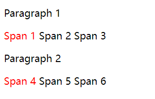

- 例子2: `A1 ~ An`

  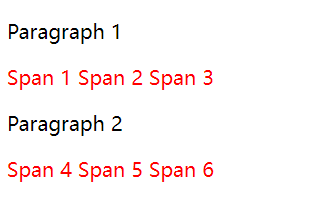

```css
<!DOCTYPE html>
<html>
	<head>
		<title>Test</title>
		<style>
			/* 选择下一个紧跟着的兄弟，中间不能有别的元素相隔 */
			/* p + span {
				color: red;
			} */

			/* 选择下边所有的兄弟*/
			p ~ span {
				color: red;
			}
		</style>
	</head>
	<body>
		<p>Paragraph 1</p>
		<span>Span 1</span>
		<span>Span 2</span>
		<span>Span 3</span>
		<p>Paragraph 2</p>
		<span>Span 4</span>
		<span>Span 5</span>
		<span>Span 6</span>
	</body>
</html>
```

## 9.复合选择器

### ⭕9.1 并集选择器

`并集选择器` 可以选择多组标签，同时为他们定义相同的样式，通常用于**集体声明**。
`并集选择器` 是各选择器通过**英文逗号** `,` 连接而成，任何形式的选择器都可以作为并集选择器的一部分。

**语法：**

```css
元素1, 元素2, 元素3 { 样式声明 }
```

```css
元素1,
元素2,
元素3 {
    样式声明
}
/* 推荐写法，编码风格 */
```

上述语法表示选择元素1、元素2 和 元素3。

**例如：**

```css
ul, div { 样式声明 }		 /* 选择 ul 和 div标签元素 */
```

- 元素1 和 元素2 中间用逗号隔开（最后一个不加逗号）
- 逗号可以理解为和的意思
- 并集选择器通常用于集体声明

```html
    <style>
        /* 要求1：请把熊大和熊二改为粉色 */
        /* div,
        p {
            color: pink;
        } */

        /* 要求2：请把熊大和熊二改为红色，还有小猪一家改为粉色 */
        div,p,.pig li {
            color: pink;
        }
        /* 语法规范：并集选择器通常竖着写 */
    </style>

    <div>熊大</div>
    <p>熊二</p>
    <span>光头强</span>
    <ul class="pig">
        <li>小猪佩奇</li>
        <li>猪爸爸</li>
        <li>猪妈妈</li>
    </ul>
```

### ⭕9.2 交集选择器

- 作用：选中同时符合多个条件的元素

- 语法：`选择器1选择器2选择器3选择器n{}`

- 注意点：交集选择器中如果有元素选择器，必须使用元素选择器开头

```css
<!DOCTYPE html>
<html>
	<head>
		<title>Test</title>
		<style>
			div.red {
				color: red;
			}

			.a.b.c {
				color: blue;
			}
		</style>
	</head>
	<body>
		<div class="red">熊大</div>
		<div>熊二</div>
		<ul class="a">
			<li>小猪佩奇</li>
			<li>猪爸爸</li>
		</ul>
		<ul class="a b c">
			<li>小猪佩奇</li>
			<li>猪妈妈</li>
		</ul>
	</body>
</html>

```

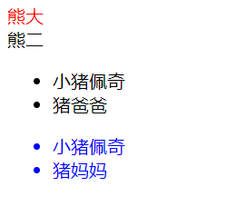

## ⭕10.属性选择器

属性选择器可以根据元素特定属性来选择元素。这样就可以不用借助于类或者 id 选择器。

- 作用：根据元素的属性值选中一组元素

- 语法1：`[属性名]` 选择含有指定属性的元素

- 语法2：`[属性名=属性值]` 选择含有指定属性和属性值的元素

- 语法3：`[属性名^=属性值]` 选择属性值以指定值开头的元素

- 语法4：`[属性名$=属性值]` 选择属性值以指定值结尾的元素

- 语法5：`[属性名*=属性值]` 选择属性值中含有某值的元素

- 例子：`p[title]{}` `p[title=e]{}` `p[title^=e]{}` `p[title$=e]{}` `p[title*=e]{}`

注意：类选择器、属性选择器、伪类选择器，权重为 10。

```css
<!DOCTYPE html>
<html>
	<head>
		<title>Test</title>
		<style>
			p[title="temp"] {
				color: green;
			}
			p[title$="example"] {
				color: yellow;
			}
			p[title^="example"] {
				color: red;
			}
			p[test*="t"] {
				color: blue;
			}
		</style>
	</head>
	<body>
		<p title="temp">This is an example paragraph.</p>
		<p title="example another">This is another example paragraph.</p>
		<p title="yet another example">
			This is yet another example paragraph.
		</p>
		<p test="t">This is a test paragraph.</p>
		<p test="t example">This is a another test paragraph.</p>
	</body>
</html>

    color: orange;
}
```

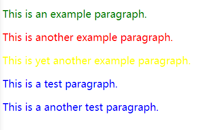

## 11.伪类选择器

### ⭕11.1 结构伪类选择器

`伪类选择器` 用于**向某些选择器添加特殊的效果**，比如：给链接添加特殊效果（链接伪类），或选择第 n 个元素（结构伪类）。
`伪类选择器` 书写最大的特点是用**冒号** `:` 表示，比如：`:hover`、`:first-child`。 
因为伪类选择器很多，比如：`链接伪类`、`结构伪类` 等，所以这里先讲解常用的链接伪类选择器。

> 伪类的由来：因为在页面中并没有这个真实存在的类，所以称为 “伪类”。
>
> 伪类（不存在的类，特殊的类）
>
> 伪类用来描述一个元素的特殊状态，比如：第一个子元素、被点击的元素、鼠标移入的元素.…

`nth-child(n)` 选择某个父元素的一个或多个特定的子元素（重点）。

- n 可以是数字，关键字和公式
- n 如果是数字，就是选择第 n 个子元素，里面数字从 1 开始……
- n 可以是关键字：even 偶数，odd 奇数
- n 可以是公式：常见的公式如下（如果 n 是公式，则从 n = 0 开始计算，但是第 0 个元素和超出了元素的个数会被忽略）

| 公式       | 取值                               |
| ---------- | ---------------------------------- |
| `n`        | 第n个，n的范围0到正无穷            |
| `2n/even`  | 偶数（2、4、6、……）                |
| `2n+1/odd` | 奇数（1、3、5、……）                |
| `5n`       | 5   10   15...                     |
| `n+5`      | 从第 5 个开始（包含第 5 个）到最后 |
| `-n+5`     | 前 5 个（包含第 5 个）             |

结构伪类选择器主要根据文档结构来选择元素，常用于根据父级来选择其子元素。


| 选择器             | 简介                                     |
| ------------------ | ---------------------------------------- |
| `E:first-child`    | 匹配父元素中的第一个子元素 E             |
| `E:last-child`     | 匹配父元素中最后一个 E 元素              |
| `E:nth-child(n)`   | 匹配父元素中的第 n 个子元素 E            |
| `E:first-of-type`  | 指定类型 E 的第一个                      |
| `E:last-of-type`   | 指定类型 E 的最后一个                    |
| `E:nth-of-type(n)` | 指定类型 E 的第 n 个                     |
| `:not()`           | 否定伪类，将符合条件的元素从选择器中去除 |

**区别：**

1. nth-child 对父元素里面所有孩子排序选择（序号是固定的） 先找到第 n 个孩子，然后看看是否和 E 匹配
2. nth-of-type 对父元素里面指定子元素进行排序选择。 先去匹配 E，然后再根据 E 找第 n 个孩子

**小结：**

- 结构伪类选择器一般用于选择父级里面的第几个孩子
- **nth-child 对父元素里面所有孩子排序选择（序号是固定的） 先找到第 n 个孩子，然后看看是否和 E 匹配**
- **nth-of-type 对父元素里面指定子元素进行排序选择。 先去匹配 E，然后再根据 E 找第 n 个孩子**
- **若父元素内都是同一种标签（如：列表），优先用 nth-child，否则就只能使用 nth-of-type**
- 类选择器、属性选择器、伪类选择器，权重为 10

```html
<!doctype html>
<html lang="en">
<head>
    <meta charset="UTF-8">
    <meta name="viewport" content="width=device-width, initial-scale=1.0">
    <meta http-equiv="X-UA-Compatible" content="ie=edge">
    <title>CSS3新增结构伪类选择器</title>
    <style>
        /* 1. 选择 ul 里面的第一个孩子 小 li */
        ul li:first-child {
            background-color: pink;
        }

        /* 2. 选择 ul 里面的最后一个孩子 小 li */
        ul li:last-child {
            background-color: pink;
        }

        /* 3. 选择 ul 里面的第 2 个孩子 小 li */
        ul li:nth-child(2) {
            background-color: skyblue;
        }

        /* 3. 选择 ul 里面的第 6 个孩子 小 li */
        ul li:nth-child(6) {
            background-color: skyblue;
        }
    </style>
</head>
<body>
<ul>
    <li>我是第1个孩子</li>
    <li>我是第2个孩子</li>
    <li>我是第3个孩子</li>
    <li>我是第4个孩子</li>
    <li>我是第5个孩子</li>
    <li>我是第6个孩子</li>
    <li>我是第7个孩子</li>
    <li>我是第8个孩子</li>
</ul>
</body>
</html>
```

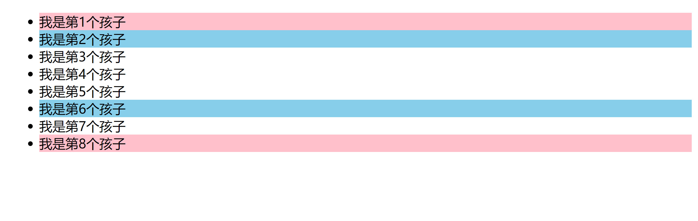

```html
<!doctype html>
<html lang="en">

<head>
    <meta charset="UTF-8">
    <meta name="viewport" content="width=device-width, initial-scale=1.0">
    <meta http-equiv="X-UA-Compatible" content="ie=edge">
    <title>CSS3新增结构伪类选择器-nth-child</title>
    <style>
        /* 1.把所有的偶数 even 的孩子选出来 */
        ul li:nth-child(even) {
            background-color: #ccc;
        }

        /* 2.把所有的奇数 odd 的孩子选出来 */
        ul li:nth-child(odd) {
            background-color: gray;
        }

        /* 3.nth-child(n) 从 0 开始每次加 1 往后面计算，这里面必须是 n，不能是其他的字母，此处选择了所有的孩子 */
        /* ol li:nth-child(n) {*/
        /*    background-color: pink;*/
        /*}*/
        /* 4.nth-child(2n) 母选择了所有的偶数孩子 等价于 even */
        /*ol li:nth-child(2n) {*/
        /*    background-color: pink;*/
        /*}*/
        /* 5.nth-child(2n+1) 母选择了所有的奇数孩子 等价于 odd */
        /*ol li:nth-child(2n+1) {*/
        /*    background-color: skyblue;*/
        /*} */
        /* 6.从第 3 个开始（包含第 3 个）到最后 */
        /*ol li:nth-child(n+3) {*/
        /*    background-color: pink;*/
        /*} */
        /*7.前 3 个（包含第 3 个）*/
        ol li:nth-child(-n+3) {
            background-color: pink;
        }
    </style>
</head>

<body>
<ul>
    <li>我是第1个孩子</li>
    <li>我是第2个孩子</li>
    <li>我是第3个孩子</li>
    <li>我是第4个孩子</li>
    <li>我是第5个孩子</li>
    <li>我是第6个孩子</li>
    <li>我是第7个孩子</li>
    <li>我是第8个孩子</li>
</ul>
<ol>
    <li>我是第1个孩子</li>
    <li>我是第2个孩子</li>
    <li>我是第3个孩子</li>
    <li>我是第4个孩子</li>
    <li>我是第5个孩子</li>
    <li>我是第6个孩子</li>
    <li>我是第7个孩子</li>
    <li>我是第8个孩子</li>
</ol>
</body>

</html>
```

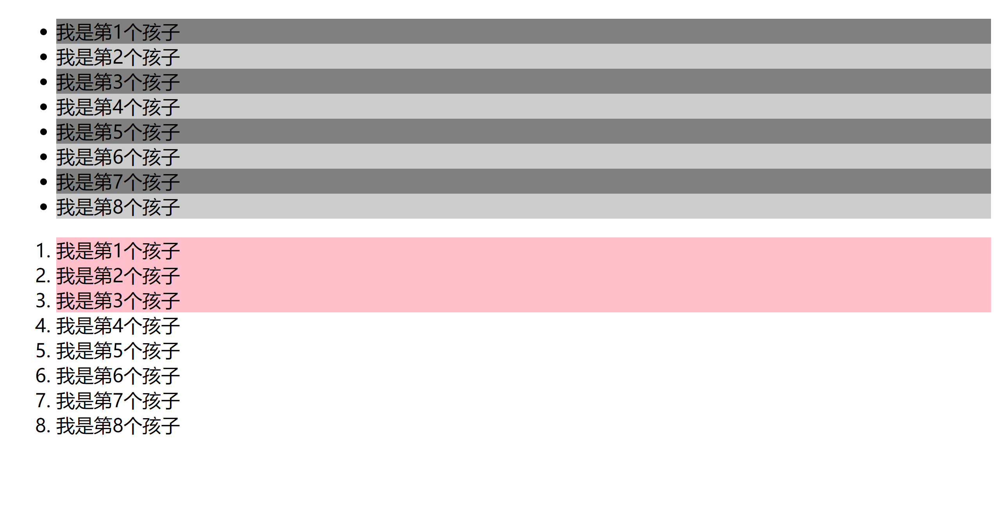

```html
<!doctype html>
<html lang="en">

<head>
    <meta charset="UTF-8">
    <meta name="viewport" content="width=device-width, initial-scale=1.0">
    <meta http-equiv="X-UA-Compatible" content="ie=edge">
    <title>CSS3新增选择器nth-type-of</title>
    <style>
        ul li:first-of-type {
            background-color: pink;
        }

        ul li:last-of-type {
            background-color: pink;
        }

        ul li:nth-of-type(even) {
            background-color: skyblue;
        }

        /* nth-child 会把所有的盒子都排列序号 */
        /* 执行的时候首先看 :nth-child(1) 之后回去看 前面 div */
        /* 所以此处先排序：*/
        /* 1号：<p>光头强</p> */
        /* 2号：<div>熊大</div> */
        /* 3号：<div>熊二</div> */
        /* 再回过头看，此时会发现，1号并不是 div，所以不生效！*/

        section div:nth-child(1) {
            background-color: red;	/* 不生效 */
        }

        /* nth-of-type 会把指定元素的盒子排列序号 */
        /* 执行的时候首先看 div 指定的元素 之后回去看 :nth-of-type(1) 第几个孩子 */
        section div:nth-of-type(1) {
            background-color: blue;
        }
    </style>
</head>

<body>
<ul>
    <li>我是第1个孩子</li>
    <li>我是第2个孩子</li>
    <li>我是第3个孩子</li>
    <li>我是第4个孩子</li>
    <li>我是第5个孩子</li>
    <li>我是第6个孩子</li>
    <li>我是第7个孩子</li>
    <li>我是第8个孩子</li>
</ul>
<!-- 区别 -->
<section>
    <p>光头强</p>
    <div>熊大</div>
    <div>熊二</div>
</section>
</body>

</html>
```

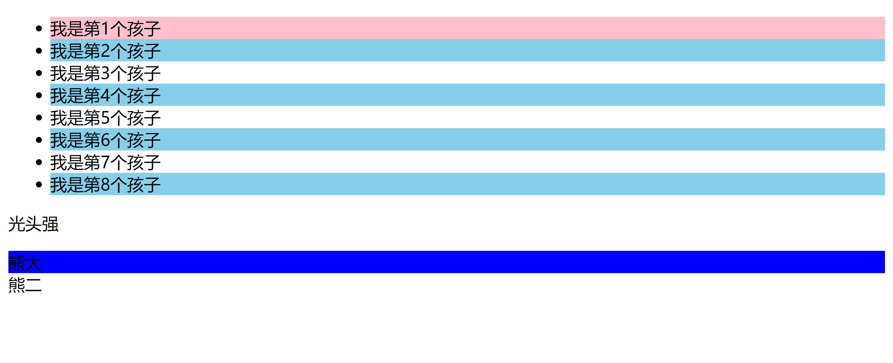

### ⭕11.2 链接的伪类

- :link 未访问的链接	
- :visited 已访问的链接 
  - 由于隐私的原因，所以visited这个伪类只能修改链接的颜色

- :hover 鼠标悬停的链接
- :active 鼠标点击的链接

**链接伪类选择器注意事项：**

- 为了确保生效且不冲突，请按照 `LVHA` 的顺序声明 `:link` `:visited` `:hover` `:active`

- 记忆法：love hate 或者 lv 包包 hao 

- 因为 a 链接在浏览器中具有默认样式，所以我们实际工作中都需要给链接单独指定样式

**链接伪类选择器实际工作开发中的写法：**

```html
<style>
	/* 注意：要学会触类旁通，这里不只是可以改变颜色，当链接为图片时还可以改图片 */
	/* 1、a:link 把没有点击过的（访问过的）链接选出来 */
	a:link {
		color: #333;
		text-decoration: none;
	}

	/* 2、a:visited 选择点击过的（访问过的）链接选出来 */
	a:visited {
		color: orange;
	}

	/* 3、a:hover 选择鼠标经过（停留）的那个链接 */
	a:hover {
		color: skyblue;
	}

	/* 4、a:active 选择的是我们鼠标正在按下还没有弹起鼠标的那个链接 */
	a:active {
		color: green;
	}
</style>

<body>
	<a href="http://www.baidu.com">小猪佩奇</a>
	<a href="#">猪爸爸</a>
</body>
```


### ⭕11.3 :focus伪类选择器

`:focus` 伪类选择器用于选取获得焦点的表单元素。

焦点就是光标，一般情况 `<input>` 类表单元素才能获取，因此这个选择器也主要针对于表单元素来说。

```css
input:focus {
	background-color: yellow;
}
```

```html
    <style>
        /* 把获得光标的 input 表单元素选区出来 */
        input:focus {
            background-color: pink;
            color: red;
        }
    </style>

<body>
    <input type="text">
    <input type="text">
    <input type="text">
</body>
```


## ⭕12.伪元素选择器

伪元素，表示页面中一些特殊的并不真实的存在的元素（特殊的位置）

伪元素选择器可以帮助我们利用 CSS 创建新标签元素，而不需要 HTML 标签，从而简化 HTML 结构。

伪元素使用`::`开头

- `::first-letter` 表示第一个字母

- `::first-line` 表示第一行

- `::selection` 表示选中的内容

- `::before` 元素的开始

- `::after` 元素的最后

- `::before`和`::after` 必须结合`content`属性来使用

注意：

- before 和 after 创建一个元素，属于行内元素
- 新创建的这个元素在文档树中是找不到的，所以我们称为伪元素
- 语法：`element::before{}`
- before 和 after 必须有 content 属性
- before 在父元素内容的前面创建元素，after 在父元素内容的后面创建元素
- 伪元素选择器和标签选择器一样，权重为 1

```css
/* 段落首字母设置大小为30px */
p::first-letter{
    font-size: 30px;
}

/* 段落第一行设置为黄色背景 */
p::first-line{
    background-color: yellow;
}

/* 段落选中的部分变绿色 */
p::selection{
    background-color: green；
}

/* div前加上内容 */
div::before{
    content: 'BEFORE';
    color: red;
}

/* div后加上内容 */
div::after{
    content: 'AFTER';
    color: blue;
}
```

**（1）伪元素选择器使用场景1：伪元素字体图标**

```css
p::before {
	position: absolute;
	right: 20px;
	top: 10px;
	content: '\e91e';
	font-size: 20px;
}
```

**（2）伪元素选择器使用场景2：仿土豆效果**

```css
/* 当我们鼠标经过了 土豆这个盒子，就让里面 before 遮罩层显示出来 */
.tudou:hover::before {
	/* 而是显示元素 */
    display: block;
}
```

**（3）伪元素选择器使用场景3：伪元素清除浮动**

1. 额外标签法也称为隔墙法，是 W3C 推荐的做法
2. 父级添加 overflow 属性
3. 父级添加 after 伪元素
4. 父级添加双伪元素

额外标签法也称为隔墙法，是 W3C 推荐的做法。

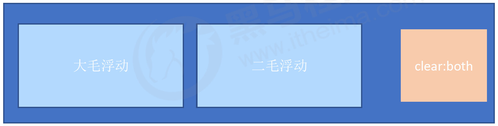

注意：要求这个新的空标签必须是块级元素。

后面两种伪元素清除浮动算是第一种额外标签法的一个升级和优化。

```css
.clearfix:after {
	content: "";			/* 伪元素必须写的属性 */
	display: block;			/* 插入的元素必须是块级 */
	height: 0;				/* 不要看见这个元素 */
	clear: both;			/* 核心代码清除浮动 */
	visibility: hidden;		/* 不要看见这个元素 */
}
```

```css
.clearfix:before,
.clearfix:after {
	content: "";
	display: table;			/* 转换为块级元素并且一行显示 */
}

.clearfix:after {
	clear: both;
}
```

**案例：**

```html
<!doctype html>
<html lang="en">
<head>
    <meta charset="UTF-8">
    <meta name="viewport" content="width=device-width, initial-scale=1.0">
    <meta http-equiv="X-UA-Compatible" content="ie=edge">
    <title>伪元素选择器before和after</title>
    <style>
        div {
            width: 200px;
            height: 200px;
            background-color: salmon;
        }

        /* div::before 权重是 2 */
        div::before {
            /* 这个 content 是必须要写的 */
            /* display: inline-block; */
            content: '我';
            /* width: 30px;
            height: 40px;
            background-color: purple; */
        }

        div::after {
            content: '小猪佩奇';
        }
    </style>
</head>
<body>
<div>
    是
</div>
</body>
</html>
```


```html
<!doctype html>
<html lang="en">

<head>
    <meta charset="UTF-8">
    <meta name="viewport" content="width=device-width, initial-scale=1.0">
    <meta http-equiv="X-UA-Compatible" content="ie=edge">
    <title>伪元素选择器使用场景-字体图标</title>
    <style>
        @font-face {
            font-family: 'icomoon';
            src: url('fonts/icomoon.eot?1lv3na');
            src: url('fonts/icomoon.eot?1lv3na#iefix') format('embedded-opentype'),
            url('fonts/icomoon.ttf?1lv3na') format('truetype'),
            url('fonts/icomoon.woff?1lv3na') format('woff'),
            url('fonts/icomoon.svg?1lv3na#icomoon') format('svg');
            font-weight: normal;
            font-style: normal;
            font-display: block;
        }

        div {
            position: relative;
            width: 200px;
            height: 35px;
            border: 1px solid red;
        }

        div::after {
            position: absolute;
            top: 10px;
            right: 10px;
            font-family: 'icomoon';
            /* content: ''; */
            content: '\e91e';
            color: red;
            font-size: 18px;
        }
    </style>
</head>

<body>
<div></div>
</body>

</html>
```

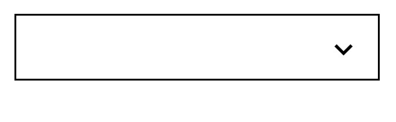

```html
<!doctype html>
<html lang="en">

<head>
    <meta charset="UTF-8">
    <meta name="viewport" content="width=device-width, initial-scale=1.0">
    <meta http-equiv="X-UA-Compatible" content="ie=edge">
    <title>伪元素选择器使用场景2-仿土豆网显示隐藏遮罩案例</title>
    <style>
        .tudou {
            position: relative;
            width: 444px;
            height: 320px;
            background-color: pink;
            margin: 30px auto;
        }

        .tudou img {
            width: 100%;
            height: 100%;
        }

        .tudou::before {
            content: '';
            /* 隐藏遮罩层 */
            display: none;
            position: absolute;
            top: 0;
            left: 0;
            width: 100%;
            height: 100%;
            background: rgba(0, 0, 0, .4) url(images/arr.png) no-repeat center;
        }

        /* 当我们鼠标经过了土豆这个盒子，就让里面 before 遮罩层显示出来 */
        .tudou:hover::before {
            /* 而是显示元素 */
            display: block;
        }
    </style>
</head>

<body>
<div class="tudou">
    
</div>
</body>

</html>
```


## 13.复合选择器总结

| 选择器          | 作用                   | 特征             | 使用情况 | 隔开符号及用法                             |
| --------------- | ---------------------- | ---------------- | -------- | ------------------------------------------ |
| 后代选择器      | 用来选择后代元素       | 可以是子孙后代   | 较多     | 符号是空格 `.nav a`                        |
| 子代选择器      | 选择最近一级元素       | 只选亲儿子       | 较少     | 符号是大于 `.nav>p`                        |
| 并集选择器      | 选择某些相同样式的元素 | 可以用于集体声明 | 较多     | 符号是逗号 `.nav`, `.header`               |
| 链接伪类选择器  | 选择不同状态的链接     | 跟链接相关       | 较多     | 重点记住 `a{}` 和 `a:hover` 实际开发的写法 |
| `:focus` 选择器 | 选择获得光标的表单     | 跟表单相关       | 较少     | `input:focus` 记住这个写法                 |

强调：复合选择器的层级写得越细越好（可读性，可维护性，安全性），同时将复合选择器的层级写得越细，可以提前避免大部分的选择器优先级混乱！

# 05 【CSS引入方式 CSS的元素显示模式】

## 1.CSS的引入方式

### 1.1 CSS的三种引入方式

按照 CSS 样式书写的位置（或者引入的方式），CSS 样式表可以分为三大类：

- 行内样式表（行内式）
- 内部样式表（嵌入式）
- 外部样式表（外链式）

### ⭕1.2 行内样式表

行内样式表（内联样式表）是在元素标签内部的 style 属性中设定 CSS 样式，适合于修改简单样式。

```html
<div style="color: red; font-size: 12px;">
    青春不常在，抓紧谈恋爱
</div>
```

- `style` 其实就是标签的属性
- 在双引号中间，写法要符合 CSS 规范
- 可以控制当前的标签设置样式
- 由于书写繁琐，并且没有体现出结构与样式相分离的思想，所以不推荐大量使用，只有对当前元素添加简单样式的时候，可以考虑使用
- 使用行内样式表设定 CSS，通常也被称为 `行内式引入`

> 问题：使用内联样式，样式只能对一个标签生效。如果希望影响到多个元素，必须在每一个元素中都复制一遍；并且当样式发生变化时，我们必须要一个一个的修改，非常的不方便。（注意：开发时绝对不要使用内联样式）

### ⭕1.3 内部样式表

将样式编写到`head`中的`style`标签里然后通过css的选择器来选中元素并为其设置各种样式可以同时为多个标签设置样式，并且修改时只需要修改一处即可。内部样式表更加方便对样式进行复用

```html
<style type="text/css">
    div {
        color: red;
        font-size: 12px;
    }
</style>
```

- `<style>` 标签理论上可以放在 HTML 文档的任何地方，但一般会放到文档的 `<head>` 标签中
- 目前的浏览器已经支持**省略** `type` **属性**
- 通过此种方式，可以方便控制当前整个页面中的元素样式设置
- 代码结构清晰，但是并没有实现结构与样式完全分离
- 使用内部样式表设定 CSS，通常也被称为 `嵌入式引入`，这种方式是我们练习时常用的方式

> 问题：我们的内部样式表只能对一个网页起作用，它里边的样式不能跨页面进行复用

### ⭕1.4 外部样式表

实际开发都是外部样式表，适合于样式比较多的情况，核心是：样式单独写到 CSS 文件中，之后把 CSS 文件引入到 HTML 页面中使用。

引入外部样式表分为两步：

- 新建一个后缀名为：`.css` 的样式文件，把所有的 CSS 代码都放入此文件中
- 在 HTML 页面中，使用 `<link>` 标签引入这个文件

```html
<link rel="stylesheet" type="text/css" href="css文件路径">
```

| 属性   | 作用                                                         |
| ------ | ------------------------------------------------------------ |
| `rel`  | **定义当前文档与被链接文档之间的关系，在这里需要指定为 "stylesheet"，表示被链接的文档是一个样式表文件** |
| `type` | 定被链接文档的 MIME 类型，该属性最常见的 MIME 类型是 "text/css"，该类型描述样式表，目前的浏览器**已经支持省略 "type" 属性** |
| `href` | 定义所链接外部样式表文件的 URL，可以是相对路径，也可以是绝对路径 |

**注意：**使用外部样式表设定 CSS，通常也被称为 `外链式` 或 `链接式引入`，这种方式是开发中常用的方式。

> 外部样式表需要通过`link`标签进行引入，意味着只要想使用这些样式的网页都可以对其进行引用使样式，可以在不同页面之间进行复用
>
> 将样式编写到外部的CSS文件中，可以使用到浏览器的缓存机制，从而加快网页的加载速度，提高用户的体验。

### 1.5 CSS引入方式总结

| 样式表               | 优点                     | 缺点         | 使用情况 | 控制范围     |
| -------------------- | ------------------------ | ------------ | -------- | ------------ |
| 行内样式表（行内式） | 书写方便，权重高         | 结构样式混写 | 较少     | 控制一个标签 |
| 内部样式表（嵌入式） | 部分结构和样式分离       | 没有彻底分离 | 较多     | 控制一个页面 |
| 外部样式表（外链式） | 完全实现结构和样式相分离 | 需要引入     | 最多     | 控制多个页面 |

## 2.CSS 的元素显示模式

### 2.1 什么是元素显示模式

**作用：**网页的标签非常多，在不同地方会用到不同类型的标签，了解他们的特点可以更好的布局我们的网页。

`元素显示模式` 就是元素（标签）以什么方式进行显示，比如 `<div>` 自己占一行，比如一行可以放多个 `<span>`。

HTML 元素一般分为 `块元素` 和 `行内元素` 两种类型。

### 2.2 块、行内、行内块

#### ⭕2.2.1 块元素

**常见的块元素有 `<h1> ~ <h6>`、`<p>`、`<div>`、`<ul>`、`<ol>`、`<li>`、`<dl>`、`<dt>`、`<dd>`、`<table>`、`<tr>`、`<form>` 等，其中  `<div>` 标签是最典型的块元素。**

**块级元素的特点：**

- 比较霸道，自己独占一行
- **高度，宽度、外边距以及内边距都可以控制**
- 宽度默认是容器（父级宽度）的 100%
- 是一个容器及盒子，里面可以放行内或者块级元素

**注意：**

- 文字类的块级元素内不能放置块级元素，会发生语法错误
- **`<p>` 标签主要用于存放文字，因此 `<p>` 里面不能放块级元素，特别是不能放 `<div>`**
- **同理， `<h1> ~ <h6>` 等都是文字类块级标签，里面也不能放其他块级元素**

#### ⭕2.2.2 行内元素

常见的行内元素有 `<a>`、`<span>`、`<em>`、`<strong>` 等，其中 `<span>` 标签是最典型的行内元素，有的地方也将行内元素称为内联元素。

**行内元素的特点：**

- **相邻行内元素在一行上，一行可以显示多个**

- **高、宽直接设置是无效的**

- **默认宽度就是它本身内容的宽度**

- **行内元素只能容纳文本或其他行内元素（a 除外）**

**注意：**

- 链接里面不能再放链接
- **特殊情况链接 `<a>` 里面可以放块级元素，但是给 `<a>` 转换一下块级模式最安全**

#### ⭕2.2.3 行内块元素

在行内元素中有几个特殊的标签：``、`<input>`、`<th>`、`<td>`，它们同时具有 `块元素` 和 `行内元素` 的特点，有些资料称它们为 `行内块元素`。

**行内块元素的特点：**

- **和相邻行内元素（行内块）在一行上，但是他们之间会有空白缝隙。一行可以显示多个（行内元素特点）**
- **默认宽度就是它本身内容的宽度（行内元素特点）**
- **高度，行高、外边距以及内边距都可以控制（块级元素特点）**

### ⭕2.3 元素显示模式转换

特殊情况下，我们需要元素模式的转换，简单理解: 一个模式的元素需要另外一种模式的特性
比如：想要增加链接 `<a>` 的触发范围。

- 转换为块元素：`display: block;`（由于经常需要设置宽高，所以通常会将行内元素转换为块元素）
- 转换为行内元素：`display: inline;`
- 转换为行内块元素：`display: inline-block;`（常用）

### ⭕2.4 元素显示模式总结

| 元素模式   | 元素排列               | 设置样式                 | 默认宽度         | 包含                   |
| ---------- | ---------------------- | ------------------------ | ---------------- | ---------------------- |
| 块级元素   | 一行只能放一个块级元素 | 可以设置宽度和高度       | 容器的 100%      | 容量级可以包含任何标签 |
| 行内元素   | 一行可以放多个行内元素 | 不可以直接设置宽度和高度 | 它本身内容的宽度 | 容纳文本或其他行内元素 |
| 行内块元素 | 一行放多个行内块元素   | 可以设置宽度和高度       | 它本身内容的宽度 |                        |

学习元素显示模式的主要目的是分清它们各自的特点，当我们网页布局的时候，在合适的地方用合适的标签元素。

# 06 【CSS字体属性 CSS文本属性】

## 1.CSS字体属性

CSS Fonts（字体）属性用于定义：`字体系列`、`大小`、`粗细`、和 `文字样式`（如：斜体）。

### ⭕1.1 字体族

`font-family` 字体族（字体的格式）

CSS 使用 font-family 属性定义文本的字体系列。

```css
p {
	font-family: "Microsoft YaHei";
}

div {
	font-family: Arial, "Microsoft YaHei";
}
```

- 各种字体之间必须使用英文状态下的逗号隔开
- 一般情况下，如果有空格隔开的多个单词组成的字体，加引号
- 字体生效时优先使用第一个，第一个无法使用则使用第二个，以此类推
- 尽量使用系统默认自带字体，保证在任何用户的浏览器中都能正确显示
- **最常用的字体：`body {font-family: "Microsoft YaHei", tahoma, arial, sans-serif, "Hiragino Sans GB";}`**

> Apple 官网字体：
>
> ```css
> body {
> 	font-family: "SF Pro SC", "SF Pro Text", "SF Pro Icons", "PingFang SC", "Helvetica Neue", "Helvetica", "Arial", sans-serif
> }
> ```

> Instagram 官网字体：
>
> ```css
> body {
> 	font-family: -apple-system, BlinkMacSystemFont,"Segoe UI", Roboto, Helvetica, Arial, sans-serif
> }
> ```

>知乎官网字体：
>
>```css
>body {
>	font-family: -apple-system, BlinkMacSystemFont, Helvetica Neue, PingFang SC, Microsoft YaHei, Source Han Sans SC, Noto Sans CJK SC, WenQuanYi Micro Hei, sans-serif
>}
>```

> 爱奇艺官网字体：
>
> ```css
> body {
> font-family: PingFangSC-Regular, Helvetica, Arial, Microsoft Yahei, sans-serif
> }
> ```

```html
    <style type="text/css">
        /* 浏览器会从第一个字体开始进行适配，如果本机可以适配的话，那么就使用该字体，否则看下一个字体，
           如果都不可以，那么浏览器会使用自带的默认字体，所以实际开发中一般建议使用比较标准化的字体 */
        h2 {
            /* font-family: '微软雅黑'; 可以使用中文，但不建议 */
            font-family: "Microsoft YaHei", Arial, sans-serif;
        }

        p {
            font-family: "Times New Roman", Times, serif;
        }
    </style>
```

```html
    <style type="text/css">
        /* 一些情况下，如果要全局设置字体可以直接在 body 标签选择器中指明 */
        body {
            font-family: "Microsoft YaHei", Arial, sans-serif;
        }
    </style>
```

注意：浏览器字体是依据用户操作系统来调用的，所以这里介绍一种 Windows 系统安装字体的方法。

> 当然实际开发中通常浏览器请求时，会把字体文件随 HTML CSS JS 等一同传送到客服端。

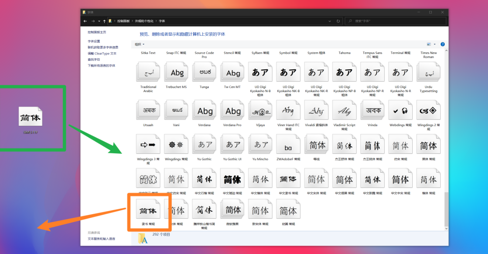

### ⭕1.2 @font-face 

我们除了可以使用系统自带的字体样式外，还可以在服务器端自定义字体位置

`@font-face`可以将服务器中的字体直接提供给用户去使用

```css
@font-face {
    /* 指定字体名字 */
    font-family: 'myFont1';
    /* 服务器中字体路径 */
    src: url('/font/ZCOOLKuaiLe-Regular.woff'),
        url('/font/ZCOOLKuaiLe-Regular.otf'),
        url('/font/ZCOOLKuaiLe-Regular.ttf') format('truetype');/* 指定字体格式，一般不写 */
}

p {
    font-size: 30px;
    color: salmon;
    font-family: myFont1;
}
```


**问题**

1. 加载速度：受网络速度影响，可能会出现字体闪烁一下变成最终的字体

2. 版权：有些字体是商用收费的，需要注意

3. 字体格式：字体格式也有很多种（woff、otf、ttf），未必兼容，可能需要指定多个

### 1.2 字体大小

CSS 使用 font-size 属性定义字体大小。

```css
p {
	font-size: 20px;
}
```

- px（像素）大小是我们网页的最常用的单位
- 谷歌浏览器默认的文字大小为：16px
- 不同浏览器可能默认显示的字号大小不一致，我们尽量给一个明确值大小，不要默认大小
- 可以给 body 指定整个页面文字的大小

```html
    <style type="text/css">
        /* 全局设置时，一般在 body 标签选择器中指定文字大小，谷歌浏览器默认 16px，
           但是最好还是指定一个明确值，以保证在不同浏览器中的效果是一样的 */
        body {
            font-size: 24px;
        }

        /* 标题标签比较特殊，body 中的设置对其是不生效的，需要单独指定文字大小 */
        h2 {
            font-size: 54px;
        }
    </style>
```

### 1.3 字体粗细

CSS 使用 font-weight 属性设置文本字体的粗细。

```css
p {
	font-weight: bold;
}
```

| 属性值    | 描述                                                         |
| --------- | ------------------------------------------------------------ |
| `normal`  | 默认值（不加粗的）                                           |
| `bold`    | 定义粗体（加粗的）                                           |
| `100-900` | 400 等同于 normal，而 700 等同于 bold，其它值一般不使用，注意这个数字后面不跟单位 |

- 学会让加粗标签（比如 h 和 strong 等）变为不加粗，或者让其他标签加粗
- 实际开发时，我们更喜欢用数字表示粗细

```html
    <style type="text/css">
        .bold {
            /* font-weight: bold; */
            /* 实际开发中，我们更提倡使用数字来表示加粗的效果 */
            /* 这个 700 的后面不要跟单位 */
            font-weight: 700;
        }

        /* 使文字不加粗 */
        h2 {
            /* font-weight: normal; */
            font-weight: 400;
        }
    </style>
```

### 1.4 文字样式

CSS 使用 font-style 属性设置文本的风格。

```css
p {
	font-style: normal;
}
```

| 属性值   | 作用                                                   |
| -------- | ------------------------------------------------------ |
| `normal` | 默认值，浏览器会显示标准的字体样式 font-style: normal; |
| `italic` | 浏览器会显示斜体的字体样式                             |

**注意：**平时我们很少给文字加斜体，反而要给斜体标签 (em、i) 改为不倾斜字体。

```html
    <style type="text/css">
        p {
            /* 让不倾斜的字体倾斜 */
            font-style: italic;
        }

        em {
            /* 让倾斜的字体不倾斜 */
            font-style: normal;
        }
    </style>

    <p>上课时候的你</p>
    <em>下课时候的你</em>
```

### ⭕1.5 字体复合属性

字体属性可以把以上文字样式综合来写，这样可以更节约代码。

```css
body {
	font: font-style font-weight font-size/line-height font-family;
}

body {
	font: normal 400 font-size/line-height "Microsoft YaHei", Arial, sans-serif;
}
```

- **使用 font 属性时，必须按上面语法格式中的顺序书写，不能更换顺序，并且各个属性间以空格隔开**
- **不需要设置的属性可以省略（取默认值），但必须保留 font-size 和 font-family 属性，否则 font 属性将不起作用**

```html
    <style type="text/css">
        /* 想要 div 文字变倾斜、加粗、字号设置为 16 像素，并且是微软雅黑 */
        div {
            /* font-style: italic;
               font-weight: 700;
               font-size: 16px;
               font-family: 'Microsoft YaHei'; */

            /* 复合属性：简写的方式，里面的顺序不能打乱 以空格隔开 */
            /* font: font-style font-weight font-size/line-height font-family; */
            font: italic 700 16px 'Microsoft YaHei';
            /* 注意：不需要设置的属性可以省略（取默认值），但必须保留 font-size 和 font-family 属性，否则 font 属性将不起作用 */
            /* font: 20px 'Microsoft YaHei'； */
        }
    </style>

    <div>三生三世十里桃花，一心一意百行代码</div>
```

### ⭕1.6字体属性总结

| 属性          | 表示     | 注意点                                                       |
| ------------- | -------- | ------------------------------------------------------------ |
| `font-size`   | 字号     | 我们通常用的单位是 px 像素，一定要跟上单位                   |
| `font-family` | 字体     | 实际工作中按照团队约定来写字体                               |
| `font-weight` | 字体属性 | 记住加粗是 700 或者 bold 不加粗 是 normal 或者 400 记住数字不要跟单位 |
| `font-style`  | 字体样式 | 记住倾斜是 italic 不倾斜是 normal 工作中我们最常用 normal    |
| `font`        | 字体连写 | 1、字体连写是有顺序的不能随意换位置，2、其中字号和字体必须同时出现 |

## 2.CSS文本属性

CSS Text（文本）属性可定义文本的 `外观`，比如：`文本颜色`、`文本对齐`、`文本装饰`、`文本缩进`、`行间距` 等。

### 2.1文本颜色

`color` 属性用于定义文本的颜色。

```css
div {
	color: red;
}
```

| 表示方式       | 属性值                                              |
| -------------- | --------------------------------------------------- |
| 预定义的颜色值 | red，green，blue，black，white，gray                |
| 十六进制       | #FF0000，#FF6600，#29D794（每两位对应：#红R绿G蓝B） |
| RGB 代码       | rgb(255, 0, 0) 或 rgb(100%, 0%, 0%)                 |

**注意：**开发中最常用的是十六进制。

> 熟记开发常用色：
>
> 黑色：`black`、`#000000`、`rgb(0, 0, 0)`（三原色啥也没有混合就为黑）
>
> 白色：`white`、`#FFFFFF`、`rgb(255, 255, 255)`（三原色全满混合就为白）
>
> 灰色：`gray`、`#808080`、`rgb(128, 128, 128)`（三原色全半混合就为灰）
>
> 红色：`red`、`#FF0000`、`rgb(255, 0, 0)`
>
> 绿色：`green`、`#008000`、`rgb(0, 128, 0)`（绿色较为特殊，green 对应的是 #008000）
>
> 蓝色：`blue`、`#0000FF`、`rgb(0, 0, 255)`
>
> 黄色：`yellow`、`#FFFF00`、`rgb(255, 255, 0)`
>
> 青色：`#00FFFF`、`rgb(0, 255, 255)`
>
> 洋红：`#FF00FF`、`rgb(255, 0, 255)`
>
> 橙色：`orange`
>
> 粉色：`pink`
>
> 烈粉色：`hotpink`（浓度低）、`deeppink`（浓度高）
>
> 天蓝色：`skyblue`
>
> 深色系：`dark颜色` 如：`darkgreen`
>
> 浅色系：`light颜色` 如：`lightgreen`

### 2.2文本对齐

#### ⭕2.2.1水平对齐

`text-align` 属性用于设置元素内文本内容的水平对齐方式。

```css
div {
	text-align: center;
}
```

| 属性值  | 解释             |
| ------- | ---------------- |
| left    | 左对齐（默认值） |
| right   | 右对齐           |
| center  | 居中对齐         |
| justify | 两端对齐         |

```html
    <style type="text/css">
        h1 {
            /* 本质是让 h1 盒子里面的文字水平居中对齐 */
            /* text-align: center; */
            text-align: right;
        }
    </style>

    <h1>右对齐的标题</h1>
```

注意：

`text-align` 属性只能作用于 `块级元素`，并让该块级元素内的 `行内元素` 实现居中（不一定是文字）。

上述例子中：h1 为块级元素，所以给 h1 设置 text-align，便会作用于里面的文本（如果里面还有行内元素的话，也会一同作用）。

```html
    <style type="text/css">
        div {
            text-align: center;
        }
    </style>

   <div>
	   <p>dselegent</p>
   </div>
```

上述例子中：为 div 设置 text-align 之所以能够使其内部的块级元素 p 里的文字居中，原因是 p 会继承父元素 div 的 text-align 属性，所以相当于对 p 设置了 text-align。

#### ⭕2.2.2垂直对齐

CSS 的 `vertical-align` 属性使用场景：经常用于设置图片或者表单（行内块元素）与文字垂直对齐。

官方解释：用于设置一个元素的垂直对齐方式，但是它只针对于行内元素或者行内块元素有效。

语法：

```css
vertical-align: baseline | top | middle | bottom
```

| 值         | 描述                                   |
| ---------- | -------------------------------------- |
| `baseline` | 默认。元素放置在父元素的基线上         |
| `top`      | 把元素的顶端与行中最高元素的顶端对齐   |
| `middle`   | 把此元素放置在父元素的中部             |
| `bottom`   | 把元素的顶端与行中最低的元素的顶端对齐 |

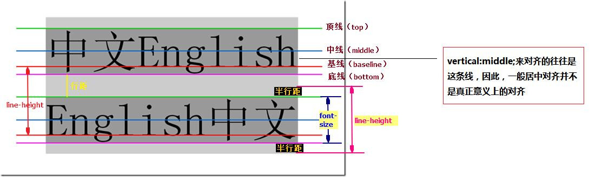

`baseline` **基线对齐**

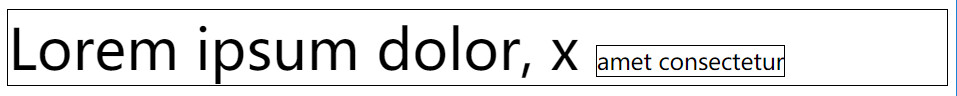

`top` **顶部对齐**

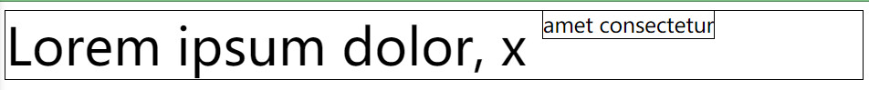

`bottom` **底部对齐**

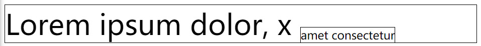

`middle` **居中对齐**

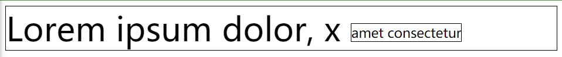

这里的居中对齐高度 = 基线高度 + x的高度 / 2

这种居中对齐并非实际上的居中对齐，一般也不会用这种方式对文字进行垂直方向的对齐

 **图片、表单和文字对齐**

图片、表单都属于行内块元素，默认的 vertical-align 是基线对齐。

此时可以给图片、表单这些行内块元素的 vertical-align 属性设置为 middle 就可以让文字和图片垂直居中对齐了。

```html
<!doctype html>
<html lang="en">

<head>
    <meta charset="UTF-8">
    <meta name="viewport" content="width=device-width, initial-scale=1.0">
    <meta http-equiv="X-UA-Compatible" content="ie=edge">
    <title>利用vertical-align实现图片文字垂直居中对齐</title>
    <style>
        img {
            /* vertical-align: bottom; */
            /* 让图片和文字垂直居中 */
            vertical-align: middle;
            /* vertical-align: top; */
        }

        textarea {
            vertical-align: middle;
        }
    </style>
</head>

<body>
     pink老师是刘德华

    <br>
    <textarea name="" id="" cols="30" rows="10"></textarea> 请您留言
</body>

</html>
```


> 运用重点：
>
> 我们知道，当对盒子设置 `line-height: 盒子高度;` 时，盒子内的 `文字` 会垂直居中，其实不只是文字可以垂直居中，盒子内的图片同样也能垂直居中，只不过图片默认是基于基线对齐的，所以要真正实现 `垂直居中` 需要在图片加上：`vertical-align: middle;`

**解决图片底部默认空白缝隙问题**

```html
<style>
    .imgDiv {
        border: 5px seagreen solid;
    }

    .imgDiv img {
        width: 400px;
        height: 300px;
    }
</style>

<div class="imgDiv">
    
</div>
```

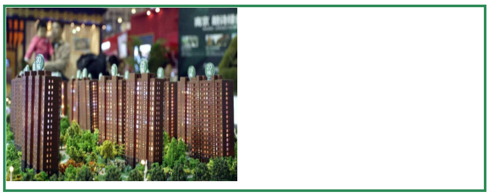

主要解决方法有两种：

1. 给图片添加 `vertical-align: middle | top | bottom` 等（推荐）
2. 把图片转换为块级元素 `display: block;`

明显默认情况下，图片底部有一定缝隙，我们稍作修改，给img元素添加`vertical-align`属性值

```css
/* 只要不是基线对齐，就能消除底部缝隙 */
vertical-align: top;
vertical-align: bottom;
vertical-align: middle;
```

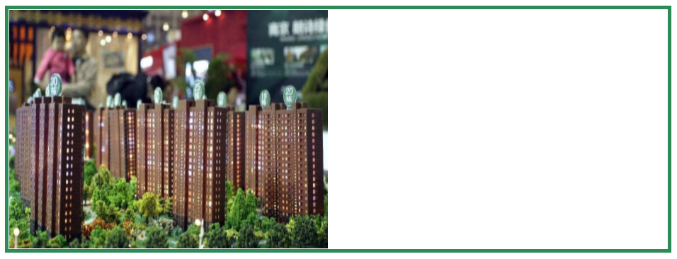

**Q：为什么图片会有缝隙？**

A：图片属于替换元素，特点与文本一致，也有自己的基线，默认也是基线对齐。而基线位置不在最底部，所以会出现缝隙

### ⭕2.3文本装饰

`text-decoration` 属性规定添加到文本的修饰，可以给文本添加 `下划线`、`删除线`、`上划线` 等。

```css
div {
	text-decoration: underline;
}
```

| 属性值         | 描述                              |
| -------------- | --------------------------------- |
| `none`         | 默认，没有装饰线（**最常用**）    |
| `underline`    | 下划线，链接 a 自带下划线（常用） |
| `overline`     | 上划线（几乎不用）                |
| `line-through` | 删除线（不常用）                  |

```html
<!doctype html>
<html lang="en">

<head>
    <meta charset="UTF-8">
    <meta http-equiv="X-UA-Compatible" content="IE=edge">
    <meta name="viewport" content="width=device-width, initial-scale=1.0">
    <title>CSS文本外观之文本装饰</title>
    <style type="text/css">
        /* 默认为 none 没有装饰 */
        div {
            /* 上划线 几乎不用 */
            /* text-decoration: overline; */
            /* 删除线 不常用 */
            /* text-decoration: line-through; */
            /* 下划线 常用，链接 a 自带下划线 */
            text-decoration: underline;
        }

        a {
            /* 取消 a 默认的下划线 */
            text-decoration: none;
            color: #333333;
        }
    </style>
</head>

<body>
    <div>粉红色的回忆</div>
    <a href="#">JERRY</a>
</body>

</html>
```

### ⭕2.4文本缩进

`text-indent` 属性用来指定文本的第一行的缩进，通常是将段落的首行缩进。

```css
div {
	text-indent: 10px;
}
```

通过设置该属性，所有元素的第一行都可以缩进一个给定的长度，甚至该长度可以是负值。

```css
p {
	text-indent: 2em;
}
```

em 是一个相对单位，就是当前元素 (font-size) 1 个文字的大小，如果当前元素没有设置大小，则会按照父元素的 1 个文字大小。

```html
<!doctype html>
<html lang="en">

<head>
    <meta charset="UTF-8">
    <meta http-equiv="X-UA-Compatible" content="IE=edge">
    <meta name="viewport" content="width=device-width, initial-scale=1.0">
    <title>CSS文本外观之文本缩进</title>
    <style type="text/css">
        p {
            font-size: 24px;
            /* 文本的首行缩进多少距离，不仅可以为正值，还可以为负值 */
            /* text-indent: 20px; */
            /* em 为相对于当前元素的大小单位 */
            text-indent: 2em;
        }
    </style>
</head>

<body>
    <p>打开北京、上海与广州的地铁地图，你会看见三张纵横交错的线路网络，
        这代表了中国最成熟的三套城市轨道交通系统</p>

    <p>可即使是这样，在北上广生活的人依然少不了对地铁的抱怨，其中谈及最多的问题便是拥挤，
        对很多人而言，每次挤地铁的过程，都像是一场硬仗。更何况，还都是败仗居多。</p>

    <p>那么，当越来越多的二线甚至三线城市迎接来了自己的地铁，中国哪里的地铁是最拥挤的呢？</p>
</body>

</html>
```

### ⭕2.5行间距（行高）

`line-height` 属性用于设置行间的距离（行高），可以控制文字行与行之间的距离。

```css
p {
	line-height: 26px;
}
```

- `行间距 = 上间距 + 文本高度 + 下间距`

- `上下间距 = （行间距 - 文本高度）/ 2`

- `文本高度 = font-size`

```html
<!doctype html>
<html lang="en">

<head>
    <meta charset="UTF-8">
    <meta http-equiv="X-UA-Compatible" content="IE=edge">
    <meta name="viewport" content="width=device-width, initial-scale=1.0">
    <title>CSS文本外观之行间距</title>
    <style type="text/css">
        /* 行间距 = 上间距 + 文本高度 + 下间距 */
        /* 行间距 = 行高 */
        /* 文本高度 = 字体像素大小 */
        /* 上下间距 = （行间距 - 文本高度）/ 2 */
        p {
            line-height: 25px;
        }
    </style>
</head>

<body>
    <p>打开北京、上海与广州的地铁地图，你会看见三张纵横交错的线路网络，
        这代表了中国最成熟的三套城市轨道交通系统</p>

    <p>可即使是这样，在北上广生活的人依然少不了对地铁的抱怨，其中谈及最多的问题便是拥挤，
        对很多人而言，每次挤地铁的过程，都像是一场硬仗。更何况，还都是败仗居多。</p>

    <p>那么，当越来越多的二线甚至三线城市迎接来了自己的地铁，中国哪里的地铁是最拥挤的呢？</p>
</body>

</html>
```

**补充：行间距测量技巧：上一行文字的底部与本行文字的底部之间的距离就是行间距。**

### 2.6文字阴影

CSS 3 新增了文字阴影。

text-shadow 属性用于为文本添加阴影。

语法：

```css
text-shadow: h-shadow v-shadow blur color;
```

| 值         | 描述                                |
| ---------- | ----------------------------------- |
| `h-shadow` | 必须。水平阴影的位置。允许负值。    |
| `v-shadow` | 必须。垂直阴影的位置。允许负值。    |
| `blur`     | 可选。模糊的距离（虚实程度）。      |
| `color`    | 可选。阴影的颜色。参阅 CSS 颜色值。 |

```html
<!doctype html>
<html lang="en">

<head>
    <meta charset="UTF-8">
    <meta name="viewport" content="width=device-width, initial-scale=1.0">
    <meta http-equiv="X-UA-Compatible" content="ie=edge">
    <title>文字阴影</title>
    <style>
        div {
            font-size: 50px;
            color: salmon;
            font-weight: 700;
            text-shadow: 5px 5px 6px rgba(0, 0, 0, .3);
        }
    </style>
</head>

<body>
    <div>
        你是阴影,我是火影
    </div>
</body>

</html>
```


### ⭕2.7文本属性总结

| 属性              | 表示     | 注意点                                                       |
| ----------------- | -------- | ------------------------------------------------------------ |
| `color`           | 文本颜色 | 我们通常用 十六进制 而且通常是简写形式 #fff（6 个一样可以简写） |
| `text-align`      | 文本对齐 | 可以设定文字水平的对齐方式                                   |
| `text-indent`     | 文本缩进 | 通常我们用于段落首行缩进2个字的距离 text-indent: 2em;        |
| `text-decoration` | 文本修饰 | 牢记 添加下划线 underline 取消下划线 none                    |
| `line-height`     | 行高     | 控制行与行之间的距离                                         |

# 07 【Emmet语法 三大特性及单位】

## 1.Emmet语法

`Emmet` 语法的前身是 `Zen coding`，它使用缩写，来提高 `html/css` 的编写速度，`VSCode` 内部已经集成该语法。

- 快速生成 HTML 结构语法
- 快速生成 CSS 样式语法

### ⭕1.1 快速生成HTML结构语法

- **生成标签直接输入标签名按 <kbd>tab</kbd> 键即可，比如 `div` 然后 <kbd>tab</kbd> 键， 就可以生成 `<div></div>`**
- **如果想要生成多个相同标签加上 `*` 就可以了，比如 `div*3` 就可以快速生成 3 个 `div`**
- **如果有父子级关系的标签，可以用 `>` 比如 `ul>li` 就可以了**
- **如果有兄弟关系的标签，用 `+` 就可以了 比如 `div+p`**
- **如果生成带有 `类名` 或者 `id` 名字的标签， 直接写 `标签.demo` 或者 `标签#demo` 再按下 tab 键就可以了**
- **如果生成的事物有顺序，可以用自增符号 `$`**
- **如果想要在生成的标签内部写内容可以用 `{}` 表示**

```html
<!doctype html>
<html lang="en">

<head>
    <meta charset="UTF-8">
    <meta http-equiv="X-UA-Compatible" content="IE=edge">
    <meta name="viewport" content="width=device-width, initial-scale=1.0">
    <title>Emmet语法之快速生成HTML结构语法</title>
</head>

<body>
    <!-- div -->
    <div></div>
    <!-- table -->
    <table></table>
    <!-- div*6 -->
    <div></div>
    <div></div>
    <div></div>
    <div></div>
    <div></div>
    <div></div>
    <!-- p*4 -->
    <p></p>
    <p></p>
    <p></p>
    <p></p>
    <!-- ul>li -->
    <ul>
        <li></li>
    </ul>
    <!-- div>span -->
    <div><span></span></div>
    <!-- div+p -->
    <div></div>
    <p></p>
    <!-- .nav -->
    <div class="nav"></div>
    <!-- #banner -->
    <div id="banner"></div>
    <!-- p.one -->
    <p class="one"></p>
    <!-- span.gray -->
    <span class="gray"></span>
    <!-- ul>li#two -->
    <ul>
        <li id="two"></li>
    </ul>
    <!-- .demo*5 -->
    <div class="demo"></div>
    <div class="demo"></div>
    <div class="demo"></div>
    <div class="demo"></div>
    <div class="demo"></div>
    <!-- .demo$*5 -->
    <div class="demo1"></div>
    <div class="demo2"></div>
    <div class="demo3"></div>
    <div class="demo4"></div>
    <div class="demo5"></div>
    <!-- div{pink老师不是gay} -->
    <div>pink老师不是gay</div>
    <!-- div{他不喜欢男人}*6 -->
    <div>他不喜欢男人</div>
    <div>他不喜欢男人</div>
    <div>他不喜欢男人</div>
    <div>他不喜欢男人</div>
    <div>他不喜欢男人</div>
    <div>他不喜欢男人</div>
    <!-- div{$}*6 -->
    <div>1</div>
    <div>2</div>
    <div>3</div>
    <div>4</div>
    <div>5</div>
    <div>6</div>
</body>

</html>
```

### ⭕1.2 快速生成CSS样式语法

CSS 基本采取简写形式即可。

- 比如 `w200` 按 <kbd>tab</kbd> 可以 生成 `width: 200px;`
- 比如 `lh26px` 按 <kbd>tab</kbd> 可以生成 `line-height: 26px;`

```html
<!doctype html>
<html lang="en">

<head>
    <meta charset="UTF-8">
    <meta name="viewport" content="width=device-width, initial-scale=1.0">
    <title>Emmet语法之快速生成CSS样式语法</title>
    <style>
        .one {
            /* tac */
            text-align: center;
            /* ti2e */
            text-indent: 2em;
            /* w */
            /* width: ; */
            /* h */
            /* height: ; */
            /* w24 */
            width: 24px;
            /* h24 */
            height: 24px;
            /* tdn */
            text-decoration: none;
        }
    </style>
</head>

<body>

</body>

</html>
```

### 1.3 快速格式化代码

`VSCode` 快速格式化代码：<kbd>Shift</kbd> + <kbd>Alt</kbd> + <kbd>F</kbd>。

`WebStorm` 快速格式化代码：<kbd>Ctrl</kbd> + <kbd>Alt</kbd> + <kbd>L</kbd>。

## 2.三大特性及单位

### 2.1 层叠性

给同一个选择器设置相同的样式，此时一个样式就会**覆盖**（层叠）另一个冲突的样式，**层叠性主要解决样式冲突的问题**。

层叠性原则：

- 样式冲突，遵循的原则是 `就近原则`，哪个样式距离结构近，就执行哪个样式
- 样式不冲突，不会层叠

注：就近的标准是：**后 > 前**

```html
    <style>
        div {
            color: red;
        }

        div {
            color: pink;
        }
    </style>
</head>

<body>
    <!-- pink 色 -->
    <div>dselegent</div>
</body>

</html>
```

### ⭕2.2 继承

现实中的继承：我们继承了父亲的姓。

CSS 中的继承：**样式的继承，我们为一个元素设置的样式，同时也会应用到它的后代元素上**，如：文本颜色和字号，简单的理解就是：子承父业。

- 恰当地使用继承可以简化代码，降低 CSS 样式的复杂性
- **子元素可以继承父元素的样式（ `text-`、`font-`、`line-`、`color` ） 文本、字体、段落、颜色**

继承是发生在祖先后后代之间的，继承的设计是为了方便我们的开发。利用继承，我们可以将一些通用的样式，统一设置到共同的祖先元素上。这样只需设置一次即可让所有的元素都具有该样式

> 注意，并不是所有的样式都会被继承：
>
> 比如背景相关的，布局相关等的这些样式都不会被继承。
>
> 我们可以再Zeal手册中，搜索`background-color`属性，可以看到一个定义的表格。其中就说明了其不可被继承性
>
> 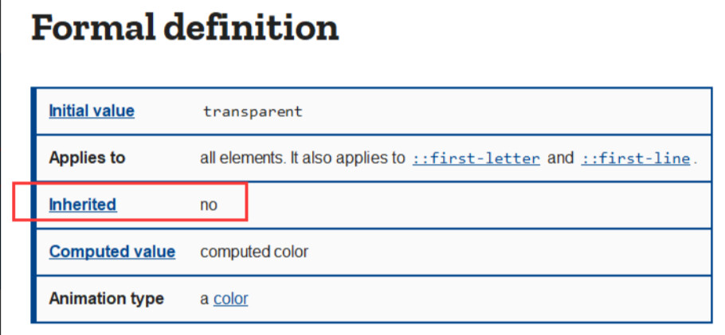

```html
<!DOCTYPE html>
<html lang="en">
	<head>
		<meta charset="UTF-8" />
		<meta name="viewport" content="width=device-width, initial-scale=1.0" />
		<meta http-equiv="X-UA-Compatible" content="ie=edge" />
		<title>文字阴影</title>
		<style>
			div {
				color: pink;
				font-size: 14px;
			}
		</style>
	</head>

	<body>
		<div>
			<p>dselegent</p>
		</div>
	</body>
</html>
```

**行高的继承**

```css
body {
    font: 12px/1.5 'Microsoft YaHei';
}
```

- 行高可以跟单位也可以不跟单位
- 如果子元素没有设置行高，则会继承父元素的行高为 1.5
- 此时子元素的行高是：**当前元素**的**文字大小** * 1.5
- body 行高 1.5 这样写法最大的优势就是**里面的子元素可以根据自己文字的大小自动调整行高**

```html
<!DOCTYPE html>
<html lang="en">
	<head>
		<meta charset="UTF-8" />
		<meta name="viewport" content="width=device-width, initial-scale=1.0" />
		<meta http-equiv="X-UA-Compatible" content="ie=edge" />
		<title>文字阴影</title>
		<style>
			body {
				color: pink;
				/* font: 12px/18px; */
				font: 12px/1.5; /* 12 + 12 * 0.5 = 18 */
			}

			div {
				/* 子元素继承了父元素 body 的行高 1.5 */
				/* 这个 1.5 就是当前元素文字大小 font-size 的 1.5 倍 */
				/* 所以当前 div 的行高就是：14 + 14 * 0.5 = 21px */
				font-size: 14px;
			}

			p {
				/* 1.5 * 16 = 24 当前行高 */
				font-size: 16px;
			}

			/* li 没有手动指定文字大小，则会继承父亲（此处的父亲可以层层向上推）的文字大小  */
			/* 即：body 12px 所有 li 的文字大小为 12px */
			/* 当前 li 的行高就是 12 * 1.5 = 18  */
		</style>
	</head>

	<body>
		<div>dselegent</div>
		<p>dselegent2</p>
		<ul>
			<li>没有指定文字大小</li>
		</ul>
	</body>
</html>

```

### ⭕2.3 权重(优先级)

当我们通过不同的选择器，选中相同的元素，并且为相同的样式设置不同的值时，此时就发生了样式的冲突。

发生样式冲突时，应用哪个样式由选择器的权重（优先级）决定选择器的权重

- 选择器相同，则执行层叠性
- 选择器不同，则根据选择器权重执行

**选择器权重如下表所示：**

| 选择器               | 选择器权重 |
| -------------------- | ---------- |
| 继承 或  `*`         | `0,0,0,0`  |
| 元素选择器           | `0,0,0,1`  |
| 类选择器、伪类选择器 | `0,0,1,0`  |
| ID 选择器            | `0,1,0,0`  |
| 内联样式             | `1,0,0,0`  |
| !important 重要的    | `∞` 无穷大 |

**规则：**比较位级别，位级别相同时比较位大小。

**优先级注意问题：**

- 权重是由 4 组数字组成的，但是不会有进位！
- 可以理解为：`类选择器` 永远大于 `元素选择器`，`ID 选择器` 永远大于 `类选择器`，以此类推！
- 比较优先级时，需要将所有的选择器的优先级进行`相加计算`，最后优先级越高，则越优先显示（分组选择器是单独计算的）
- 可以简单的记忆：`通配符` 和 `继承` 权重为 0，`标签选择器` 为 1，`类`（`伪类`）选择器为 10，`ID` 选择器为 100，`行内样式表` 为 1000，`!important` 无穷大
- 继承的权重是 0，不管父元素权重多高，子元素得到的权重都是 0 ！
- `a` 链接浏览器默认指定了一个样式，所以它不参与继承，所以设置样式需要选中单独设置

**权重的叠加：**

如果是复合选择器，则会有权重叠加，需要计算权重。

注意：再次强调！权重虽然会叠加，但一定不会进位！（1万个元素选择器也比不过一个类选择器）。

从左到右逐位比较，只有左`一位同样大，才比较右边一位！

**例如：**

- `div ul li` ——> `0,0,0,3`
- `.nav ul li` ——> `0,0,1,2`
- `a:hover` ——> `0,0,1,1`
- `.nav a` ——> `0,0,1,1`

如果要对某一元素设置样式，那么就必须给它足够高的权重（注意：是给他，而不是他的父亲！）。

> 提高选择器权重的技巧之一：
>
> - 多写几层类选择器

### 2.4 长度单位

#### 像素

我们先来看下某度上关于像素（pixel,缩写px）的介绍

> 像素是指由图像的小方格组成的，这些小方块都有一个明确的位置和被分配的色彩数值，小方格颜色和位置就决定该图像所呈现出来的样子
>
> 可以将像素视为整个图像中不可分割的单位或者是元素。不可分割的意思是它不能够再切割成更小单位抑或是元素，它是以一个单一颜色的小格存在 [1] 。每一个点阵图像包含了一定量的像素，这些像素决定图像在屏幕上所呈现的大小。

也就是说，显示器屏幕实际上是由一个一个的小点（单位色块，即像素）构成的

**问题1：像素和分辨率有什么关系呢？**

分辨率 = 水平方向像素 * 垂直方向像素

#### 屏幕分辨率

例如，屏幕分辨率是1920×1080，则该屏幕水平方向有1920个像素，垂直方向有1080个像素

- 不同屏幕的像素大小是不同的，也就是说像素大小不像我们现行的长度单位（如米/m）那样有着固定的国际标准

- 所以同样的像素大小在不同的设备上显示效果是不一样的，像素越小的屏幕显示的效果越清晰

#### 图像分辨率

例如，一张图片分辨率是300x200，则该图片在屏幕上按1:1缩放时，水平方向有300个像素，垂直方向有200个像素点

- 图片分辨率越高，1:1缩放时面积越大

- 图片分辨率越低，1:1缩放时面积越小

同一台设备像素大小是不变的，那把图片放大超过100%时占的像素点就多了，但是图像也会变得模糊

**问题2：屏幕实现图片放大或缩小的原理是什么呢？**

- 其实是设备通过算法对图像进行了像素补足；

- 同理，把图片按小于100%缩放时，也是通过算法将图片像素减少

#### 百分比

也可以将属性值设置为相对于其父元素属性的百分比，可以使子元素跟随父元素的改变而改变

#### em

em是相对于元素的字体大小来计算的，`1em = <self>.font-size`，也就说em值会根据元素本身的字体大小的改变而改变

#### rem

rem是相对于根元素的字体大小来计算，`1em = <root>.font-size`，也就说em值会根据根元素的字体大小的改变而改变

### 2.5 颜色单位

**css中的颜色名称**

我们生活中会使用各种颜色名称去描述看到的各种颜色，在css中当然也可以直接使用颜色名来设置颜色，比如：red、orange、yellow、blue、green等等

其中有140 种颜色名称是所有浏览器都支持的，但是有个问题，就是在css中直接使用颜色名非常不方便

而且世界上有无数种颜色，人眼也不能分辨出所有颜色，更不可能对每一种颜色都进行命名

而且就算能够有办法对那么多种颜色进行命名，我们也不可能一个一个的去记或去查这种对应关系。试问下，有多少人看一眼某个颜色，就能够在调色板上快速准确的定位那个颜色或者直接叫出那种颜色的名称？这显然不现实，至少现在如此

另外，那么css中还可以怎么调和出更多的颜色呢？

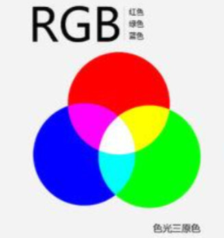

#### RGB值

RGB通过三原色的不同浓度来调配出不同的颜色

- 语法：`RGB(red, green, blue)`

- 范围：每一种颜色的范围在0 ~ 255（0% ~ 100%）之间

#### RGBA

就是在rgb的基础上增加了一个a表示不透明度

- `1`表示完全不透明

- `0`表示完全透明

- `.5`半透明

#### 十六进制的RGB值

就是RGB值的十六进制写法

- 语法：`#RRGGBB`

- 范围：每一种颜色的范围在00 ~ ff 之间

如果颜色两位两位重复可以进行简写，如`#aabbcc` => `#abc`

在vscode中，我们可以看到其会对颜色进行预览展示。并且将鼠标移至color处悬浮，会智能的弹出一个rgb调色板，方便我们进行调色

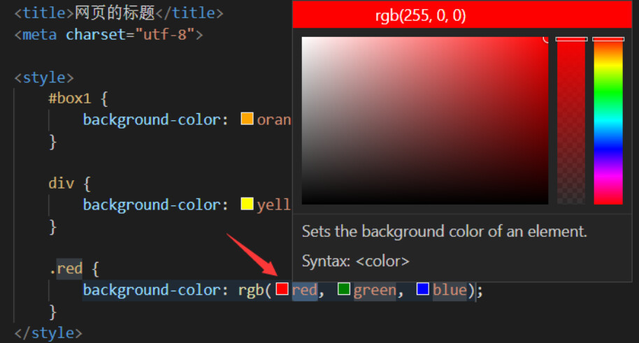

# 08 【盒模型(上) 盒模型(下)】

## 1.盒模型(上)

### 1.1 文档流（normalflow）

网页是一个多层的结构，一层摁着一层

通过CSS可以分别为每一层来设置样式，作为用户来讲只能看到最顶上一层

这些层中，最底下的一层称为文档流

文档流是网页的基础我们所创建的元素默认都是在文档流中进行排列

对于我们来元素主要有两个状态

- 在文档流中

- 不在文档流中（脱离文档流）

### 1.2 块元素

- 块元素会在页面中独占一行

- 默认宽度是父元素的全部（会把父元素撑满）

- 默认高度是被内容撑开（子元素）

### 1.3 行内元素

- 行内元素不会独占页面的一行，只占自身的大小

- 行内元素在页面中左向右水平排列（书写习惯一致）

- 如果一行之中不能容纳下所有的行内元素，则元素会换到第二行继续自左向右排列

- 行内元素的默认宽度和高度都是被内容撑开

### ⭕1.4 盒子模型

> 网页设计中常听的属性名：内容(content)、内边距(padding)、边框(border)、外边距(margin)， CSS盒子模型都具备这些属性。
>
> 这些属性我们可以用日常生活中的常见事物——盒子作一个比喻来理解，所以叫它盒子模型。
>
> CSS盒子模型就是在网页设计中经常用到的CSS技术所使用的一种思维模型。[[1\]](#fn1)

#### 盒子模型（box model）

所谓盒子模型：就是把 HTML 页面中的布局元素看作是一个矩形的盒子，也就是一个盛**装内容的容器**。
CSS 盒子模型本质上是一个盒子，封装周围的 HTML 元素。

CSS将页面中的所有元素都设置为了一个矩形的盒子

将元素设置为矩形的盒子后，对页面的布局就变成将不同的盒子摆放到不同的位置

每一个盒子都由一下几个部分组成：

- 内容区（content）

- 内边距（padding）

- 边框（border）

- 外边距（margin）

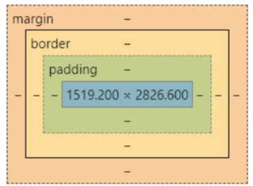

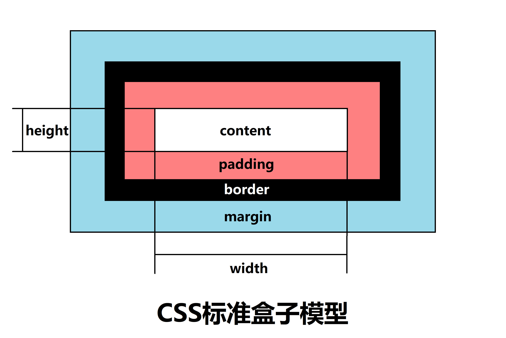


#### 内容区（content）

内容区是盒子模型的中心，它呈现了盒子的主要信息内容，这些内容可以是文本、图片等多种类型

元素中的所有的子元素和文本内容都在内容区中

- `width和height` 设置排列内容区的大小

- `width` 设置内容区的宽度

- `height` 设置内容区的高度

```css
.box1{
    width: 200px; 
    height: 200px; 
    background-color: #bfa;
}
```

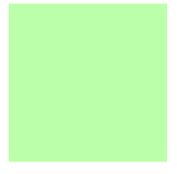


#### 边框（border）

`border` 可以设置元素的边框。

边框有三部分组成：`边框宽度（粗细）`、`边框样式`、`边框颜色`。

边框属于盒子边缘，边框里边属于盒子内部，出了边框都是盒子的外部

> 注意：边框会额外增加盒子的实际区域大小。因此我们有两种方案解决：
>
> - 测量盒子大小的时候，不量边框
>
> - 如果测量的时候包含了边框，则需要 width、height 减去边框宽度（注意减单边还是双边）
>
>   盒子实际区域大小 = 内容区大小 + 内边距大小 + 边框大小 + 外边距大小

**语法：**

```css
border: border-width || border-style || border-color
```

| 属性           | 作用                      |
| -------------- | ------------------------- |
| `border-width` | 定义边框粗细，单位是 `px` |
| `border-style` | 边框的样式                |
| `border-color` | 边框颜色                  |


边框样式 border-style 可以设置如下值：

- `none`：没有边框，即忽略所有边框的宽度（默认值）
- `solid`：边框为单实线（最为常用的）
- `dashed`：边框为虚线
- `dotted`：边框为点线
- `double`：边框为双线

**边框简写：**

`border`：简写属性，通过该属性可以同时设置边框所有的相关样式，并且没有顺序要求

```css
border: 1px solid red; 	/* 没有顺序 */
```

**边框分开写法：**

- `border-top` 上边框的宽度、颜色和样式

- `border-right` 右边框的宽度、颜色和样式

- `border-bottom` 下边框的宽度、颜色和样式

- `border-left` 左边框的宽度、颜色和样式

```css
border-top: 1px solid red; 		/* 只设定上边框，其余同理 */
```

**补充：**

> - `border-width` 边框的宽度：默认3px 
>
> - - `border-top-width` 上边框的宽度
>
> - - `border-right-width` 右边框的宽度
>
> - - `border-bottom-width` 下边框的宽度
>
> - - `border-left-width` 左边框的宽度
>
> - `border-color` 边框的颜色：默认使用color的颜色值
>
> - `border-top-color` 上边框的颜色
>
> - `border-right-color` 右边框的颜色
>
> - `border-bottom-color` 下边框的颜色
>
> - `border-left-color` 左边框的颜色
>
> - `border-style` 边框的样式：没有默认值，必须指定 
>
> - - `border-top-style` 上边框的样式
>
> - - `border-right-style` 右边框的样式
>
> - - `border-bottom-style` 下边框的样式
>
> - - `border-left-style` 左边框的样式

#### 内边距(padding）

padding 属性用于设置**内边距**，即**边框与内容之间的距离**。

| 属性             | 作用     |
| ---------------- | -------- |
| `padding-left`   | 左内边距 |
| `padding-rigth`  | 右内边距 |
| `padding-top`    | 上内边距 |
| `padding-bottom` | 下内边距 |

padding 属性（简写属性）可以有一到四个值。

| 值的个数                       | 表达意思                                                     |
| ------------------------------ | ------------------------------------------------------------ |
| `padding: 5px;`                | 1 个值，代表上下左右都有 5 像素内边距                        |
| `padding: 5px 10px;`           | 2 个值，代表上下内边距是 5 像素，左右内边距是 10 像素        |
| `padding: 5px 10px 20px;`      | 3 个值，代码上内边距 5 像素，左右内边距 10 像素，下内边距 20 像素 |
| `padding: 5px 10px 20px 30px;` | 4 个值，上是 5 像素，右 10 像素，下 20 像素，左是 30 像素（顺时针） |

以上 4 种情况，我们实际开发都会遇到。

当我们给盒子指定 `padding` 值之后，发生了 2 件事情：

- 内容和边框有了距离，添加了内边距
- `padding` 影响了盒子实际区域大小

也就是说，如果盒子已经有了宽度和高度，此时再指定内边距，会撑大盒子区域！

解决方案：

- 如果保证盒子跟效果图大小保持一致，则让 width、height 减去多出来的内边距大小即可
- 如果盒子本身没有指定 width、height 属性，则此时 padding 不会撑开盒子区域大小

盒子可见框的大小，由内容区、内边距和边框共同决定，所以在计算盒子大小时，需要将这三个区域加到一起计算

#### 外边距（margin）

外边距，也叫空白边，位于盒子的最外围，是添加在边框外周围的空间。空白边使盒子之间不会紧凑地连接在一起，是CSS 布局的一个重要手段

注意：外边距不会影响盒子可见框的大小，但是外边距会影响盒子的位置和占用空间

`margin` 属性用于设置**外边距**，即控制**盒子和盒子之间的距离**。

| 属性            | 作用     |
| --------------- | -------- |
| `margin-left`   | 左外边距 |
| `margin-right`  | 右外边距 |
| `margin-top`    | 上外边距 |
| `margin-bottom` | 下外边距 |

一共有四个方向的外边距：

- `margin-top` 上外边距 

- - 设置正值，元素自身向下移动

- - 设置负值，元素自身向上移动

- `margin-right` 右外边距 

- - 设置正值，其右边的元素向右移动

- - 设置负值，其右边的元素向左移动

- - 上述说法并不准确，对于块元素，设置`margin-right`不会产生任何效果

- `margin-bottom` 下外边距 

- - 设置正值，其下边的元素向下移动

- - 设置负值，其下边的元素向上移动

- - 上述说法并不准确，对于块元素，会有垂直方向上的边距重叠问题（后面会细说）

- `margin-left` 左外边距 

- - 设置正值，元素自身向右移动

- - 设置负值，元素自身向左移动

元素在页面中是按照自左向右的顺序排列的，所以默认情况下

- 如果我们设置的左和上外边距则会移动元素自身

- 而设置下和右外边距会移动其他元素


`margin` 简写方式代表的意义跟 `padding` 完全一致。

外边距典型应用：

外边距可以让**块级盒子水平居中**，但是必须满足两个条件：

- 盒子必须指定了宽度 `width`
- 盒子左右的外边距都设置为 `auto`

```css
.header { width: 960px; margin: 0 auto;}
```

常见的写法，以下三种都可以：

- `margin-left: auto; margin-right: auto;`
- `margin: auto;`
- `margin: 0 auto;`

注意：以上方法是让块级元素水平居中，行内元素或者行内块元素水平居中给其父元素添加 `text-align: center` 即可。

### ⭕1.5 水平方向布局

元素在其父元素中水平方向的位置由以下几个属性共同决定

- `margin-left`

- `border-left`

- `padding-left`

- `width`

- `padding-right`

- `border-right`

- `margin-right`

一个元素在其父元素中，水平布局必须要满足以下的等式

```css
margin-left + border-left + padding-left + width + padding-right + border-right + margin-right = 其父元素的宽度
```

以上等式必须满足，如果相加结果使等式不成立，则称为**过渡约束**

则等式会自动调整调整的情况：

-  **如果这七个值中没有`auto`的情况，则浏览器会自动调整`margin-right`值以使等式满足**
   `100 + 0 + 0 + 200 + 0 + 0 + 0 = 800` ==> `100 + 0 + 0 + 200 + 0 + 0 + 500 = 800` 

-  如果这七个值中有`auto`的情况，则会自动调整`auto`值以使等式成立
   **这七个值中有三个值可以设置为`auto` ：`width`、`margin-left`、`margin-right`** 

1. 如果某个值为auto，则会自动调整`auto`的那个值以使等式成立
   `200 + 0 + 0 + auto + 0 + 0 + 200 = 800` ==> `200 + 0 + 0 + 400 + 0 + 0 + 200 = 800`
   `auto + 0 + 0 + 200 + 0 + 0 + 200 = 800` ==> `400 + 0 + 0 + 200 + 0 + 0 + 200 = 800`
   `200 + 0 + 0 + 200 + 0 + 0 + auto = 800` ==> `200 + 0 + 0 + 200 + 0 + 0 + 400 = 800` 

2. **如果宽度为`auto`，则宽度会调整到最大，其他`auto`的外边距会自动设置为0**
   `auto + 0 + 0 + auto + 0 + 0 + 200 = 800` ==> `0 + 0 + 0 + 600 + 0 + 0 + 200 = 800`
   `200 + 0 + 0 + auto + 0 + 0 + auto = 800` ==> `200 + 0 + 0 + 600 + 0 + 0 + 0 = 800`
   `auto + 0 + 0 + auto + 0 + 0 + auto = 800` ==> `0 + 0 + 0 + 800 + 0 + 0 + 0 = 800` 

3. **如果外边距都为`auto`，则`auto`的外边距会自动均分以使等式成立**
   `auto + 0 + 0 + 200 + 0 + 0 + auto = 800` ==> `300 + 0 + 0 + 200 + 0 + 0 + 300 = 800` 

```html
<style>
    .box1 {
        width: 200px;
        height: 200px;
        background-color: #bfa;
        border: 10px orange solid;
        /* 下列条件等价于 margin: 0 auto */
        margin-left: auto;
        margin-right: auto;
    }
</style>
<div class="box1"></div>
```

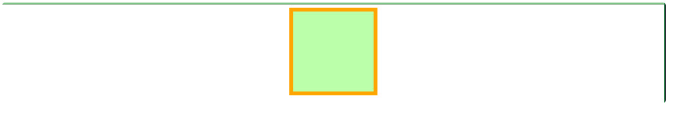

### ⭕1.6 垂直方向布局

#### 元素溢出

子元素是在父元素的内容区中排列的，如果子元素的大小超过了父元素，则子元素会从父元素中溢出

使用`overflow`/`overflow-x`/`overflow-y`属性来设置父元素如何处理溢出的子元素

可选值：`visible`/`hidden`/`scroll`/`auto`

`visible` 溢出内容会在父元素外部位置显示，默认值

#### 边距折叠

使用 `margin` 定义块元素的垂直外边距时，可能会出现外边距的合并。

注意：**内边距没有合并一说！浮动的盒子不会发生外边距合并！**

主要有两种情况:

- **相邻块元素垂直外边距的合并**
- **嵌套块元素垂直外边距的塌陷**

#### 兄弟元素

当上下相邻的两个块元素（兄弟关系）相遇时，如果上面的元素有下外边距 `margin-bottom`，下面的元素有上外边距 `margin-top` ，则他们之间的垂直间距不是 `margin-bottom` 与 `margin-top` 之和。而是取两个值中的**较大者**，这种现象被称为相邻块元素垂直外边距的合并（准确的描述应该是：**大的外边距覆盖小的**）。

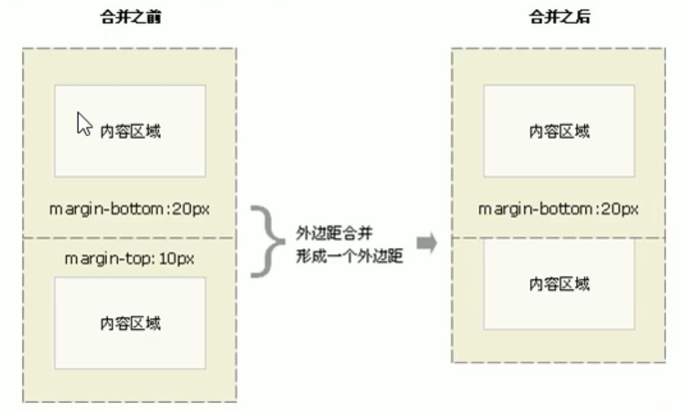

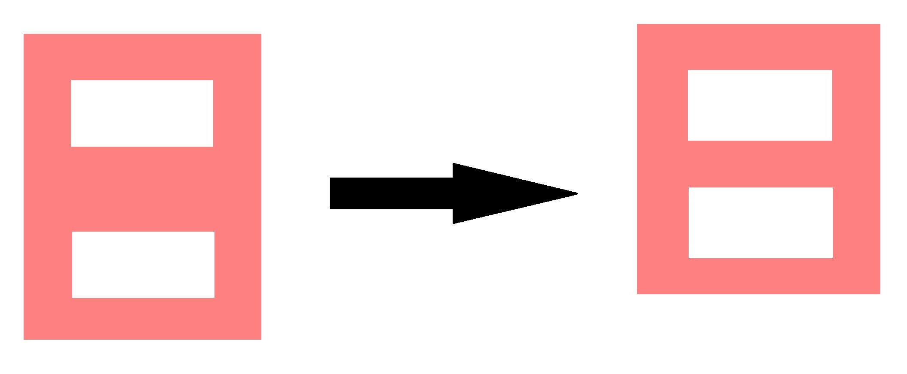

**解决方案：**

**尽量只给一个盒子添加 `margin` 值。**

特殊情况：

- 如果相邻的外边距一正一负，则取两者的和

- 如果相邻的外边距都是负值，则取两者中绝对值较大的

> 在网页布局中，通过谷歌浏览器或火狐浏览器预览时，发现我们定义的盒模型width，height，margin，padding 值都是不准确的
>
> 谷歌、火狐浏览器 缩放为80% 时，margin值才正确[[2\]](#fn2)

**总结**

兄弟元素之间的外边距的重叠，对于开发是有利的，所以我们不需要进行处理

#### 父子元素

对于两个嵌套关系（父子关系）的块元素，当子元素有上外边距，此时父元素会塌陷较大的外边距值（**外边距效果显示在父元素之上**）。

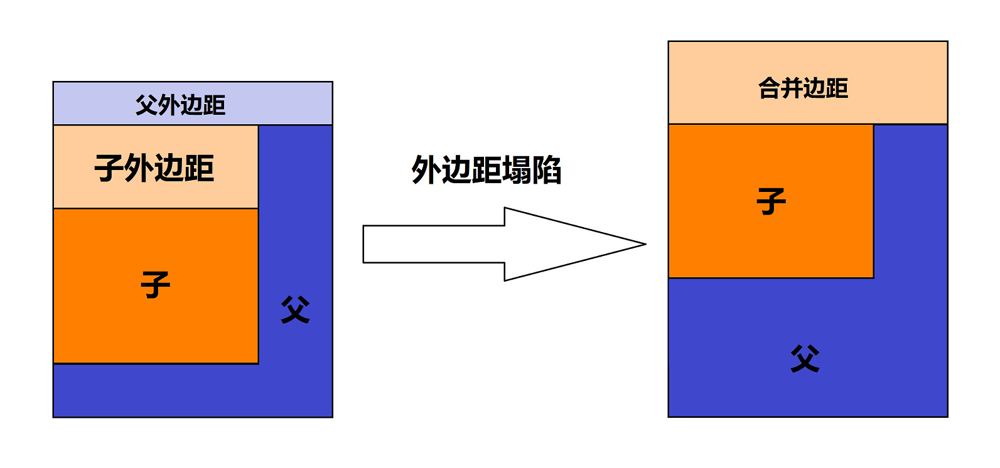


父子外边距的折叠会影响到页面的布局，必须要进行处理

**解决方案：**

- 可以为父元素定义上边框（比如：可以给一个透明 transparent 、rebeccapurple 边框）` border-top: 1px rebeccapurple solid;`,然后调整父元素的高度

```css
.box3 {
    width: 200px;
    height: 199px;
    background-color: #bfa;
    border-top: 1px #bfa solid; 
}

.box4 {
    width: 100px;
    height: 100px;
    background-color: orange;
    margin-top: 99px; /* margin-top: 100px; */
}
```

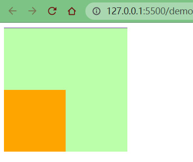

- 可以为父元素定义上内边距，然后调整父元素的高度

```css
.box3 {
    width: 200px;
    height: 100px; /* height: 200px; */
    background-color: #bfa;
    padding-top: 100px; 
}

.box4 {
    width: 100px;
    height: 100px;
    background-color: orange;
}
```


- 可以为父元素添加 `overflow: hidden`

还有其他方法，比如浮动、固定，绝对定位的盒子不会有塌陷问题，后面咱们再总结。

### 1.7 行内元素的盒模型

-  行内元素不支持设置宽度和高度 

```css
.s1 {
    /* 行内元素设置了宽高也没用，不会生效 */
    width: 100px;
    height: 100px;
    background-color: yellow;
}
```

-  行内元素可以设置`padding`，但是垂直方向`padding`不会影响页面的布局 

```css
.s1 {
    /* 下方的div元素并没有因span设置了padding属性，而受到位置上的影响 */
    padding: 100px;
    background-color: yellow;
}

.box1 {
    width: 200px;
    height: 200px;
    background-color: #bfa;
}
```

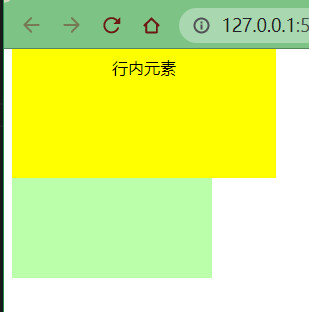

-  行内元素可以设置`border`，垂直方向的`border`不会影响页面的布局 

```css
.s1 {
    border: 10px orange solid;
    background-color: yellow;
}

.box1 {
    width: 200px;
    height: 200px;
    background-color: #bfa;
}
```

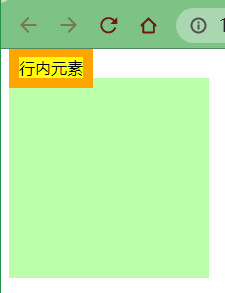

-  行内元素可以设置`margin`，垂直方向的`margin`不会影响页面的布局 

```css
.s1 {
    margin: 100px;
    background-color: yellow;
}

.box1 {
    width: 200px;
    height: 200px;
    background-color: #bfa;
}
```

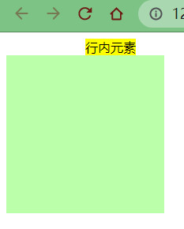

`display`用来设置元素显示的类型

-  `inline`将元素设置为行内元素 

-  `block`将元素设置为块元素 

```css
.s1 {
    margin: 100px;
    background-color: yellow;
    /* 将行内元素设置为块元素 */
    display: block; 
}
```

-  `inline-block` 将元素设置为行内块元素行内块，既可以设置宽度和高度又不会独占一行 

```css
.s1 {
    margin: 100px;
    background-color: yellow;
    /* 将行内元素设置为行内块元素，兼顾行内元素和块元素的特点 */
    display: inline-block; 
}
```

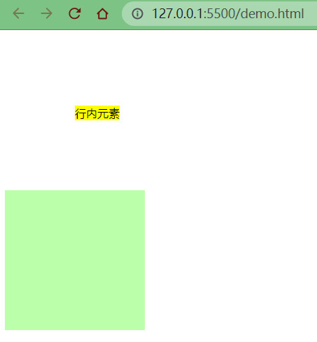

`visibility`用来设置元素的显示状态

-  `visible`默认值，元素在页面中正常显示 

-  `hidden`元素在页面中隐藏不显示，但是依然占据页面的位置 

### 1.8 浏览器的默认样式

通常情况，浏览器都会为元素设置一些默认样式

默认样式的存在会影响到页面的布局，通常情况下编写网页时必须要去除浏览器的默认样式（PC端的页面）

> 在当今网页设计/开发实践中，使用CSS来为语义化的(X)HTML标记添加样式风格是重要的关键。
>
> 在设计师们的梦想中都存在着这样的一个完美世界：所有的浏览器都能够理解和适用多有CSS规则，并且呈现相同的视觉效果(没有兼容性问题)。
>
> 但是，我们并没有生活在这个完美的世界，现实中发生的失窃却总是恰恰相反，很多CSS样式在不同的浏览器中有着不同的解释和呈现。
>
> 当今流行的浏览器(如:Firefox、Opera、Internet Explorer、Chrome、Safari等等)中，有一些都是以自己的方式去理解CSS规范，这就会导致有的浏览器对CSS的解释与设计师的CSS定义初衷相冲突，使得网页的样子在某些浏览器下能正确按照设计师的想法显示
>
> 而且有些浏览器却并没有按照设计师想要的样子显示出来，这就导致浏览器的兼容性问题。
>
> 更糟的是，有的浏览器完全无视CSS的一些声明和属性。[[5\]](#fn5)

我们可以尝试编写css样式，以去除浏览器的默认样式

```css
* {
    margin: 0;
    padding: 0;
    list-style: none;
}
```

> 正因为上述冲突和问题依然存在于这个”不完美的世界”，所以一些设计师想到了一种避免浏览器兼容性问题的方法，那就是CSS Reset
>
> 什么是CSS Reset？
>
> 我们可以把它叫做CSS重设，也有人叫做CSS复位、默认CSS、CSS重置等
>
> CSS重设就是先定义好一些CSS样式，来让所有浏览器都按照同样的规则解释CSS，这样就能避免发生这种问题。[[](#fn5)

### 1.9 reset样式

官方地址：[reset.css](https://meyerweb.com/eric/tools/css/reset/)

```html
<link rel="stylesheet" href="assets/reset.css">
```

### 1.10 normalize样式

官方地址：[normalize.css](https://necolas.github.io/normalize.css/8.0.1/normalize.css)

```html
<link rel="stylesheet" href="assets/normalize.css">
```

### 1.11 参考资料

1CSS盒子模型：`https://baike.baidu.com/item/CSS盒子模型/9814562?fr=aladdin`

2谷歌、火狐浏览器 缩放为80% 时，margin值才正确：https://www.cnblogs.com/taohuaya/p/7642742.html

3margin (子元素远离父元素边框)：https://www.cnblogs.com/FlFtFw/p/9627026.html 

4目前比较全的CSS重设(reset)方法总结：https://www.cnblogs.com/hnyei/archive/2011/10/04/2198779.html 

## 2.盒模型(下)

### 2.1 盒子大小

CSS3 中可以通过 box-sizing 来指定盒模型，有 2 个值：即可指定为 content-box、border-box，这样我们计算盒子大小的方式就发生了改变。

可以分成两种情况：

1. box-sizing: content-box 盒子大小为 width + padding + border （以前默认的）
2. box-sizing: border-box 盒子大小为 width

如果盒子模型我们改为了 box-sizing: border-box， 那 padding 和 border 就不会撑大盒子了（前提 padding 和 border 不会超过 width 宽度）

默认情况下，盒子可见框的大小由内容区、内边距和边框共同决定

`box-sizing`用来设置盒子尺寸的计算方式（设置width和height的作用）

```css
.box {
    width: 200px;
    height: 200px;
    background-color: yellow;
    border: 10px red solid;
    /* box-sizing: content-box; */
    box-sizing: border-box;
}
```

可选值：

-  `content-box`默认值，宽度和高度用来设置内容区的大小
   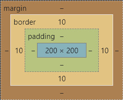

-  `border-box` 宽度和高度用来设置整个盒子可见框的大小
   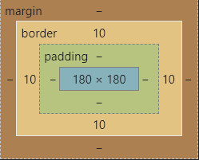

`width`和`height`指的是内容区、内边距和边框的总大小

### ⭕2.2 轮廓

`outline`用来设置元素的轮廓线，用法和`border`一模一样

轮廓和边框不同点是，轮廓不会影响到可见框的大小

```css
.box {
    width: 200px;
    height: 200px;
    background-color: yellow;
    outline: 10px red solid;
}
```

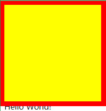

可以很明显看到`outline`与`border`的区别

我们一般不会直接这么设置轮廓，而是下面这种场景

```css
.box:hover {
    outline: 10px red solid;
}
```


从上面的动态图也可以很清晰地看出，`outline`属性并没有改变盒子的布局

### ⭕2.3 盒子阴影

CSS 3 新增了盒子阴影。

`box-shadow`用来设置元素的阴影效果，阴影不会影响页面布局。

语法：

```css
box-shadow: h-shadow v-shadow blur spread color inset;
```

| 值         | 描述                                                         |
| ---------- | ------------------------------------------------------------ |
| `h-shadow` | 必须。水平阴影的位置，允许负值。                             |
| `v-shadow` | 必须。垂直阴影的位置，允许负值。                             |
| `blur`     | 可选。阴影的模糊半径（虚实程度）。                           |
| `spread`   | 可选。阴影的尺寸（大小）。                                   |
| `color`    | 可选。阴影的颜色，请参阅 CSS 颜色值（阴影多为半透明颜色）。  |
| `inset`    | 可选。将外部阴影（outset）改为内部阴影（outset 不能指定，默认为空即可）。 |

```html
<head>
    <meta charset="UTF-8">
    <meta name="viewport" content="width=device-width, initial-scale=1.0">
    <meta http-equiv="X-UA-Compatible" content="ie=edge">
    <title>盒子阴影</title>
    <style>
        div {
            width: 200px;
            height: 200px;
            background-color: salmon;
            margin: 100px auto;
            /* box-shadow: 10px 10px; */
        }

        /* 伪类不仅仅可以用于 a 链接，还能用于其他标签 */
        /* 原先盒子没有影子,当我们鼠标经过盒子就添加阴影效果 */
        div:hover {
            box-shadow: 10px 10px 10px -4px rgba(0, 0, 0, .3);
        }
    </style>
</head>

<body>
    <div></div>
</body>

```


**三边阴影、双边阴影、单边阴影的设置方法：**

```html
<!doctype html>
<html lang="en">

<head>
    <meta charset="UTF-8">
    <meta http-equiv="X-UA-Compatible" content="IE=edge">
    <meta name="viewport" content="width=device-width, initial-scale=1.0">
    <title>盒子阴影 三边阴影、双边阴影、单边阴影</title>
    <style>
        div {
            width: 100px;
            height: 100px;
            background-color: #000;
            margin: 25px auto;
            color: white;
        }

        .a {
            box-shadow: 0 0 25px 5px red;
        }

        /* 三边阴影就是直接把整个阴影部分往下边移 */
        .b {
            box-shadow: 0 6px 10px 0 red;
        }

        /* 两边阴影要用盒子嵌套来解决 */
        .c1 {
            box-shadow: 0 10px 10px -5px red;
        }

        .c2 {
            width: 100%;
            box-shadow: 0 -10px 10px -5px red;
        }

        /* 单边阴影就是直接把整个阴影部分往下边移，并且减小阴影大小 */
        .d {
            box-shadow: 0 10px 10px -5px red;
        }
    </style>
</head>

<body>
    <div class="a">四边阴影</div>
    <div class="b">三边阴影</div>
    <div class="c1">
        <div class="c2">两边阴影</div>
    </div>
    <div class="d">一边阴影</div>
</body>

</html>
```


### ⭕2.4 圆角边框

CSS 3 新增了圆角边框样式。

border-radius 属性用于设置元素的外边框圆角。

语法：

```css
border-radius: length;
```

原理：

border-radius 顾名思义：边框半径。

（椭）圆与边框的交集形成圆角效果。

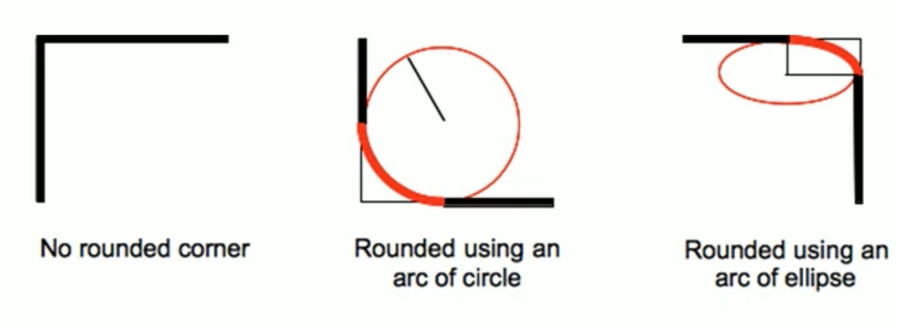

```html
<!doctype html>
<html lang="en">

<head>
    <meta charset="UTF-8">
    <meta name="viewport" content="width=device-width, initial-scale=1.0">
    <meta http-equiv="X-UA-Compatible" content="ie=edge">
    <title>圆角边框</title>
    <style>
        div {
            width: 300px;
            height: 150px;
            background-color: pink;
            border-radius: 24px;
        }
    </style>
</head>

<body>
    <div></div>
</body>

</html>
```


注意：

- 参数值可以为数值或百分比的形式
- 如果是正方形，想要设置为圆形，那么只需要把数值修改为高度或者宽度的一半即可，或者直接写为 50%
- 如果是个矩形，设置为高度的一半就可以做 “胶囊” 效果了
- 该属性是一个简写属性，可以跟多个值
  - 四个值：左上角、右上角、右下角、左下角（从左上开始顺时针）
  - 三个值：左上、右上+左下、右下（对角为一组）
  - 两个值：左上+右下、右上+左下（对角为一组）
- 同时可以对特定角单独设置
  - 左上角：`border-top-left-radius`
  - 右上角：`border-top-right-radius`
  - 右下角：`border-bottom-right-radius`
  - 左下角：`border-bottom-left-radius`

### ⭕2.5 CSS3其他特性（了解）

1. 图片变模糊
2. 计算盒子宽度 width:calc 函数

```html
<!doctype html>
<html lang="en">
<head>
    <meta charset="UTF-8">
    <meta name="viewport" content="width=device-width, initial-scale=1.0">
    <meta http-equiv="X-UA-Compatible" content="ie=edge">
    <title>图片模糊处理filter</title>
    <style>
        img {
            /* blur 是一个函数 小括号里面数值越大，图片越模糊 注意数值要加 px 单位 */
            filter: blur(15px);
        }

        img:hover {
            filter: blur(0);
        }
    </style>
</head>
<body>

</body>
</html>
```


```html
<!doctype html>
<html lang="en">
<head>
    <meta charset="UTF-8">
    <meta name="viewport" content="width=device-width, initial-scale=1.0">
    <meta http-equiv="X-UA-Compatible" content="ie=edge">
    <title>CSS3属性calc函数</title>
    <style>
        .father {
            width: 500px;
            height: 500px;
            background-color: black;
        }

        .son {
            /* width: 300px; */
            /* width: calc(500px - 100px); */
            width: calc(100% - 100px);
            height: 200px;
            background-color: salmon;
        }
    </style>
</head>
<body>
<!-- 需求：我们的子盒子宽度永远比父盒子小 100 像素 -->
<div class="father">
    <div class="son"></div>
</div>
</body>
</html>
```

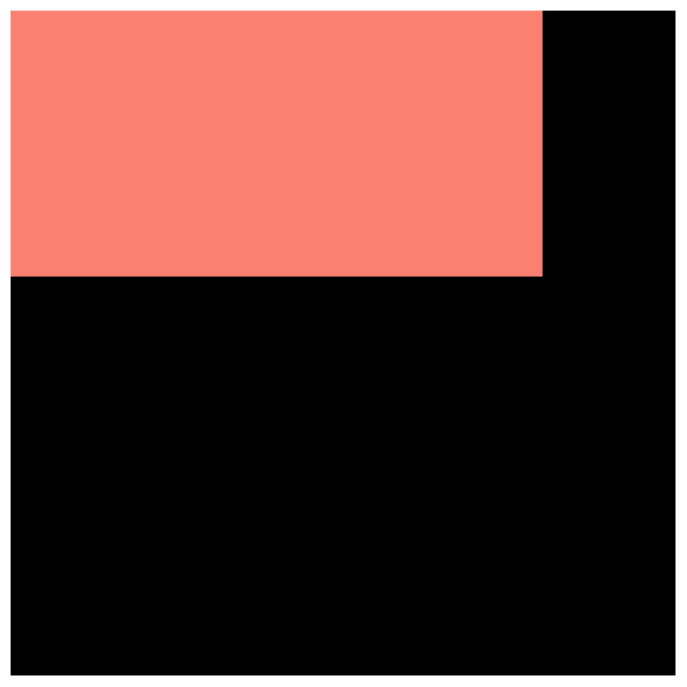

#### CSS3滤镜 filter

filter CSS 属性将模糊或颜色偏移等图形效果应用于元素。

```css
filter: 函数(); 例如：filter: blur(5px); blur 模糊处理，数值越大越模糊
```

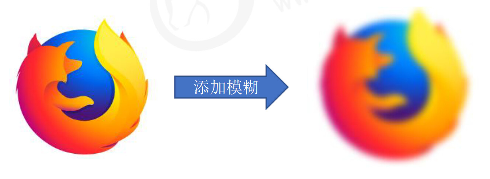

#### CSS3 calc 函数

calc() 此 CSS 函数让你在声明 CSS 属性值时执行一些计算。

```css
width: calc(100% - 80px);
```

括号里面可以使用 `+` `-` `*` `/` 来进行计算。

# 09 【浮动 常见网页布局】

## 1.浮动

### 1.1 传统网页布局的三种方式

网页布局的本质：用 CSS 来摆放盒子，把盒子摆放到相应位置。

CSS 提供了三种传统布局方式（简单说就是盒子如何进行排列）。

- 普通流（标准流）
- 浮动
- 定位

> 这里指的只是传统布局，其实还有一些特殊高级的布局方式。

### 1.2 标准流（普通流/文档流）

所谓的标准流：就是标签按照规定好的默认方式排列。

1. **块级元素会独占一行，从上向下顺序排列。**
2. **行内元素会按照顺序，从左到右顺序排列，碰到父元素边缘则自动换行。**

以上都是标准流布局，我们前面学习的就是标准流，标准流是最基本的布局方式。

这三种布局方式都是用来摆放盒子的，盒子摆放到合适位置，布局自然就完成了。

**注意：**实际开发中，一个页面基本都包含了这三种布局方式（后面移动端学习新的布局方式） 。

### 1.3 为什么需要浮动？

提问：我们用标准流能很方便的实现如下效果吗？

1. **如何让多个块级盒子（div）水平排列成一行？**


比较难，虽然转换为行内块元素可以实现一行显示，但是他们之间会有大的**空白缝隙**，很难控制。

```html
<head>
    <title>行内块中间有缝隙</title>
    <style>
        div {
            width: 150px;
            height: 200px;
            background-color: #d87093;
            display: inline-block;
        }
    </style>
</head>

<body>
    <div>1</div>
    <div>2</div>
    <div>3</div>
</body>
```


2. **如何实现两个盒子的左右对齐？**


总结： 有很多的布局效果，标准流没有办法完成，此时就可以利用浮动完成布局。 因为浮动可以改变元素标签默认的排列方式。

**浮动最典型的应用：可以让多个块级元素一行内排列显示。**

**网页布局第一准则：多个块级元素纵向排列找标准流，多个块级元素横向排列找浮动！**

```html
<head>
    <style>
        div {
            float: left;
            width: 150px;
            height: 200px;
            background-color: #d87093;
        }
    </style>
</head>

<body>
    <div>1</div>
    <div>2</div>
    <div>3</div>
</body>
```


**拓展：**浮动的盒子不会发生外边距合并！

### ⭕1.4 什么是浮动？

通过浮动可以使一个元素向其父元素的左侧或右侧移动

注意

- 元素设置浮动以后，水平布局的等式便不需要强制成立

- 元素设置浮动以后，会完全从文档流中脱离，不再占用文档流的位置，所以元素下边的还在文档流中的元素会自动向上移动

语法：

```css
选择器 { float: 属性值;}
```

| 属性  | 描述                 |
| ----- | -------------------- |
| none  | 元素不浮动（默认值） |
| left  | 元素向左浮动         |
| right | 元素向右浮动         |

```html
<!doctype html>
<html lang="en">

<head>
    <meta charset="UTF-8">
    <meta name="viewport" content="width=device-width, initial-scale=1.0">
    <meta http-equiv="X-UA-Compatible" content="ie=edge">
    <title>什么是浮动</title>
    <style>
        .left,
        .right {
            float: left;
            width: 200px;
            height: 200px;
            background-color: pink;
        }
    </style>
</head>

<body>
    <div class="left">左青龙</div>
    <div class="right">右白虎</div>
</body>

</html>
```


```html
<!doctype html>
<html lang="en">

<head>
    <meta charset="UTF-8">
    <meta name="viewport" content="width=device-width, initial-scale=1.0">
    <meta http-equiv="X-UA-Compatible" content="ie=edge">
    <title>什么是浮动</title>
    <style>
        .left,
        .right {
            float: left;
            width: 200px;
            height: 200px;
            background-color: pink;
        }

        /* 层叠性 */
        .right {
            float: right;
        }
    </style>
</head>

<body>
    <div class="left">左青龙</div>
    <div class="right">右白虎</div>
</body>

</html>
```


### ⭕1.5 浮动的特点

1. 浮动元素会脱离标准流（脱标），不再占据文档流中的位置 

   - 脱离标准普通流的控制（浮） 移动到指定位置（动），（俗称脱标）
   - 浮动的盒子不再保留原先的位置

   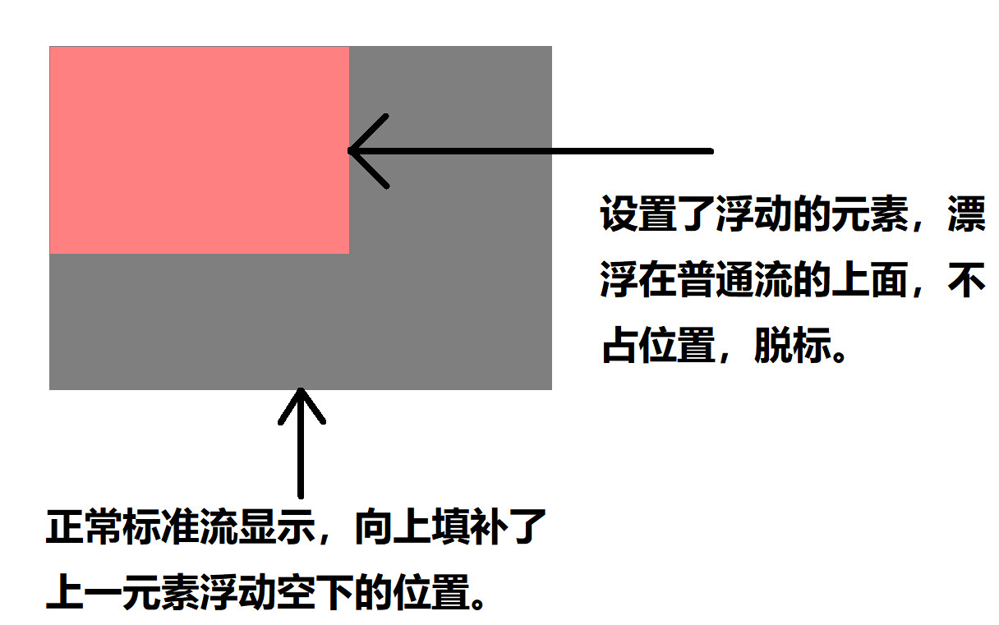

   ```html
   <!doctype html>
   <html lang="en">
   
   <head>
       <meta charset="UTF-8">
       <meta name="viewport" content="width=device-width, initial-scale=1.0">
       <meta http-equiv="X-UA-Compatible" content="ie=edge">
       <title>浮动特性1</title>
       <style>
           /* 设置了浮动（float）的元素会：
           1.脱离标准普通流的控制（浮）移动到指定位置（动）。
           2.浮动的盒子不再保留原先的位置 */
           .box1 {
               float: left;
               width: 200px;
               height: 200px;
               background-color: pink;
           }
   
           .box2 {
               width: 300px;
               height: 300px;
               background-color: gray;
           }
       </style>
   </head>
   
   <body>
       <div class="box1">浮动的盒子</div>
       <div class="box2">标准流的盒子</div>
   </body>
   
   </html>
   ```

   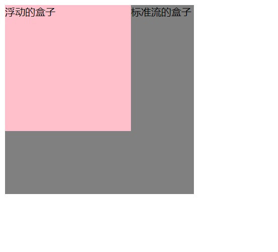

2. 设置浮动以后，元素会向父元素的左侧或右侧移动 

3. 浮动元素默认不会从父元素中移出 

```html
<style>
    .box1 {
        width: 100px;
        height: 100px;
        background-color: orange;
        float: left;
    }

    .box2 {
        width: 200px;
        height: 200px;
        background-color: red;
    }
</style>

<div class="box1"></div>
<div class="box2"></div>
```


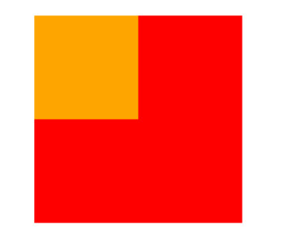

4. 浮动元素向左或向右移动时，不会超过前边的浮动元素（先来后到的顺序） 

```html
<style>
    .box1 {
        width: 200px;
        height: 200px;
        background-color: orange;
        float: left;
    }

    .box2 {
        width: 200px;
        height: 200px;
        background-color: red;
        float: left;
    }

    .box3 {
        width: 200px;
        height: 200px;
        background-color: yellow;
        float: left;
    }
</style>

<div class="box1"></div>
<div class="box2"></div>
<div class="box3"></div>
```


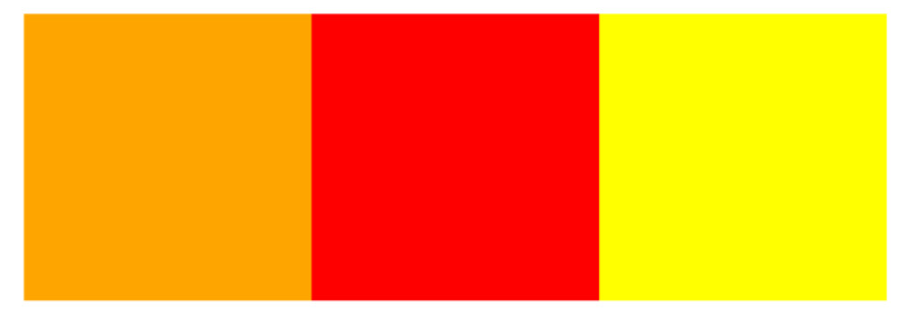

5. 浮动元素不会超过上边的浮动的兄弟元素，最多就是和它一样高 

```html
<style>
    .box1 {
        width: 300px;
        height: 300px;
        background-color: orange;
        float: left;
    }

    .box2 {
        width: 400px;
        height: 400px;
        background-color: red;
        float: left;
    }

    .box3 {
        width: 300px;                                              
        height: 300px;
        background-color: yellow;
        float: right;
    }
</style>

<div class="box1"></div>
<div class="box2"></div>
<div class="box3"></div>
```


6. 如果浮动元素的上边是一个没有浮动的块元素，则浮动元素无法上移 

```html
<style>
    .box1 {
        width: 200px;
        height: 200px;
        background-color: orange;
    }

    .box2 {
        width: 200px;
        height: 200px;
        background-color: red;
        float: left;
    }
</style>

<div class="box1"></div>
<div class="box2"></div>
```


7. 浮动元素不会盖住文字，文字会自动环绕在浮动元素的周围，所以我们可以利用浮动来设置文字环绕图片的效果
   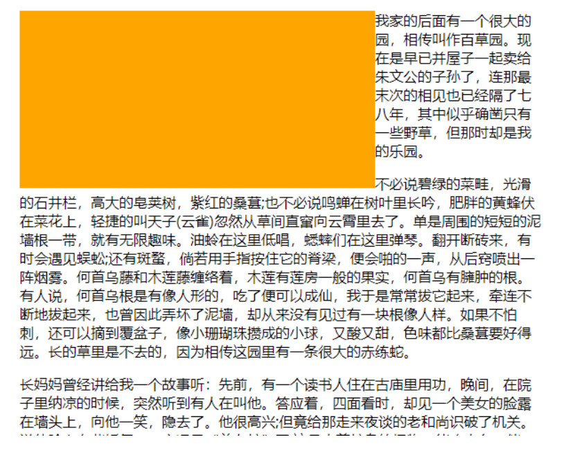

8. 浮动的元素会一行内显示并且元素顶部对齐

- 如果多个盒子都设置了浮动，则它们会按照属性值一行内显示并且顶端对齐排列。
- 浮动的元素是互相贴靠在一起的（不会有缝隙），如果父级宽度装不下这些浮动的盒子，多出的盒子会另起一行对齐。

```html
<!doctype html>
<html lang="en">

<head>
    <meta charset="UTF-8">
    <meta name="viewport" content="width=device-width, initial-scale=1.0">
    <meta http-equiv="X-UA-Compatible" content="ie=edge">
    <title>浮动元素特性-浮动元素一行显示</title>
    <style>
        div {
            float: left;
            width: 200px;
            height: 200px;
            background-color: pink;
        }

        .two {
            background-color: skyblue;
            height: 249px;
        }

        .four {
            background-color: skyblue;
        }
    </style>
</head>

<body>
    <div>1</div>
    <div class="two">2</div>
    <div>3</div>
    <div class="four">4</div>
</body>

</html>
```


9. 浮动的元素会具有行内块元素的特性

任何元素都可以浮动。不管原先是什么模式的元素，添加浮动之后具有行内块元素相似的特性。

- 块级盒子：没有设置宽度时默认宽度和父级一样宽，但是添加浮动后，它的大小根据内容来决定
- 行内盒子：宽度默认和内容一样宽，直接设置高宽无效，但是添加浮动后，它的大小可以直接设置
- 浮动的盒子中间是没有缝隙的，是紧挨着一起的
- **即：默认宽度由内容决定，同时支持指定高宽，盒子之间无空隙**

```html
<!doctype html>
<html lang="en">

<head>
    <meta charset="UTF-8">
    <meta name="viewport" content="width=device-width, initial-scale=1.0">
    <meta http-equiv="X-UA-Compatible" content="ie=edge">
    <title>浮动的元素具有行内块元素特点</title>
    <style>
        /* 任何元素都可以浮动。不管原先是什么模式的元素，添加浮动之后具有行内块元素相似的特性。 */
        span,
        div {
            float: left;
            width: 200px;
            height: 100px;
            background-color: pink;
        }

        /* 如果行内元素有了浮动，则不需要转换块级\行内块元素就可以直接给高度和宽度 */
        p {
            float: right;
            height: 200px;
            background-color: skyblue;
        }
    </style>
</head>

<body>
    <span>span1</span>
    <span>span2</span>

    <div>div</div>
    <p>pppppppppppppp</p>
</body>

</html>
```


**注意：之所以顶部没有对齐，原因是 p 标签自带的外边距 > span div 自带的外边距。**

```html
<!doctype html>
<html lang="en">

<head>
    <meta charset="UTF-8">
    <meta name="viewport" content="width=device-width, initial-scale=1.0">
    <meta http-equiv="X-UA-Compatible" content="ie=edge">
    <title>浮动的元素具有行内块元素特点</title>
    <style>
        * {
            margin: 0px;
        }

        /* 任何元素都可以浮动。不管原先是什么模式的元素，添加浮动之后具有行内块元素相似的特性。 */
        span,
        div {
            float: left;
            width: 200px;
            height: 100px;
            background-color: pink;
        }

        /* 如果行内元素有了浮动,则不需要转换块级\行内块元素就可以直接给高度和宽度 */
        p {
            float: right;
            height: 200px;
            background-color: skyblue;
        }
    </style>
</head>

<body>
    <span>span1</span>
    <span>span2</span>

    <div>div</div>
    <p>pppppppppppppp</p>
</body>

</html>
```


简单总结：

- 浮动目前来讲它的主要作用就是让页面中的元素可以水平排列，通过浮动可以制作一些水平方向的布局

- 元素设置浮动以后，将会从文档流中脱离，从文档流中脱离后，元素的一些特点也会发生变化

### ⭕1.6 脱离文档流的特点

块元素：

- 块元素不再独占页面的一行

- 脱离文档流以后，块元素的宽度和高度默认都被内容撑开

```html
<style>
    .box1 {
        background-color: orange;
        /* float: left; */
    }
</style>

<div class="box1">hello</div>
```


行内元素：

- 行内元素脱离文档流以后会，特点和块元素一样

```html
<style>
    span {
        width: 200px;
        height: 200px;
        background-color: orange;
        float: left;
    }
</style>

<span>I am a Span</span>
```


脱离文档流之后的特点很像行内块元素，不过存在一些差异

```html
<style>
    span {
        width: 200px;
        height: 200px;
        background-color: orange;
        /* display: inline-block; */
        float: left;
    }
</style>

<span>I am a Span</span>
<span>I am a Span</span>
```


## 2.常见网页布局

### 2.1 页面布局分析

**为了提高网页制作的效率，布局时通常有以下的布局流程：**

1. 必须确定页面的版心（可视区），我们测量可得知

2. 分析页面中的行模块，以及每个行模块中的列模块。其实页面布局，就是一行行罗列而成的

3. 制作 `HTML` 结构。我们还是遵循，先有结构，后有样式的原则。结构永远最重要

4. 开始运用盒子模型的原理，通过 `div` + `CSS` 布局来控制网页的各个模块

### 2.2 初识常见网页布局


```html
<!doctype html>
<html lang="en">

<head>
    <meta charset="UTF-8">
    <meta name="viewport" content="width=device-width, initial-scale=1.0">
    <meta http-equiv="X-UA-Compatible" content="ie=edge">
    <title>常见网页布局</title>
    <style>
        * {
            margin: 0;
            padding: 0;
        }

        li {
            list-style: none;
        }

        .top {
            height: 50px;
            background-color: gray;
        }

        .banner {
            width: 980px;
            height: 150px;
            background-color: gray;
            margin: 10px auto;
        }

        .box {
            width: 980px;
            margin: 0 auto;
            height: 300px;
            background-color: pink;
        }

        .box li {
            float: left;
            width: 237px;
            height: 300px;
            background-color: gray;
            margin-right: 10px;
        }

        .box .last {
            margin-right: 0;
        }

        /* 只要是通栏的盒子（和浏览器一样宽）不需要指定宽度 */
        .footer {
            height: 200px;
            background-color: gray;
            margin-top: 10px;
        }
    </style>
</head>

<body>
    <div class="top">top</div>
    <div class="banner">banner</div>
    <div class="box">
        <ul>
            <li>1</li>
            <li>2</li>
            <li>3</li>
            <li class="last">4</li>
        </ul>
    </div>
    <div class="footer">footer</div>
</body>

</html>
```


### 2.3 完整布局

**整体样式**

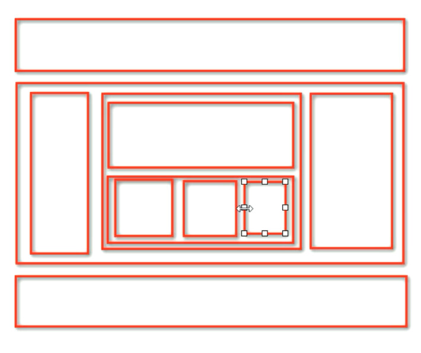

**目的**

1. 熟悉布局（块元素、浮动）

2. 公共css部分复用

3. 复习语义标签

#### ⭕**代码**

```html
<!-- 页眉 -->
<header></header>
<!-- 主体 -->
<main>
    <!-- 左边栏 -->
    <nav></nav>
    <!-- 中心 -->
    <article>
        <!-- 内容上 -->
        <div class="top"></div>
        <!-- 内容下 -->
        <div class="bottom">
            <!-- 内容左 -->
            <div class="left"></div>
            <!-- 内容中 -->
            <div class="middle"></div>
            <!-- 内容右 -->
            <div class="right"></div>
        </div>
    </article>
    <!-- 右边栏 -->
    <aside></aside>
</main>
<!-- 页脚 -->
<footer></footer>
```

**css代码**

```css
/* 公共部分 */
header,
main,
footer {
    width: 1000px;
    margin: 10px auto;
}

main nav,
main article,
main aside {
    float: left;
    /* 虽然设置浮动了，但整体大小是被内容撑开的，所以设置一个高度 */
    height: 100%;
}

.bottom .left,
.bottom .middle,
.bottom .right {
    float: left;
    width: 220px;
    height: 100%;
}

/* ==========整体布局-上========== */
header {
    height: 100px;
    background-color: silver;
}

/* ==========整体布局-中========== */
main {
    height: 400px;
    background-color: #bfa;
}


/* ------左边栏------ */
main nav {
    width: 150px;
    background-color: red;
}

/* ------中心------ */
main article {
    width: 680px;
    background-color: green;
    margin: 0 10px;
}

/* ---上--- */
article .top {
    height: 190px;
    background-color: yellow;
    margin-bottom: 10px;
}

/* ---下--- */
article .bottom {
    height: 200px;
    background-color: orange;
}


/* 左 */
.bottom .left {
    background-color: lightblue;
}

/* 中 */
.bottom .middle {
    background-color: gray;
    margin: 0 10px;
}

/* 右 */
.bottom .right {
    background-color: wheat;
}

/* ------右边栏------ */
main aside {
    width: 150px;
    background-color: blue;
}

/* ==========整体布局-下========== */
footer {
    height: 100px;
    background-color: tomato;
}
```

**效果**


# 10 【高度塌陷与BFC】

## ⭕1.高度塌陷

在浮动布局中，父元素的高度默认是被子元素撑开的

当子元素浮动后，其会完全脱离文档流，子元素从文档流中脱离将会无法撑起父元素的高度，导致父元素的高度丢失

父元素高度丢失以后，其下的元素会自动上移，导致页面的布局混乱


所以高度塌陷是浮动布局中比较常见的一个问题，这个问题我们必须要进行处理！

## ⭕2.BFC

BFC（Block Formatting Context）块级格式化环境

- BFC是一个CSS中的一个隐含的属性，可以为一个元素开启BFC

- 开启BFC该元素会变成一个独立的布局区域

元素开启BFC后的特点：

- 不会被浮动元素覆盖

- 父子元素外边距不会重叠

- 可以包含浮动的元素

可以通过一些特殊方式来开启元素的BFC：

-  设置为浮动（不推荐）：很明显下方元素被覆盖了，总不能让所有元素都浮动吧


-  设置为行内块元素（不推荐）：不再独占一行，宽度变了，同时与下方元素产生了一点空隙


- 设置`overflow`为非`visible`值：既没有覆盖元素，也保持了独占一方的特性（保持了宽度），与下方元素也保持了最初的间隙
  常用的方式为元素设置`overflow:hidden`（`overflow:auto`也是ok的） 开启其BFC， 以使其可以包含浮动元素
  `overflow:scroll` 会有滚动条，可能并不需要的，所以不太推荐


不过，这种方式也存在一定问题，如下，`overflow`并没有完全清除div2布局上受到的影响

**总结**

- 可以通过变成浮动元素，来防止自身被浮动元素覆盖（有点“以毒攻毒”那味了）

- 可以设置行内块，来防止自身及其他元素被浮动元素覆盖（如果说浮动是“独善其身”，那行内块就有点“兼济天下”的意思）

- 可以设置`overflow`属性，包含浮动元素（既“独善其身”，又“兼济天下”，但仍有缺陷）

## 3.为什么需要清除浮动？

**问题**

由于父级盒子很多情况下不方便给高度，但是子盒子浮动又不占有位置，最后父级盒子高度为 0 时，就会影响下面的标准流盒子。

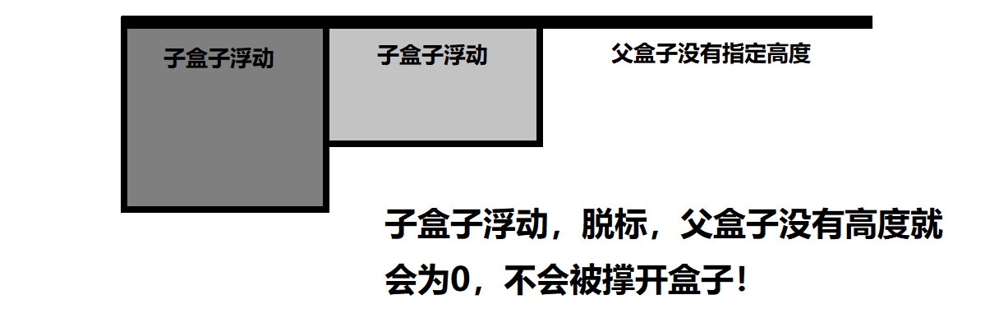

- 由于浮动元素不再占用原文档流的位置，所以它会对后面的元素排版产生影响

- 此时一但父盒子下面有其他盒子，那么布局就会发生严重混乱！

**实际开发**

我们前面浮动元素有一个标准流的父元素，他们有一个共同的特点，都是有高度的。

但是，所有的父盒子都必须有高度吗？

答案：不一定！比如，一个产品列表，随着时期的不同，产品数量也不同，所需的盒子大小也会随之改变，那么直接固定盒子高度的形式显然就是不行的。再比如，文章之类的盒子，不同的文章字数是不相同的，那么显然盒子也不能直接固定高度。

理想中的状态，让子盒子撑开父亲。有多少孩子，我父盒子就有多高。

但是不给父盒子高度会有问题吗？

答案：会！但有方法解决（清除浮动）。

## 4.清除浮动本质

- 清除浮动的本质是清除浮动元素造成的影响
- 如果父盒子本身有高度，则不需要清除浮动
- 清除浮动之后，父级就会根据浮动的子盒子自动检测高度。父级有了高度，就不会影响下面的标准流了

## ⭕5.clear

我们这里设计三个兄弟元素，对前两个元素进行`float`的浮动属性设置，看下效果


由于box1的浮动，导致box3位置上移也就是box3受到了box1浮动的影响，位置发生了改变（注意，这里文字并没有被覆盖，这个就是“文字环绕”的问题）

如果我们不希望某个元素因为其他元素浮动的影响而改变位置，可以通过`clear`属性来清除浮动元素对当前元素所产生的影响

`clear`作用：清除浮动元素对当前元素所产生的影响（本质是为元素添加一个`margin-top`属性，值由浏览器自动计算）

语法：

```css
选择器 { clear: 属性值; }
```

| 属性值 | 描述                                                         |
| ------ | ------------------------------------------------------------ |
| left   | 不允许左侧有浮动元素（清除左侧浮动元素对当前元素的影响）     |
| right  | 不允许右侧有浮动元素（清除右侧浮动元素对当前元素的影响）     |
| both   | 清除两侧中影响较大一侧元素的影响（注意，这里不是同时清除两侧的影响） |

**我们实际工作中，几乎只用 `clear: both;`**

清除浮动的策略是：闭合浮动。


## 6.清除浮动方法

1. 额外标签法也称为隔墙法，是 W3C 推荐的做法。(实际开发不推荐)
2. 父级添加 overflow 属性
3. 父级添加 after 伪元素
4. 父级添加 双伪元素

## ⭕7.清除浮动 —— 额外标签法

额外标签法也称为隔墙法，是 W3C 推荐的做法。

额外标签法会在浮动元素末尾添加一个空的标签。例如 `<div style="clear: both"></div>`，或者其他标签（如 `<br>` 等）。

- 优点： 通俗易懂，书写方便
- 缺点： 添加许多无意义的标签，结构化较差

注意： 要求这个新的空标签必须是**块级元素**。

总结：

- 清除浮动本质是？

清除浮动的本质是清除浮动元素脱离标准流造成的影响。

- 清除浮动策略是？

闭合浮动。只让浮动在父盒子内部影响，不影响父盒子外面的其他盒子。

- 额外标签法？

**隔墙法，就是在最后一个浮动的子元素后面添加一个额外空标签（块级标签），添加清除浮动样式。**

实际工作可能会遇到，但是不常用。


## 8.清除浮动 —— 父级添加 overflow

可以给父级添加 `overflow` 属性，将其属性值设置为 `hidden`、 `auto` 或 `scroll`。

子不教，父之过，注意是给父元素添加代码。

- 优点：代码简洁
- 缺点：无法显示溢出的部分


## 9.清除动 —— ::after 伪元素法

`::after` 方式是额外标签法的升级版，也是给父元素添加代码。

原理：自动在父盒子里的末尾添加一个 行内盒子，我们将它转换为 块级盒子，就间接实现了额外标签法。

```css
.clearfix::after {
	content: "";
	display: block;
	clear: both;
}
```

注意：类名不一定非要是 clearfix，但是还是推荐这么写以提高可读性。

- 优点：没有增加标签，结构更简单
- 缺点：需要单独照顾低版本浏览器
- 代表网站： 百度、淘宝网、网易等


**Q1：这里使用了一个伪元素选择器**`::after`**，那有人会问了，跟在box2下直接定义一个box3有什么区别呢？**

A：我们知道，网页的结构思想是：结构+表现+行为。在box2下直接定义一个box3，属于结构；而使用伪元素选择器，属于表现

而高度塌陷问题属于表现问题，所以在css中定义`::after`更符合网页的编程思想

**Q2：为什么需要使用**`display: block`**呢？**

A：因为默认情况下，`::after`伪元素是一个行内元素，如果不转为块元素，将仍然撑不起box1的高度

## 10.清除浮动 —— 双伪元素清除浮动

在前面说过垂直布局中边距重叠的问题：相邻的垂直方向外边距会发生重叠现象


如上图所示，子元素设置了一个`margin-top`之后，父元素跟随子元素一起进行了移动

即我们之前说的父子元素间相邻外边距，子元素会传递给父元素（上外边距）

可以用刚才说的伪元素选择器啊

好，我们先来看下效果


貌似是没有任何变化，到底是什么地方不对呢？

我们再来回顾下使用`after`伪元素的心路历程：

- 使用无内容的box3撑起box1 => 表现代替结构（`::after`代替box3）

- `clear`清除浮动对元素产生的影响（还记得`clear`的原理么？）

其实就是给元素设置了一个`margin-top`属性，不过这个在开发者工具中是看不到的

既然如此，就相当于在box2下面添加一个box3，然后给box3设置一个`margin-top`属性

到此为止，

∵  相邻的垂直方向外边距 这个条件仍然满足

∴  会发生重叠现象这个结论也依然成立

具体点就是，父子元素间相邻外边距，子元素会传递给父元素（上外边距），表现为box1和box2同步往下移动

那我们应该怎么做才能解决这个问题？

当然是让两个元素垂直外边距不相邻啊


我们用了`before`伪元素选择器，目的当然是让box1和box2的外边距不相邻，但是好像并没有效果

我们再换成`display: inline-block`属性看看


好像是解决了父元素布局的问题，但是子元素怎么还往下跑了一段距离？ 是谁给的勇气？

因为`inline-block`兼顾行内元素和块元素的特点，既可以设置宽高也不独占一行

在没有设置宽高时，会存在一个默认高度，所以`inline-block`仍然行不通

还有一个属性，`display: table`


**Q1：为什么没有使用clear属性？**

A：不是说了吗？`clear`是为了清除浮动对布局的影响，我们现在没有浮动的元素啊，我们要讨论的也不是浮动的问题

**Q2：display不是还有一个**`none`**属性么，为什么不用呢？**

A：`none`属性是不占据位置，但是也不能让元素相邻的外边距分离啊

**Q3：为什么**`table`值就可以呢？

A：这个也是开启BFC的方法，而且，应该牢记的是，元素开启BFC后的其中一个特点就是 父子元素外边距不会重叠。当然，这里也需要合理选择伪元素选择器，使其外边距不相邻才行

另外，总结一下：

- 高度塌陷问题，一般用`::after`

- 外边距重叠问题，一般用`::before`

`clearfix` 这个样式就可以同时解决高度塌陷和外边距重叠的问题

当你在遇到这些问题时，直接使用`clearfix`这个类即可，他就可以帮你轻松搞定css中的两大难题

额外标签法的升级版，也是给给父元素添加代码。

原理：自动在父盒子里的两端添加两个行内盒子，并把它们转换为 表格，间接实现了额外标签法。

```css
.clearfix::before,
.clearfix::after{
    content: '';
    display: table;
    clear: both;
}

```

其中`.clearfix::before`是为了解决外边距重叠问题

```css
.clearfix::before{
    content: '';
    display: table;
}
```

`.clearfix::after`是为了解决高度塌陷问题

````css
.clearfix::after{
    content: '';
    display: table;
    clear: both;
}
````

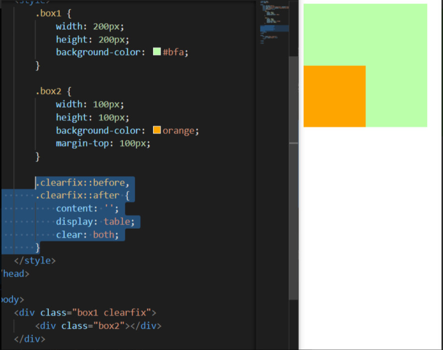

## ⭕11.清除浮动总结

为什么需要清除浮动？

- 父级没高度
- 子盒子浮动了
- 影响下面布局了，我们就应该清除浮动了

| 清除浮动的方式         | 优点               | 缺点                                 |
| ---------------------- | ------------------ | ------------------------------------ |
| 额外标签法（隔墙法）   | 通俗易懂，书写方便 | 添加许多无意义的标签，结构化较差     |
| 父级 overflow: hidden; | 书写简单           | 溢出隐藏                             |
| 父级 after 伪元素      | 结构语义化正确     | 由于 IE6~7 不支持 :after，兼容性问题 |
| 父级双伪元素           | 结构语义化正确     | 由于 IE6~7 不支持 :after，兼容性问题 |

# 11 【定位】

## 1.为什么需要定位？

提问： 以下情况使用标准流或者浮动能实现吗？

1. 某个元素可以**自由**的在一个盒子内移动位置，并且压住其他盒子。

2. 当我们滚动窗口的时候，盒子是**固定**屏幕某个位置的。

以上效果，标准流或浮动都无法快速实现，此时需要定位来实现。

所以：

1. 浮动可以让多个块级盒子一行没有缝隙排列显示， 经常用于横向排列盒子。
2. 定位则是可以让盒子自由的在某个盒子内移动位置或者固定屏幕中某个位置，并且可以压住其他盒子。

## ⭕2.定位组成

定位：将盒子定在某一个位置，所以定位也是在摆放盒子， 按照定位的方式移动盒子。

`定位 = 定位模式 + 边偏移`

- 定位模式用于指定一个元素在文档中的定位方式
- 边偏移则决定了该元素的最终位置

**（1）定位模式**

定位模式决定元素的定位方式，它通过 CSS 的 `position` 属性来设置，其值可以分为四个。

| 值         | 语义     |
| ---------- | -------- |
| `static`   | 静态定位 |
| `relative` | 相对定位 |
| `absolute` | 绝对定位 |
| `fixed`    | 固定定位 |
| `sticky`   | 粘滞定位 |

**（2）边偏移**

边偏移就是定位的盒子移动的最终位置。有 `top`、`bottom`、`left` 和 `right` 4 个属性。

注意：可以为负值。

| 边偏移属性 | 实例           | 描述                                           |
| ---------- | -------------- | ---------------------------------------------- |
| `top`      | `top: 80px`    | 顶端偏移量，定位元素相对于其父元素上边线的距离 |
| `bottom`   | `bottom: 80px` | 底部偏移量，定位元素相对于其父元素下边线的距离 |
| `left`     | `left: 80px`   | 左侧偏移量，定位元素相对于其父元素左边线的距离 |
| `rigth`    | `right: 80px`  | 右侧偏移量，定位元素相对于其父元素右边线的距离 |

## ⭕3.相对定位

### 3.1 基本使用

相对定位是元素在移动位置的时候**相对于它原来的位置**来说的定位。

语法：

```css
选择器 { position: relative; }
```

当元素开启相对定位以后，可以通过偏移量来设置元素的位置

| offset属性 | 含义                         |
| ---------- | ---------------------------- |
| `top`      | 定位元素和定位位置的上边距离 |
| `bottom`   | 定位元素和定位位置的下边距离 |
| `left`     | 定位元素和定位位置的左侧距离 |
| `right`    | 定位元素和定位位置的右侧距离 |

定位元素垂直方向的位置由`top`和`bottom`两个属性控制，通常情况下只会使用其中之一

- `top`值越大，定位元素越靠下

- `bottom`值越大，定位元素靠上

定位元素水平方向的位置由`left`和`right`两个属性控制，通常情况下只会使用其中之一

- `left`越大，定位元素越靠右

- `right`越大，定位元素越靠左

```html
<!doctype html>
<html lang="en">

<head>
    <meta charset="UTF-8">
    <meta name="viewport" content="width=device-width, initial-scale=1.0">
    <meta http-equiv="X-UA-Compatible" content="ie=edge">
    <title>相对定位</title>
    <style>
        .box1 {
            position: relative;
            top: 100px;
            left: 100px;
            width: 200px;
            height: 200px;
            background-color: pink;
        }

        .box2 {
            width: 200px;
            height: 200px;
            background-color: deeppink;
        }
    </style>
</head>

<body>
    <div class="box1">

    </div>
    <div class="box2">

    </div>

</body>

</html>
```


### 3.2 相对定位的特点

**相对定位的特点：（务必记住）**

1.  当元素开启相对定位以后，如果不设置偏移量元素，则元素不会发生任何变化（这里注意，不仅仅是位置） 

2.  相对定位是**参照于元素在文档流中的位置**进行定位的（可以理解为相对于自身原始位置） 

3.  相对定位会**提升元素的层级**（表现为可以覆盖其他元素） 

4.  相对定位**不会改变元素的性质**：块还是块，行内还是行内 


**Q1：如果给上述三个div都设置相对定位，那么它们的层级关系会是什么样的呢？或者说谁会被谁覆盖呢？**

A：我们直接进行测试验证


可以看到覆盖关系是：box3 >> box2 >> box1

可以大概猜测：**在页面文档流中，越靠下的元素开启相对定位后，其层级越高（没有设置层级或层级`z-index`设置相同值时，优先显示靠下的元素）**

**Q2：相对定位的第三个特点相对定位会提升元素的层级，是不是就类似于浮动一样脱离了文档流？**

A：我们可以对比下，浮动和相对定位的区别

- 参考系不同：浮动的参考系是其父元素；相对定位是相对于自身

- 可移动方向不同：浮动只能左右移动；相对定位是上下左右移动

- 影响不同：浮动会影响页面布局（包括下方元素位置影响和高度塌陷问题）；相对定位不对影响页面布局

- 性质不同：浮动会改变元素的性质（不再独占一行，其宽高都会被内容撑开）；相对定位不会改变元素的性质

- 文字环绕：浮动不会覆盖文字；相对定位可以覆盖文字（这个可以自行验证，不再赘述）

当然，浮动和相对定位也有其相似之处

- 浮动和相对定位都是移动位置

- 浮动和相对定位不会从父元素中移出

可以看出，浮动和相对定位的区别是更多的

最后回答一点：浮动脱离了文档流，不再占据页面位置；相对定位仍然占据页面位置

**Q3：相对定位的第四个特点相对定位不会改变元素的性质：块还是块，行内还是行内，但是上述例子中元素开启相对定位后好像就不再独占一行了，这个怎么理解？**

A：相比于浮动元素的特点，相对定位不会改变元素的性质其实是一个相对不容易理解的问题。其位置发生改变以后，布局并没有产生影响，因为它的结构仍然占据着原来的那个位置。只是其内容发生了移动。

**Q4：相对定位的第四个特点中块还是块，行内还是行内，意味着行内元素也可以使用相对定位是吗？**

A：是的

## ⭕4.绝对定位

绝对定位是元素在移动位置的时候**相对于它祖先元素**来说的定位（拼爹型）。

语法：

```css
选择器 { position: absolute; }
```

绝对定位的特点：（务必记住）

1. 开启绝对定位后，如果不设置偏移量，元素的位置不会发生变化

2. 绝对定位**不再占有原先的位置**（脱标），并且**脱标的程度大于浮动**（会压住浮动）

3. 绝对定位会**改变元素的性质**：行内变成块，块的宽高被内容撑开（与相对定位相反）

4. 绝对定位会**使元素提升一个层级**

5. 如果没有祖先元素或者祖先元素没有定位，则以浏览器为准定位（Document 文档）

6. 如果祖先元素有定位（相对、绝对、固定定位），则以**最近一级的有定位祖先元素为参考点**移动位置


## ⭕5.布局

### 5.1 水平方向的布局

我们之前说过，水平方向的布局等式：

```css
margin-left + border-left + padding-left + width + padding-right + border-right + margin-right = 其父元素的宽度
```

当使用绝对定位时，需要添加`left`和`right`两个值（此时规则和之前一样，只是多添加了两个值）

```css
left + margin-left + border-left + padding-left + width + padding-right + border-right + margin-right + right = 其父元素的宽度
```

当发生过度约束时

- 如果9个值中没有`auto`，则自动调整`right`值以使等式满足（之前7个值是`margin-right`）

- 如果9个值中有`auto`，则自动调整`auto`的值以使等式满足

可设置`auto`的值：`margin-left`/`margin-right` /`width`/`left`/`right`

**因为`left`和`right`的值默认是`auto`，所以如果没有设置`left`和`right`，当等式不满足时，则会自动调整这两个值**

### 5.2 水平居中

```html
<style>
    .box1 {
        width: 500px;
        height: 500px;
        background-color: #bfa;
        position: relative;
    }

    .box2 {
        width: 100px;
        height: 100px;
        background-color: orange;
        /* 左右外边距设置为auto */
        margin-left: auto;
        margin-right: auto;
        /* 绝对定位 */
        position: absolute;
        left: 0;
        right: 0;
    }
</style>

<div class="box1">
    <div class="box2"></div>
</div>
```

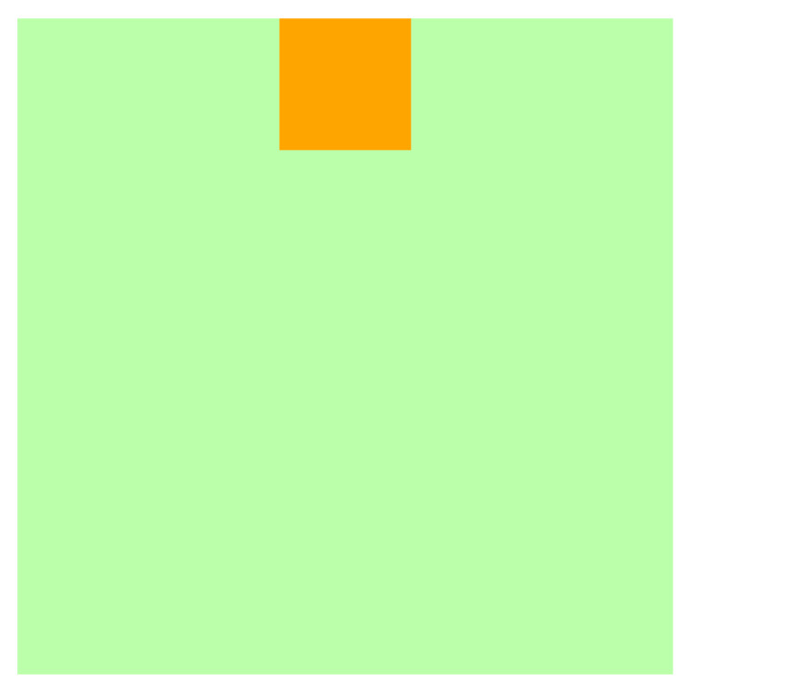

### 5.3 垂直方向的布局

垂直方向布局的等式的也必须要满足

```css
top + margin-top + border-top + padding-top + height + padding-bottom + border-bottom + margin-bottom + top = 其父元素的高度
```

### 5.4 垂直居中

```css
.box2 {
    width: 100px;
    height: 100px;
    background-color: orange;
    /* 左右外边距设置为auto */
    margin-top: auto;
    margin-bottom: auto;
    /* 绝对定位 */
    position: absolute;
    top: 0;
    bottom: 0;
}
```

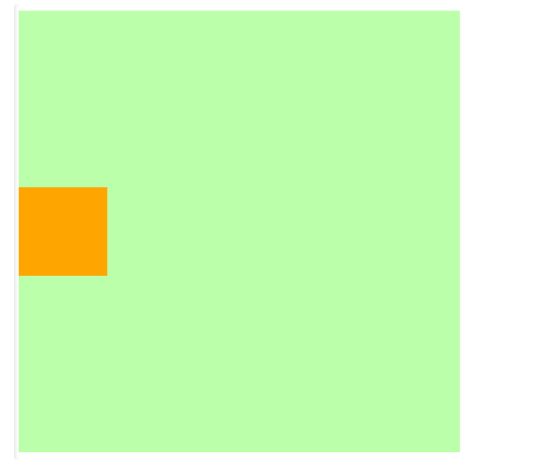

### 5.5 水平垂直居中

目前，我们可以根据绝对定位进行元素的水平垂直双方向居中，所以这个方法只是其中之一

```css
.box2 {
    width: 100px;
    height: 100px;
    background-color: orange;
    /* 左右外边距设置为auto */
    margin: auto;
    /* 绝对定位 */
    position: absolute;
    top: 0;
    bottom: 0;
    left: 0;
    right: 0;
}
```

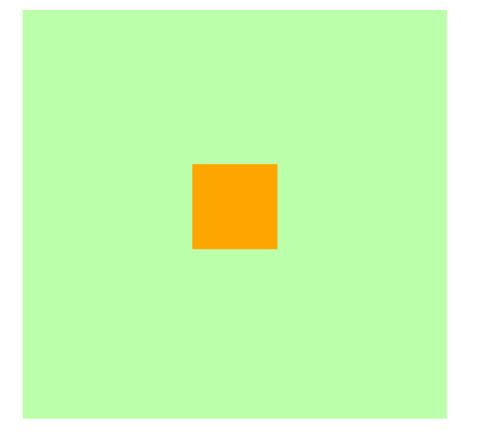

### ⭕5.6 小结

- 水平布局等式：`left + margin-left + border-left + padding-left + width + padding-right + border-right + margin-right + right = 其父元素的宽度`

- 垂直布局等式：`top + margin-top + border-top + padding-top + height + padding-bottom + border-bottom + margin-bottom + top = 其父元素的高度`

- 只是在没有`auto`时，会自动调整`top`/`bottom`/`left`/`right`

## ⭕6.子绝父相的由来

弄清楚这个口诀，就明白了绝对定位和相对定位的使用场景。

这个 “子绝父相” 太重要了，是我们学习定位的口诀，是定位中最常用的一种方式这句话的意思是：子级是绝对定位的话，父级要用相对定位。

1. **子级绝对定位，不会占有位置，可以放到父盒子里面的任何一个地方，不会影响其他的兄弟盒子**
2. **父盒子需要加定位限制子盒子在父盒子内显示**
3. **父盒子布局时，需要占有位置，因此父亲只能是相对定位**

这就是子绝父相的由来，所以相对定位经常用来作为绝对定位的父级。

总结： 因为父级需要占有位置，因此是相对定位， 子盒子不需要占有位置，则是绝对定位。

当然，子绝父相不是永远不变的，如果父元素不需要占有位置，“子绝父绝” 也会遇到。

**思考：为什么非要用定位？浮动不可以吗？**

答案：用浮动做某些布局远远没有定位简单和方便！例如，轮播图。


- 左右两边的图片切换按钮，利用浮动也可以做。但是，假如放置图片的盒子是在切换按钮之前添加的，那么根据浮动元素只能影响后面盒子的特性，切换按钮就只可能在图片底部之下，不可能浮于图片之上！
- 就算切换按钮用浮动实现了，但是左下角的轮播序号点图如果也用浮动实现，结果就是轮播序号点图会与切换按钮在一行并排浮动！

可见，浮动单纯用于左右排列盒子是非常适合的，但是用于空间层次上排列盒子就不适合了！应该用定位实现。

**重点：竖向上布局找标准流，横向上布局找浮动，空间上布局找定位！**

## ⭕7.固定定位

固定定位是元素固定于浏览器可视区的位置。

主要使用场景： 可以在浏览器页面滚动时元素的位置不会改变。

语法：

```css
选择器 { position: fixed; }
```

固定定位的特点（务必记住）：

1. 以**浏览器的可视窗口为参照点**移动元素
   - 跟父元素没有任何关系
   - 不随滚动条滚动
2. 固定定位不再占有原先的位置
   - 固定定位也是**脱标**的，其实固定定位也可以看做是一种**特殊的绝对定位**。


```html
<!doctype html>
<html lang="en">

<head>
    <meta charset="UTF-8">
    <meta name="viewport" content="width=device-width, initial-scale=1.0">
    <meta http-equiv="X-UA-Compatible" content="ie=edge">
    <title>固定定位</title>
    <style>
        .dj {
            position: fixed;
            top: 100px;
            left: 200px;
        }
    </style>
</head>

<body>
    <div class="dj">
        
    </div>
    <p>请尽情吩咐妲己，主人</p>
    <p>请尽情吩咐妲己，主人</p>
    <p>请尽情吩咐妲己，主人</p>
    <p>请尽情吩咐妲己，主人</p>
    <p>请尽情吩咐妲己，主人</p>
    <p>请尽情吩咐妲己，主人</p>
    <p>请尽情吩咐妲己，主人</p>
    <p>请尽情吩咐妲己，主人</p>
    <p>请尽情吩咐妲己，主人</p>
    <p>请尽情吩咐妲己，主人</p>
    <p>请尽情吩咐妲己，主人</p>
    <p>请尽情吩咐妲己，主人</p>
    <p>请尽情吩咐妲己，主人</p>
    <p>请尽情吩咐妲己，主人</p>
    <p>请尽情吩咐妲己，主人</p>
    <p>请尽情吩咐妲己，主人</p>
    <p>请尽情吩咐妲己，主人</p>
    <p>请尽情吩咐妲己，主人</p>
    <p>请尽情吩咐妲己，主人</p>
    <p>请尽情吩咐妲己，主人</p>
    <p>请尽情吩咐妲己，主人</p>
    <p>请尽情吩咐妲己，主人</p>
    <p>请尽情吩咐妲己，主人</p>
    <p>请尽情吩咐妲己，主人</p>
    <p>请尽情吩咐妲己，主人</p>
    <p>请尽情吩咐妲己，主人</p>
    <p>请尽情吩咐妲己，主人</p>
    <p>请尽情吩咐妲己，主人</p>
    <p>请尽情吩咐妲己，主人</p>
    <p>请尽情吩咐妲己，主人</p>
    <p>请尽情吩咐妲己，主人</p>
    <p>请尽情吩咐妲己，主人</p>
    <p>请尽情吩咐妲己，主人</p>
    <p>请尽情吩咐妲己，主人</p>
    <p>请尽情吩咐妲己，主人</p>
    <p>请尽情吩咐妲己，主人</p>
    <p>请尽情吩咐妲己，主人</p>
    <p>请尽情吩咐妲己，主人</p>
    <p>请尽情吩咐妲己，主人</p>
    <p>请尽情吩咐妲己，主人</p>
    <p>请尽情吩咐妲己，主人</p>
    <p>请尽情吩咐妲己，主人</p>
    <p>请尽情吩咐妲己，主人</p>
    <p>请尽情吩咐妲己，主人</p>
    <p>请尽情吩咐妲己，主人</p>
    <p>请尽情吩咐妲己，主人</p>
    <p>请尽情吩咐妲己，主人</p>
    <p>请尽情吩咐妲己，主人</p>
    <p>请尽情吩咐妲己，主人</p>
    <p>请尽情吩咐妲己，主人</p>
    <p>请尽情吩咐妲己，主人</p>
    <p>请尽情吩咐妲己，主人</p>

</body>

</html>
```


## 8.固定定位小技巧：固定在版心右侧位置

**小算法：**

1. 让固定定位的盒子 `left: 50%`，走到浏览器可视区（也可以看做版心） 一半的位置
2. 让固定定位的盒子 `margin-left: 版心宽度的一半距离`，多走版心宽度的一半位置

就可以让固定定位的盒子贴着版心右侧对齐了。

```html
<!doctype html>
<html lang="en">

<head>
    <meta charset="UTF-8">
    <meta name="viewport" content="width=device-width, initial-scale=1.0">
    <meta http-equiv="X-UA-Compatible" content="ie=edge">
    <title>固定定位小技巧-固定到版心右侧</title>
    <style>
        .w {
            width: 800px;
            height: 1400px;
            background-color: pink;
            margin: 0 auto;
        }

        .fixed {
            position: fixed;
            /* 1. 走浏览器宽度的一半 */
            left: 50%;
            /* 2. 利用 margin 走版心盒子宽度的一半距离（为了美观多加了 5px）*/
            margin-left: 405px;
            width: 50px;
            height: 150px;
            background-color: skyblue;
        }
    </style>
</head>

<body>
    <div class="fixed"></div>
    <div class="w">版心盒子 800像素</div>

</body>

</html>
```


## ⭕9.粘滞定位

粘性定位可以被认为是相对定位和固定定位的混合。

Sticky 粘性的。

语法：

```css
选择器 { position: sticky; top: 10px; }
```

粘性定位的特点：

1. 以浏览器的**可视窗口为参照点**移动元素（固定定位特点）
2. 粘性定位**占有原先的位置**（相对定位特点）
3. 必须添加 top 、left、right、bottom 其中一个才有效
4. **粘滞定位可以在元素到达某个位置时将其固定**

跟页面滚动搭配使用。 兼容性较差，IE 不支持。

未来开发的趋势，但目前并不常用（目前用 javascript 来实现粘性定位效果）。

应用举例：

我们拿之前的`w3cschool顶部导航栏`进行下魔改

```css
/* 设置一个高度 */
body {
    height: 3000px;
}

.menu {
    width: 1211px;
    height: 48px;
    background-color: #E8E7E3;
    margin: 100px auto;
    /* 开启粘滞定位 */
    position: sticky;
    top: 10px;
}
```


## ⭕10.定位的总结

我们通过上面的学习，知道`position`属性有五个可选值

但`static`是默认值，即不开启定位，所以我们只需要对比4种定位方式即可

| 定位方式             | 是否不设置偏移量，元素不会发生改变 | 是否脱离文档流 | 是否改变元素性质 | 是否提升元素层级 | 参考系                     |
| -------------------- | ---------------------------------- | -------------- | ---------------- | ---------------- | -------------------------- |
| relative（相对定位） | √                                  | ×              | ×                | √                | 参照于元素在文档流中的位置 |
| absolute（绝对定位） | ×                                  | √              | √                | √                | 参照于其包含块             |
| fixed（固定定位）    | ×                                  | √              | √                | √                | 参照于浏览器的视口         |
| sticky（粘滞定位）   | ×                                  | √              | √                | √                | 参照于浏览器的视口         |

1. 一定记住，相对定位、固定定位、绝对定位 两个大的特点： 1. 是否占有位置（脱标否） 2. 以谁为基准点移动位置。
2. 学习定位重点学会子绝父相。

## ⭕11.元素层级

对于开启了定位元素，可以通过`z-index`属性来指定元素的层级

- `z-index`需要一个整数作为参数，值越大元素的层级越高，元素的层级越高越优先显示

- 如果元素的层级一样，则优先显示靠下的元素

- 祖先的元素的层级再高，也不会盖住后代元素

语法：

```css
选择器 { z-index: 1; }
```

- 数值可以是正整数、负整数或 0，默认是 auto，数值越大，盒子越靠上
- 如果属性值相同，则按照书写顺序，后来居上
- 数字后面不能加单位
- 只有定位的盒子才有 z-index 属性

```html
<style>
    div {
        font-size: 40px;
    }

    .box1 {
        width: 200px;
        height: 200px;
        background-color: #bfa;
        position: absolute;
        top: 0;
        left: 0;
    }

    .box2 {
        width: 200px;
        height: 200px;
        background-color: orange;
        position: absolute;
        top: 50px;
        left: 50px;
    }

    .box3 {
        width: 200px;
        height: 200px;
        background-color: salmon;
        position: absolute;
        top: 100px;
        left: 100px;
    }

    .box4 {
        width: 100px;
        height: 100px;
        background-color: skyblue;
        position: absolute;
        bottom: 0;
        left: 0;
    }
</style>

<div class="box1">1</div>
<div class="box2">2</div>
<div class="box3">3
    <div class="box4">4</div>
</div>
```


## ⭕12.定位的拓展

**（1）绝对定位的盒子居中**

**加了绝对定位的盒子不能通过 `margin: 0 auto` 水平居中**，但是可以通过以下计算方法实现水平和垂直居中。

1. `left: 50%;`：让盒子的左侧移动到父级元素的水平中心位置。
2. `margin-left: -0.5widthpx;`：让盒子向左移动自身宽度的一半，垂直居中类似。

```html
<!doctype html>
<html lang="en">

<head>
    <meta charset="UTF-8">
    <meta name="viewport" content="width=device-width, initial-scale=1.0">
    <meta http-equiv="X-UA-Compatible" content="ie=edge">
    <title>绝对定位水平垂直居中</title>
    <style>
        .box {
            position: absolute;
            /* 1. left 走 50%  父容器宽度的一半 */
            left: 50%;
            /* 2. margin 负值 往左边走 自己盒子宽度的一半 */
            margin-left: -100px;
            /* 垂直居中同理 */
            top: 50%;
            margin-top: -100px;
            width: 200px;
            height: 200px;
            background-color: pink;
            /* margin: auto; */
        }
    </style>
</head>

<body>
    <div class="box"></div>
</body>

</html>
```


**（2）定位特殊特性**

**绝对定位和固定定位也和浮动类似。**

1. 行内元素添加绝对或者固定定位，可以直接设置高度和宽度。
2. 块级元素添加绝对或者固定定位，如果不给宽度或者高度，默认大小是内容的大小。

```html
<!doctype html>
<html lang="en">

<head>
    <meta charset="UTF-8">
    <meta name="viewport" content="width=device-width, initial-scale=1.0">
    <meta http-equiv="X-UA-Compatible" content="ie=edge">
    <title>定位的特殊特性</title>
    <style>
        span {
            position: absolute;
            top: 100px;
            width: 200px;
            height: 150px;
            background-color: pink;
        }

        div {
            position: absolute;
            background-color: skyblue;
        }
    </style>
</head>

<body>
    <span>123</span>

    <div>abcd</div>
</body>

</html>
```


**（3）脱标的盒子不会触发外边距塌陷**

浮动元素、绝对定位（固定定位）元素的都不会触发外边距合并的问题。

**（4）绝对定位（固定定位）会完全压住盒子**

浮动元素不同，只会压住它下面标准流的盒子，但是不会压住下面标准流盒子里面的文字（图片）。

但是绝对定位（固定定位） 会压住下面标准流所有的内容。

浮动之所以不会压住文字，因为浮动产生的目的最初是为了做文字环绕效果的。 文字会围绕浮动元素。

```html
<!doctype html>
<html lang="en">

<head>
    <meta charset="UTF-8">
    <meta name="viewport" content="width=device-width, initial-scale=1.0">
    <meta http-equiv="X-UA-Compatible" content="ie=edge">
    <title>浮动产生原来的目的是做文字环绕效果</title>
    <style>
        img {
            float: left;
        }
    </style>
</head>

<body>
    1993年，在古装片《战神传说》中扮演一个武功超群的渔民；同年，主演动作喜剧片《至尊三十六计之偷天换日》，在片中饰演赌术高明的千门高手钱文迪；此外，他还主演了爱情片《天长地久》，在片中塑造了一个风流不羁的江湖浪子形象。
    1994年，刘德华投资并主演了剧情片《天与地》，在片中饰演面对恶势力却毫不退缩的禁毒专员张一鹏。1995年，主演赛车励志片《烈火战车》，在片中饰演叛逆、倔强的阿祖，并凭借该片获得第15届香港电影金像奖最佳男主角提名；同年在动作片《大冒险家》中演绎了立仁从小时候父母双亡到长大后进入泰国空军的故事。
    1996年，主演黑帮题材的电影《新上海滩》，在片中饰演对冯程程痴情一片的丁力。1997年，担任剧情片《香港制造》的制作人；同年，主演爱情片《天若有情之烽火佳人》，在片中饰演家世显赫的空军少尉刘天伟；12月，与梁家辉联袂主演警匪动作片《黑金》，在片中饰演精明干练、嫉恶如仇的调查局机动组组长方国辉。1998年，主演动作片《龙在江湖》
    
    ，饰演重义气的黑帮成员韦吉祥；同年，出演喜剧片《赌侠1999》；此外，他还担任剧情片《去年烟花特别多》的制作人。
    1993年，在古装片《战神传说》中扮演一个武功超群的渔民；同年，主演动作喜剧片《至尊三十六计之偷天换日》，在片中饰演赌术高明的千门高手钱文迪；此外，他还主演了爱情片《天长地久》，在片中塑造了一个风流不羁的江湖浪子形象。
    1994年，刘德华投资并主演了剧情片《天与地》，在片中饰演面对恶势力却毫不退缩的禁毒专员张一鹏。1995年，主演赛车励志片《烈火战车》，在片中饰演叛逆、倔强的阿祖，并凭借该片获得第15届香港电影金像奖最佳男主角提名；同年在动作片《大冒险家》中演绎了立仁从小时候父母双亡到长大后进入泰国空军的故事。
    1996年，主演黑帮题材的电影《新上海滩》，在片中饰演对冯程程痴情一片的丁力。1997年，担任剧情片《香港制造》的制作人；同年，主演爱情片《天若有情之烽火佳人》，在片中饰演家世显赫的空军少尉刘天伟；12月，与梁家辉联袂主演警匪动作片《黑金》，在片中饰演精明干练、嫉恶如仇的调查局机动组组长方国辉。1998年，主演动作片《龙在江湖》，饰演重义气的黑帮成员韦吉祥；同年，出演喜剧片《赌侠1999》；此外，他还担任剧情片《去年烟花特别多》的制作人。
</body>

</html>
```


---

```html
<!doctype html>
<html lang="en">

<head>
    <meta charset="UTF-8">
    <meta name="viewport" content="width=device-width, initial-scale=1.0">
    <meta http-equiv="X-UA-Compatible" content="ie=edge">
    <title>定位会完全压住标准流盒子内容</title>
    <style>
        .box {
            /* 1.浮动的元素不会压住下面标准流的文字 */
            /* float: left; */
            /* 2. 绝对定位（固定定位） 会压住下面标准流所有的内容。 */
            position: absolute;
            width: 150px;
            height: 150px;
            background-color: pink;
        }
    </style>
</head>

<body>
    <div class="box"></div>
    <p>阁下何不同风起，扶摇直上九万里</p>
</body>

</html>
```


# 12 【网页布局总结 元素的显示与隐藏】

## 1.网页布局总结

通过盒子模型，清楚知道大部分 html 标签是一个盒子。

通过 CSS 浮动、定位可以让每个盒子排列成为网页。

一个完整的网页，是标准流、浮动、定位一起完成布局的，每个都有自己的专门用法。

1. 标准流

可以让盒子上下排列或者左右排列，垂直的块级盒子显示就用标准流布局。

2. 浮动

可以让多个块级元素一行显示或者左右对齐盒子，多个块级盒子水平显示就用浮动布局。

3. 定位

定位最大的特点是有层叠的概念，就是可以让多个盒子前后叠压来显示。如果元素自由在某个盒子内移动就用定位布局。

**重点：竖向上布局找标准流，横向上布局找浮动，空间上布局找定位！**

## 2.元素的显示与隐藏

类似网站广告，当我们点击关闭就不见了，但是我们重新刷新页面，会重新出现！

本质：让一个元素在页面中隐藏或者显示出来。

注意：是隐藏，不是删除！

1. display 显示隐藏（脱标）
2. visibility 显示隐藏（不脱标）
3. overflow 溢出显示隐藏

### ⭕2.1 display 属性

display 属性用于设置一个元素应如何显示。

- `display: none`：隐藏对象
- `display：block`：除了转换为块级元素之外，同时还有显示元素的意思

display 隐藏元素后，不再占有原来的位置（**脱标**）。

后面应用及其广泛，搭配 JS 可以做很多的网页特效。

```html
<!doctype html>
<html lang="en">

<head>
    <meta charset="UTF-8">
    <meta name="viewport" content="width=device-width, initial-scale=1.0">
    <meta http-equiv="X-UA-Compatible" content="ie=edge">
    <title>显示隐藏元素之display</title>
    <style>
        .peppa {
            display: none;
            /* display: block; */
            width: 200px;
            height: 200px;
            background-color: pink;

        }

        .george {
            width: 200px;
            height: 200px;
            background-color: skyblue;
        }
    </style>
</head>

<body>
    <div class="peppa">佩奇</div>		<!-- 佩奇被隐藏 -->
    <div class="george">乔治</div>
</body>

</html>
```


---

```html
<!doctype html>
<html lang="en">

<head>
    <meta charset="UTF-8">
    <meta name="viewport" content="width=device-width, initial-scale=1.0">
    <meta http-equiv="X-UA-Compatible" content="ie=edge">
    <title>显示隐藏元素之display</title>
    <style>
        .peppa {
            /* display: none; */
            display: block;
            width: 200px;
            height: 200px;
            background-color: pink;

        }

        .george {
            width: 200px;
            height: 200px;
            background-color: skyblue;
        }
    </style>
</head>

<body>
    <div class="peppa">佩奇</div>		<!-- 佩奇被显示 -->
    <div class="george">乔治</div>
</body>

</html>
```


### ⭕2.2 visibility 可见性

visibility 属性用于指定一个元素应可见还是隐藏。

- `visibility：visible`：元素可视
- `visibility：hidden`：元素隐藏

visibility **隐藏元素后，继续占有原来的位置**。

如果隐藏元素想要原来位置， 就用 visibility：hidden。

如果隐藏元素不想要原来位置， 就用 display：none（用处更多，重点）。

```html
<!doctype html>
<html lang="en">

<head>
    <meta charset="UTF-8">
    <meta name="viewport" content="width=device-width, initial-scale=1.0">
    <meta http-equiv="X-UA-Compatible" content="ie=edge">
    <title>显示隐藏元素之display</title>
    <style>
        .baba {
            visibility: hidden;
            width: 200px;
            height: 200px;
            background-color: pink;

        }

        .mama {
            width: 200px;
            height: 200px;
            background-color: skyblue;
        }
    </style>
</head>

<body>
    <div class="baba">猪爸爸</div>
    <div class="mama">猪妈妈</div>
</body>

</html>
```


### ⭕2.3 overflow 溢出

overflow 属性指定了如果内容溢出一个元素的框（**超过其指定高度及宽度**）时，会发生什么。

| 属性值    | 描述                                                   |
| --------- | ------------------------------------------------------ |
| `visible` | 不剪切内容也不添加滚动条（默认方式）                   |
| `hidden`  | 不显示超过对象尺寸的内容，超出的部分隐藏掉（并非删除） |
| `scroll`  | 不管超出的内容否，总是显示滚动条                       |
| `auto`    | 超出自动显示滚动条，不超出不显示滚动条                 |

一般情况下，我们都不想让溢出的内容显示出来，因为溢出的部分会影响布局。

但是如果有定位的盒子， 请慎用 overflow: hidden 因为它会隐藏多余的部分。

```html
<!doctype html>
<html lang="en">

<head>
    <meta charset="UTF-8">
    <meta name="viewport" content="width=device-width, initial-scale=1.0">
    <meta http-equiv="X-UA-Compatible" content="ie=edge">
    <title>显示隐藏元素之overflow</title>
    <style>
        .peppa {
            /* overflow: visible; */
            /* overflow: hidden; */
            /* scroll 溢出的部分显示滚动条  不溢出也显示滚动条 */
            /* overflow: scroll; */
            /* auto 溢出的时候才显示滚动条 不溢出不显示滚动条 */
            /* overflow: auto; */
            width: 200px;
            height: 200px;
            border: 3px solid pink;
            margin: 100px auto;
        }
    </style>
</head>

<body>
    <div class="peppa">
        小猪佩奇》，又译作《粉红猪小妹》（台湾译为粉红猪），原名为《Peppa
        Pig》，是由英国人阿斯特利（Astley）、贝克（Baker）、戴维斯（Davis）创作、
        导演和制作的一部英国学前电视动画片，也是历年来最具潜力的学前儿童品牌。
        故事围绕小猪佩奇与家人的愉快经历，幽默而有趣，
        藉此宣扬传统家庭观念与友情，鼓励小朋友们体验生活。
    </div>

</body>

</html>
```


---

```html
<!doctype html>
<html lang="en">

<head>
    <meta charset="UTF-8">
    <meta name="viewport" content="width=device-width, initial-scale=1.0">
    <meta http-equiv="X-UA-Compatible" content="ie=edge">
    <title>显示隐藏元素之overflow</title>
    <style>
        .peppa {
            overflow: visible;
            /* overflow: hidden; */
            /* scroll 溢出的部分显示滚动条  不溢出也显示滚动条 */
            /* overflow: scroll; */
            /* auto 溢出的时候才显示滚动条 不溢出不显示滚动条 */
            /* overflow: auto; */
            width: 200px;
            height: 200px;
            border: 3px solid pink;
            margin: 100px auto;
        }
    </style>
</head>

<body>
    <div class="peppa">
        小猪佩奇》，又译作《粉红猪小妹》（台湾译为粉红猪），原名为《Peppa
        Pig》，是由英国人阿斯特利（Astley）、贝克（Baker）、戴维斯（Davis）创作、
        导演和制作的一部英国学前电视动画片，也是历年来最具潜力的学前儿童品牌。
        故事围绕小猪佩奇与家人的愉快经历，幽默而有趣，
        藉此宣扬传统家庭观念与友情，鼓励小朋友们体验生活。
    </div>

</body>

</html>
```


---

```html
<!doctype html>
<html lang="en">

<head>
    <meta charset="UTF-8">
    <meta name="viewport" content="width=device-width, initial-scale=1.0">
    <meta http-equiv="X-UA-Compatible" content="ie=edge">
    <title>显示隐藏元素之overflow</title>
    <style>
        .peppa {
            /* overflow: visible; */
            overflow: hidden;
            /* scroll 溢出的部分显示滚动条  不溢出也显示滚动条 */
            /* overflow: scroll; */
            /* auto 溢出的时候才显示滚动条 不溢出不显示滚动条 */
            /* overflow: auto; */
            width: 200px;
            height: 200px;
            border: 3px solid pink;
            margin: 100px auto;
        }
    </style>
</head>

<body>
    <div class="peppa">
        小猪佩奇》，又译作《粉红猪小妹》（台湾译为粉红猪），原名为《Peppa
        Pig》，是由英国人阿斯特利（Astley）、贝克（Baker）、戴维斯（Davis）创作、
        导演和制作的一部英国学前电视动画片，也是历年来最具潜力的学前儿童品牌。
        故事围绕小猪佩奇与家人的愉快经历，幽默而有趣，
        藉此宣扬传统家庭观念与友情，鼓励小朋友们体验生活。
    </div>

</body>

</html>
```


---

```html
<!doctype html>
<html lang="en">

<head>
    <meta charset="UTF-8">
    <meta name="viewport" content="width=device-width, initial-scale=1.0">
    <meta http-equiv="X-UA-Compatible" content="ie=edge">
    <title>显示隐藏元素之overflow</title>
    <style>
        .peppa {
            /* overflow: visible; */
            /* overflow: hidden; */
            /* scroll 溢出的部分显示滚动条  不溢出也显示滚动条 */
            overflow: scroll;
            /* auto 溢出的时候才显示滚动条 不溢出不显示滚动条 */
            /* overflow: auto; */
            width: 200px;
            height: 200px;
            border: 3px solid pink;
            margin: 100px auto;
        }
    </style>
</head>

<body>
    <div class="peppa">
        小猪佩奇》，又译作《粉红猪小妹》（台湾译为粉红猪），原名为《Peppa
        Pig》
    </div>

</body>

</html>
```


---

```html
<!doctype html>
<html lang="en">

<head>
    <meta charset="UTF-8">
    <meta name="viewport" content="width=device-width, initial-scale=1.0">
    <meta http-equiv="X-UA-Compatible" content="ie=edge">
    <title>显示隐藏元素之overflow</title>
    <style>
        .peppa {
            /* overflow: visible; */
            /* overflow: hidden; */
            /* scroll 溢出的部分显示滚动条  不溢出也显示滚动条 */
            /* overflow: scroll; */
            /* auto 溢出的时候才显示滚动条 不溢出不显示滚动条 */
            overflow: auto;
            width: 200px;
            height: 200px;
            border: 3px solid pink;
            margin: 100px auto;
        }
    </style>
</head>

<body>
    <div class="peppa">
        小猪佩奇》，又译作《粉红猪小妹》（台湾译为粉红猪），原名为《Peppa
        Pig》，是由英国人阿斯特利（Astley）、贝克（Baker）、戴维斯（Davis）创作、
        导演和制作的一部英国学前电视动画片，也是历年来最具潜力的学前儿童品牌。
        故事围绕小猪佩奇与家人的愉快经历，幽默而有趣，
        藉此宣扬传统家庭观念与友情，鼓励小朋友们体验生活。
    </div>

</body>

</html>
```


---

```html
<!doctype html>
<html lang="en">

<head>
    <meta charset="UTF-8">
    <meta name="viewport" content="width=device-width, initial-scale=1.0">
    <meta http-equiv="X-UA-Compatible" content="ie=edge">
    <title>显示隐藏元素之overflow</title>
    <style>
        .peppa {
            /* overflow: visible; */
            /* overflow: hidden; */
            /* scroll 溢出的部分显示滚动条  不溢出也显示滚动条 */
            /* overflow: scroll; */
            /* auto 溢出的时候才显示滚动条 不溢出不显示滚动条 */
            overflow: auto;
            width: 200px;
            height: 200px;
            border: 3px solid pink;
            margin: 100px auto;
        }
    </style>
</head>

<body>
    <div class="peppa">
        小猪佩奇》，又译作《粉红猪小妹》（台湾译为粉红猪），原名为《Peppa
        Pig》
    </div>

</body>

</html>
```


### ⭕2.4 总结

1. display 显示隐藏元素 但是不保留位置
2. visibility 显示隐藏元素 但是保留原来的位置
3. overflow 溢出显示隐藏 但是只是对于溢出的部分处理

# 13 【精灵图 图标字体 CSS三角 鼠标样式 溢出省略号】

## 1.精灵图

### 1.1为什么需要精灵图？

一个网页中往往会应用很多小的背景图像作为修饰，当网页中的图像过多时，服务器就会频繁地接收和发送
请求图片，造成服务器请求压力过大，这将大大降低页面的加载速度。

因此，为了有效地减少服务器接收和发送请求的次数，提高页面的加载速度，出现了 CSS 精灵技术（也称 CSS Sprites、CSS 雪碧）。

核心原理：将网页中的一些小背景图像整合到一张大图中 ，这样服务器只需要一次请求就可以了。

精灵技术目的：为了有效地减少服务器接收和发送请求的次数，提高页面的加载速度。

### ⭕1.2精灵图（sprites）的使用

使用精灵图核心：

1. 精灵技术主要针对于背景图片使用。就是把多个小背景图片整合到一张大图片中
2. 这个大图片也称为 sprites 精灵图 或者 雪碧图
3. 移动背景图片位置以控制显示区域， 此时可以使用 `background-position`
4. 移动的距离就是这个目标图片的 `x` 和 `y` 坐标。注意网页中的坐标有所不同
5. 因为一般情况下都是将精灵图往上往左移动，所以两个坐标数值基本是负值
6. 使用精灵图的时候需要精确测量，每个小背景图片的大小和位置

雪碧图的使用步骤：

1. 先确定要使用的图标

2. 测量图标的大小

3. 根据测量结果创建一个元素

4. 将雪碧图设置为元素的背景图片

5. 设置一个偏移量以显示正确的图片

使用精灵图核心总结：

1. 精灵图主要针对于小的背景图片使用
2. 主要借助于背景位置来实现 `background-position`
3. 一般情况下精灵图都是负值（千万注意网页中的坐标： x轴右边走是正值，左边走是负值， y轴同理） 

**示例1**


```css
a:link {
    display: block;
    width: 93px;
    height: 29px;
    background: url("assets/背景/练习2-背景/btn.png");
    /* 默认值，可以不设置 */
    background-position: 0 0;
}

a:hover {
    /* 设置水平方向的一个偏移量；注意是向左移动，所以是负值 */
    background-position: -93px 0;
}

a:active {
    /* 设置水平方向的一个偏移量；注意是向左移动，所以是负值 */
    background-position: calc(-93px*2) 0;
}
```

> 如果不使用雪碧图会因为图片需要临时去发请求加载，会闪一下才出现图片

**示例2**

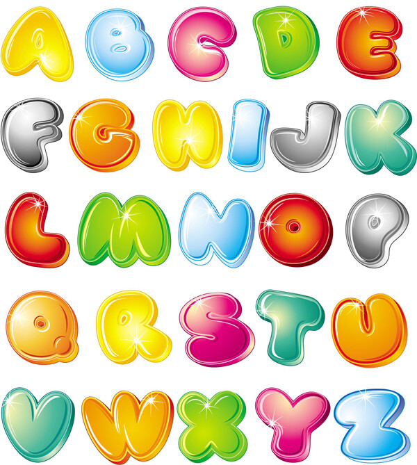

```html
<!doctype html>
<html lang="en">

<head>
    <meta charset="UTF-8">
    <meta name="viewport" content="width=device-width, initial-scale=1.0">
    <meta http-equiv="X-UA-Compatible" content="ie=edge">
    <title>利用精灵图拼出自己名字</title>
    <style>
        span {
            display: inline-block;
            background: url(images/abcd.jpg) no-repeat;
        }

        .p {
            width: 100px;
            height: 112px;
            /* background-color: pink; */
            background-position: -493px -276px;
        }

        .i {
            width: 60px;
            height: 108px;
            /* background-color: pink; */
            background-position: -327px -142px;
        }

        .n {
            width: 115px;
            height: 112px;
            /* background-color: pink; */
            background-position: -255px -275px;
        }

        .k {
            width: 105px;
            height: 114px;
            /* background-color: pink; */
            background-position: -495px -142px;
        }
    </style>
</head>

<body>
    <span class="p">p</span>
    <span class="i">i</span>
    <span class="n">n</span>
    <span class="k">k</span>
</body>

</html>
```

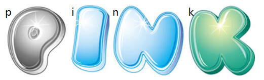

## ⭕2.图标字体

### 2.1字体图标的产生

字体图标使用场景：主要用于显示网页中通用、常用的一些小图标。

精灵图是有诸多优点的，但是缺点很明显。

1. 图片文件还是比较大的
2. 图片本身放大和缩小会失真
3. 一旦图片制作完毕想要更换非常复杂

此时，有一种技术的出现很好的解决了以上问题，就是字体图标 iconfont。

字体图标可以为前端工程师提供一种方便高效的图标使用方式，展示的是图标，但本质却属于字体。

### 2.2字体图标的优点

- 轻量级：一个图标字体要比一系列的图像要小。一旦字体加载了，图标就会马上渲染出来，减少了服务器请求
- 灵活性：本质其实是文字，可以很随意的改变颜色、产生阴影、透明效果、旋转等
- 兼容性：几乎支持所有的浏览器，请放心使用

注意： 字体图标不能替代精灵技术，只是对工作中图标部分技术的提升和优化。

总结：

1. 如果遇到一些结构和样式比较简单的小图标，就用字体图标
2. 如果遇到一些结构和样式复杂一点的小图片，就用精灵图

字体图标是一些网页常见的小图标，我们直接网上下载即可。 因此使用可以分为：

1. 字体图标的下载
2. 字体图标的引入（引入到我们 html 页面中）
3. 字体图标的追加（在原有的基础上添加新的小图标）

### 2.3字体图标的下载

推荐下载网站：

- icomoon 字库 [https://icomoon.io/](https://icomoon.io/)

IcoMoon 成立于 2011 年，推出了第一个自定义图标字体生成器，它允许用户选择所需要的图标，使它们成一字型。该字库内容种类繁多，非常全面，唯一的遗憾是国外服务器，打开网速较慢。

- 阿里 iconfont 字库 [https://www.iconfont.cn/](https://www.iconfont.cn/)

这个是阿里妈妈 M2UX 的一个 iconfont 字体图标字库，包含了淘宝图标库和阿里妈妈图标库。可以使用 AI 制作图标上传生成。 重点是，免费！

> 以下内容以 icomoon 字库 为例。

### 2.4字体图标的引入

下载完毕之后，注意原先的文件不要删，后面会用！

1. **把下载包里面的 fonts 文件夹放入页面根目录下**

不同浏览器所支持的字体格式是不一样的，字体图标之所以兼容，就是因为包含了主流浏览器支持的字体文件。

- TureType (.ttf) 格式 .ttf 字体是 Windows 和 Mac 的最常见的字体，支持这种字体的浏览器有 IE9+、Firefox3.5+、Chrome4+、Safari3+、Opera10+、iOS Mobile、Safari4.2+；
- Web Open Font Format (.woff) 格式 woff 字体，支持这种字体的浏览器有 IE9+、Firefox3.5+、Chrome6+、Safari3.6+、Opera11.1+；
- Embedded Open Type (.eot) 格式 .eot 字体是 IE 专用字体，支持这种字体的浏览器有 IE4+；
- SVG (.svg) 格式 .svg 字体是基于 SVG 字体渲染的一种格式，支持这种字体的浏览器有 Chrome4+、Safari3.1+、Opera10.0+、iOS Mobile Safari3.2+；

2. **在 CSS 样式中全局声明字体：简单理解把这些字体文件通过 css 引入到我们页面中**

一定注意字体文件路径的问题。

```css
@font-face {
	font-family: 'icomoon';
	src: url('fonts/icomoon.eot?7kkyc2');
	src: url('fonts/icomoon.eot?7kkyc2#iefix') format('embedded-opentype'),
	url('fonts/icomoon.ttf?7kkyc2') format('truetype'),
	url('fonts/icomoon.woff?7kkyc2') format('woff'),
	url('fonts/icomoon.svg?7kkyc2#icomoon') format('svg');
	font-weight: normal;
	font-style: normal;
}
```

3. **html 标签内添加小图标**

复制小图标对应的字符（一个小方框）到 html 中，一般建议放在 `<i></i>` 标签里。 

4. **给标签定义字体**

```css
span {
	font-family: "icomoon";
}
```

注意：务必保证这个字体和上面 @font-face 里面的字体保持一致（默认为：icomoon）。

### 2.5字体图标的追加

如果工作中，原来的字体图标不够用了，我们便需要添加新的字体图标到原来的字体文件中。

选择 Import Icons 按钮，把原压缩包里面的 selection.json 重新上传，然后选中自己想要新的图标，从新下载压缩包，并替换原来的文件即可。

### 2.6字体图标加载的原理

服务器只需接受一次浏览器请求便可以将 fonts 文件一次性返回，如此而来网页中所有用到 fonts 字体图标的部分便一次性加载好了，大大减轻了服务器压力。

```html
<!doctype html>
<html lang="en">

<head>
  <meta charset="UTF-8">
  <meta name="viewport" content="width=device-width, initial-scale=1.0">
  <meta http-equiv="X-UA-Compatible" content="ie=edge">
  <title>字体图标的使用</title>
  <style>
    /* 字体声明 */
    @font-face {
    	font-family: 'icomoon';
      	src: url('fonts/icomoon.eot?p4ssmb');
      	src: url('fonts/icomoon.eot?p4ssmb#iefix') format('embedded-opentype'),
        url('fonts/icomoon.ttf?p4ssmb') format('truetype'),
        url('fonts/icomoon.woff?p4ssmb') format('woff'),
        url('fonts/icomoon.svg?p4ssmb#icomoon') format('svg');
      	font-weight: normal;
      	font-style: normal;
      	font-display: block;
    }

    span {
      font-family: 'icomoon';
      font-size: 100px;
      color: salmon;
    }
  </style>
</head>

<body>
  <span class="icon-location"></span>
  <span class="icon-home"></span>
</body>

</html>
```

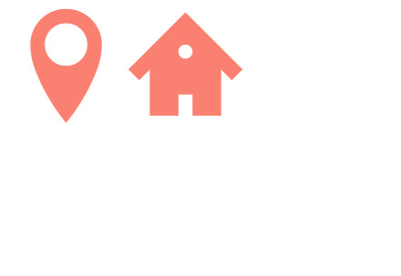

### 2.7fontawesome

官方网站：https://fontawesome.com/

下载解压完毕之后，直接将css和webfonts移动到项目中即可使用

**示例**

```html
<link rel="stylesheet" href="/font/fontawesome/css/all.css">
<style>
    i {
        color: green;
    }

    .fa-venus-mars,
    .fa-mars-double {
        color: red;
    }

    .fa-html5 {
        color: #E34D22;
    }

    .fa-css3 {
        color: blue;
    }

    .fa-js {
        color: #D1B514;
    }
</style>

<!-- 大小 -->
<i class="fab fa-weixin fa-lg"></i>
<i class="fab fa-weixin fa-2x"></i>
<i class="fab fa-weixin fa-3x"></i>
<br>

<!-- 边框 -->
<i class="fab fa-weixin fa-2x fa-border"></i>
<br>

<!-- 旋转 -->
<i class="fab fa-weixin fa-2x  fa-rotate-90 "></i>
<!-- 水平对称 -->
<i class="fab fa-weixin fa-2x fa-flip-horizontal "></i>
<!-- 垂直对称 -->
<i class="fab fa-weixin fa-2x fa-flip-vertical "></i>
<br>

<!-- 动画 -->
<i class="fa fa-venus-mars fa-3x fa-spin"></i>
<i class="fa fa-mars-double  fa-3x fa-pulse"></i>
<br>

<!-- 列表 -->
<ul class="fa-ul">
    <li><i class="fa-li fa fa-check-square"></i>can be used</li>
    <li><i class="fa-li fa fa-spinner fa-spin"></i>as bullets</li>
    <li><i class="fa-li fa fa-square"></i>in lists</li>
</ul>
<br><br><br>

<!-- 组合 -->
<span class="fa-stack fa-lg">
    <i class="fab fa-html5 fa-stack-1x fa-10x"></i>
    <i class="fab fa-css3 fa-stack-1x fa-4x"></i>
    <i class="fab fa-js fa-stack-1x fa-2x"></i>
</span>
```


其中`fas`/`fab`是免费的，其他是收费的

### 2.8图标字体其他使用方式

#### 2.8.1通过伪元素设置

1. 找到要设置图标的元素通过`::before`或`::after`选中

2. 在`content`中设置字体的编码

3. 设置字体的样式 

- - `fab`：`font-family: 'Font Awesome 5 Brands';`

- - `fas`：`font-family: 'Font Awesome 5 Free'; font-weight：900;`

```html
<style>
    .poem {
        width: 200px;
        height: 300px;
        margin: auto;
    }

    li {
        list-style: none;
        margin-left: -40px;
    }

    li::before {
        content: '\f130';
        /* font-family: 'Font Awesome 5 Brands'; */
        font-family: 'Font Awesome 5 Free';
        font-weight: 900;
        margin-right: 10px;
        color: gray;
    }
</style>

<div class="poem">
    <h1>武陵春·春晚</h1>
    <p> [宋] 李清照</p>
    <ul>
        <li>风住尘香花已尽，</li>
        <li>日晚倦梳头。</li>
        <li>物是人非事事休，</li>
        <li>欲语泪先流。</li>
        <li>闻说双溪春尚好，</li>
        <li>也拟泛轻舟。</li>
        <li>只恐双溪舴艋舟，</li>
        <li>载不动、许多愁。</li>
    </ul>
</div>
```

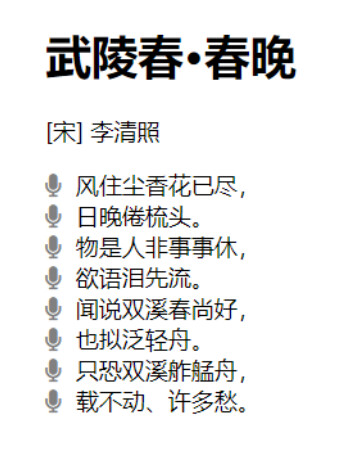

#### 2.8.2通过实体设置

通过实体来使用图标字体：`&#x图标编码;`

**示例**

```html
<i class="fas">&#xf025;</i>
```

**效果**

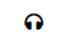

### 2.9iconfont

官方网站：https://www.iconfont.cn/

iconfont是阿里的一个图标字体库，海量图标库，图标字体非常丰富

但是版权有点模横两可，如果需要商用，最好联系作者

不过一般情况下，公司企业都会有自己的UI设计团队，会自己去进行设计

这里使用方式大同小异，不过

- iconfont需要添加购物车后再添加至项目然后下载，下载包中有demo.html，详细介绍了使用方式

- iconfont也提供了一种在线方式，直接在`我的项目`中选择`在线链接`可以复制出一份`@font-face`的css代码

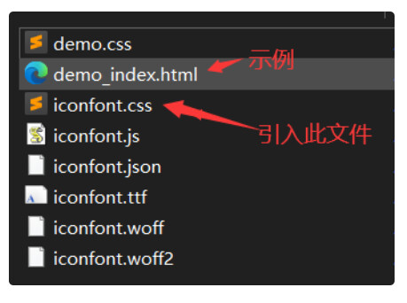

**示例**

```html
<!-- <link rel="stylesheet" href="/font/iconfont/iconfont.css"> -->
<style>
    i.iconfont {
        font-size: 100px;
    }

    p::before {
        content: '\e811';
        font-family: 'iconfont';
        font-size: 50px;
    }
    
    /* 3、通过在线连接：这里link和@font-face择其一即可  */
    @font-face {
        font-family: 'iconfont';
        /* Project id 2580407 */
        src: url('//at.alicdn.com/t/font_2580407_c0kpuhebb7r.woff2?t=1622373966454') format('woff2'),
            url('//at.alicdn.com/t/font_2580407_c0kpuhebb7r.woff?t=1622373966454') format('woff'),
            url('//at.alicdn.com/t/font_2580407_c0kpuhebb7r.ttf?t=1622373966454') format('truetype');
    }
</style>

<!-- 1、通过字符实体设置 -->
<i class="iconfont">&#xe810;</i>
<i class="iconfont">&#xe811;</i>
<i class="iconfont">&#xe812;</i>
<i class="iconfont">&#xe813;</i>

<!-- 2、通过伪元素设置 -->
<p>Lorem ipsum, dolor sit amet consectetur adipisicing elit. Totam deserunt tempore fugit quos eaque, ipsa rerum
    suscipit iure cumque aspernatur esse cupiditate nihil quas nulla odit? Sequi accusantium labore maiores.</p>

<!-- 通过class类名是最常用的方式 -->
<i class="iconfont icon-home"></i>
```

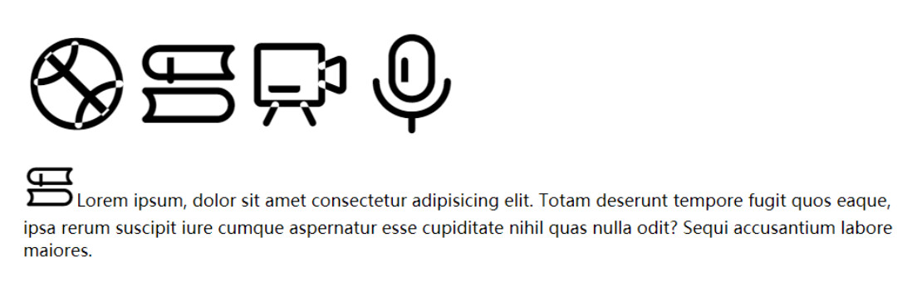

## ⭕3.CSS三角

网页中常见一些三角形，使用 CSS 直接画出来就可以，不必做成图片或者字体图标。

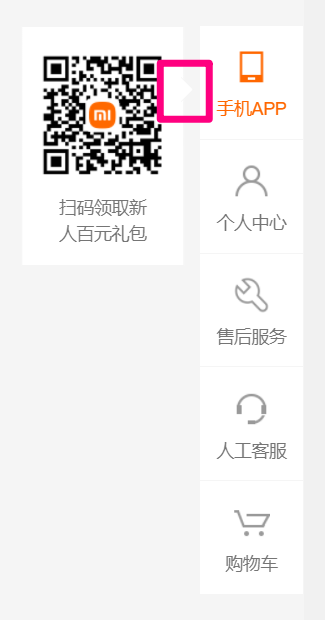

CSS 三角是怎么来的？原理如下：

对一个没有大小的盒子设置边框，那么只要边框足够粗，就可以呈现三角效果。

如果只需要一个三角，那么对其他三个边框设置透明色即可。

通常 CSS 三角要配合定位来布局。

```html
<!doctype html>
<html lang="en">

<head>
    <meta charset="UTF-8">
    <meta name="viewport" content="width=device-width, initial-scale=1.0">
    <meta http-equiv="X-UA-Compatible" content="ie=edge">
    <title>CSS 三角制作</title>
    <style>
        .box1 {
            width: 0;
            height: 0;
            /* border: 10px solid pink; */
            border-top: 30px solid hotpink;
            border-right: 30px solid black;
            border-bottom: 30px solid skyblue;
            border-left: 30px solid gray;
        }

        .box2 {
            width: 0;
            height: 0;
            border: 50px solid transparent;
            border-left-color: black;
            margin: 50px;
        }

        .jd {
            /* 子绝父相 */
            position: relative;
            width: 120px;
            height: 249px;
            background-color: black;
        }

        .jd span {
            /* 子绝父相 */
            position: absolute;
            right: 15px;
            top: -20px;
            width: 0;
            height: 0;
            /* 下面两行为了照顾兼容性 */
            line-height: 0;
            font-size: 0;
            border: 10px solid transparent;
            border-bottom-color: black;
        }
    </style>
</head>

<body>
    <div class="box1"></div>
    <div class="box2"></div>
    <div class="jd">
        <span></span>
    </div>
</body>

</html>
```

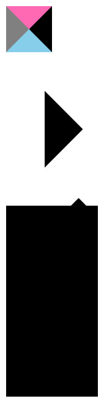

## 4.CSS用户界面样式

### 4.1什么是界面样式

所谓的界面样式，就是更改一些用户操作样式，以提高更好的用户体验。

- 更改用户的鼠标样式
- 表单轮廓
- 防止表单域拖拽

### ⭕4.2鼠标样式 cursor

```css
li { cursor: pointer; }
```

设置或检索在对象上移动的鼠标指针采用何种系统预定义的光标形状。

| 属性值        | 描述     |
| ------------- | -------- |
| `default`     | 默认箭头 |
| `pointer`     | 小手     |
| `move`        | 十字移动 |
| `text`        | 文本竖杠 |
| `not-allowed` | 禁止     |

注意：除了以上类型，还有其他很多类型。

```html
<!doctype html>
<html lang="en">

<head>
    <meta charset="UTF-8">
    <meta name="viewport" content="width=device-width, initial-scale=1.0">
    <meta http-equiv="X-UA-Compatible" content="ie=edge">
    <title>用户界面样式-鼠标样式</title>
</head>

<body>
    <ul>
        <li style="cursor: default;">我是默认的小白鼠标样式</li>
        <li style="cursor: pointer;">我是鼠标小手样式</li>
        <li style="cursor: move;">我是鼠标移动样式</li>
        <li style="cursor: text;">我是鼠标文本样式</li>
        <li style="cursor: not-allowed;">我是鼠标禁止样式</li>
    </ul>
</body>

</html>
```


### 4.3轮廓线 outline

给表单添加 `outline: 0;` 或者 `outline: none;` 样式之后，就可以去掉默认的边框。

```css
input { outline: none; }
```

默认样式：


修改后样式：

```html
<!doctype html>
<html lang="en">

<head>
    <meta charset="UTF-8">
    <meta http-equiv="X-UA-Compatible" content="IE=edge">
    <meta name="viewport" content="width=device-width, initial-scale=1.0">
    <title>轮廓线 outline</title>
    <style>
        input {
            /* 取消表单轮廓 */
            outline: none;
        }
    </style>
</head>

<body>
    <!-- 取消表单轮廓 -->
    <input type="text">
</body>

</html>
```


### ⭕4.4防止拖拽文本域 resize

实际开发中，我们文本域右下角是不允许拖拽的。（会破坏布局！）

```css
textarea { resize: none; }
```

默认样式：


修改后样式：

```html
<!doctype html>
<html lang="en">

<head>
    <meta charset="UTF-8">
    <meta http-equiv="X-UA-Compatible" content="IE=edge">
    <meta name="viewport" content="width=device-width, initial-scale=1.0">
    <title>防止拖拽文本域 resize</title>
    <style>
        textarea {
            /* 取消表单轮廓 */
            outline: none;
            /* 防止拖拽文本域 */
            resize: none;
        }
    </style>
</head>

<body>
    <!-- 防止拖拽文本域 -->
    <!-- <textarea></textarea>起始标签建议放在一行，因为这样不会导致文本域里文字前有空白，
    后期可以专门通过 padding 来设置文本周围的留白 -->
    <textarea name="" id="" cols="30" rows="10"></textarea>
</body>

</html>
```


## 5.溢出的文字省略号显示

### ⭕5.1单行文本溢出省略号显示

三个必要条件：

```css
/* 1. 先强制一行内显示文本 */ 
white-space: nowrap; 	/*（ 默认 normal 自动换行）*/ 
/* 2. 超出的部分隐藏 */ 
overflow: hidden; 
/* 3. 文字用省略号替代超出的部分 */ 
text-overflow: ellipsis;
```

案例：

```html
<!doctype html>
<html lang="en">

<head>
    <meta charset="UTF-8">
    <meta name="viewport" content="width=device-width, initial-scale=1.0">
    <meta http-equiv="X-UA-Compatible" content="ie=edge">
    <title>单行文本溢出显示省略号</title>
    <style>
        div {
            width: 150px;
            height: 80px;
            background-color: pink;
            margin: 100px auto;
            /* 这个单词的意思是如果文字显示不开自动换行 */
            /* white-space: normal; */
            /* 1.这个单词的意思是如果文字显示不开也必须强制一行内显示 */
            white-space: nowrap;
            /* 2.溢出的部分隐藏起来 */
            overflow: hidden;
            /* 3.文字溢出的时候用省略号来显示 */
            text-overflow: ellipsis;
        }
    </style>
</head>

<body>
    <div>
        啥也不说，此处省略一万字
    </div>
</body>

</html>
```

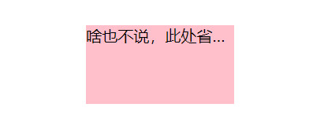

### ⭕5.2多行文本溢出省略号显示

多行文本溢出显示省略号，有较大兼容性问题， 适合于 webkit 浏览器或移动端（移动端大部分是 webkit 内核）。

```css
overflow: hidden;
text-overflow: ellipsis;
/* 弹性伸缩盒子模型显示 */
display: -webkit-box;
/* 限制在一个块元素显示的文本的行数 */
-webkit-line-clamp: 2;
/* 设置或检索伸缩盒对象的子元素的排列方式 */
-webkit-box-orient: vertical;
```

更推荐让后台人员来做这个效果，因为后台人员可以设置显示多少个字，操作更简单。

案例：

```html
<!doctype html>
<html lang="en">

<head>
    <meta charset="UTF-8">
    <meta name="viewport" content="width=device-width, initial-scale=1.0">
    <meta http-equiv="X-UA-Compatible" content="ie=edge">
    <title>单行文本溢出显示省略号</title>
    <style>
        div {
            width: 150px;
            height: 65px;
            background-color: pink;
            margin: 100px auto;
            overflow: hidden;
            text-overflow: ellipsis;
            /* 弹性伸缩盒子模型显示 */
            display: -webkit-box;
            /* 限制在一个块元素显示的文本的行数 */
            -webkit-line-clamp: 3;
            /* 设置或检索伸缩盒对象的子元素的排列方式 */
            -webkit-box-orient: vertical;
        }
    </style>
</head>

<body>
    <div>
        啥也不说，此处省略一万字,啥也不说，此处省略一万字此处省略一万字
    </div>
</body>

</html>
```

Chrome 浏览器效果：

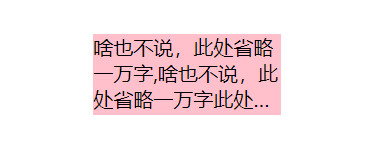

# ⭕14 【布局技巧】

## 1.margin负值的运用

如何实现以下效果呢？

多个盒子紧挨在一起，当鼠标放在其中一个盒子上时该盒子的边框自动变色。

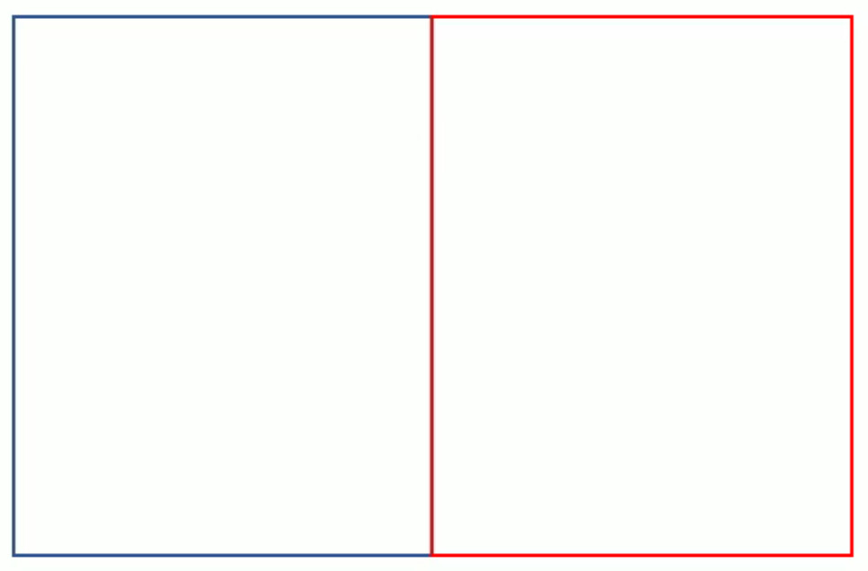

1. 让每个盒子 margin 往左侧移动 -1px 正好压住相邻盒子边框（否则边框会发生叠加 * 2）
2. 鼠标经过某个盒子的时候，提高当前盒子的层级即可（如果周围盒子没有定位，则对当前盒子加相对定位（保留位置并显示在其他盒子之上）；如果周围有定位，则提高当前盒子的 z-index）

```html
<!doctype html>
<html lang="en">

<head>
    <meta charset="UTF-8">
    <meta name="viewport" content="width=device-width, initial-scale=1.0">
    <meta http-equiv="X-UA-Compatible" content="ie=edge">
    <title>margin负值的巧妙运用</title>
    <style>
        ul li {
            position: relative;
            float: left;
            list-style: none;
            width: 150px;
            height: 200px;
            border: 1px solid red;
            margin-left: -1px;
        }

        /* ul li:hover {
           1. 如果盒子没有定位，则鼠标经过添加相对定位即可
        position: relative;
        border: 1px solid blue;

       } */
        ul li:hover {
            /* 2.如果li都有定位，则利用 z-index提高层级 */
            z-index: 1;
            border: 1px solid blue;
        }
    </style>
</head>

<body>
<ul>
    <li>1</li>
    <li>2</li>
    <li>3</li>
    <li>4</li>
    <li>5</li>
</ul>
</body>

</html>
```


## 2.文字围绕浮动元素

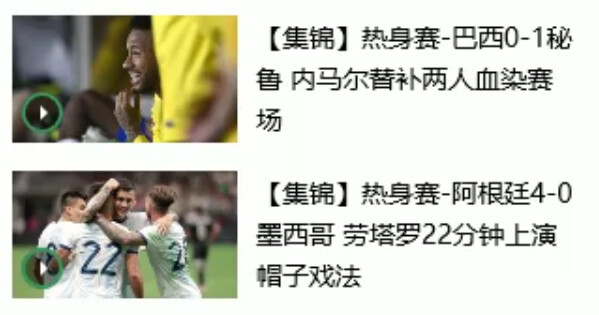在制作文字位于图片周围的效果时，可以巧妙运用浮动元素不会压住文字的特性。

```html
<!doctype html>
<html lang="en">
<head>
    <meta charset="UTF-8">
    <meta name="viewport" content="width=device-width, initial-scale=1.0">
    <meta http-equiv="X-UA-Compatible" content="ie=edge">
    <title>文字围绕浮动元素的妙用</title>
    <style>
        * {
            margin: 0;
            padding: 0;
        }

        .box {
            width: 300px;
            height: 70px;
            background-color: #d4d4d4;
            margin: 0 auto;
            padding: 5px;
        }

        .pic {
            float: left;
            width: 120px;
            height: 60px;
            margin-right: 5px;
        }

        .pic img {
            width: 100%;
        }
    </style>
</head>
<body>
<div class="box">
    <div class="pic">
        
    </div>
    <p>【集锦】热身赛-巴西0-1秘鲁 内马尔替补两人血染赛场</p>
</div>
</body>
</html>
```


## 3.行内块的巧妙运用

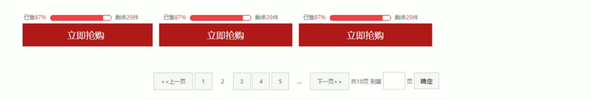

页码在页面中间显示：

1. 把这些链接盒子转换为行内块， 之后给父级指定 `text-align: center;`
2. 利用行内块元素中间有缝隙，并且给父级添加 `text-align: center;` 行内块元素会水平会居中

```html
<!doctype html>
<html lang="en">
<head>
    <meta charset="UTF-8">
    <meta name="viewport" content="width=device-width, initial-scale=1.0">
    <meta http-equiv="X-UA-Compatible" content="ie=edge">
    <title>行内块的巧妙运用</title>
    <style>
        * {
            margin: 0;
            padding: 0;
        }

        .box {
            text-align: center;
        }

        .box a {
            display: inline-block;
            width: 36px;
            height: 36px;
            background-color: #f7f7f7;
            border: 1px solid #ccc;
            line-height: 36px;
            text-decoration: none;
            color: #333;
            font-size: 14px;
        }

        .box .prev,
        .box .next {
            width: 85px;
        }

        .box .current,
        .box .elp {
            background-color: #fff;
            border: none;
        }

        .box input {
            height: 36px;
            width: 45px;
            border: 1px solid #ccc;
            outline: none;
        }

        .box button {
            width: 60px;
            height: 36px;
            background-color: #f7f7f7;
            border: 1px solid #ccc;

        }
    </style>
</head>
<body>
<div class="box">
    <a href="#" class="prev">&lt;&lt;上一页</a>
    <a href="#" class="current">2</a>
    <a href="#">3</a>
    <a href="#">4</a>
    <a href="#">5</a>
    <a href="#">6</a>
    <a href="#" class="elp">...</a>
    <a href="#" class="next">&gt;&gt;下一页</a>
    到第
    <input type="text">
    页
    <button>确定</button>
</div>
</body>
</html>
```

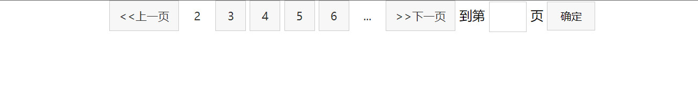

## 4.CSS三角强化

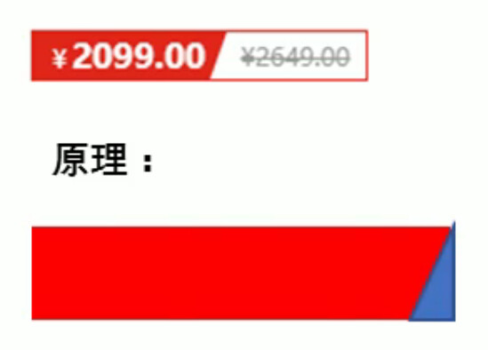

代码：

```css
width: 0;
height: 0;
border-color: transparent red transparent transparent;
border-style: solid;
border-width: 22px 8px 0 0;
```

案例：

```html
<!doctype html>
<html lang="en">
<head>
    <meta charset="UTF-8">
    <meta name="viewport" content="width=device-width, initial-scale=1.0">
    <meta http-equiv="X-UA-Compatible" content="ie=edge">
    <title>CSS三角强化的巧妙运用</title>
    <style>
        .box1 {
            width: 0;
            height: 0;
            /* 把上边框宽度调大 */
            /* border-top: 100px solid transparent;
            border-right: 50px solid skyblue; */
            /* 左边和下边的边框宽度设置为0 */
            /* border-bottom: 0 solid blue;
            border-left: 0 solid green; */
            /* 1. 只保留右边的边框有颜色 */
            border-color: transparent red transparent transparent;
            /* 2. 样式都是solid */
            border-style: solid;
            /* 3. 上边框宽度要大， 右边框 宽度稍小， 其余的边框该为 0 */
            border-width: 100px 50px 0 0;
        }

        .price {
            width: 160px;
            height: 24px;
            line-height: 24px;
            border: 1px solid red;
            margin: 0 auto;
        }

        .miaosha {
            position: relative;
            float: left;
            width: 90px;
            height: 100%;
            background-color: red;
            text-align: center;
            color: #fff;
            font-weight: 700;
            margin-right: 8px;

        }

        .miaosha i {
            position: absolute;
            right: 0;
            top: 0;
            width: 0;
            height: 0;
            border-color: transparent #fff transparent transparent;
            border-style: solid;
            border-width: 24px 10px 0 0;
        }

        .origin {
            font-size: 12px;
            color: gray;
            text-decoration: line-through;
        }
    </style>
</head>
<body>
<div class="box1"></div>
<div class="price">
            <span class="miaosha">
                ¥1650
                <i></i>
            </span>
    <span class="origin">¥5650</span>
</div>
</body>
</html>
```

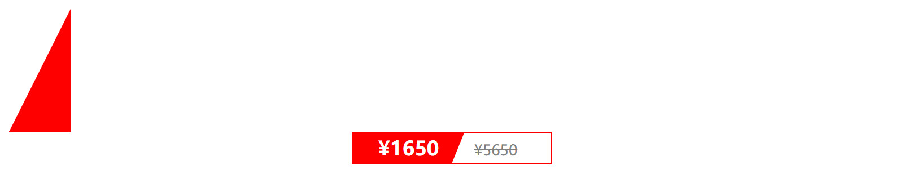

## 5.CSS初始化

不同浏览器对有些标签的默认值是不同的，为了消除不同浏览器对 HTML 文本呈现的差异，照顾浏览器的兼容，我们需要对 CSS 初始化。

简单理解：CSS 初始化是指重设浏览器的样式。(也称为 CSS reset）

每个网页都必须首先进行 CSS 初始化。

这里我们以 京东 CSS 初始化代码为例。

**Unicode 编码字体：**

把中文字体的名称用相应的 Unicode 编码来代替，这样就可以有效的避免浏览器解释 CSS 代码时候出现乱码的问题。

比如：

黑体 \9ED1\4F53

宋体 \5B8B\4F53

微软雅黑 \5FAE\8F6F\96C5\9ED1

```css
/* 把我们所有标签的内外边距清零 */
* {
    margin: 0;
    padding: 0
}

/* em 和 i 斜体的文字不倾斜 */
em,
i {
    font-style: normal
}

/* 去掉 li 的小圆点 */
li {
    list-style: none
}

img {
    /* border 0 照顾低版本浏览器，如果图片外面包含了链接会有边框的问题 */
    border: 0;
    /* 取消图片底侧有空白缝隙的问题 */
    vertical-align: middle
}

button {
    /* 当我们鼠标经过 button 按钮的时候，鼠标变成小手 */
    cursor: pointer
}

a {
    color: #666;
    text-decoration: none
}

a:hover {
    color: #c81623
}

button,
input {
    /* "\5B8B\4F53" 就是宋体的意思，这样浏览器兼容性比较好 */
    font-family: Microsoft YaHei, Heiti SC, tahoma, arial, Hiragino Sans GB, "\5B8B\4F53", sans-serif
}

body {
    /* CSS3 抗锯齿形，让文字显示的更加清晰 */
    -webkit-font-smoothing: antialiased;
    background-color: #fff;
    font: 12px/1.5 Microsoft YaHei, Heiti SC, tahoma, arial, Hiragino Sans GB, "\5B8B\4F53", sans-serif;
    color: #666
}

.hide,
.none {
    display: none
}

/* 清除浮动 */
.clearfix:after {
    visibility: hidden;
    clear: both;
    display: block;
    content: ".";
    height: 0
}

.clearfix {
    *zoom: 1
}
```

# 15【背景 渐变色】 

## 1.背景

### ⭕1.1 背景颜色

`background-color` 属性定义了元素的背景颜色。

```css
background-color: 颜色值;
```

一般情况下元素背景颜色默认值是 `transparent`（透明），我们也可以手动指定背景颜色为透明色。

```css
background-color: transparent;
```

目前 CSS 还支持丰富的渐变色，但是某些浏览器不支持。

```html
<!doctype html>
<html lang="zh-CN">

<head>
    <meta charset="UTF-8">
    <meta http-equiv="X-UA-Compatible" content="IE=edge">
    <meta name="viewport" content="width=device-width, initial-scale=1.0">
    <title>渐变</title>
    <style>
        #grad1 {
            height: 200px;
            /* 浏览器不支持时显示 */
            background-color: red;
            /* 线性渐变 - 从上到下（默认情况下）*/
            background-image: linear-gradient(#e66465, #9198e5);
        }
    </style>
</head>

<body>
    <h3>线性渐变 - 从上到下</h3>
    <p>从顶部开始的线性渐变。起点是红色，慢慢过渡到蓝色：</p>

    <div id="grad1"></div>

    <p><strong>注意：</strong> Internet Explorer 9 及之前的版本不支持渐变。</p>
</body>

</html>
```


### ⭕1.2 背景图片

`background-image` 属性描述了元素的背景图像，实际开发常用于 **logo** 或者一些**装饰性的小图片**或者是**超大的背景图片**, 优点是非常便于控制位置（精灵图也是一种运用场景）。

```css
background-image : none | url(url)
```

| 参数值 | 作用                           |
| ------ | ------------------------------ |
| `none` | 无背景图（默认的）             |
| `url`  | 使用绝对或相对地址指定背景图像 |

注意：背景图片后面的地址，千万不要忘记加 URL， 同时里面的路径不要加引号。

```css
background-color: pink;
background-image: url(../images/logo.png);
/* 1、背景图片不平铺 */
/* background-repeat: no-repeat; */
/* 2、默认情况下，背景图片是平铺的 */
/* background-repeat: repeat; */ /* 页面元素既可以添加背景颜色也可以添加背景图片，只不过背景图片区域会覆盖背景颜色 */
```

- 如果背景图片大小小于元素，则背景图片会自动在元素中平铺将元素铺满

- 如果背景图片大小大于元素，则背景图片一部分会无法完全显示

- 如果背景图片大小等于元素，则背景图片会直接正常显示

> 可以同时设置背景图片和背景颜色，这样背景颜色将会成为图片的背景色

### ⭕1.3 背景平铺

如果需要在 HTML 页面上对背景图像进行平铺，可以使用 `background-repeat` 属性。

注：平铺可以简单的理解为“重复”。

```css
background-repeat: repeat | no-repeat | repeat-x | repeat-y
```

| 参数值      | 作用                                 |
| ----------- | ------------------------------------ |
| `repeat`    | 背景图像在纵向和横向上平铺（默认的） |
| `no-repeat` | 背景图像不平铺                       |
| `repeat-x`  | 背景图像在横向上平铺                 |
| `repeat-y`  | 背景图像在纵向上平铺                 |

### ⭕1.4 背景图片位置

利用 `background-position` 属性可以改变图片在背景中的位置。

```css
background-position: x y;
```

参数代表的意思是：x 坐标 和 y 坐标，可以使用 `方位名词` 或者 `精确单位`。

| 参数值     | 说明                                              |
| ---------- | ------------------------------------------------- |
| `length`   | 百分数 \| 由浮点数字和单位标识符组成的长度值      |
| `position` | top \| center \| bottom \| left \| rigth 方位名词 |

- 参数是方位名词
  - 如果指定的两个值都是方位名词，则两个值前后顺序无关，比如 left top 和 top left 效果一致
  - 使用方位词时必须要同时指定两个值，如果只写一个则第二个默认就是`center`


- 参数是精确单位
  - 如果参数值是精确坐标，那么第一个肯定是 x 坐标，第二个一定是 y 坐标
  - 如果只指定一个数值，那该数值一定是 x 坐标，**另一个默认垂直居中**


- 参数是混合单位
  - 如果指定的两个值是精确单位和方位名词混合使用，则第一个值是 x 坐标，第二个值是 y 坐标

### ⭕1.5 背景图像固定（背景附着）

`background-attachment` 属性设置背景图像是否固定或者随着页面的其余部分滚动。

`background-attachment` 后期可以制作 `视差滚动` 的效果。

```css
background-attachment : scroll | fixed
```

| 参数     | 作用                               |
| -------- | ---------------------------------- |
| `scroll` | 默认值，背景图片会跟随元素移动     |
| `fixed`  | 背景会固定在页面中，不会随元素移动 |

```html
<!doctype html>
<html lang="en">

<head>
    <meta charset="UTF-8">
    <meta http-equiv="X-UA-Compatible" content="IE=edge">
    <meta name="viewport" content="width=device-width, initial-scale=1.0">
    <title>超大背景图片</title>
    <style>
        body {
            background-image: url(images/bg.jpg);
            background-repeat: no-repeat;
            background-position: center top;
            /* 把背景图片固定住 */
            background-attachment: fixed;
            color: #fff;
            font-size: 20px;
        }
    </style>
</head>

<body>
    <p>天王盖地虎, pink老师一米五</p>
    <p>天王盖地虎, pink老师一米五</p>
    <p>天王盖地虎, pink老师一米五</p>
    <p>天王盖地虎, pink老师一米五</p>
    <p>天王盖地虎, pink老师一米五</p>
    <p>天王盖地虎, pink老师一米五</p>
    <p>天王盖地虎, pink老师一米五</p>
    <p>天王盖地虎, pink老师一米五</p>
    <p>天王盖地虎, pink老师一米五</p>
    <p>天王盖地虎, pink老师一米五</p>
    <p>天王盖地虎, pink老师一米五</p>
    <p>天王盖地虎, pink老师一米五</p>
    <p>天王盖地虎, pink老师一米五</p>
    <p>天王盖地虎, pink老师一米五</p>
    <p>天王盖地虎, pink老师一米五</p>
    <p>天王盖地虎, pink老师一米五</p>
    <p>天王盖地虎, pink老师一米五</p>
    <p>天王盖地虎, pink老师一米五</p>
    <p>天王盖地虎, pink老师一米五</p>
    <p>天王盖地虎, pink老师一米五</p>
    <p>天王盖地虎, pink老师一米五</p>
    <p>天王盖地虎, pink老师一米五</p>
    <p>天王盖地虎, pink老师一米五</p>
    <p>天王盖地虎, pink老师一米五</p>
    <p>天王盖地虎, pink老师一米五</p>
    <p>天王盖地虎, pink老师一米五</p>
    <p>天王盖地虎, pink老师一米五</p>
    <p>天王盖地虎, pink老师一米五</p>
    <p>天王盖地虎, pink老师一米五</p>
    <p>天王盖地虎, pink老师一米五</p>
    <p>天王盖地虎, pink老师一米五</p>
    <p>天王盖地虎, pink老师一米五</p>
    <p>天王盖地虎, pink老师一米五</p>
    <p>天王盖地虎, pink老师一米五</p>
    <p>天王盖地虎, pink老师一米五</p>
    <p>天王盖地虎, pink老师一米五</p>
    <p>天王盖地虎, pink老师一米五</p>
    <p>天王盖地虎, pink老师一米五</p>
    <p>天王盖地虎, pink老师一米五</p>
    <p>天王盖地虎, pink老师一米五</p>
    <p>天王盖地虎, pink老师一米五</p>
    <p>天王盖地虎, pink老师一米五</p>
    <p>天王盖地虎, pink老师一米五</p>
    <p>天王盖地虎, pink老师一米五</p>
    <p>天王盖地虎, pink老师一米五</p>
    <p>天王盖地虎, pink老师一米五</p>
    <p>天王盖地虎, pink老师一米五</p>
</body>

</html>
```


### ⭕1.6 背景大小

利用 `background-size ` 属性可以设置背景图片的大小。

```css
background-size: length|percentage|cover|contain;
```

| 值         | 描述                                                         |
| :--------- | :----------------------------------------------------------- |
| length     | 设置背景图片高度和宽度。第一个值设置宽度，第二个值设置的高度。如果只给出一个值，第二个是设置为 **auto**(自动) |
| percentage | 将计算相对于背景定位区域的百分比。第一个值设置宽度，第二个值设置的高度。如果只给出一个值，第二个是设置为"auto(自动)" |
| cover      | 此时会保持图像的纵横比并将图像缩放成将完全覆盖背景定位区域的最小大小。 |
| contain    | 此时会保持图像的纵横比并将图像缩放成将适合背景定位区域的最大大小。 |

### ⭕1.7 背景范围 

利用 `background-clip ` 属性可以设置背景的范围 。

```css
background-clip: border-box|padding-box|content-box;
```

| 值          | 说明                                       |
| :---------- | :----------------------------------------- |
| border-box  | 默认值，背景会出现在边框的下边             |
| padding-box | 背景不会出现在边框，只出现在内容区和内边距 |
| content-box | 背景只会出现在内容区                       |

### 1.8 背景复合写法

为了简化背景属性的代码，我们可以将这些属性合并简写在同一个属性 `background` 中，从而节约代码量。
当使用简写属性时，没有特定的书写顺序，一般习惯约定顺序为：
`background`: `背景颜色` `背景图片地址` `背景平铺` `背景图像滚动` `背景图片位置/背景大小`

```css
    background: #bfa url("assets/dlam.png") no-repeat 100px 100px/200px padding-box content-box;
```

**注意**

- `background-size`必须写在`background-position`的后边，并且使用/隔开`background-position/background-size`

- `background-origin background-clip` 两个样式，`orgin`要在`clip`的前边

这是实际开发中，我们更提倡的写法。

### ⭕1.9 背景色半透明

CSS3 为我们提供了背景颜色半透明的效果。

```css
background: rgba(0, 0, 0, 0.3);
```

- 最后一个参数是 `alpha` 透明度，取值范围在 `0~1` 之间
- 习惯把 0.3 的 0 省略掉，写为 `background: rgba(0, 0, 0, .3);`
- 注意：背景半透明是指盒子背景半透明，盒子里面的内容不受影响
- CSS3 新增属性，是 IE9+ 版本浏览器才支持的
- 但是现在实际开发，我们不太关注兼容性写法了，可以放心使用

```html
<!doctype html>
<html lang="en">

<head>
    <meta charset="UTF-8">
    <meta http-equiv="X-UA-Compatible" content="IE=edge">
    <meta name="viewport" content="width=device-width, initial-scale=1.0">
    <title>背景色透明写法</title>
    <style>
        div {
            width: 300px;
            height: 300px;
            /* background-color: black; */
            background: rgba(0, 0, 0, .3);
        }
    </style>
</head>

<body>
    <!-- 只是让背景颜色半透明，盒子里的内容并不受影响 -->
    <div>dselegent</div>
</body>

</html>
```

### ⭕1.10 背景总结

| 属性                   | 作用           | 值                                               |
| ---------------------- | -------------- | ------------------------------------------------ |
| `backgroud-color`      | 背景颜色       | 预定义的颜色值 / 十六进制 / RGB代码              |
| `backgroud-image`      | 背景图片       | url（图片路径）                                  |
| `backgroud-repeat`     | 是否平铺       | repeat / no-repeat / repeat-x / repeat-y         |
| `backgroud-position`   | 背景位置       | length / position 分别是 x 和 y 坐标             |
| `backgroud-attachment` | 背景附着       | scroll（背景滚动）/ fixed（背景固定）            |
| `背景简写`             | 书写更简单     | 背景颜色 背景图片地址 背景平铺 背景滚动 背景位置 |
| `背景色半透明`         | 背景颜色半透明 | background: rgba(0, 0, 0, 0.3); 后面必须是4个值  |

背景图片：实际开发常见于 logo 或者一些装饰性的小图片或者是超大的背景图片，优点是非常便于控制位置（精灵图也是一种运用场景）。

## ⭕2.渐变色

### 2.1 线性渐变

通过渐变可以设置一些复杂的背景颜色，可以实现从一个颜色向其他颜色过渡的效果

渐变是图片，需要通过`background-image`来设置

线性渐变，颜色沿着一条直线发生变化 `linear-gradient()`

```css
# 红色在开头，黄色在结尾，中间是过渡区域
background-image: linear-gradient(red, yellow);
```

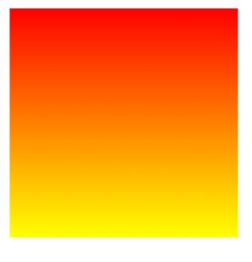

线性渐变的开头，我们可以指定一个渐变的方向

- `to left`

- `to right`

- `to bottom`

- `to top`

- `deg` deg表示度数

- `turn` 表示圈

```css
background-image: linear-gradient(to left, red, yellow);
background-image: linear-gradient(to right, red, yellow);
background-image: linear-gradient(to top, red, yellow);
background-image: linear-gradient(to bottom, red, yellow);
```

上面基本的4个方向的渐变很好理解，我们就不再做过多的一一解释了

我们来看度数的渐变效果

```css
background-image: linear-gradient(45deg, red, yellow);
```

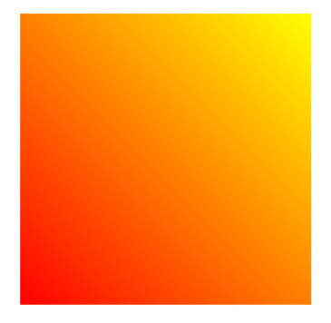

会发现它是从左下角往右上角去进行渐变的，为什么呢？

我们小时候肯定都用过量角器

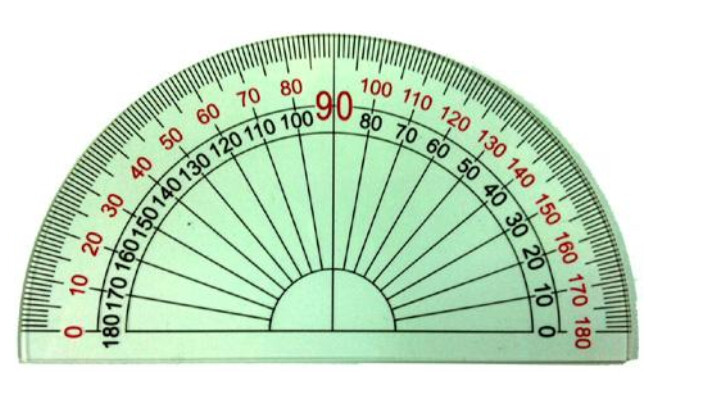

是不是恍然大悟，我们以原点作为起始点，有角度的那条边去做渐变，再把四象限的概念和矩形内部的四个角对应起来

**总结**：线性渐变的边上的某一点为起点，以一定角度渐变的；渐变方向的颜色是线性变化的，而其垂线方向的颜色是一致的

然后看下圈数的表示方法

```css
background-image: linear-gradient(0.4turn, red, yellow);
```

因为圈数和角度之间可以相互转换，所以这里就不再进行赘述了

另外，渐变可以同时指定多个颜色，多个颜色默认情况下平均分布，也可以手动指定渐变的分布情况

`repeating-linear-gradient()` 可以平铺的线性渐变

```css
background-image: repeating-linear-gradient(red, yellow);
```

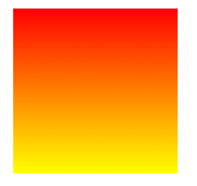

默认情况下，跟`linear-gradient(red, yellow)`效果一样，我们稍作改动

```css
background-image: repeating-linear-gradient(red 0px, yellow 50px);
```

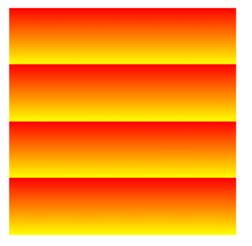

由于我们设置的`div`宽高为`200px`，所以会有4次重复的渐变效果

所以默认情况下，下列几种写法是一致的，效果相同

```css
background-image: linear-gradient(red, yellow);
background-image: repeating-linear-gradient(red, yellow);
/* 因为我们设置的div盒子的宽高为200px，所以这里[height]=200px */
background-image: repeating-linear-gradient(red 0, yellow [height]);
```

### 2.2 径向渐变

`radial-gradient()` 径向渐变（放射性的效果）

```css
background-image: radial-gradient(red, yellow);
```

默认情况下，径向渐变的形状根据元素的形状来计算的

-  正方形 --> 圆形
-  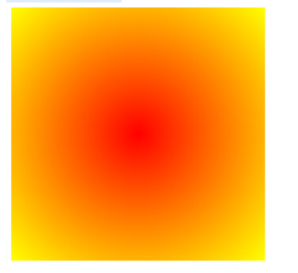
-  长方形 --> 椭圆形
   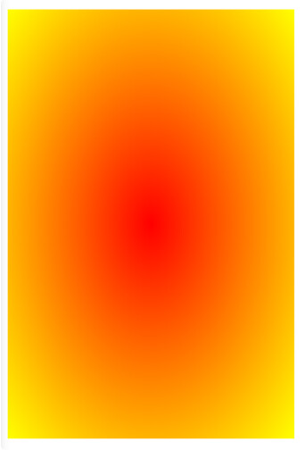

默认情况下，`circle`和`ellipse`是自动适配盒子的，我们也可以手动指定径向渐变的形状

**形状**

- `circle` 圆形

- `ellipse`椭圆

```css
background-image: radial-gradient(circle, red, yellow);
```

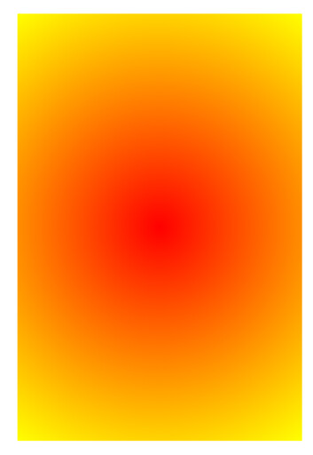

也可以指定渐变的位置

**位置**

- `top`

- `right`

- `left`

- `center`

- `bottom`

```css
background-image: radial-gradient(at left, red, yellow);
```


当然，除了上述值，还可以指定像素

**大小**

- `closest-side` 近边

- `farthest-side` 远边

- `closest-corner` 近角

- `farthest-corner` 远角

```css
background-image: radial-gradient(100px 60px, red, yellow);
```

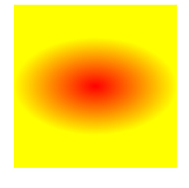

同时对其形状/大小和位置进行指定

`radial-gradient(形状/大小 at 位置, 颜色 位置, 颜色 位置, 颜色 位置)`

```css
background-image: radial-gradient(circle at 50px 100px, red 50px, yellow 100px);
```

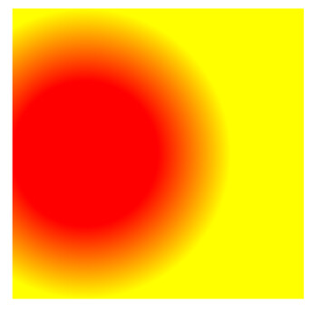

总结一下

**形状**

- `circle` 圆形

- `ellipse`椭圆

**大小**

- `closest-side` 近边

- `farthest-side` 远边

- `closest-corner` 近角

- `farthest-corner` 远角

**位置**

- `top`

- `right`

- `left`

- `center`

- `bottom`

类似于线性渐变，径向渐变也有对应的`repeat`属性

```css
background-image: repeating-radial-gradient(circle at 50px 100px, red 50px, yellow 100px);
```

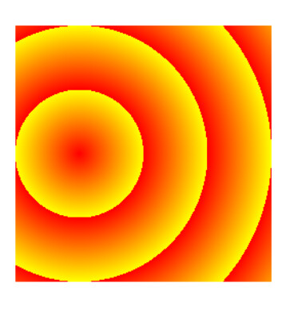

**总结**：径向渐变的渐变方向以圆心为起点，往四周扩散的；同一半径上的颜色是渐变的，同一圆周上的颜色是一致的
