# 成信链接口交互

## 一、信息上链

**使用postman**

1. 新建Collection与folder：

   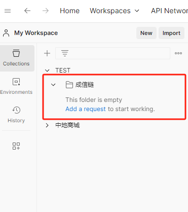

2. 右击成信链folder，新建请求：

   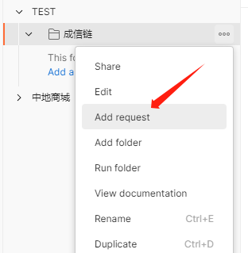

3. 请求方法选择POST请求：

   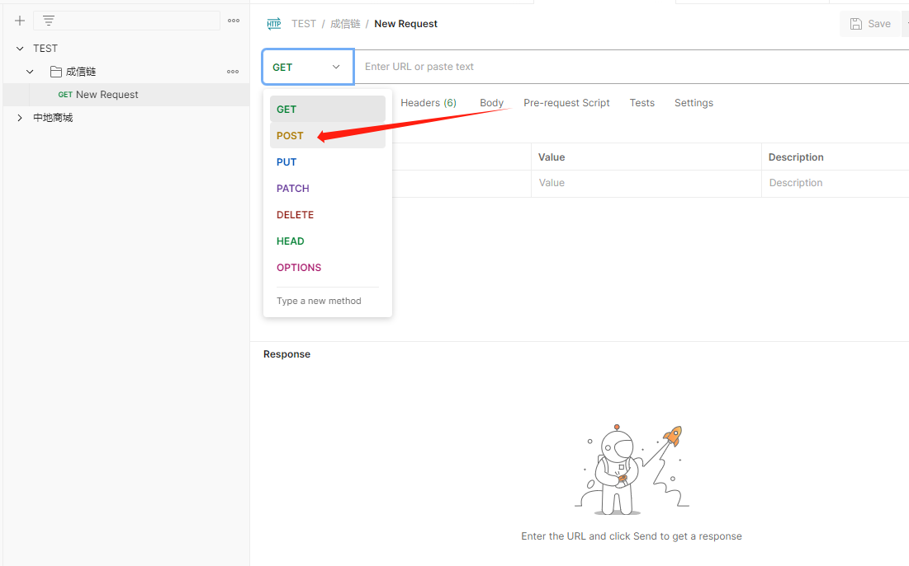
   可将request名称更改为`信息上链`

4. 设置Body格式：

   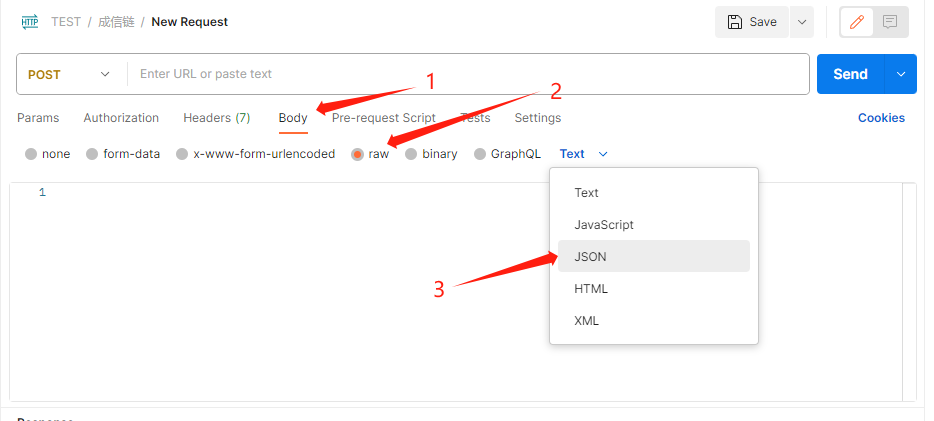

5. 输入请求的URL：

   ```html
   43.136.240.218:8082/blockchain/message/set
   ```

   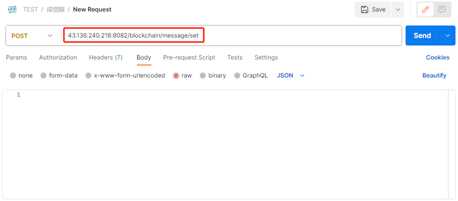

6. 更改Body内容：

   ```json
   {
       "contnent": "cuit"
   }
   ```

   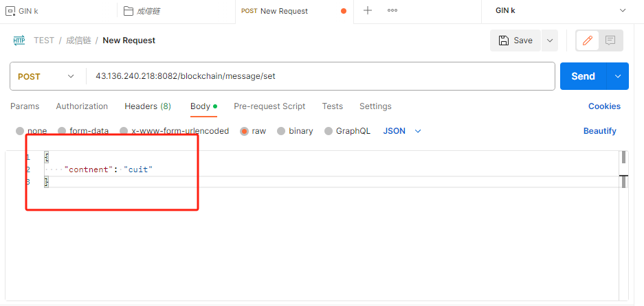

点击send发送请求：
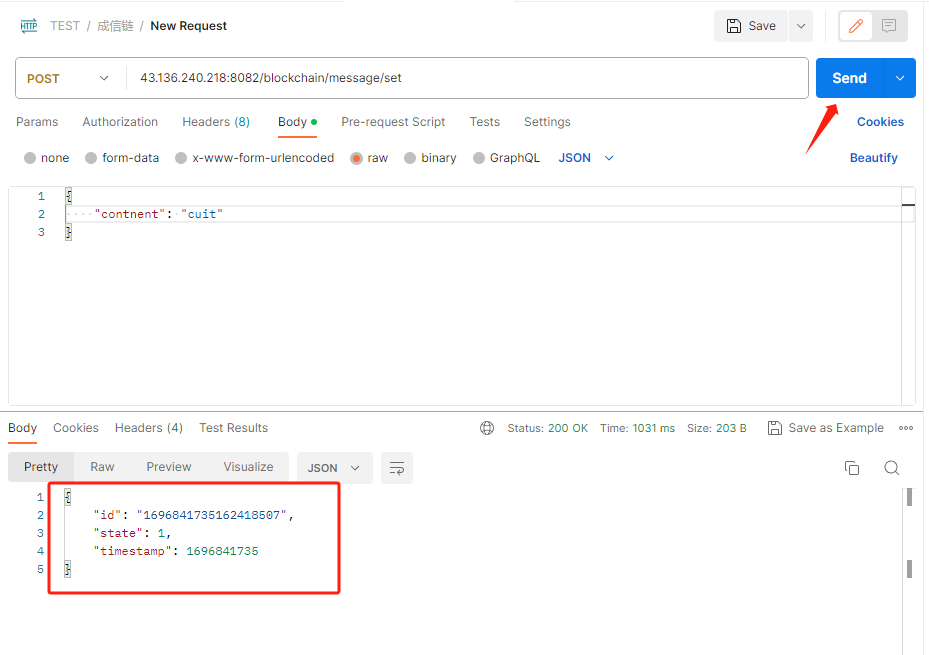
获取到如上图的返回值内容，并保存ID，后续查询需要用到ID：

1. state：1表示写入成功，0表示写入失败
2. timestamp：时间戳，上链的时间
3. id：上链数据的ID用于后面查询/比对

```json
{
    "id": "1696841735162418507",
    "state": 1,
    "timestamp": 1696841735
}
```

8. 发送请求后将会在区块链中增加一个交易区块：

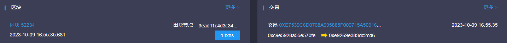

## 二、信息查询

**使用postman**

1. 新建request请求并更名为信息查询：
   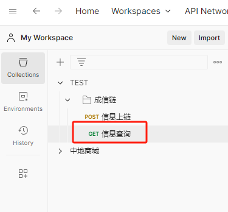

2. 请求方法选择GET请求：
   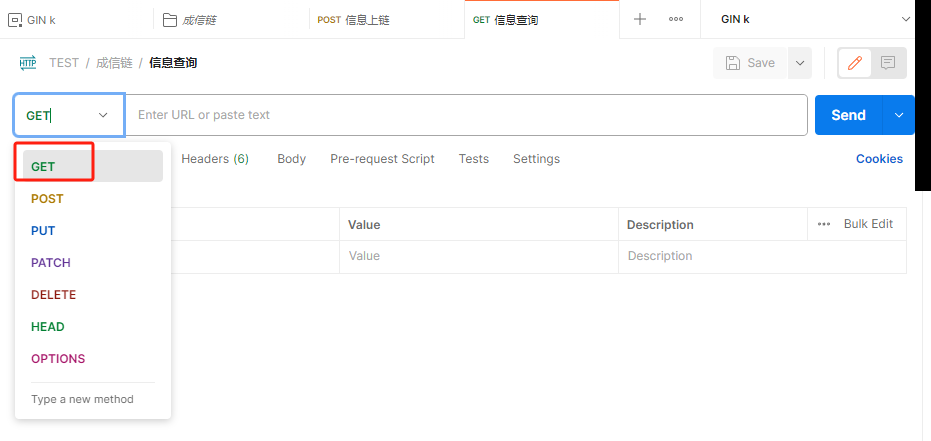

3. 按如下格式输入请求的URL：

   ```html
   43.136.240.218:8082/blockchain/message/get/{ID}
   ```

   其中的`{ID}`为POST请求返回值中的ID值，即需要查询的ID。

   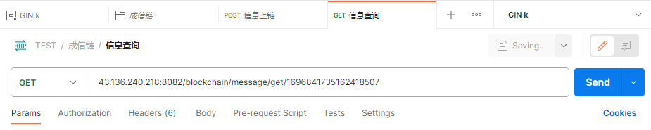

4. 点击send发送请求
   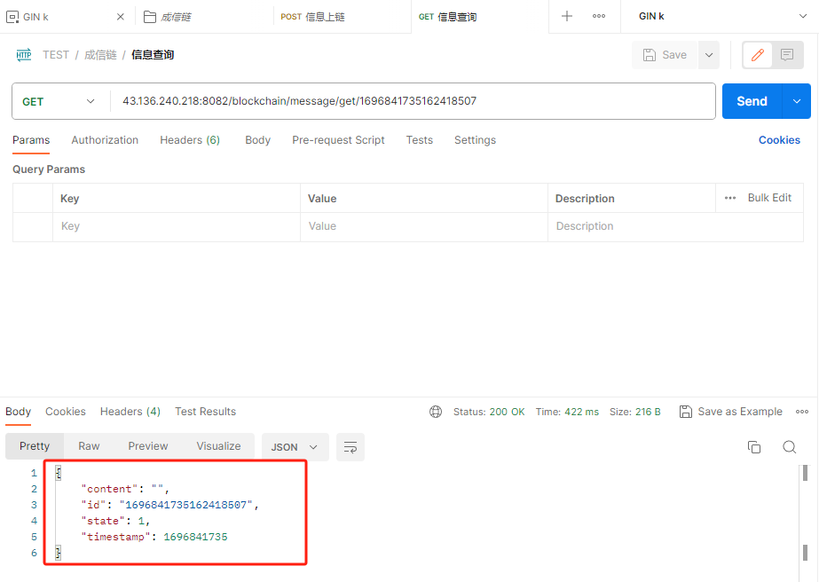
   获取到如上图的返回值内容，content即上链的信息。